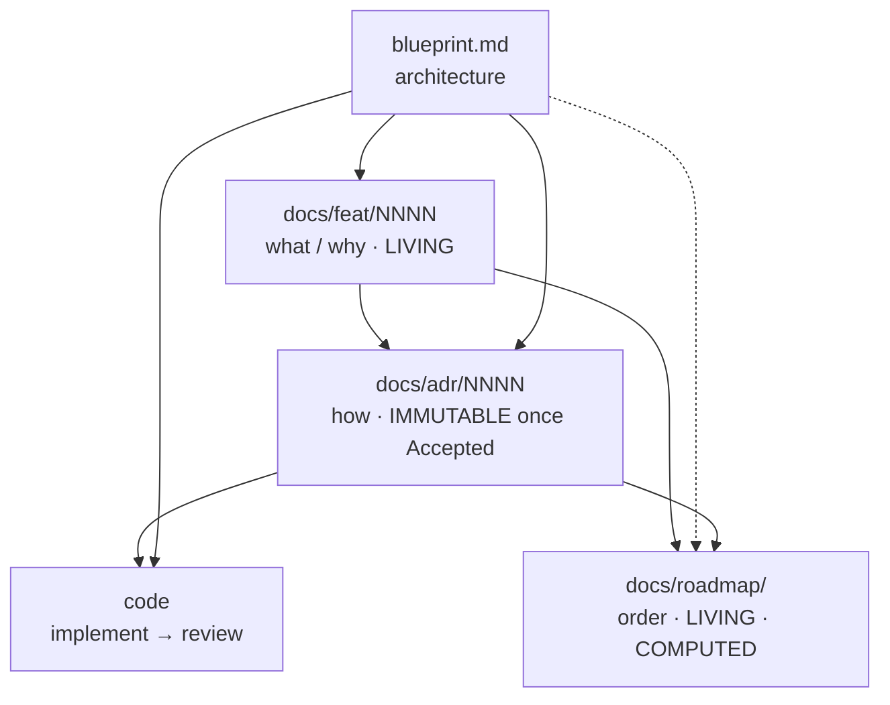

<!--
  funcd — agent working agreement.
  This file is MIRRORED: `.claude/CLAUDE.md` (Claude Code) and
  `.github/copilot-instructions.md` (GitHub Copilot) are byte-identical copies.
  Edit BOTH together — they must never drift. Links use `../` because both
  copies live exactly one directory below the repo root.
-->

# funcd — agent working agreement

funcd is in its **design phase**: documents drive the code, gradually, one decision at a
time. There is no big-bang implementation — every package is implemented
*from an ADR*. The authoritative process is [ADR-0000](../docs/adr/0000-adr-process.md);
this file does **not** override it. It exists to make one thing impossible to forget:

> **The planning documents are a connected system. An edit to one almost always creates an
> obligation to update others. Those obligations are listed here — honor them in the same
> session as the change that triggers them.**

This is the gap this file closes: the cross-document dependencies are real but were
previously implied across the skills and ADR-0000, never stated in one place.

## ⛔ Absolute rule — nothing about the dev machine ever enters the repo

The repository describes the **project**, never the machine it was built on. It is **forbidden** to write
anything tied to the developer's filesystem or identity — in *any* tracked file, doc, report, ADR, review
doc, commit message, code, code comment, example, **or even a grep-pattern string**:

- **no** absolute OS paths (`/Users/<user>/…`, `/home/<user>/…`, `C:\Users\…`) — every path is **project-root-relative**;
- **no** local machine **username**, home-directory name, or personal **email**;
- the only identity the repo knows is `green-0-rabbit` / `github.com/pyvvo/funcd` / "The funcd Authors".

This is **non-negotiable and binds subagents too** (judge, review, summary — every gate that writes a file). If
you must *describe* a check, describe it generically ("grepped for the local username / abs-path") — **never
transcribe the real value**. The single exception: when genuinely operating inside a *separate* sibling project
or a remote target (e.g. the homebox box), that project's own root is the path origin — still never an OS-absolute prefix.

## The four document layers (+ code)

| Layer | Path | Answers | Mutability | Source-of-truth rule |
|---|---|---|---|---|
| **Blueprint** | [blueprint.md](../blueprint.md) | *What the platform is* — target architecture | Living | Architecture truth, **except** a newer Accepted ADR wins; then the blueprint is synced to it |
| **Feature-version** | [docs/feat/](../docs/feat/) `NNNN-feat-<v>.md` | *What & why* a version must contain | **Living** (tracking table updates as work moves) | The what/why; never the how |
| **ADR** | [docs/adr/](../docs/adr/) `NNNN-*.md` | *How* one decision is made + its contracts | **Immutable once `Accepted`** (change = a new superseding ADR) | The truth for its topic |
| **Roadmap** | [docs/roadmap/](../docs/roadmap/) `<v>-delivery-plan.md` + `<v>-plan.json` | *In what order* ADRs get built | **Living + computed** | Sequencing only; commits to no architecture |
| Code | (not yet) | The implementation | — | Must conform to its ADR's Contracts |

### Reading / derivation direction



Arrows = *"informs / is read by."* Propagation (below) runs the **other** way: a change
downstream-or-sideways obligates an update to the documents that referenced it.

## The skills pipeline (`.claude/skills/`)

| Order | Skill | Does | Writes | Must also update on exit |
|---|---|---|---|---|
| plan | [roadmap-planner](../.claude/skills/roadmap-planner/SKILL.md) | sequence ADRs into build waves + critical path (computed) | `docs/roadmap/` + `plan.json` | — (notes missing decisions as items) |
| decide | [adr](../.claude/skills/adr/SKILL.md) | brainstorm → Accepted ADR | `docs/adr/NNNN-*.md` | **feat row + blueprint** (see below) |
| judge | [adr-judge](../.claude/skills/adr-judge/SKILL.md) | judge the ADR *document* before acceptance — evidence-cited verdict | a report (no doc edits) | nothing — it never edits what it judges |
| build | [adr-impl](../.claude/skills/adr-impl/SKILL.md) | ADR → working code (interfaces + drivers + facades + deps + scenario tests **written and passing**, green `just ci`) | code | **ADR `Accepted → Reviewing` + feat row → `reviewing`** |
| review | [adr-impl-review](../.claude/skills/adr-impl-review/SKILL.md) | review the *work* vs ADR + Definition of Done by **running** build/lint/test; score the model | a verdict + `docs/reviews/` model scorecard | **on a `pass`**: ADR `Reviewing → Implemented` + feat row → `implemented` (sole stamper of `Implemented`); non-pass advances nothing (ADR stays `Reviewing`); still never edits the *work* (code) |

`adr-judge` and `adr-impl-review` are different gates: the judge reads the *ADR document* (before
acceptance); the review reads the *code* (after implementation) and records a per-model
quality entry in `docs/reviews/` — see [ADR-0000 gate 5](../docs/adr/0000-adr-process.md).

**A new feature or a refactor concept takes the ADR pipeline above; a bug fix that needs no design
decision takes the fix pipeline**, which starts from a GitHub issue instead of an ADR:

| Order | Skill | Does | Writes | Must also update on exit |
|---|---|---|---|---|
| fix | [fix](../.claude/skills/fix/SKILL.md) | issue → regression test that fails → root-cause fix → revert check → checks → PR (`Fixes #N`) | code + a `TestIssue<N>_…` test | — (the merged PR closes the issue) |
| review | [fix-review](../.claude/skills/fix-review/SKILL.md) | independent review of the fix by **running** it: the test fails without the fix and passes with it, cause not symptom, scope, reuse with no duplication, conventions, ADR conformance; score the model | `docs/reviews/issue-<N>-fix-<model>.md` + a ledger row | nothing — it never edits the work |
| batch | [fix-batch](../.claude/skills/fix-batch/SKILL.md) | many issues (a tracker's sub-issues, a list, a label): fix → review per issue, one PR per group | a branch + PR per group | — |

An issue labelled `needs-adr`, or a fix that would change an Accepted ADR's decision, leaves the fix
pipeline for `/adr`.

## ⚠️ Cross-document propagation rules

When you change the **row**, you owe the checked **columns** — in the same session.

| You changed… | → blueprint.md | → docs/feat row | → the ADR | → roadmap + plan.json | → code |
|---|---|---|---|---|---|
| ADR drafted / `Proposed` | — | `idea → adr`, link the ADR | — | reconcile its `P-x` placeholder → real number | — |
| ADR **Accepted** | sync **iff** it refines/contradicts the blueprint (newest accepted wins) | `→ accepted` | set `Accepted` + date | reconcile number; **re-run analyzer** if a new build dep surfaced | — |
| ADR **Reviewing** (implementation done) | — | `→ reviewing` | set `Accepted → Reviewing` (by `adr-impl`) | — | implementation lands |
| ADR **Implemented** (review passed) | — | `→ implemented` | set `Reviewing → Implemented` (by the review gate; final edit — frozen after) | — | — |
| ADR **Superseded** | sync (newest wins) | re-point row to the new ADR | old → `Superseded by ADR-XXXX`; write the new ADR | re-sequence if build order changed | maybe |
| **feat** feature added / removed / re-scoped | maybe (if architectural intent shifts) | (the edit itself) | draft a new ADR or defer one | **update `plan.json`, re-run `plan_waves.py`, repaste graph/waves/critical-path** | — |
| **blueprint** architecture change | (the edit itself) | maybe add/adjust feature rows | maybe a new or superseding ADR | maybe re-sequence | — |
| **roadmap** reveals a missing decision | — | maybe add a feature row | note it as an item to be decided (don't decide it in the roadmap) | (the edit itself) | — |

### The two chains worth memorizing

1. **ADR lifecycle → feat tracking row.** Every ADR carries `Realizes: FEAT-NNNN/Fxx`.
   Each status move (`Proposed`/`Accepted`/`Reviewing`/`Implemented`) must advance that exact
   row's status and link the ADR. An ADR that changed status but left its feat row stale is
   a defect. Acceptance additionally syncs the blueprint if the decision refined it.
2. **feat scope → roadmap.** The roadmap's slate table, graph, waves, and critical path are
   **computed from [`plan.json`](../docs/roadmap/v1-plan.json)**, not hand-drawn. Any change
   to the feature set or its dependencies means: edit `plan.json` (and the mirrored slate
   table), re-run the analyzer, mermaid-validate, and repaste the computed sections:

   ```bash
   python3 .claude/skills/roadmap-planner/scripts/plan_waves.py docs/roadmap/v1-plan.json
   python3 .claude/skills/roadmap-planner/scripts/plan_waves.py docs/roadmap/v1-plan.json --check-waves
   ```

## Status vocabularies (keep them in sync with reality)

- **feat row**: `idea → adr → accepted → reviewing → implemented`.
- **ADR**: `Draft → Proposed → Accepted → Reviewing → Implemented`; terminal alt: `Superseded by ADR-XXXX`.
- The feat row and its ADR's status are two views of the same truth — they must agree.

## Invariants (must always hold)

- Every ADR has a `Realizes: FEAT-NNNN/Fxx` header pointing at a real feat row.
- Blueprint ⟷ newest Accepted ADR: on conflict the ADR wins and the blueprint is updated.
- **An `Accepted` ADR is frozen in substance.** Context, Scenarios, Decision, Contracts,
  Alternatives — none of it changes after acceptance. The *only* edits ever allowed are the
  forward status bumps (`Accepted → Reviewing` by `adr-impl`, then `Reviewing → Implemented`
  by the review gate) and the single `Superseded by ADR-XXXX` back-link. To change the
  decision, write a new superseding ADR — never rewrite history.
- **An `Implemented` ADR is fully frozen — never updated.** Once its status reads
  `Implemented`, the file is closed: no substance, contract, or status edit ever again. The
  one and only permitted touch is adding the `Superseded by ADR-XXXX` back-link. A correction
  to an implemented decision is *always* a new superseding ADR (carrying its own feat row and
  roadmap follow-through), never an in-place edit.
- Roadmap computed sections ≡ `plan.json` (analyzer output, not hand-drawn); the slate
  table and `plan.json` stay mirrored.
- Roadmap `P-x` placeholders reconcile to real ADR numbers as ADRs land (track by the
  stable **feature code** `Fxx`, not the placeholder).
- Identity in every repo file: `Deciders: green-0-rabbit`, module
  `github.com/pyvvo/funcd`, author "The funcd Authors". **Never** write the local
  machine username or local filesystem paths into a tracked file — grep before finishing.
- **Paths are always project-root-relative — never absolute OS paths.** The repository root is
  your path origin: every path you write into a tracked file, a commit message, a doc, a report,
  or any generated/committed output must be relative to the project root (e.g. `docs/reviews/…`,
  `pkg/funcd/…`), **never** an absolute working-OS path (`/Users/<user>/…`, `/home/<user>/…`,
  `C:\Users\…`). The OS-absolute prefix leaks the machine username and is non-portable. This holds
  even inside example/illustrative strings (e.g. a grep pattern shown in a review doc) — write the
  *pattern token* generically (`/Users/`, `<user>`), never the real path. The **only** exception:
  when you are genuinely operating in a *separate project that lives beside the main project* (a
  sibling repo/sandbox, or a remote target like the homebox box), use **that** project's root as
  the origin for its own files — still never the OS-absolute prefix. Before finishing any change,
  grep the touched files for an absolute-path prefix and for the local username, and remove any hit.

## Strict rules — the guardrails that keep the system consistent

Hard constraints. They bound *consistency*, not *creativity* — everything not named here
stays free (see below).

1. **Status moves forward only.** `Draft → Proposed → Accepted → Reviewing → Implemented`. Never walk a
   status backward, and never delete or renumber an ADR — numbers are sequential and
   permanent. "Undoing" an Accepted/Implemented decision is done by *superseding* it, not by
   editing or removing it.
2. **No silent override.** A `Draft`/`Proposed` ADR may not contradict an `Accepted` one:
   either it explicitly supersedes it (status `Superseded by ADR-XXXX`, linked both ways) or
   it conforms. Newest *Accepted* wins — a Draft never quietly wins over Accepted work.
3. **One ADR = one topic at one altitude.** If a draft starts deciding a neighboring topic,
   split it into a follow-up ADR rather than overloading it. Overlapping ADRs that each
   half-decide a topic are the main source of cross-document contradiction.
4. **Decide in the right layer.** feat docs hold *what/why* only (never an interface, a
   library, or a mechanism — those belong in an ADR); the roadmap holds *order* only (it
   commits to no architecture); the blueprint holds target architecture (per-topic contracts
   live in ADRs). A "how" sentence in a feat doc, or an architecture call in the roadmap, is
   a defect.
5. **Never hand-edit a computed artifact.** The roadmap's graph, waves, and critical path are
   `plan_waves.py` output; the slate table mirrors `plan.json`. Change `plan.json`, re-run the
   analyzer, repaste — never edit the computed sections by hand (they silently drift otherwise).
6. **No orphans, no ghosts.** Every ADR's `Realizes: FEAT-NNNN/Fxx` points at a real row, and
   every feat row's status equals its ADR's status. One without the other is a defect to fix
   in the same session.
7. **Propagate in the same session.** A status, scope, or architecture change is not "done"
   until its obligations (the propagation table above) are discharged in the same change.
   Never leave the four layers in a half-updated state.

### What stays free

The rules above constrain consistency, not exploration. You remain free to: brainstorm and
weigh options; edit `Draft`/`Proposed` ADRs as much as you like (they freeze only at
acceptance); draft independent ADRs in parallel; choose any Apache-2.0/MIT-compatible library
on its merits; reorder or parallelize work within a build tier; and restructure the prose of
living docs (blueprint, feat, roadmap) freely — as long as their *facts* stay consistent with
the rules above. The judge advises; it never blocks a sound decision on taste.

## Backlog — un-scoped ideas live on the GitHub Project, not in the docs

The four document layers hold **committed, version-scoped** work (a feat row, an ADR, a roadmap
item). Raw future ideas that are **not yet scoped into a version** — cross-cutting "someday"
features, research spikes, anything deferred past the current version — do **not** belong in the
docs (they would rot the feat/roadmap with un-decided scope). They go to the project's GitHub
**Project board #1** (pyvvo org):

- **Board**: <https://github.com/orgs/pyvvo/projects/1> (`funcd`; copied from the user-owned Project #4 by ADR-0141).
- **Use the [`/project-management`](../.claude/skills/project-management/SKILL.md) skill — do not hand-write `gh`.**
  Its `driver.py` bakes in the project/field/option ids (verified) so there is nothing to discover;
  it needs the `project` token scope (the `green-0-rabbit` token already has it; otherwise
  `gh auth refresh -s project`). **List first** to avoid duplicates, then create:

  ```bash
  python3 .claude/skills/project-management/driver.py list
  python3 .claude/skills/project-management/driver.py create \
    --title "<short idea title>" \
    --body "<why · key trade-offs · what it depends on · scope-when-picked-up>"
  ```

  `create` defaults the item to **Backlog** (never "No Status"). Write a rich body — match the depth
  of the existing items (`driver.py show "<substring>"`).

Rule of thumb: **decided + scoped → the docs** (feat row / ADR / roadmap); **idea + un-scoped →
the board**. (Examples added this way: the v2 microVM-isolation / krun-via-crun item, the
artifact-contract registry, and distro packaging P-Z.) **And — see below — a *feature* ADR also
carries a board card** from the moment it's drafted, so the board shows feature work in flight, not
only un-scoped ideas.

### A feature ADR carries a board card that natively tracks its lifecycle

A **feature ADR** — one that realizes a genuine deliverable feat-row (a user-facing capability, e.g.
FEAT-0001, FEAT-0003) — **gets a board tracking card created when it is first drafted**, and its
**Status follows the ADR's lifecycle** (the skill gates move it). The card title references the ADR so
it's findable (e.g. *"…(data-platform epoch) — ADR-0080 / FEAT-0003 F47"*).

**Pure-infra / process / refactor ADRs skip the card** — a rename (ADR-0078/0079), a tooling/e2e ADR
(ADR-0077), the process ADR (ADR-0000): no card. (If a feature ADR was *scoped from a pre-existing
board idea*, **reuse that card — don't create a second**; `driver.py list` first.) When unsure, read
the ADR's `Realizes:` header: a user-facing feat-row gets a card; an infra/process/refactor row does not.

The board's three Status options — **Backlog · In Progress · Done** — map onto the five ADR statuses:

| ADR status | Board card | Moved by |
|---|---|---|
| `Draft` | **create the card in `Backlog`** | the `adr` skill, at draft |
| `Proposed` (+ judge) | stays `Backlog` | — |
| `Accepted` | `→ In Progress` | the `adr` / `adr-batch` accept step |
| `Reviewing` | stays `In Progress` | — (no move; `adr-impl` just notes it) |
| `Implemented` | `→ Done` | the `adr-impl-review` gate (sole stamper of `Implemented`) |

The skill gates carry each move as an explicit step. Create/move the card with the
[`/project-management`](../.claude/skills/project-management/SKILL.md) skill (it resolves the item by title
substring — no ids to hand-assemble):

```bash
python3 .claude/skills/project-management/driver.py create --title "<…> — ADR-NNNN / FEAT-NNNN Fxx" --body "<…>"  # at Draft
python3 .claude/skills/project-management/driver.py status "<title substring>" "In Progress"                       # at Accepted
python3 .claude/skills/project-management/driver.py status "<title substring>" "Done"                              # at Implemented
```

## Issues — defects and concrete work live in GitHub Issues

Wrong behavior in what is built (a bug, a flaky test) and concrete work items go to
[GitHub Issues](https://github.com/pyvvo/funcd/issues), in one fixed shape per kind and one label taxonomy.
**Use the [`/issue-management`](../.claude/skills/issue-management/SKILL.md) skill — do not hand-write
`gh issue`.** Its `driver.py` holds the shapes and the labels, checks every issue before filing it, and
generates the issue forms in `.github/ISSUE_TEMPLATE/` (computed — never hand-edit them).

- **Where things go**: a defect or a task → an issue; an un-scoped idea → a board card; a decision → an ADR.
- **One defect per issue**, with exactly one `kind/`, exactly one `priority/`, and at least one `area/` label.
- **A fix that needs a design decision** gets `needs-adr`: the ADR cites the issue in its References, and the
  PR that implements it closes the issue (`Fixes #N` in the PR description).
- **Every other fix** goes through [`/fix`](../.claude/skills/fix/SKILL.md) (test-first, one issue per commit) and
  the independent [`/fix-review`](../.claude/skills/fix-review/SKILL.md) gate; [`/fix-batch`](../.claude/skills/fix-batch/SKILL.md)
  works through a tracker issue's sub-issues. A security finding is a private draft security advisory, not a
  public issue, and is fixed in the advisory's private fork.

## Dev environment — run everything through Nix

The toolchain is pinned by the flake ([flake.nix](../flake.nix) + `flake.lock`) — Go, `just`, and
(macOS only) Lima. **Always run the project's tooling through the dev shell, never a system-wide
install.** Enter it once with `nix develop`, or prefix individual commands:

```bash
nix develop -c just ci
nix develop -c go test ./...
nix develop -c just bench-containerd-lima
```

This guarantees the pinned versions; a binary found on the bare `PATH` is **not** the source of
truth and may differ. New tooling dependencies are **added to the flake (pinned), not installed on
the machine** — e.g. Lima (for the ADR-0052 containerd footprint lane, `just bench-containerd-lima`)
is provided by the dev shell via a pinned `nixpkgs-lima` input, not `brew`. Don't reach for a
globally-installed binary when a `nix develop -c …` invocation will use the pinned one.

For many short commands (agents, scripts), use `scripts/agent/d <cmd>` instead: the same pinned environment from a
cached `nix print-dev-env` (regenerated when `flake.nix`/`flake.lock` change), ~0.02 s per call instead of ~2 s.

## Running subagents and workflows efficiently

Measured on the 2026-10-02 fix waves (first wave vs the rebuilt pipeline): a fix went from 6.3 to 3.0 agent-minutes,
a review from 7.1 to 1.5, and a two-issue group from over an hour to 11 minutes, with review depth unchanged. The
rules that did it:

- **Turns are the cost.** Each tool call is a model round trip (median ~6 s, slower as the context grows). Send
  independent calls together in one turn, read a file once with Read rather than in `sed`/`grep` slices, chain
  dependent shell steps with `&&`, and filter test output (`-run`, `| tail -25`). Large pasted outputs slow every
  later turn.
- **One job per item, in parallel; integrate at the end.** Give each issue its own worktree from `origin/main` and
  review it the moment its fix is committed. Group barriers and sequential chunks leave slots idle; a cheap
  integrator cherry-picks a group's passing commits onto the latest main.
- **Each check runs once, in one place.** Per-item agents run only the regression test (with `-race`) and the
  touched packages' tests, vet and lint. The repo-wide checks — `just ci-full` (e2e included), the Linux
  build/vet/lint, a clean tree — run once per PR via `scripts/agent/gate.sh`, then CI runs them again. Never run the
  e2e suite or `go test ./...` inside a per-item fixer or reviewer.
- **Toolchain**: `scripts/agent/d` (above), never a `nix develop -c` per command.
- **Worktrees, not the shared checkout.** Other sessions switch branches in the main checkout; agents work in their
  own worktree under the session scratchpad. Never `git stash` there: `refs/stash` is shared by every worktree of
  the repo, so parallel agents pop each other's changes (a revert check compares with `git show origin/main:<file>`
  and `go test -overlay`). Lima lanes need a checkout under `$HOME` (colima) and one VM at a time: two VMs share
  the forwarded 8080/8081 ports, so the second lane's suite talks to the first VM. They run in a single serial stage.
- **Append-only shared files conflict.** Parallel PRs that each append to `docs/reviews/model-ledger.json` and
  regenerate `model-scorecard.md` conflict one after another; record a batch's ledger rows in one ledger PR.
- **Model per role.** Fixers and reviewers on the strongest model (reviews at medium effort held their depth);
  integration, gates and PR plumbing on a fast model at low effort.
- **The host is shared.** Concurrent gates contend on one machine: the `tests/lint-fixtures` tests fail with
  "parallel golangci-lint is running" while another lint holds the lock, and many e2e runs, or a probe that opens a
  fresh connection per request, exhaust the ~16k ephemeral ports ("connect: can't assign requested address";
  count `TIME_WAIT` with `netstat -an`). Run at most two gates at once, rerun only the step that failed for the
  environment, and keep probes to a few thousand keep-alive connections.
- **Merging and waiting.** Repo auto-merge is off, so `gh pr merge` fails: enqueue with the GraphQL
  `enqueuePullRequest` mutation after reading every check's conclusion; the queue builds up to 5 PRs together.
  Wait in the background (`scripts/agent/watch-prs.py` exits when a PR turns green, red or conflicted), never in a
  foreground loop.
- **Measure, don't guess.** Subagent transcripts (`agent-*.jsonl` beside each workflow's journal) carry per-call
  timestamps and token usage: compute tool time versus model time and turns per item before changing a pipeline.

## The language repos — pinned Go modules, never copies (ADR-0141)

The shims and their examples live in [pyvvo/funcd-typescript](https://github.com/pyvvo/funcd-typescript) and
[pyvvo/funcd-python](https://github.com/pyvvo/funcd-python), not here. funcd pins both in `go.mod` at release
tags and reads them through the Go module system:

- **Embedded shims**: `cmd/funcd` and `cmd/funcdctl` import `github.com/pyvvo/funcd-typescript/shim`
  (`Shim`, `Pool`) and `github.com/pyvvo/funcd-python/shim` (`Extract`).
- **Files** (examples, the image's shim): `scripts/moddir.sh <module>` in recipes and lanes,
  `internal/testkit/langmod` in tests. The module cache is **read-only**; anything that writes beside an
  example works on a copy under `.modcopy/` (`scripts/example-copy.sh`, a lane's `copy: true`).
- **Only `go.mod`/`go.sum` name a language-module version** (`just check-hygiene` enforces it).
- **A shim change** is a PR and a release in the language repo, then `go get <module>@<tag>` here. To test
  an unreleased change, clone the repo next to funcd and add a local `go.work`
  (`go work init . ../funcd-typescript`); git ignores it. Never commit a `go.work` or a pseudo-version.
- **One session across repos**: start Claude Code in funcd with the siblings added
  (`claude --add-dir ../funcd-typescript --add-dir ../funcd-python`), so a shim change, its release and
  the funcd bump happen in one conversation. Each repo keeps its own CLAUDE.md, PR flow and merge queue.
- **Design decisions still live here**: a change to the funcd ↔ shim contract needs a funcd ADR first.

## ⛔ Grounding — never present invention as fact

Design work *necessarily* invents: a proposed CRD shape, a new port, a contract that does not exist yet.
That stays free — it is the job. What is **forbidden** is presenting invention in the same register as
fact, or smuggling in elements nothing asked for. This binds chat answers and sketches as hard as
tracked files; a shape the decider reviews is a decision input, and an unmarked invention corrupts it.

- **Every element is grounded or flagged.** A field, kind, status reason, CLI flag, ADR number, or file
  path is either traced to something real — **cite it** (`api/types/…`, an ADR number, the precedent it
  mirrors) — or explicitly marked as new and unbuilt. The defect is the *mixed block*: a manifest where
  some keys map to shipped code and one is your idea, with nothing to tell them apart.
- **Never add what the request does not need.** A speculative field, a knob "for later", an extra
  capability — that is scope creep at the design layer, and it costs the decider a review cycle to
  discover it was never real. Propose the minimum shape; list the rest as open questions.
- **grep the vocabulary before naming anything.** This repo reuses words precisely, so a new name that
  collides with a shipped one is a defect, not a taste call (`retain` is already a *deletion policy* on
  `Workflow.spec.kv[].deletion`; `artifact` is already the OCI *function* bundle). Search the term, then
  name it.
- **"Show me X" is answered by what the code says — including "X does not exist."** Never fabricate a
  path, field, flag, status reason, or ADR number to satisfy the shape of the question. Read it or say
  it is unbuilt.

## Code & config style conventions

Small house-style rules that apply to every file you write or edit:

- **YAML is block style — never flow style.** No inline `{ key: value }` curly braces and no inline
  `[a, b]` lists, in any `.yaml`/`.yml` file or any embedded YAML (funcdctl.yaml, resource manifests,
  `.venom.yml`, YAML inside Go/Python test consts, ADR/doc code fences). Expand every mapping and
  sequence across lines:

  ```yaml
  # do                          # not
  properties:                   properties:
    name:                         name: { type: string }
      type: string              required: [name]
  required:
    - name
  ```

- **Imports at module top level.** No `import`/`from … import` inside a function or method (Python, JS/TS,
  Go). The only exception is a genuine circular-import break.

- **Don't bloat code or examples with comments.** Comment the *why* when it is not derivable from the
  code — an invariant, a non-obvious constraint, an ADR the line implements. Never narrate the *what*:
  no line-by-line annotation, no comment restating the identifier next to it, no explanatory comment on
  every field of a struct or every key of a YAML manifest. This binds **examples, manifests, and answers
  in chat** as much as tracked code: a sample manifest carries the shape, not a tutorial — if a field
  needs prose, that prose belongs in the ADR or the example's README, not inline. A package/type doc
  comment naming the ADR it realizes stays; a wall of per-key commentary does not. Same rule for prose:
  say it once, at the right altitude.

## Known pitfalls (Go dev on this project — learned from ADR-0003 implementation)

### 1. `create_file` may double the `package` declaration

When using a file-creation tool to create a new Go file, the tool sometimes prepends its
own `package <name>` line even when the content you provide already starts with one. The
result is a file that begins with `package foo\npackage foo\n`, which produces the
cryptic compile error `syntax error: non-declaration statement outside function body`.

**Mitigation**: after creating a batch of Go files, run `go build ./...` immediately and
grep for duplicate `package` lines if it fails. Fix is trivial: remove the duplicate
`package` line. A quick pre-flight is `grep -rl '^package.*\npackage' --include='*.go' .`
though that regex is hard to get right; the build-is-the-check.

### 2. `just ci`'s `git diff` gate fails on content changes to tracked files

The `ci` recipe runs `go fmt ./...` then checks `git diff --name-only -- '*.go'`. If any
**tracked** Go file has uncommitted changes — even pure content changes that `go fmt`
does not touch (new types, modified constants) — the diff check fails and `just ci` exits 1.
This is by design (no dirty tracked files in CI), but during an implementation that
legitimately modifies existing files, `just ci` will *always* fail until you commit.

**Mitigation**: during implementation, verify with the individual sub-checks:
```bash
go build ./... && go test ./... && go tool golangci-lint run ./... && go mod verify
```
When all four pass individually, the implementation is green — the `git diff` gate is
satisfied by committing the changed tracked files. After `go fmt ./...` is clean and the
four checks above pass, the implementation is done; `just ci` will pass after commit.

### 3. The containerd Lima lanes need colima (Docker) running — start it if a lane fails early

The `just lima-example-*` lanes (KV, fn-to-fn, …) and `build-runtime-images` build the embedded
runtime images with `docker build` (the shim comes from the pinned module as the `shim` build context,
ADR-0141), so they require **colima to be running** (it provides the
Docker daemon on macOS — a *separate host daemon* from the flake-pinned Lima). If colima is
stopped, the lane fails **early in `build-runtime-images`** with a Docker-socket connection error
(`failed to connect to the docker API … : no such file or directory`) — *before* the VM ever
boots or the Venom suite runs. This is environmental, **not** a code/test/suite defect; don't
chase it in the lane's YAML.

**Mitigation**: `colima start`, confirm `docker info` responds (and `docker context show` is
`colima`), then re-run the lane. colima shares only `$HOME` with its VM, so run the lanes from a checkout
under `$HOME`: from anywhere else (a `/tmp` worktree) a `docker run -v` bind mount, like the duckdb lane's
bundle build, silently writes into the VM instead of the host. colima can stop/die mid-session (sleep, resource pressure); when
a containerd lane suddenly fails at the image-build step, check colima **first**. Keep it running;
don't stop it mid-session. (The Venom e2e suites themselves are covered by the `venom-e2e` skill.)

### 4. A test that assembles a platform needs a short data dir

Startup rejects an invoke socket dir whose socket paths overrun the Unix limit (#41: 103 bytes on macOS, 107 on
Linux). A `t.TempDir()` holds the test name, and under a nix shell's `TMPDIR` it easily passes that limit, so
`funcd.New` fails with `socket dir … is too long` on one host and not another. Take the data dir from
`shortDataDir(t)` (`cmd/funcd/main_test.go`) or a short `os.MkdirTemp("", "funcd")`.

## Before you finish any skill run — propagation checklist

- [ ] Did an ADR change status? Update its feat row (and blueprint, if it refined it).
- [ ] Did the feature set or a build dependency change? Update `plan.json`, re-run
      `plan_waves.py`, re-validate the graph, repaste the computed roadmap sections.
- [ ] Did the blueprint change architecture? Check whether a feat row or ADR must follow.
- [ ] Are all four layers internally consistent (no stale status, no orphan ADR, no
      placeholder left pointing at a now-real ADR number)?
- [ ] No identity/path leak in any changed file.
