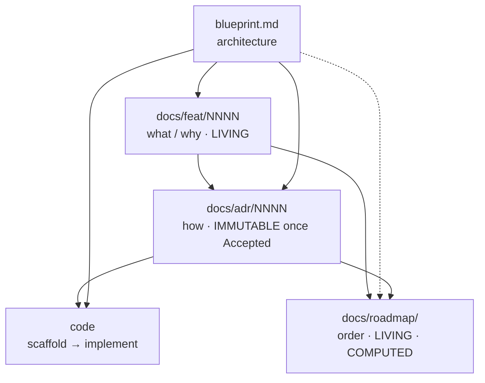

<!--
  funcd — agent working agreement.
  This file is MIRRORED: `.claude/CLAUDE.md` (Claude Code) and
  `.github/copilot-instructions.md` (GitHub Copilot) are byte-identical copies.
  Edit BOTH together — they must never drift. Links use `../` because both
  copies live exactly one directory below the repo root.
-->

# funcd — agent working agreement

funcd is in its **design phase**: documents drive the code, gradually, one decision at a
time. There is no big-bang implementation — every package is scaffolded and implemented
*from an ADR*. The authoritative process is [ADR-0000](../docs/adr/0000-adr-process.md);
this file does **not** override it. It exists to make one thing impossible to forget:

> **The planning documents are a connected system. An edit to one almost always creates an
> obligation to update others. Those obligations are listed here — honor them in the same
> session as the change that triggers them.**

This is the gap this file closes: the cross-document dependencies are real but were
previously implied across four skills and ADR-0000, never stated in one place.

## The four document layers (+ code)

| Layer | Path | Answers | Mutability | Source-of-truth rule |
|---|---|---|---|---|
| **Blueprint** | [blueprint.md](../blueprint.md) | *What the platform is* — target architecture | Living | Architecture truth, **except** a newer Accepted ADR wins; then the blueprint is synced to it |
| **Feature-version** | [docs/feat/](../docs/feat/) `NNNN-feat-<v>.md` | *What & why* a version must contain | **Living** (tracking table updates as work moves) | The what/why; never the how |
| **ADR** | [docs/adr/](../docs/adr/) `NNNN-*.md` | *How* one decision is made + its contracts | **Immutable once `Accepted`** (change = a new superseding ADR) | The truth for its topic |
| **Roadmap** | [docs/roadmap/](../docs/roadmap/) `<v>-delivery-plan.md` + `<v>-plan.json` | *In what order* ADRs get built | **Living + computed** | Sequencing only; commits to no architecture |
| Code | (not yet) | The implementation | — | Must conform to its ADR's Contracts |

### Reading / derivation direction



Arrows = *"informs / is read by."* Propagation (below) runs the **other** way: a change
downstream-or-sideways obligates an update to the documents that referenced it.

## The skills pipeline (`.claude/skills/`)

| Order | Skill | Does | Writes | Must also update on exit |
|---|---|---|---|---|
| plan | [roadmap-planner](../.claude/skills/roadmap-planner/SKILL.md) | sequence ADRs into build waves | `docs/roadmap/` + `plan.json` | — (notes missing decisions as items) |
| decide | [adr](../.claude/skills/adr/SKILL.md) | brainstorm → Accepted ADR | `docs/adr/NNNN-*.md` | **feat row + blueprint** (see below) |
| review | [adr-judge](../.claude/skills/adr-judge/SKILL.md) | evidence-cited verdict | a report (no doc edits) | nothing — it never edits what it judges |
| build | [adr-scaffold](../.claude/skills/adr-scaffold/SKILL.md) | ADR → compiling skeleton | code | **feat row → `scaffolded`** |

## ⚠️ Cross-document propagation rules

When you change the **row**, you owe the checked **columns** — in the same session.

| You changed… | → blueprint.md | → docs/feat row | → the ADR | → roadmap + plan.json | → code |
|---|---|---|---|---|---|
| ADR drafted / `Proposed` | — | `idea → adr`, link the ADR | — | reconcile its `P-x` placeholder → real number | — |
| ADR **Accepted** | sync **iff** it refines/contradicts the blueprint (newest accepted wins) | `→ accepted` | set `Accepted` + date | reconcile number; **re-run analyzer** if a new build dep surfaced | — |
| ADR **Scaffolded** | — | `→ scaffolded` | — | — | scaffold lands |
| ADR **Implemented** | — | `→ implemented` | set `Implemented` | — | impl lands |
| ADR **Superseded** | sync (newest wins) | re-point row to the new ADR | old → `Superseded by ADR-XXXX`; write the new ADR | re-sequence if build order changed | maybe |
| **feat** feature added / removed / re-scoped | maybe (if architectural intent shifts) | (the edit itself) | draft a new ADR or defer one | **update `plan.json`, re-run `plan_waves.py`, repaste graph/waves/critical-path** | — |
| **blueprint** architecture change | (the edit itself) | maybe add/adjust feature rows | maybe a new or superseding ADR | maybe re-sequence | — |
| **roadmap** reveals a missing decision | — | maybe add a feature row | note it as an item to be decided (don't decide it in the roadmap) | (the edit itself) | — |

### The two chains worth memorizing

1. **ADR lifecycle → feat tracking row.** Every ADR carries `Realizes: FEAT-NNNN/Fxx`.
   Each status move (`Proposed`/`Accepted`/scaffolded/implemented) must advance that exact
   row's status and link the ADR. An ADR that changed status but left its feat row stale is
   a defect. Acceptance additionally syncs the blueprint if the decision refined it.
2. **feat scope → roadmap.** The roadmap's slate table, graph, waves, and critical path are
   **computed from [`plan.json`](../docs/roadmap/v1-plan.json)**, not hand-drawn. Any change
   to the feature set or its dependencies means: edit `plan.json` (and the mirrored slate
   table), re-run the analyzer, mermaid-validate, and repaste the computed sections:

   ```bash
   python3 .claude/skills/roadmap-planner/scripts/plan_waves.py docs/roadmap/v1-plan.json
   python3 .claude/skills/roadmap-planner/scripts/plan_waves.py docs/roadmap/v1-plan.json --check-waves
   ```

## Status vocabularies (keep them in sync with reality)

- **feat row**: `idea → adr → accepted → scaffolded → implemented`.
- **ADR**: `Draft → Proposed → Accepted → Implemented`; terminal alt: `Superseded by ADR-XXXX`.
- The feat row and its ADR's status are two views of the same truth — they must agree.

## Invariants (must always hold)

- Every ADR has a `Realizes: FEAT-NNNN/Fxx` header pointing at a real feat row.
- Blueprint ⟷ newest Accepted ADR: on conflict the ADR wins and the blueprint is updated.
- An `Accepted` ADR is never edited in place — supersede it with a new ADR, link both ways.
- Roadmap computed sections ≡ `plan.json` (analyzer output, not hand-drawn); the slate
  table and `plan.json` stay mirrored.
- Roadmap `P-x` placeholders reconcile to real ADR numbers as ADRs land (track by the
  stable **feature code** `Fxx`, not the placeholder).
- Identity in every repo file: `Deciders: green-0-rabbit`, module
  `github.com/green-0-rabbit/funcd`, author "The funcd Authors". **Never** write the local
  machine username or local filesystem paths into a tracked file — grep before finishing.

## Before you finish any skill run — propagation checklist

- [ ] Did an ADR change status? Update its feat row (and blueprint, if it refined it).
- [ ] Did the feature set or a build dependency change? Update `plan.json`, re-run
      `plan_waves.py`, re-validate the graph, repaste the computed roadmap sections.
- [ ] Did the blueprint change architecture? Check whether a feat row or ADR must follow.
- [ ] Are all four layers internally consistent (no stale status, no orphan ADR, no
      placeholder left pointing at a now-real ADR number)?
- [ ] No identity/path leak in any changed file.
