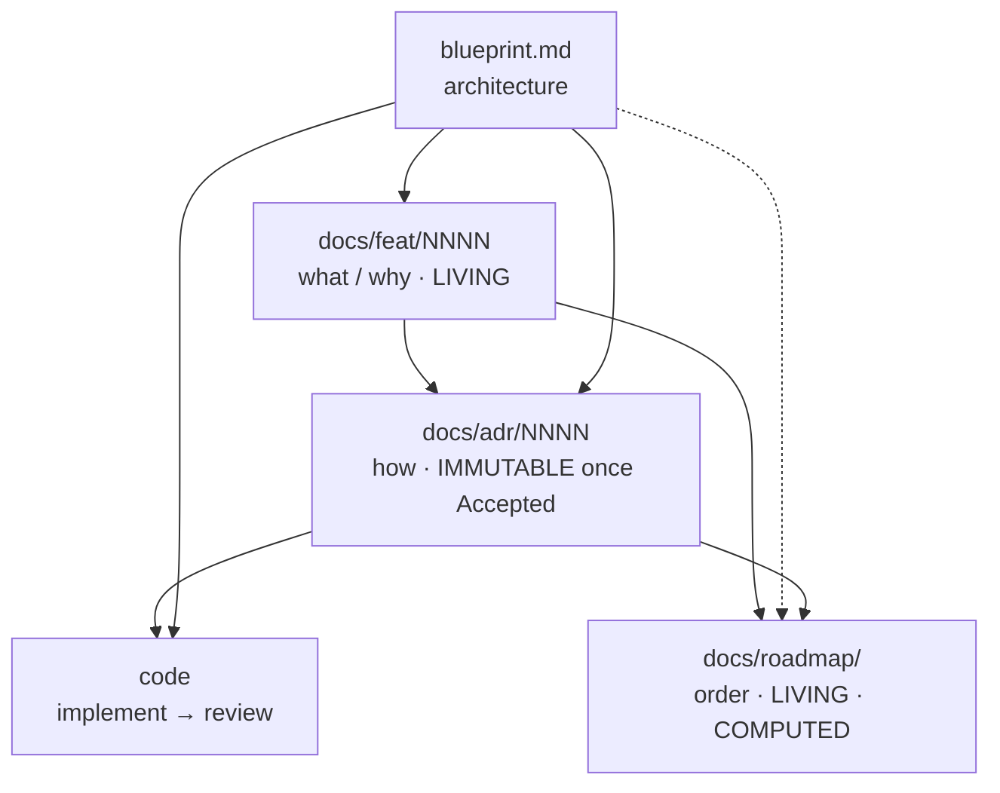

<!--
  funcd — agent working agreement.
  This file is MIRRORED: `.claude/CLAUDE.md` (Claude Code) and
  `.github/copilot-instructions.md` (GitHub Copilot) are byte-identical copies.
  Edit BOTH together — they must never drift. Links use `../` because both
  copies live exactly one directory below the repo root.
-->

# funcd — agent working agreement

funcd is in its **design phase**: documents drive the code, gradually, one decision at a
time. There is no big-bang implementation — every package is implemented
*from an ADR*. The authoritative process is [ADR-0000](../docs/adr/0000-adr-process.md);
this file does **not** override it. It exists to make one thing impossible to forget:

> **The planning documents are a connected system. An edit to one almost always creates an
> obligation to update others. Those obligations are listed here — honor them in the same
> session as the change that triggers them.**

This is the gap this file closes: the cross-document dependencies are real but were
previously implied across the skills and ADR-0000, never stated in one place.

## ⛔ Absolute rule — nothing about the dev machine ever enters the repo

The repository describes the **project**, never the machine it was built on. It is **forbidden** to write
anything tied to the developer's filesystem or identity — in *any* tracked file, doc, report, ADR, review
doc, commit message, code, code comment, example, **or even a grep-pattern string**:

- **no** absolute OS paths (`/Users/<user>/…`, `/home/<user>/…`, `C:\Users\…`) — every path is **project-root-relative**;
- **no** local machine **username**, home-directory name, or personal **email**;
- the only identity the repo knows is `green-0-rabbit` / `github.com/green-0-rabbit/funcd` / "The funcd Authors".

This is **non-negotiable and binds subagents too** (judge, review, summary — every gate that writes a file). If
you must *describe* a check, describe it generically ("grepped for the local username / abs-path") — **never
transcribe the real value**. The single exception: when genuinely operating inside a *separate* sibling project
or a remote target (e.g. the homebox box), that project's own root is the path origin — still never an OS-absolute prefix.

## The four document layers (+ code)

| Layer | Path | Answers | Mutability | Source-of-truth rule |
|---|---|---|---|---|
| **Blueprint** | [blueprint.md](../blueprint.md) | *What the platform is* — target architecture | Living | Architecture truth, **except** a newer Accepted ADR wins; then the blueprint is synced to it |
| **Feature-version** | [docs/feat/](../docs/feat/) `NNNN-feat-<v>.md` | *What & why* a version must contain | **Living** (tracking table updates as work moves) | The what/why; never the how |
| **ADR** | [docs/adr/](../docs/adr/) `NNNN-*.md` | *How* one decision is made + its contracts | **Immutable once `Accepted`** (change = a new superseding ADR) | The truth for its topic |
| **Roadmap** | [docs/roadmap/](../docs/roadmap/) `<v>-delivery-plan.md` + `<v>-plan.json` | *In what order* ADRs get built | **Living + computed** | Sequencing only; commits to no architecture |
| Code | (not yet) | The implementation | — | Must conform to its ADR's Contracts |

### Reading / derivation direction



Arrows = *"informs / is read by."* Propagation (below) runs the **other** way: a change
downstream-or-sideways obligates an update to the documents that referenced it.

## The skills pipeline (`.claude/skills/`)

| Order | Skill | Does | Writes | Must also update on exit |
|---|---|---|---|---|
| plan | [roadmap-planner](../.claude/skills/roadmap-planner/SKILL.md) | sequence ADRs into build waves + critical path (computed) | `docs/roadmap/` + `plan.json` | — (notes missing decisions as items) |
| decide | [adr](../.claude/skills/adr/SKILL.md) | brainstorm → Accepted ADR | `docs/adr/NNNN-*.md` | **feat row + blueprint** (see below) |
| judge | [adr-judge](../.claude/skills/adr-judge/SKILL.md) | judge the ADR *document* before acceptance — evidence-cited verdict | a report (no doc edits) | nothing — it never edits what it judges |
| build | [adr-impl](../.claude/skills/adr-impl/SKILL.md) | ADR → working code (interfaces + drivers + facades + deps + scenario tests **written and passing**, green `just ci`) | code | **ADR `Accepted → Reviewing` + feat row → `reviewing`** |
| review | [adr-impl-review](../.claude/skills/adr-impl-review/SKILL.md) | review the *work* vs ADR + Definition of Done by **running** build/lint/test; score the model | a verdict + `docs/reviews/` model scorecard | **on a `pass`**: ADR `Reviewing → Implemented` + feat row → `implemented` (sole stamper of `Implemented`); non-pass advances nothing (ADR stays `Reviewing`); still never edits the *work* (code) |

`adr-judge` and `adr-impl-review` are different gates: the judge reads the *ADR document* (before
acceptance); the review reads the *code* (after implementation) and records a per-model
quality entry in `docs/reviews/` — see [ADR-0000 gate 5](../docs/adr/0000-adr-process.md).

## ⚠️ Cross-document propagation rules

When you change the **row**, you owe the checked **columns** — in the same session.

| You changed… | → blueprint.md | → docs/feat row | → the ADR | → roadmap + plan.json | → code |
|---|---|---|---|---|---|
| ADR drafted / `Proposed` | — | `idea → adr`, link the ADR | — | reconcile its `P-x` placeholder → real number | — |
| ADR **Accepted** | sync **iff** it refines/contradicts the blueprint (newest accepted wins) | `→ accepted` | set `Accepted` + date | reconcile number; **re-run analyzer** if a new build dep surfaced | — |
| ADR **Reviewing** (implementation done) | — | `→ reviewing` | set `Accepted → Reviewing` (by `adr-impl`) | — | implementation lands |
| ADR **Implemented** (review passed) | — | `→ implemented` | set `Reviewing → Implemented` (by the review gate; final edit — frozen after) | — | — |
| ADR **Superseded** | sync (newest wins) | re-point row to the new ADR | old → `Superseded by ADR-XXXX`; write the new ADR | re-sequence if build order changed | maybe |
| **feat** feature added / removed / re-scoped | maybe (if architectural intent shifts) | (the edit itself) | draft a new ADR or defer one | **update `plan.json`, re-run `plan_waves.py`, repaste graph/waves/critical-path** | — |
| **blueprint** architecture change | (the edit itself) | maybe add/adjust feature rows | maybe a new or superseding ADR | maybe re-sequence | — |
| **roadmap** reveals a missing decision | — | maybe add a feature row | note it as an item to be decided (don't decide it in the roadmap) | (the edit itself) | — |

### The two chains worth memorizing

1. **ADR lifecycle → feat tracking row.** Every ADR carries `Realizes: FEAT-NNNN/Fxx`.
   Each status move (`Proposed`/`Accepted`/`Reviewing`/`Implemented`) must advance that exact
   row's status and link the ADR. An ADR that changed status but left its feat row stale is
   a defect. Acceptance additionally syncs the blueprint if the decision refined it.
2. **feat scope → roadmap.** The roadmap's slate table, graph, waves, and critical path are
   **computed from [`plan.json`](../docs/roadmap/v1-plan.json)**, not hand-drawn. Any change
   to the feature set or its dependencies means: edit `plan.json` (and the mirrored slate
   table), re-run the analyzer, mermaid-validate, and repaste the computed sections:

   ```bash
   python3 .claude/skills/roadmap-planner/scripts/plan_waves.py docs/roadmap/v1-plan.json
   python3 .claude/skills/roadmap-planner/scripts/plan_waves.py docs/roadmap/v1-plan.json --check-waves
   ```

## Status vocabularies (keep them in sync with reality)

- **feat row**: `idea → adr → accepted → reviewing → implemented`.
- **ADR**: `Draft → Proposed → Accepted → Reviewing → Implemented`; terminal alt: `Superseded by ADR-XXXX`.
- The feat row and its ADR's status are two views of the same truth — they must agree.

## Invariants (must always hold)

- Every ADR has a `Realizes: FEAT-NNNN/Fxx` header pointing at a real feat row.
- Blueprint ⟷ newest Accepted ADR: on conflict the ADR wins and the blueprint is updated.
- **An `Accepted` ADR is frozen in substance.** Context, Scenarios, Decision, Contracts,
  Alternatives — none of it changes after acceptance. The *only* edits ever allowed are the
  forward status bumps (`Accepted → Reviewing` by `adr-impl`, then `Reviewing → Implemented`
  by the review gate) and the single `Superseded by ADR-XXXX` back-link. To change the
  decision, write a new superseding ADR — never rewrite history.
- **An `Implemented` ADR is fully frozen — never updated.** Once its status reads
  `Implemented`, the file is closed: no substance, contract, or status edit ever again. The
  one and only permitted touch is adding the `Superseded by ADR-XXXX` back-link. A correction
  to an implemented decision is *always* a new superseding ADR (carrying its own feat row and
  roadmap follow-through), never an in-place edit.
- Roadmap computed sections ≡ `plan.json` (analyzer output, not hand-drawn); the slate
  table and `plan.json` stay mirrored.
- Roadmap `P-x` placeholders reconcile to real ADR numbers as ADRs land (track by the
  stable **feature code** `Fxx`, not the placeholder).
- Identity in every repo file: `Deciders: green-0-rabbit`, module
  `github.com/green-0-rabbit/funcd`, author "The funcd Authors". **Never** write the local
  machine username or local filesystem paths into a tracked file — grep before finishing.
- **Paths are always project-root-relative — never absolute OS paths.** The repository root is
  your path origin: every path you write into a tracked file, a commit message, a doc, a report,
  or any generated/committed output must be relative to the project root (e.g. `docs/reviews/…`,
  `shim/python/src/…`), **never** an absolute working-OS path (`/Users/<user>/…`, `/home/<user>/…`,
  `C:\Users\…`). The OS-absolute prefix leaks the machine username and is non-portable. This holds
  even inside example/illustrative strings (e.g. a grep pattern shown in a review doc) — write the
  *pattern token* generically (`/Users/`, `<user>`), never the real path. The **only** exception:
  when you are genuinely operating in a *separate project that lives beside the main project* (a
  sibling repo/sandbox, or a remote target like the homebox box), use **that** project's root as
  the origin for its own files — still never the OS-absolute prefix. Before finishing any change,
  grep the touched files for an absolute-path prefix and for the local username, and remove any hit.

## Strict rules — the guardrails that keep the system consistent

Hard constraints. They bound *consistency*, not *creativity* — everything not named here
stays free (see below).

1. **Status moves forward only.** `Draft → Proposed → Accepted → Reviewing → Implemented`. Never walk a
   status backward, and never delete or renumber an ADR — numbers are sequential and
   permanent. "Undoing" an Accepted/Implemented decision is done by *superseding* it, not by
   editing or removing it.
2. **No silent override.** A `Draft`/`Proposed` ADR may not contradict an `Accepted` one:
   either it explicitly supersedes it (status `Superseded by ADR-XXXX`, linked both ways) or
   it conforms. Newest *Accepted* wins — a Draft never quietly wins over Accepted work.
3. **One ADR = one topic at one altitude.** If a draft starts deciding a neighboring topic,
   split it into a follow-up ADR rather than overloading it. Overlapping ADRs that each
   half-decide a topic are the main source of cross-document contradiction.
4. **Decide in the right layer.** feat docs hold *what/why* only (never an interface, a
   library, or a mechanism — those belong in an ADR); the roadmap holds *order* only (it
   commits to no architecture); the blueprint holds target architecture (per-topic contracts
   live in ADRs). A "how" sentence in a feat doc, or an architecture call in the roadmap, is
   a defect.
5. **Never hand-edit a computed artifact.** The roadmap's graph, waves, and critical path are
   `plan_waves.py` output; the slate table mirrors `plan.json`. Change `plan.json`, re-run the
   analyzer, repaste — never edit the computed sections by hand (they silently drift otherwise).
6. **No orphans, no ghosts.** Every ADR's `Realizes: FEAT-NNNN/Fxx` points at a real row, and
   every feat row's status equals its ADR's status. One without the other is a defect to fix
   in the same session.
7. **Propagate in the same session.** A status, scope, or architecture change is not "done"
   until its obligations (the propagation table above) are discharged in the same change.
   Never leave the four layers in a half-updated state.

### What stays free

The rules above constrain consistency, not exploration. You remain free to: brainstorm and
weigh options; edit `Draft`/`Proposed` ADRs as much as you like (they freeze only at
acceptance); draft independent ADRs in parallel; choose any Apache-2.0/MIT-compatible library
on its merits; reorder or parallelize work within a build tier; and restructure the prose of
living docs (blueprint, feat, roadmap) freely — as long as their *facts* stay consistent with
the rules above. The judge advises; it never blocks a sound decision on taste.

## Dev environment — run everything through Nix

The toolchain is pinned by the flake ([flake.nix](../flake.nix) + `flake.lock`) — Go, `just`, and
(macOS only) Lima. **Always run the project's tooling through the dev shell, never a system-wide
install.** Enter it once with `nix develop`, or prefix individual commands:

```bash
nix develop -c just ci
nix develop -c go test ./...
nix develop -c just bench-containerd-lima
```

This guarantees the pinned versions; a binary found on the bare `PATH` is **not** the source of
truth and may differ. New tooling dependencies are **added to the flake (pinned), not installed on
the machine** — e.g. Lima (for the ADR-0052 containerd footprint lane, `just bench-containerd-lima`)
is provided by the dev shell via a pinned `nixpkgs-lima` input, not `brew`. Don't reach for a
globally-installed binary when a `nix develop -c …` invocation will use the pinned one.

## Known pitfalls (Go dev on this project — learned from ADR-0003 implementation)

### 1. `create_file` may double the `package` declaration

When using a file-creation tool to create a new Go file, the tool sometimes prepends its
own `package <name>` line even when the content you provide already starts with one. The
result is a file that begins with `package foo\npackage foo\n`, which produces the
cryptic compile error `syntax error: non-declaration statement outside function body`.

**Mitigation**: after creating a batch of Go files, run `go build ./...` immediately and
grep for duplicate `package` lines if it fails. Fix is trivial: remove the duplicate
`package` line. A quick pre-flight is `grep -rl '^package.*\npackage' --include='*.go' .`
though that regex is hard to get right; the build-is-the-check.

### 2. `just ci`'s `git diff` gate fails on content changes to tracked files

The `ci` recipe runs `go fmt ./...` then checks `git diff --name-only -- '*.go'`. If any
**tracked** Go file has uncommitted changes — even pure content changes that `go fmt`
does not touch (new types, modified constants) — the diff check fails and `just ci` exits 1.
This is by design (no dirty tracked files in CI), but during an implementation that
legitimately modifies existing files, `just ci` will *always* fail until you commit.

**Mitigation**: during implementation, verify with the individual sub-checks:
```bash
go build ./... && go test ./... && go tool golangci-lint run ./... && go mod verify
```
When all four pass individually, the implementation is green — the `git diff` gate is
satisfied by committing the changed tracked files. After `go fmt ./...` is clean and the
four checks above pass, the implementation is done; `just ci` will pass after commit.

## Before you finish any skill run — propagation checklist

- [ ] Did an ADR change status? Update its feat row (and blueprint, if it refined it).
- [ ] Did the feature set or a build dependency change? Update `plan.json`, re-run
      `plan_waves.py`, re-validate the graph, repaste the computed roadmap sections.
- [ ] Did the blueprint change architecture? Check whether a feat row or ADR must follow.
- [ ] Are all four layers internally consistent (no stale status, no orphan ADR, no
      placeholder left pointing at a now-real ADR number)?
- [ ] No identity/path leak in any changed file.
