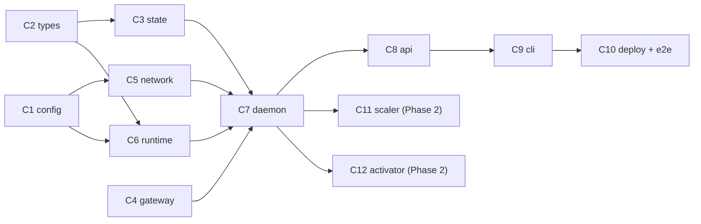

# funcd — MVP Implementation Plan

> Companion to [SPEC.md](SPEC.md). The SPEC says *what and why*; this file says *how*, in
> units small enough that each component can be implemented (and reviewed) independently —
> including by an LLM given only **§1 Ground rules**, **§2 Shared types**, and the one
> component section it is working on.
>
> **Phase 1 (MVP) = SPEC milestones M0–M2 + basic log tailing**: deploy / update / delete /
> list / **scale (manual replicas)** / info / logs through the control API and CLI,
> readiness gate, desired-state store, boot reconcile, generated APISIX route file.
> **Phase 2 = SPEC M4 scale-to-zero** (scaler + activator), specified in §6 of this doc —
> implement only after the Phase 1 definition of done passes.
> **Out of scope here**: secrets (M3), async/NATS (M5), exit-watcher auto-restart (M6),
> microVM runtime (M7), autoscaling (M8). Fields for those features (`secrets`, `runtime`)
> exist in the data model but are rejected with `400` if set to anything but their
> defaults; `idleTimeout` is accepted and persisted from day one and acted on in Phase 2.

---

## 1. Ground rules (read before implementing anything)

### 1.1 Language, module, dependencies
- Go **1.23+**. Module path: `github.com/green-0-rabbit/funcd` (adjust to the real remote once
  pushed; nothing else may hardcode it — always import relatively to the module).
- **Allowed dependencies** (do not add others without updating this file):
  - `github.com/containerd/containerd/v2` (client, oci, namespaces, cio)
  - `github.com/containerd/go-cni`
  - `github.com/spf13/cobra` (CLI only)
  - `gopkg.in/yaml.v3` (gateway renderer + config loader)
  - `golang.org/x/sync` (`singleflight`, Phase 2 wake path only)
  - stdlib for everything else: `net/http` (no router framework — use Go 1.22+
    `http.ServeMux` method patterns), `log/slog` for logging, `encoding/json`.
- Linux-only packages (`internal/runtime`, `internal/network`, `internal/daemon`) get
  `//go:build linux` on files that import containerd/CNI, plus a stub file so
  `go build ./...` passes on macOS for development.

### 1.2 Error and logging conventions
- Sentinel errors live in `internal/types`: `ErrNotFound`, `ErrAlreadyExists`,
  `ErrNotReady`. Wrap with `fmt.Errorf("context: %w", err)` everywhere; never log-and-return
  the same error twice.
- Every exported function that does I/O takes `context.Context` as its first argument.
- `slog` with a component attribute: `slog.With("component", "gateway")`.

### 1.3 Runtime filesystem layout (single source of truth)

| Path | Purpose | Mode |
|---|---|---|
| `/etc/funcd/config.yaml` | daemon config (optional; defaults below) | 0644 |
| `/var/lib/funcd/state/<ns>/<name>.json` | desired-state records | 0600 |
| `/var/lib/funcd/logs/<ns>/<name>-r<idx>.log` | per-replica stdout+stderr | 0640 |
| `/var/lib/funcd/apisix/apisix.yaml` | generated route file (bind-mounted into APISIX) | 0644 |
| `/var/lib/funcd/apisix/config.yaml` | APISIX static config (installed once) | 0644 |
| `/var/lib/funcd/api-token` | control-API bearer token (generated on first `up`) | 0600 |
| `/var/lib/funcd/gateway-key` | key-auth consumer key (generated on first `up`) | 0600 |
| `/var/lib/funcd/cni/conf/10-funcd.conflist` | CNI network config (written by funcd) | 0644 |
| `/var/lib/funcd/cni/ipam/` | host-local IPAM allocations | dir |

### 1.4 Naming conventions (collision-free by construction)
- funcd namespace `<ns>` ↔ containerd namespace `funcd-<ns>`.
- Container ID: `<name>-r<idx>` with replica index `idx` ∈ `0..replicas-1` (unique within
  its containerd namespace); the CNI attachment ID passed to go-cni is `<ns>-<name>-r<idx>`.
- APISIX object IDs: upstream `fn-<ns>-<name>`, route `rt-fn-<ns>-<name>`.
- Route paths: default namespace → `/function/<name>` (+ `/function/<name>/*`); other
  namespaces → `/function/<name>.<ns>` (+ `/function/<name>.<ns>/*`).
- Name/namespace validation: DNS label, `^[a-z0-9]([-a-z0-9]{0,61}[a-z0-9])?$`.

### 1.5 Dev environment reality check
funcd only *runs* on Linux as root (containerd socket + CNI + bridge). Development of pure
components (types, state, gateway, api, cli) works anywhere. Integration tests are gated:
they run only when `FUNCD_IT=1` is set **and** GOOS=linux, and they skip with a clear
message otherwise. On macOS use a Lima VM or the target homebox for integration/e2e.
Prereqs on the Linux box: containerd ≥ 1.7 running, CNI reference plugins in
`/opt/cni/bin` (`bridge`, `host-local`, `firewall`), and Docker or Podman for APISIX.

---

## 2. Shared types — `internal/types` (component C2, but read by everyone)

```go
package types

import "time"

type FunctionSpec struct {
    Name        string            `json:"name"`
    Namespace   string            `json:"namespace,omitempty"`  // "" → "default" (normalize on input)
    Image       string            `json:"image"`                // full ref, e.g. docker.io/library/nginx:1.27
    Env         map[string]string `json:"env,omitempty"`
    TargetPort  int               `json:"targetPort,omitempty"` // 0 → 8080 (normalize on input)
    Replicas    int               `json:"replicas,omitempty"`   // 0 → 1 (normalize); desired WARM count, min 1
    IdleTimeout string            `json:"idleTimeout,omitempty"`// scale-to-zero: "" → config default,
                                                                // "0" → disabled, else Go duration ("10m")
    Limits      *Limits           `json:"limits,omitempty"`
    Secrets     []string          `json:"secrets,omitempty"`    // reserved (M3) — reject if non-empty
    Runtime     string            `json:"runtime,omitempty"`    // reserved (M7) — reject unless "" or "runc"
}

type Limits struct {
    MemoryBytes int64   `json:"memoryBytes,omitempty"` // 0 = unlimited
    CPUs        float64 `json:"cpus,omitempty"`        // 0 = unlimited; 0.5 = half a core
}

type FunctionStatus struct {
    Spec      FunctionSpec `json:"spec"`
    State     string       `json:"state"`          // "ready" | "idle" | "failed" | "unknown"
    IPs       []string     `json:"ips,omitempty"`  // live CNI IPs, index = replica (not persisted)
    CreatedAt time.Time    `json:"createdAt"`
    Ready     int          `json:"ready"`          // running+ready replica count (0 when idle)
}

type SystemInfo struct {
    Version       string `json:"version"`
    FunctionCount int    `json:"functionCount"`
    Namespaces    []string `json:"namespaces"`
}
```

Also in this package: `ErrNotFound`, `ErrAlreadyExists`, `ErrNotReady` (plain
`errors.New`), and `func (s *FunctionSpec) Validate() error` + `func (s *FunctionSpec)
Normalize()` (fills `Namespace="default"`, `TargetPort=8080`, `Replicas=1`,
`Runtime="runc"`). Validate enforces: name/namespace DNS-label regex (§1.4), image
non-empty, port 1–65535, `Replicas ≥ 1` (no upper cap — hardware is the limit), env keys
non-empty and without `=`, `IdleTimeout` empty or `time.ParseDuration`-able and ≥ 0,
`Secrets` empty, `Runtime` ∈ {"", "runc"}.

**Tests**: table-driven `Validate`/`Normalize` cases. **No dependencies.**

---

## 3. Components

Implement in the order listed in §4. Each section is self-contained given §1 + §2.

### C1 — `internal/config`: daemon configuration

**Purpose**: one struct with every tunable, loaded from `/etc/funcd/config.yaml` if present,
else defaults. No other package reads files or env for configuration.

```go
package config

type Config struct {
    ContainerdSocket string        `yaml:"containerdSocket"` // /run/containerd/containerd.sock
    DataDir          string        `yaml:"dataDir"`          // /var/lib/funcd
    BindAddr         string        `yaml:"bindAddr"`         // 127.0.0.1:8081
    ActivatorAddr    string        `yaml:"activatorAddr"`    // 127.0.0.1:8082 (server starts in Phase 2;
                                                             // the gateway renderer needs the addr from day one)
    BridgeName       string        `yaml:"bridgeName"`       // funcd0
    SubnetCIDR       string        `yaml:"subnetCIDR"`       // 10.63.0.0/16
    CNIBinDir        string        `yaml:"cniBinDir"`        // /opt/cni/bin
    ReadyTimeout     time.Duration `yaml:"readyTimeout"`     // 30s
    Snapshotter      string        `yaml:"snapshotter"`      // overlayfs
}

func Load(path string) (Config, error) // missing file → defaults, no error
```

Derived path helpers (methods, not config fields): `StateDir()`, `LogsDir()`,
`RoutesFile()`, `TokenFile()`, `GatewayKeyFile()`, `CNIConfDir()`, `CNIIPAMDir()` — all
under `DataDir` per the §1.3 table.

**Tests**: defaults when file missing; partial YAML overrides only the given keys.
**Depends on**: nothing.

### C3 — `internal/state`: desired-state store

**Purpose**: persist `FunctionSpec`s so `funcd up` can rebuild the world after a reboot.

```go
package state

type Record struct {
    Spec      types.FunctionSpec `json:"spec"`
    CreatedAt time.Time          `json:"createdAt"`
}

type Store interface {
    Save(ctx context.Context, r Record) error                       // upsert
    Get(ctx context.Context, ns, name string) (Record, error)       // types.ErrNotFound
    Delete(ctx context.Context, ns, name string) error              // idempotent (no error if absent)
    List(ctx context.Context) ([]Record, error)                     // sorted by (ns, name)
}

func NewFileStore(dir string) Store // dir = cfg.StateDir()
```

**Behavior**: one JSON file per function at `<dir>/<ns>/<name>.json`. Writes are atomic:
write `<file>.tmp` (0600), `fsync`, `rename`. `List` walks two levels, ignores non-`.json`
files, and **must not** fail wholesale on one corrupt file (skip + `slog.Warn`).

**Tests** (pure, `t.TempDir()`): roundtrip, overwrite, delete-idempotent, list-sorted,
corrupt-file-skipped. **Depends on**: types.

### C4 — `internal/gateway`: APISIX route-file renderer + single writer

**Purpose**: turn the set of live functions into `apisix.yaml`, deterministically.

```go
package gateway

type Backend struct {
    Namespace, Name string
    Endpoints       []string // "ip:port" per ready replica; ignored when Idle
    Idle            bool     // scaled to zero → route to the activator instead
}

// Render is pure: same input → byte-identical output.
func Render(backends []Backend, gatewayKey, activatorAddr string) ([]byte, error)

// Writer serializes all writes to the routes file.
type Writer struct{ /* chan-based; one goroutine owns rendering+writing */ }
func NewWriter(routesFile, gatewayKey, activatorAddr string) *Writer
func (w *Writer) Submit(backends []Backend)  // non-blocking; coalesces bursts
func (w *Writer) Close() error               // flush pending write, stop goroutine

// EnsureKey returns the key in file, generating 32 random hex chars (0600) if absent.
func EnsureKey(file string) (string, error)
```

**Rendering rules** (all are hard requirements — golden tests pin them):
1. Sort backends by `(Namespace, Name)`; within a backend, sort `Endpoints`.
2. Per backend: one upstream `{id: fn-<ns>-<name>, type: roundrobin, nodes: {...}}` with
   one node (weight 1) per endpoint, and one route
   `{id: rt-fn-<ns>-<name>, uris: [<base>, <base>/*], upstream_id: ...}` where `<base>`
   follows §1.4. Route plugins:
   `proxy-rewrite: {regex_uri: ["^<escapedBase>/?(.*)", "/$1"]}` — **regex-escape the base**
   (the `.` in `name.ns` must be `\.`), plus `key-auth: {}` and `prometheus: {}`.
3. If `Idle`: the upstream's single node is `activatorAddr`, and `proxy-rewrite` also sets
   `headers: {set: {X-Funcd-Function: "<ns>/<name>"}}` so the activator knows what to wake.
4. Always emit one consumer: `{username: funcd, plugins: {key-auth: {key: <gatewayKey>}}}`
   (APISIX usernames must match `^[a-zA-Z0-9_]+$` — hence `funcd`, no dash).
5. Empty backend list still renders the consumer block (valid file, no routes).
6. File ends with the line `#END` + newline. Build the YAML with `yaml.v3` marshalling of
   ordered structs, then append the footer.
7. Writer behavior: `Submit` replaces any queued snapshot (last-write-wins), the goroutine
   renders and writes atomically (tmp + rename, same dir).

**Tests**: golden files in `internal/gateway/testdata/` — empty set, one default-ns fn
(1 replica), one fn with 3 replicas (multi-node, endpoint sort), one non-default-ns fn
(checks dot-escaping), one idle fn (activator node + header), three fns (checks sort).
Writer test: 100 concurrent `Submit`s → file parses as YAML, ends with `#END`, contains
last snapshot. **Depends on**: nothing (types not even needed — `Backend` is local).

### C5 — `internal/network`: CNI bridge manager

**Purpose**: give each function task an IP on `funcd0`, and clean it up.

```go
package network

type Manager interface {
    Init(ctx context.Context) error // write conflist, gocni.New + Load; idempotent
    Attach(ctx context.Context, id, netnsPath string) (netip.Addr, error)
    Detach(ctx context.Context, id, netnsPath string) error // idempotent
}

func NewManager(cfg config.Config) Manager
```

**Behavior**:
- `Init` writes this conflist to `cfg.CNIConfDir()/10-funcd.conflist` (templated with
  `BridgeName`, `SubnetCIDR`, `CNIIPAMDir()`):

```json
{
  "cniVersion": "1.0.0",
  "name": "funcd",
  "plugins": [
    {
      "type": "bridge",
      "bridge": "funcd0",
      "isGateway": true,
      "ipMasq": true,
      "ipam": {
        "type": "host-local",
        "dataDir": "/var/lib/funcd/cni/ipam",
        "ranges": [[{ "subnet": "10.63.0.0/16" }]],
        "routes": [{ "dst": "0.0.0.0/0" }]
      }
    },
    { "type": "firewall" }
  ]
}
```

- then `gocni.New(gocni.WithPluginDir([]string{cfg.CNIBinDir}), gocni.WithPluginConfDir(...),
  gocni.WithMinNetworkCount(2))` + `Load(gocni.WithLoNetwork, gocni.WithDefaultConf)`.
- `Attach` calls `cni.Setup(ctx, id, netnsPath)` and extracts the IPv4 from the returned
  result (`result.Interfaces["eth0"].IPConfigs[0].IP`) — never scrape `/var/run/cni`.
  `id` is `<ns>-<name>` (§1.4). Return error if no IPv4 found.
- `Detach` calls `cni.Remove`; swallow "not found"-class errors (idempotent teardown).

**Tests**: integration-only (`FUNCD_IT=1`, root, linux): create a netns with
`unix.Unshare`/`ip netns`, Attach → got IP in subnet → Detach → second Detach is a no-op.
**Depends on**: config.

### C6 — `internal/runtime`: containerd sandbox backend

**Purpose**: image pull + container/task lifecycle behind the `Sandbox` interface
(SPEC §3.7 — runc now, microVM later).

```go
package runtime

type Instance struct {
    Namespace, Name string
    Replica         int       // index from the container id suffix -r<idx>
    PID             uint32    // task pid (for /proc/<pid>/ns/net)
    Running         bool
    CreatedAt       time.Time
}

type Sandbox interface {
    Pull(ctx context.Context, image string) error
    // Create: container + task for ONE replica, created but NOT started;
    // container id "<name>-r<replica>"; cio.LogFile wired to logPath.
    Create(ctx context.Context, spec types.FunctionSpec, replica int, logPath string) (Instance, error)
    Start(ctx context.Context, ns, name string, replica int) error
    // RemoveReplica: SIGTERM → wait up to 10s → SIGKILL; delete task + container +
    // snapshot. Idempotent: absent container/task is not an error.
    RemoveReplica(ctx context.Context, ns, name string, replica int) error
    // Remove: RemoveReplica for every replica of the function (lookup by labels).
    Remove(ctx context.Context, ns, name string) error
    Get(ctx context.Context, ns, name string) ([]Instance, error) // all replicas; types.ErrNotFound if none
    List(ctx context.Context, ns string) ([]Instance, error)
}

func NewContainerd(cfg config.Config) (Sandbox, error) // client.New(cfg.ContainerdSocket)

// WaitReady polls TCP connect on addr:port every 250ms until success or ctx/timeout.
func WaitReady(ctx context.Context, addr netip.Addr, port int, timeout time.Duration) error
```

**Behavior details**:
- Every call wraps ctx with `namespaces.WithNamespace(ctx, "funcd-"+ns)`.
- `Pull` uses `client.Pull(ctx, image, containerd.WithPullUnpack,
  containerd.WithPullSnapshotter(cfg.Snapshotter))`.
- `Create` OCI spec opts, in order: `oci.WithImageConfig(image)` (keeps the image's
  ENTRYPOINT/CMD/Env), `oci.WithEnv(extra)` where extra = user env +
  `FUNCD_NAME=<name>`, `FUNCD_NAMESPACE=<ns>`, `oci.WithHostname(name)`,
  `oci.WithNoNewPrivileges`. If `Limits.MemoryBytes > 0`: `oci.WithMemoryLimit`. If
  `Limits.CPUs > 0`: `oci.WithCPUs(fmt.Sprintf("%g", cpus))` equivalent (period 100000,
  quota = cpus*100000). **No added capabilities** (containerd defaults only).
- Container labels: `funcd/name`, `funcd/namespace`, `funcd/replica` (lets `List` filter
  to funcd-owned and `Get`/`Remove` find all replicas).
- Task creation: `container.NewTask(ctx, cio.LogFile(logPath))` — create the log file's
  parent dir first.
- `RemoveReplica` must also tolerate a task in `Stopped` state (skip kill, go straight to
  delete).
- `WaitReady` returns `types.ErrNotReady` wrapped with the elapsed time on timeout.

**Tests**: integration-only: pull `docker.io/library/busybox:1.36`, Create replicas 0 and 1
of a spec whose image runs `sleep`, Start both, Get→2 running, RemoveReplica(1),
Get→1, Remove, Get→ErrNotFound, Remove again→nil.
**Depends on**: config, types.

### C7 — `internal/daemon`: orchestrator + bootstrap + reconcile

**Purpose**: the brain. Owns the deploy/delete sequences, the only writer of state +
gateway, and startup reconciliation. The API layer is a thin shell over this.

```go
package daemon

type Daemon struct{ /* cfg, store, sandbox, netmgr, gwWriter, mu sync.Mutex, version string */ }

func New(cfg config.Config, version string) (*Daemon, error)
// New performs bootstrap: ensure dirs (§1.3), EnsureKey(gateway-key), ensure api-token
// (32 hex chars, 0600), containerd ping (client.Version), netmgr.Init, gwWriter started.

func (d *Daemon) Deploy(ctx context.Context, spec types.FunctionSpec) (types.FunctionStatus, error)
func (d *Daemon) Update(ctx context.Context, spec types.FunctionSpec) (types.FunctionStatus, error)
func (d *Daemon) Scale(ctx context.Context, ns, name string, replicas int) (types.FunctionStatus, error)
func (d *Daemon) Delete(ctx context.Context, ns, name string) error
func (d *Daemon) Get(ctx context.Context, ns, name string) (types.FunctionStatus, error)
func (d *Daemon) List(ctx context.Context) ([]types.FunctionStatus, error)
func (d *Daemon) Info(ctx context.Context) (types.SystemInfo, error)
func (d *Daemon) LogPath(ns, name string, replica int) string
func (d *Daemon) APIToken() string
func (d *Daemon) Reconcile(ctx context.Context) error
func (d *Daemon) Close() error
```

**Deploy sequence** (all mutations hold `d.mu` — MVP serializes deploys, good enough):
1. `spec.Normalize(); spec.Validate()`.
2. `store.Get` → if exists, return `types.ErrAlreadyExists` (API maps to 409).
3. `sandbox.Pull` (once).
4. `d.startReplica(ctx, spec, i)` for `i` in `0..Replicas-1` (helper used by Deploy, Scale
   and Reconcile): `sandbox.Create(spec, i, LogsDir()/<ns>/<name>-r<i>.log)` →
   `netmgr.Attach(ctx, "<ns>-<name>-r<i>", "/proc/<pid>/ns/net")` → `sandbox.Start` →
   `runtime.WaitReady(ip, spec.TargetPort, cfg.ReadyTimeout)` → record ip in `d.ips`.
5. `store.Save`.
6. `d.publishRoutes(ctx)` (below).
7. Return status `{State: "ready", IPs: [...], Ready: N}`.

**Rollback**: any `startReplica` failure → best-effort `netmgr.Detach` +
`sandbox.RemoveReplica` for **every replica started so far**, return the original error.
Failures must leave no state record, no route, no `d.ips` entries.

**Scale sequence**: `store.Get` (404 if absent) → target N vs current count `c` from
`d.ips`: scale **up** runs `startReplica` for `c..N-1` (rollback removes only the new
ones); scale **down** removes replicas `N..c-1` (highest index first: Detach +
RemoveReplica, drop from `d.ips`) — existing replicas are never restarted. Update
`record.Spec.Replicas` → `store.Save` → `publishRoutes`.

**Delete sequence**: `store.Get` (404 if absent) → `store.Delete` **first** (desired state
gone even if teardown half-fails) → per replica: `netmgr.Detach` + `sandbox.RemoveReplica`
→ drop from `d.ips` → `publishRoutes`. **Update** = Delete (if exists) + Deploy, holding
the lock across both.

**`publishRoutes`**: build one `gateway.Backend` per state record. Endpoints come from
`d.ips` — an in-memory `map[nsName][]netip.Addr` indexed by replica, populated only by
`startReplica` and scale-down (IPs are runtime-only, never persisted). A record with zero
live endpoints contributes nothing in Phase 1 (and an `Idle: true` backend in Phase 2,
§6). `gwWriter.Submit`.

**Reconcile** (called once by `funcd up` before serving):
1. `store.List`.
2. For each record: `sandbox.Get`. Running replicas can't be re-`Attach`ed (netns already
   wired), so their IPs are unknown after a funcd restart — simplest correct MVP approach
   is `sandbox.Remove` + full redeploy of every record without known IPs (fresh boot =
   containerd is empty anyway, so this only costs extra work after a funcd-only restart;
   document the simplification with a `// TODO(M6)` for IP re-discovery). In Phase 2 (§6),
   records with scale-to-zero enabled are *not* started: they reconcile to idle (no tasks,
   `Idle` backend).
3. `publishRoutes`. Failures per-function: log, mark `failed`, continue — reconcile never
   aborts wholesale.

**Tests**: unit-test the orchestration with hand-rolled fakes for `Store`, `Sandbox`,
`Manager`, `Writer` interfaces (assert call order, rollback on Create/Attach/Ready failure
mid-replica-loop, scale up/down replica math, delete-idempotency,
reconcile-redeploys-missing). This is the highest-value test in the repo — be thorough.
**Depends on**: everything above.

### C8 — `internal/api`: control REST API

**Purpose**: HTTP shell over `daemon.Daemon` on `cfg.BindAddr` (loopback by default).

```go
package api

func NewServer(d *daemon.Daemon) http.Handler // all routes + middleware wired
```

**Middleware**: every request must carry `Authorization: Bearer <token>` matching
`d.APIToken()` (constant-time compare) → else `401 {"error":"unauthorized"}`.

**Endpoints** (Go 1.22 mux patterns; `ns` = `?namespace=` query, default `default`):

| Pattern | Behavior | Codes |
|---|---|---|
| `POST /functions` | body = FunctionSpec JSON → `Deploy` | 201 + FunctionStatus; 400 invalid; 409 exists; 500 |
| `PUT /functions/{name}` | body = FunctionSpec (name in body must match path) → `Update` | 200; 400; 500 |
| `POST /functions/{name}/scale` | body `{"replicas": N}` (N ≥ 1) → `Scale` | 200 + FunctionStatus; 400; 404 |
| `DELETE /functions/{name}` | `Delete(ns, name)` | 204; 404 |
| `GET /functions` | `List` (all namespaces) | 200 `[]FunctionStatus` |
| `GET /functions/{name}` | `Get(ns, name)` | 200; 404 |
| `GET /functions/{name}/logs` | tail of replica log file; `?replica=N` (default 0), `?tail=N` (default 100, max 5000) last lines; `?follow=true` keeps the connection open, polls the file every 500ms, writes new bytes, flushes | 200 text/plain; 404 |
| `GET /system/info` | `Info` | 200 SystemInfo |
| `GET /namespaces` | distinct namespaces from `List` | 200 `[]string` |

**Error body** everywhere: `{"error": "<message>"}`. Map `types.ErrNotFound`→404,
`ErrAlreadyExists`→409, validation→400, rest→500 (log the full error, return the message).

**Tests**: `httptest` against a `Daemon` interface — define a narrow local interface for
what the server needs so the daemon can be faked; cover auth (no/bad/good token), each
status-code branch, logs tail (write a temp file with 10 lines, `?tail=3` → last 3).
**Depends on**: daemon (via local interface), types.

### C9 — `cmd/funcd`: cobra CLI

**Purpose**: both faces of the binary — the daemon (`up`) and the client (everything else).

Commands (client commands talk HTTP to `FUNCD_ADDR`, default `http://127.0.0.1:8081`;
token from `FUNCD_TOKEN` env or `/var/lib/funcd/api-token`):

```
funcd up                         # bootstrap + Reconcile + serve API (foreground, SIGTERM-clean)
funcd deploy --name n --image img [--namespace ns] [--env K=V]... [--port 8080]
             [--replicas 2] [--idle-timeout 15m] [--memory 128m] [--cpus 0.5]
                                 # POST, or PUT with --update
funcd scale <name> --replicas N [--namespace ns]
funcd rm <name> [--namespace ns]
funcd ls [-o json]               # table: NAME NAMESPACE IMAGE READY/DESIRED STATE
funcd info <name> [--namespace ns] [-o json]
funcd logs <name> [--namespace ns] [--replica 0] [--tail N] [-f]
funcd version
```

Details: `--memory` parses `k/m/g` suffixes; table output via `text/tabwriter`; non-2xx →
print server `error` field to stderr, exit 1; `up` refuses to start if not root or
containerd unreachable, with actionable messages. Version string injected via
`-ldflags "-X main.version=..."`.

**Tests**: flag-parsing + memory-suffix unit tests; client formatting against `httptest`.
**Depends on**: api/daemon (for `up`), plain `net/http` client otherwise.

### C10 — `deploy/` + e2e

**Purpose**: make the whole thing runnable on a fresh box, and prove it.

Files:
- `deploy/apisix/config.yaml` — exactly SPEC §3.5.
- `deploy/apisix-gateway.service` — systemd unit running
  `docker run --rm --name funcd-apisix --network host \
   -v /var/lib/funcd/apisix/config.yaml:/usr/local/apisix/conf/config.yaml:ro \
   -v /var/lib/funcd/apisix/apisix.yaml:/usr/local/apisix/conf/apisix.yaml:ro \
   apache/apisix:3.11.0-debian` (pin the tag; host network so APISIX reaches `10.63.0.0/16`).
- `deploy/funcd.service` — `ExecStart=/usr/local/bin/funcd up`, `After=containerd.service`,
  `Restart=on-failure`.
- `hack/e2e.sh` — fails on first error, run as root on Linux:
  1. `funcd up &`; wait for `/system/info` 200.
  2. `funcd deploy --name echo --image docker.io/mendhak/http-https-echo:31 --env HTTP_PORT=8080`.
  3. `curl -s -H "apikey: $(cat /var/lib/funcd/gateway-key)" http://127.0.0.1:9080/function/echo`
     → expect HTTP 200 and JSON echoing the request (key-auth header name is `apikey`).
  4. Same curl **without** the apikey header → expect 401 (key-auth enforced).
  5. `funcd scale echo --replicas 2`; 20 curls → all 200 and ≥2 distinct upstream addresses
     observed (the echo image reports its own host/ip in the response body).
  6. Kill funcd, restart `funcd up`, wait, curl again → 200 (reconcile works, both replicas).
  7. `funcd rm echo` → curl → 404 from APISIX.

**Depends on**: everything.

---

## 4. Build order and dependency graph



Suggested PR slicing (each lands green with its tests):
1. **PR1**: repo bootstrap (`go.mod`, `.golangci.yml` or `go vet`, Makefile with
   `build/test/lint`) + C1 + C2.
2. **PR2**: C3 + C4 (pure logic, golden files — no Linux needed).
3. **PR3**: C5 + C6 (+ integration tests, `FUNCD_IT`-gated).
4. **PR4**: C7 (fakes-based orchestration tests).
5. **PR5**: C8 + C9.
6. **PR6**: C10 + README usage section. **Run `hack/e2e.sh` on the homebox — MVP done.**
7. **PR7** (Phase 2): C11 + C12 + the §6 daemon/config deltas + e2e additions — SPEC M4.

SPEC milestone mapping: PR1–3 ≈ M0/M1 plumbing, PR4–6 ≈ M2 (+ logs pulled forward from
M3), PR7 = M4 scale-to-zero.

---

## 5. Definition of done (Phase 1 / MVP)

- [ ] `go build ./...` and `go test ./...` pass on macOS and Linux (integration tests skip
      unless `FUNCD_IT=1`).
- [ ] `hack/e2e.sh` passes on a clean Debian or RHEL box (all 7 steps, including the
      scale-to-2, restart-reconcile and 401 checks).
- [ ] `apisix.yaml` output is byte-stable (golden tests) and always ends with `#END`.
- [ ] Control API unreachable without the bearer token; binds loopback by default.
- [ ] A failed deploy (bad image, port never ready, failure mid-replica-loop) leaves zero
      residue: no containers, no CNI allocations, no state file, no route.
- [ ] `funcd scale` up and down changes only the affected replicas (existing replica PIDs
      unchanged across a scale operation).
- [ ] `journalctl -u funcd` shows structured slog lines with `component=` attributes.

---

## 6. Phase 2 — scale-to-zero (SPEC M4, §3.8)

Start only after §5 is fully checked. Adds two components and small deltas; nothing in
Phase 1 changes shape (the `Idle` backend and `idleTimeout` field already exist).

### 6.1 Config deltas (C1)

```go
DefaultIdleTimeout time.Duration `yaml:"defaultIdleTimeout"` // 15m; 0 disables globally
MetricsURL         string        `yaml:"metricsURL"`         // http://127.0.0.1:9091/apisix/prometheus/metrics
ScalerInterval     time.Duration `yaml:"scalerInterval"`     // 15s
DrainWait          time.Duration `yaml:"drainWait"`          // 2s (≥ 2× APISIX reload latency)
```

(`ActivatorAddr` already exists in the Phase 1 config — the renderer needed it.)

### 6.2 Daemon deltas (C7)

- Effective idle timeout: `spec.IdleTimeout` `""` → `cfg.DefaultIdleTimeout`; `"0"` →
  disabled; else parsed duration. Helper on the daemon, used by scaler and reconcile.
- New runtime-only field `d.idle map[nsName]bool` (alongside `d.ips`). `State` reports
  `"idle"` when set; `Ready` is 0. The state record (incl. `Replicas`) is never modified
  by idling — idle is runtime state, not intent.
- `ScaleToZero(ctx, ns, name) error` — drain ordering:
  1. (hold `mu`) record exists, not already idle, effective timeout > 0 → set
     `d.idle=true`, `publishRoutes` (renders the `Idle` backend → activator). Release `mu`.
  2. Sleep `cfg.DrainWait` (off-lock — wakes may happen meanwhile).
  3. (re-acquire `mu`) if `d.idle` was flipped false by a concurrent `Wake`, abort —
     the wake won. Otherwise: per replica `netmgr.Detach` + `sandbox.RemoveReplica`,
     clear `d.ips` entry.
- `Wake(ctx, ns, name) (netip.AddrPort, error)` — wrapped in
  `singleflight.Group.Do("<ns>/<name>", ...)`:
  1. Fast path: not idle and endpoints exist → return the first endpoint.
  2. Else: flip `d.idle=false`, `sandbox.Pull` (no-op when cached), `startReplica(0)`,
     `publishRoutes`, return replica 0's endpoint. Remaining replicas (`1..N-1`) start in
     a background goroutine (errors logged; `publishRoutes` again when done).
  3. On failure: restore idle state + route, return the error.
- `Endpoint(ns, name) (netip.AddrPort, bool)` — read-only fast-path lookup for the
  activator.
- Reconcile delta: records whose effective idle timeout > 0 are **not** started — set
  `d.idle=true` and publish the `Idle` backend. Warm-only records behave as in Phase 1.
- `funcd up` starts the activator HTTP server (on `cfg.ActivatorAddr`) and the scaler
  goroutine unconditionally.

### 6.3 C11 — `internal/scaler`: idle watcher

```go
package scaler

type Control interface { // narrow view of *daemon.Daemon
    Statuses(ctx context.Context) ([]types.FunctionStatus, error)
    EffectiveIdleTimeout(spec types.FunctionSpec) time.Duration
    ScaleToZero(ctx context.Context, ns, name string) error
}

func New(cfg config.Config, c Control, now func() time.Time) *Scaler
func (s *Scaler) Run(ctx context.Context) // tick every cfg.ScalerInterval until ctx done
```

**Per tick**:
1. GET `cfg.MetricsURL` (5s timeout). On any error: `slog.Warn`, skip the tick — never
   scale down on missing data.
2. Parse the Prometheus text format **by hand** (no client dep): for every line starting
   with `apisix_http_status{`, extract the `route="rt-fn-<ns>-<name>"` label and the
   trailing float; sum per route id (the metric has several lines per route — different
   `code` labels).
3. Track `lastCount`/`lastActive` per function. Counter moved → `lastActive = now()`.
   A function newly seen (just deployed or just woken) initializes `lastActive = now()` —
   never idle something straight away on zero traffic.
4. For each `ready` function with effective timeout `T > 0` and `now() - lastActive > T`:
   call `ScaleToZero` (log failures, continue).

**Tests** (pure): canned metrics bodies via `httptest`; injected `now`; assert: no
scale-down before `T`, scale-down after `T`, counter movement resets the clock,
fetch-error tick is a no-op, newly-seen function not idled at `T=0+ε`.

### 6.4 C12 — `internal/activator`: cold-start proxy

```go
package activator

type Waker interface {
    Endpoint(ns, name string) (netip.AddrPort, bool)
    Wake(ctx context.Context, ns, name string) (netip.AddrPort, error)
}

func NewServer(w Waker) http.Handler // serve on cfg.ActivatorAddr (loopback)
```

**Per request**:
1. `X-Funcd-Function: <ns>/<name>` header (injected by the route's proxy-rewrite, §3.4);
   missing or malformed → 400.
2. Fast path: `Endpoint` hit → reverse-proxy immediately (function is warm; we're inside
   the post-wake reload window).
3. Slow path: `Wake` (blocks ≤ pull + readyTimeout; concurrency collapsed by the daemon's
   singleflight) → reverse-proxy to the returned endpoint.
4. Proxy = `httputil.ReverseProxy`: rewrite scheme/host to the endpoint, strip
   `X-Funcd-Function`. `Wake` error → 503 `{"error": ...}`.
5. No auth here: APISIX already enforced key-auth before forwarding, and the listener is
   loopback-only.

**Tests** (pure, `httptest` both sides): warm path proxies body+status from a stub
"function" server; missing header → 400; `Wake` error → 503; wake path proxies after wake.

### 6.5 e2e additions (insert into `hack/e2e.sh`; the final `rm`/cleanup step moves to the end)

Run funcd with a test config (`scalerInterval: 5s`, `drainWait: 2s`):
8. `funcd deploy --name sleepy --image docker.io/mendhak/http-https-echo:31 \
    --env HTTP_PORT=8080 --idle-timeout 30s`; curl → 200.
9. Wait 60s → `funcd info sleepy` reports `state=idle, ready=0`; `apisix.yaml` contains
   `127.0.0.1:8082` for sleepy.
10. curl `/function/sleepy` (timeout 90s) → 200 (cold start through the activator);
    `funcd info sleepy` reports `ready≥1`; `apisix.yaml` points at the replica IP again.
11. Restart funcd → `sleepy` is still idle (not started); curl wakes it → 200.

### 6.6 Definition of done (Phase 2)

- [ ] Idle function scales to 0 within `idleTimeout + scalerInterval`; its route points at
      the activator.
- [ ] First request after idle returns 200; once warm, requests bypass funcd (verify the
      rendered `apisix.yaml` endpoints).
- [ ] 20 concurrent curls against a cold function → all 200, exactly one wake (one set of
      replica creations in the logs).
- [ ] funcd restart leaves scale-to-zero functions idle (fast boot), and they wake on
      demand; warm-only functions start eagerly.
- [ ] Scaler never scales down when the metrics endpoint is unreachable.

---

Remaining backlog stays in [SPEC.md §7](SPEC.md): secrets (M3), async (M5), exit-watcher +
hardening (M6), microVM runtime class via Kata Containers (M7, SPEC §3.7), autoscaling
(M8).
