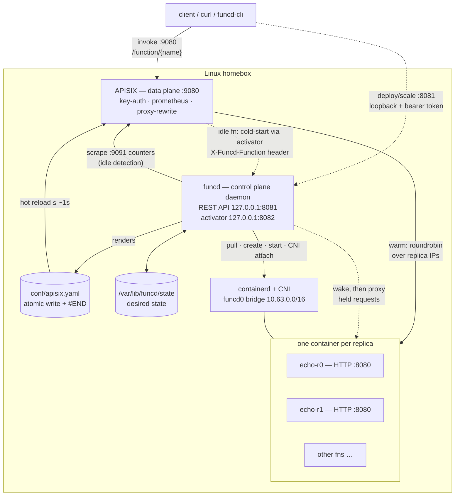

# funcd — SPEC

> **Status: v1 execution spec — subordinate to [blueprint.md](blueprint.md).**
> [blueprint.md](blueprint.md) is the platform blueprint (library-first repository structure, CRD-like
> resources with reconciliation, embedded NATS messaging, internal IAM, augmenting services); this
> document remains the authoritative *mechanics* reference for the single-node v1 slice: APISIX
> standalone rendering (§3.4–3.5), containerd/CNI lifecycle and recovery (§3.1, §3.6), scale-to-zero
> drain/wake ordering (§3.8), the Kata microVM path (§3.7), the function contract (§5), milestones
> M0–M8 (§7) and the risks list (§8). [IMPLEMENTATION.md](IMPLEMENTATION.md) is keyed to these sections.
>
> Where the two documents disagree, the blueprint wins. Superseded here: §4 layout (→ blueprint
> "Repository structure": `pkg/funcd` facade, feature slices, ports & drivers, `tests/e2e`); §6
> hand-shaped REST API (→ OpenAPI-first, CRD-like `spec`/`status` apply — §6 stays as the imperative
> MVP surface); JSON-file state store in §3.6 (→ `store.Store` port: memory / sqlite / slatedb);
> NATS as an M5 add-on (→ embedded NATS/JetStream as the platform messaging layer, accounts per
> namespace); file-only secrets (→ `Secret` resource + workload identity); CLI bundled in `cmd/funcd`
> (→ separate `funcdcli`).

> Single-node, self-hosted Functions-as-a-Service for a homebox.
> Clean-room design. No usage caps, no namespace limits, no scale-to-zero lock-in.
> All dependencies Apache-2.0 / MIT. This is your code, with your copyright.
>
> `funcd` is a working name — rename freely (`homefaas`, `boxfn`, …).

---

## 1. Goals / Non-goals

### Goals
- Run arbitrary container-image functions on **one Linux host** via containerd.
- **No artificial limits**: unlimited functions, unlimited namespaces.
- HTTP-invokable functions, sync first, async later.
- **Manual horizontal scaling** (`replicas: N` per function, APISIX round-robin across
  replica IPs) and **scale-to-zero** with cold-start activation — both in v1 (§3.8).
- Deploy / delete / update / list / scale / logs / secrets through a small REST control API + CLI.
- Auth, routing, and metrics handled by **Apache APISIX (standalone)** — not hand-rolled.
- Cleanly packaged for systemd on a Debian/RHEL homebox.

### Non-goals (v1)
- No clustering / HA / multi-node (single host by design — same as faasd).
- No *automatic* (load-based) horizontal scaling — replica counts are set manually in v1;
  RPS-driven autoscaling is tracked as optional M8.
- No Kubernetes.
- No rolling updates (update = redeploy with a brief gap).

### Explicitly NOT derived from faasd
This project takes **architectural inspiration only** from publicly-documented patterns
(containerd + CNI + an API gateway + a function contract). It contains **no faasd/OpenFaaS
source**, links no OpenFaaS-licensed images, and reuses only Apache-2.0 / MIT components.
The function "watchdog" convention we adopt (HTTP server on a fixed port) is a generic
pattern; where we optionally support STDIO functions we use the **MIT-licensed
of-watchdog** convention, not any CE-licensed code.

---

## 2. Substrate & language

**Language: Go (1.23+).** Rationale: containerd's high-level client, `go-cni`, the OCI
runtime-spec builders, and the compose loader are all Go-native and are the only mature
interface to this stack. Rust would mean thin hand-rolled containerd gRPC + reimplementing
CNI orchestration (weeks of yak-shaving); Node is the heaviest runtime for a resident daemon
and fights the container plumbing throughout. Go is the pragmatic and correct choice here.

**Core dependencies (all Apache-2.0 / MIT):**

| Concern | Choice | License |
|---|---|---|
| Container runtime | containerd (`github.com/containerd/containerd/v2` client) | Apache-2.0 |
| Networking | `github.com/containerd/go-cni` + reference CNI plugins | Apache-2.0 |
| OCI spec | `github.com/opencontainers/runtime-spec` | Apache-2.0 |
| Gateway / data plane | **Apache APISIX** (container `apache/apisix`) | Apache-2.0 |
| Async bus (M5) | NATS (`nats-io/nats.go`) | Apache-2.0 |
| Metrics | Prometheus (scrapes APISIX) | Apache-2.0 |
| MicroVM isolation (M7, opt-in) | Kata Containers shim (`io.containerd.kata.v2`) + Dragonball or Cloud Hypervisor | Apache-2.0 |
| CLI | `spf13/cobra` | Apache-2.0 |
| Function STDIO shim (optional) | of-watchdog convention | MIT |

---

## 3. Architecture



**Control/data split.** funcd never proxies steady-state user traffic. It only (a) drives
containerd/CNI and (b) rewrites `conf/apisix.yaml`. APISIX owns every request hop: auth,
routing, retries, metrics. This is the key simplification over faasd, which bundled a
proprietary gateway. The single, deliberate exception is the **cold-start activator**
(§3.8): requests to a scaled-to-zero function pass through funcd only while the function
wakes, then the path reverts to APISIX → function.

### 3.1 Deploy flow
1. `POST /functions` to funcd control API with
   `{name, image, namespace, env, secrets, limits, targetPort, runtime, replicas, idleTimeout}`.
2. funcd validates namespace label, validates referenced secrets exist.
3. Pull image via containerd (once; configurable snapshotter, default `overlayfs`).
4. **For each replica** `r0 … r(N−1)` (default N=1):
   - Build OCI spec: env, secret bind-mounts (`/run/secrets/<name>`), resolv.conf/hosts
     mounts, optional resource limits (`LinuxMemory.Limit`, CPU quota). Extra capabilities
     such as `CAP_NET_RAW` are opt-in per function, never default.
   - `NewContainer` (`<name>-r<i>`) → `NewTask` → attach CNI (`funcd0` bridge, attachment
     id `<ns>-<name>-r<i>`) → read assigned IP.
   - `task.Start`.
   - **Readiness gate**: poll TCP connect (or `GET <probePath>` if configured) on
     `<ip>:<targetPort>` until ready or timeout (default 30s).

   Any failure rolls back **all** replicas created so far (stop, detach CNI, remove) and
   fails the deploy. Never publish a route to replicas that aren't listening.
5. Persist the desired-state record (§3.6).
6. **Regenerate `conf/apisix.yaml`**: one `upstream` holding a node per replica
   (`<ip>:<targetPort>`) and a `route` (routing scheme in §3.2). Write atomically (temp
   file + rename), end with `#END`.
7. APISIX picks up the change within ~1s. Function is live.

### 3.2 Invoke flow
`GET/POST :9080/function/<name>` → APISIX matches route → proxies to the function's
upstream, round-robin across one node per replica (each a CNI IP:port). APISIX `prometheus`
plugin records latency/counters; `key-auth` (or `basic-auth`) enforces access. If the
function is scaled to zero, the upstream points at the activator instead (§3.8).

**Routing scheme.** Function names are unique *per namespace*. The default namespace is
exposed at `/function/<name>`; any other namespace uses the suffix form
`/function/<name>.<namespace>`. A suffix (rather than an extra path segment) keeps the two
forms unambiguous — a path segment could collide with a function whose name matches a
namespace.

### 3.3 Delete / update
- **Delete**: stop+remove task/container, remove CNI, regenerate `apisix.yaml` without the
  route/upstream.
- **Update**: delete-then-deploy (brief gap; documented non-goal to do rolling).

### 3.4 apisix.yaml (generated example)
```yaml
upstreams:
  - id: fn-default-echo            # ids are fn-<ns>-<name>; names unique per namespace
    type: roundrobin
    nodes:                         # one node per replica (here: replicas = 2)
      "10.63.0.7:8080": 1
      "10.63.0.8:8080": 1
  - id: fn-default-sleepy          # scaled to zero → upstream is the activator (§3.8)
    type: roundrobin
    nodes:
      "127.0.0.1:8082": 1
routes:
  - id: rt-fn-default-echo
    uris:                          # APISIX uri matching is exact — both forms needed
      - /function/echo
      - /function/echo/*
    upstream_id: fn-default-echo
    plugins:
      proxy-rewrite:
        regex_uri: ["^/function/echo/?(.*)", "/$1"]
      key-auth: {}
      prometheus: {}
  - id: rt-fn-default-sleepy
    uris:
      - /function/sleepy
      - /function/sleepy/*
    upstream_id: fn-default-sleepy
    plugins:
      proxy-rewrite:
        regex_uri: ["^/function/sleepy/?(.*)", "/$1"]
        headers:
          set:                     # tells the activator which function to wake
            X-Funcd-Function: "default/sleepy"
      key-auth: {}
      prometheus: {}
consumers:                         # key-auth is a no-op without a consumer holding a key;
  - username: funcd                # funcd generates this key at install time and stores it
    plugins:                       # under /var/lib/funcd/gateway-key
      key-auth:                    # (consumer usernames must match ^[a-zA-Z0-9_]+$)
        key: "<generated-at-install>"
#END
```

### 3.5 config.yaml (APISIX standalone, static)
```yaml
deployment:
  role: data_plane
  role_data_plane:
    config_provider: yaml    # file-driven; the Admin API is unavailable in this mode
                             # (note: `apisix.enable_admin` is a 2.x key, removed in 3.x)
plugins:
  - key-auth
  - prometheus
  - proxy-rewrite
plugin_attr:
  prometheus:
    export_addr: { ip: 0.0.0.0, port: 9091 }
```

### 3.6 State, supervision & recovery

containerd tasks do **not** restart on exit and do **not** survive a host reboot, and CNI
IPs change on every re-attach. Three mechanisms cover this:

- **Desired-state store.** Every deploy persists a record (name, namespace, image, env,
  secrets, limits, targetPort, replicas, idleTimeout) under `/var/lib/funcd/state/` (one
  JSON file per function; atomic write). containerd labels alone are not enough — after a
  reboot the tasks are gone but the intent must survive.
- **Exit watcher.** funcd holds a `task.Wait()` per replica and restarts exited tasks with
  exponential backoff (cap ~1 min; give up + mark `failed` after N attempts). A restart
  re-runs CNI attach, so the IP may change → re-render `apisix.yaml`.
- **Boot reconcile.** `funcd up` diffs desired state against live containerd state,
  re-creates every missing replica (fresh CNI IPs), then rewrites `apisix.yaml` from
  scratch. The route file is always *derived* from desired state — never hand-merged.
  Functions with scale-to-zero enabled come back **idle** (route → activator, no tasks):
  boots are fast and RAM-cheap, and the first request wakes them (§3.8).

All `apisix.yaml` regeneration is serialized through a single writer (one goroutine owning
the render loop); concurrent API calls enqueue, the renderer coalesces.

### 3.7 Isolation & sandboxing (runtime classes)

Default isolation is a runc container with a conservative OCI spec: no added capabilities,
`no_new_privileges`, default seccomp profile. For untrusted or internet-facing functions the
design reserves a stronger runtime class — **one KVM microVM per function** — selected with
`runtime: "microvm"` in the deploy payload. `internal/runtime` is written behind a
`Sandbox` interface from day one, so the stronger class is additive, never a rewrite.

**Chosen path: [Kata Containers](https://github.com/kata-containers/kata-containers)**
(Apache-2.0, OpenInfra; 4.x line). Kata ships `containerd-shim-kata-v2`, a *standard
containerd runtime-v2 shim* — funcd keeps its single containerd socket and simply creates
the container with runtime `io.containerd.kata.v2` (`containerd.WithRuntime`). The microVM
class is therefore one per-function runtime name plus a Kata `configuration.toml` on the
box — not a second backend.

- **Networking is unchanged.** The Kata shim mirrors the netns veth into the guest
  (tc-based), so the function keeps a host-reachable `<fn-ip>:<port>` and the APISIX
  upstream model works as-is.
- **Storage is unchanged.** With Dragonball / Cloud Hypervisor / QEMU as the VMM, the
  container rootfs is shared into the guest over virtio-fs — the standard overlayfs
  snapshotter keeps working.
- **Packaging is solved.** kata-static release tarballs ship the shim, guest kernel, guest
  rootfs and VMM binaries prebuilt.

**VMM choice inside Kata** (a `configuration.toml` decision, invisible to funcd):
*Dragonball* — built into the Rust runtime (`src/runtime-rs`), upstream's recommended
default, no external VMM process, fewest moving parts. *Cloud Hypervisor* (Apache-2.0,
~monthly releases, v52 as of 2026-05) — external VMM, richest feature set, the conservative
fallback paired with the Go runtime if runtime-rs misbehaves. *Firecracker via Kata* —
possible but has no virtio-fs, which reintroduces the devmapper thin-pool requirement;
avoid. Plan: start with runtime-rs + Dragonball, fall back to Go runtime + Cloud
Hypervisor.

**Considered and rejected:** firecracker-containerd. It requires a forked containerd
daemon (second socket/config), a devmapper thin-pool snapshotter, a DIY guest kernel +
rootfs build — and upstream has no tagged releases and a maintenance-mode cadence. Kata
delivers the same KVM isolation boundary as a drop-in shim on stock containerd.

**Cost of admission (why this is M7, not MVP):** requires `/dev/kvm`; per-function memory
floor rises (guest kernel + agent; `default_memory` is tunable down to ~128 MiB); cold
create is hundreds of ms; virtio-fs taxes I/O-heavy functions. Driving the Kata shim from
a raw containerd client (no Kubernetes/CRI) is supported but less traveled — M7 opens with
a spike validating task lifecycle, `cio.LogFile`, and CNI netns wiring through the shim
before any funcd code changes.

**Middle tier.** gVisor (`runsc`, Apache-2.0) is also a drop-in runtime-v2 shim — syscall
interception, no KVM or kernel/rootfs requirements. If microVMs prove too heavy for the
homebox, `runtime: "gvisor"` fits the same `Sandbox` interface.

### 3.8 Scaling: replicas & scale-to-zero (v1)

**Replicas — manual horizontal scaling.** `replicas: N` (default 1, min 1) is the desired
*warm* replica count. Each replica is its own container (`<name>-r<idx>`) with its own CNI
IP; all of them are nodes of the function's single APISIX upstream (round-robin).
`POST /functions/{name}/scale {"replicas": N}` adds or removes replicas incrementally —
existing replicas are never restarted by a scale operation. Load-based *auto*-scaling is
out of v1 (optional M8); the plumbing it needs (per-route counters, replica add/remove) all
exists after this section.

**Scale-to-zero.** Per-function `idleTimeout` (Go duration string; empty → config default
`defaultIdleTimeout: 15m`; `"0"` disables for that function). Three moving parts:

- **Idle detection (scaler).** funcd polls APISIX's Prometheus endpoint (`:9091`) every
  ~15s and watches the per-route request counters (`rt-fn-<ns>-<name>`). A function whose
  counter hasn't moved for `idleTimeout` is idle. No data-path hooks, no log scraping.
- **Scale-down, in drain order.** (1) re-render routes so the function's upstream points
  at the **activator** (`127.0.0.1:8082`) with an injected `X-Funcd-Function: <ns>/<name>`
  header; (2) wait ≥ 2× the APISIX reload latency (~2s); (3) stop tasks + detach CNI.
  Requests landing between (1) and (3) reach the activator, which proxies them to the
  still-running replica. Status becomes `idle`, ready replicas 0; the desired-state record
  (incl. `replicas`) is untouched — idle is runtime state, not intent.
- **Wake (cold start).** First request hits the activator → singleflight per function →
  re-create replicas from the stored spec. The held request unblocks as soon as the *first*
  replica passes readiness (remaining replicas fill in the background); routes are
  re-rendered back to replica endpoints, and during the ~1s reload window the activator
  keeps proxying. Then funcd is out of the data path again.

**Caveats (accepted for v1).** Cold start costs container start + readiness on the first
request. If funcd is down, *idle* functions are unreachable until it returns (warm
functions keep working — APISIX runs independently). A request in flight at the instant of
task stop can fail; the drain ordering bounds this window to near-zero, and the residual
race is documented rather than engineered away.

---

## 4. Component breakdown (proposed layout)

```
funcd/
  cmd/funcd/main.go        # cobra root: up | deploy | rm | ls | logs | secret | version
  internal/
    daemon/                # bootstrap: containerd reachability, CNI init, APISIX supervise
    api/                   # control REST API (:8081) — deploy/delete/list/update/info
    runtime/               # Sandbox interface; containerd/runc backend (microVM backend M7)
    network/               # go-cni bridge (funcd0, 10.63.0.0/16, host-local IPAM + firewall)
    gateway/               # apisix.yaml renderer (single writer, atomic write, #END footer)
    state/                 # desired-state store (/var/lib/funcd/state) + boot reconciler
    scaler/                # idle watcher: polls APISIX prometheus counters, drains idle fns
    activator/             # cold-start proxy (127.0.0.1:8082): wake, hold, forward
    secrets/               # /var/lib/funcd/secrets/<ns>/<name> read/write + bind-mount specs
    logs/                  # task IO → journald/file; tail endpoint
    queue/                 # (M5) NATS subscriber → POST to function route
  deploy/
    config.yaml            # APISIX static config (standalone)
    funcd.service          # systemd unit
    apisix.service         # systemd unit (or run APISIX as a containerd container)
  SPEC.md
  README.md
```

---

## 5. Function contract

A function image MUST serve **HTTP on a single port** — `:8080` by default, overridable per
function via `targetPort` in the deploy payload (in the contract from day one so it never
becomes a breaking change). Two supported authoring styles:
1. **Native HTTP**: image runs its own server on 8080 (any language/framework).
2. **STDIO (optional)**: image bundles the MIT of-watchdog; funcd sets `fprocess=<cmd>` and
   the watchdog turns each request into a process invocation over stdio. Lets simple
   scripts become functions without writing an HTTP server.

Functions must be **stateless and fast to start**: with `replicas > 1` any replica can
serve any request, and with scale-to-zero the container is recreated on wake — treat local
disk as scratch space and keep startup well under the 30s readiness timeout.

Env injected by funcd: user `env`, mounted `secrets` under `/run/secrets/`, plus
`FUNCD_NAME`, `FUNCD_NAMESPACE`.

---

## 6. Control REST API (v1 surface)

The control API is **arbitrary code execution by design** (deploy = run any image), so it is
locked down by default: binds `127.0.0.1:8081` only (a unix socket is an acceptable
alternative), and every request requires a bearer token generated at install time
(`/var/lib/funcd/api-token`, mode 0600). Exposing it beyond localhost is an explicit,
documented opt-in. Name-scoped endpoints take `?namespace=` (default `default`).

| Method | Path | Purpose |
|---|---|---|
| POST | `/functions` | deploy |
| PUT  | `/functions/{name}` | update (delete+deploy) |
| DELETE | `/functions/{name}` | remove |
| POST | `/functions/{name}/scale` | set replica count: `{"replicas": N}` (no restart of existing replicas) |
| GET  | `/functions` | list (across all namespaces) |
| GET  | `/functions/{name}` | status (image, replica IPs, state incl. `idle`, ready/desired counts) |
| GET  | `/functions/{name}/logs` | tail logs |
| POST/GET/DELETE | `/secrets` | manage secrets (GET lists names only — values are write-only) |
| GET  | `/system/info` | version, counts (no caps) |
| GET  | `/namespaces` | list/create funcd-labelled containerd namespaces |

(API shape is ours. Optionally add a faas-provider-compatible adapter later if you want to
reuse `faas-cli` — tracked as a stretch goal, not a v1 requirement.)

---

## 7. Milestones

**MVP = M0–M2 plus basic log tailing — manual replicas included.** v1 = M0–M6. The
component-by-component build plan lives in [IMPLEMENTATION.md](IMPLEMENTATION.md) (MVP in
Phase 1, scale-to-zero in Phase 2).

- **M0 — Scaffold.** Repo, `go.mod`, cobra skeleton, containerd connectivity check,
  `funcd0` CNI bridge init, APISIX running in standalone mode with a hand-written route.
  _Exit: `curl :9080/healthz` hits a manually-placed dummy upstream._
- **M1 — One function, end to end.** Pull image → container+task → CNI IP → render
  `apisix.yaml` → invoke through APISIX. _Exit: deploy an `echo` image and curl it via :9080._
- **M2 — Control API + state.** REST deploy/delete/update/list/scale/info with automatic
  `apisix.yaml` regeneration + atomic reload; manual replicas (§3.8); desired-state store +
  boot reconcile (§3.6). CLI wraps it. _Exit: full lifecycle with no manual file edits;
  `funcd scale echo --replicas 3` round-robins across 3 IPs; functions come back after a
  host reboot via `funcd up`._
- **M3 — Secrets + logs.** Secret store + bind-mounts; log tailing endpoint.
- **M4 — Scale-to-zero.** Scaler (prometheus-counter idle detection) + activator
  (cold-start proxy) per §3.8. _Exit: an idle function drops to 0 replicas after
  `idleTimeout`; the next request cold-starts it and succeeds; the warm path goes back
  through APISIX only._
- **M5 — Async.** NATS + a queue-worker subscriber that POSTs to function routes; `/async`
  route in APISIX enqueues. _Exit: fire-and-forget invocation returns 202 and runs._
- **M6 — Hardening + packaging.** key-auth, Prometheus scrape of APISIX, exit watcher with
  backoff restart (§3.6), systemd units, install script (Debian + RHEL), docs.
  _Exit: `systemctl start funcd` on a fresh box; a crashed function self-heals._
- **M7 (optional) — MicroVM isolation.** `runtime: microvm` class backed by Kata
  Containers (§3.7): kata-static install, runtime name `io.containerd.kata.v2` on the
  existing containerd, Dragonball (or Cloud Hypervisor) VMM. Opens with a no-code spike:
  `ctr run --runtime io.containerd.kata.v2` + log file + CNI netns. _Exit: the same echo
  function deploys with `--runtime microvm` and `uname -r` inside it reports the guest
  kernel._
- **M8 (optional) — Autoscaling.** The scaler grows a scale-up/down policy: RPS over a
  sliding window (same prometheus counters) drives replicas between `replicas` (floor) and
  a per-function `maxReplicas`, with hysteresis to prevent flapping. Pure policy work — all
  mechanics (counters, incremental scale) exist after M2+M4.

---

## 8. Risks & open questions

- **containerd access**: run as root or configure socket perms; decide rootless support (defer).
- **CNI prerequisites**: reference plugins in `/opt/cni/bin`, bridge/firewall kernel modules.
- **APISIX reload latency (~1s)**: acceptable for deploy; document it. For zero-gap updates
  later, consider APISIX's API-driven standalone (in-memory POST) instead of file mode.
- **IP discovery**: read CNI result files (like the reference pattern) vs. parse `cni.Setup`
  return directly — prefer the latter (`gocni.Setup` returns the result; avoid scraping
  `/var/run/cni`).
- **Private registries**: image pulls need credentials eventually. v1: a static creds file
  (`/var/lib/funcd/registry.json`, docker-config shape); defer credential helpers.
- **Egress NAT**: functions on `funcd0` need masquerade (CNI bridge `ipMasq: true` or a
  firewall plugin rule) to reach the internet; verify on both Debian (nftables) and RHEL.
- **Kata outside Kubernetes (M7)**: funcd drives the kata shim through the raw containerd
  client, not CRI — supported but less traveled. De-risked by the M7 opening spike (§3.7);
  `runtime: microvm` stays strictly opt-in so funcd never hard-depends on it.
- **Scale-to-zero edges (M4)**: idle detection granularity is bounded by the scaler poll
  interval (~15s) — fine at 15m timeouts; the prometheus route label must stay the route
  *id* (`rt-fn-…`), so don't enable `prefer_name`; requests in flight exactly at task-stop
  can fail despite the drain ordering (§3.8) — documented, not engineered away in v1.
- **APISIX lifecycle**: run it as a systemd service vs. as a containerd-managed container
  that funcd boots in `up` (the latter keeps everything under funcd, mirrors the supervisor
  pattern). Decision pending — leaning systemd for v1 simplicity.

---

## 9. Why this is clean and unlimited by construction

There is nothing to "remove": the caps in the inspiration project existed because its gateway
and provider were a vendor's proprietary build. Here the gateway is APISIX (Apache-2.0), the
provider is your own Go daemon, and the only limits are the ones the hardware imposes. No
attribution to strip, no license to circumvent — you can use, modify, and even sell this.
