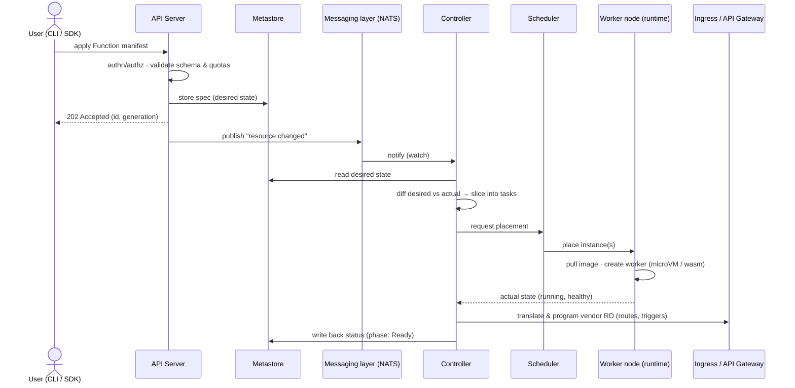
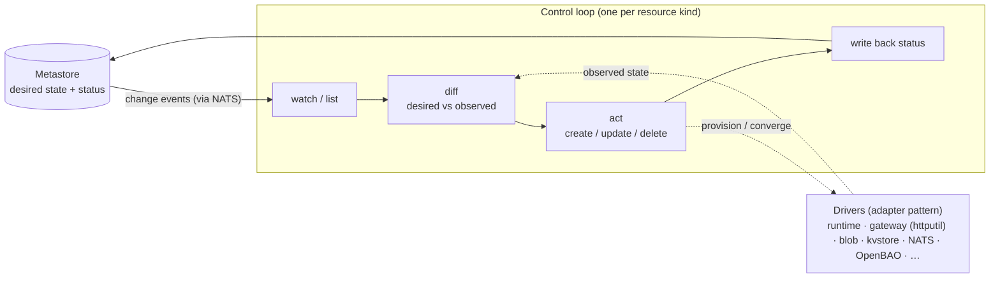
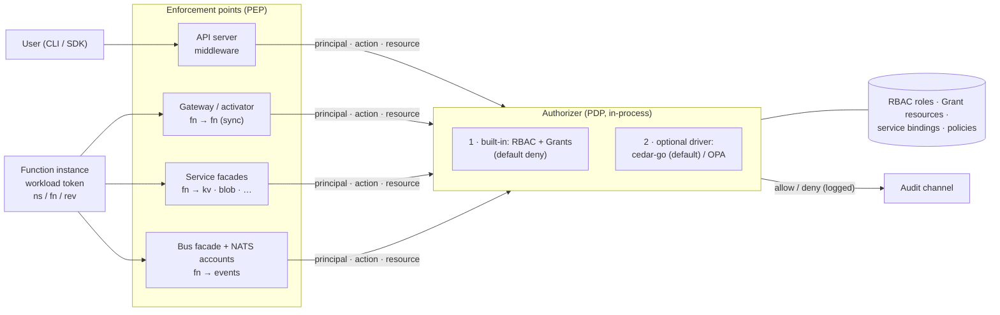
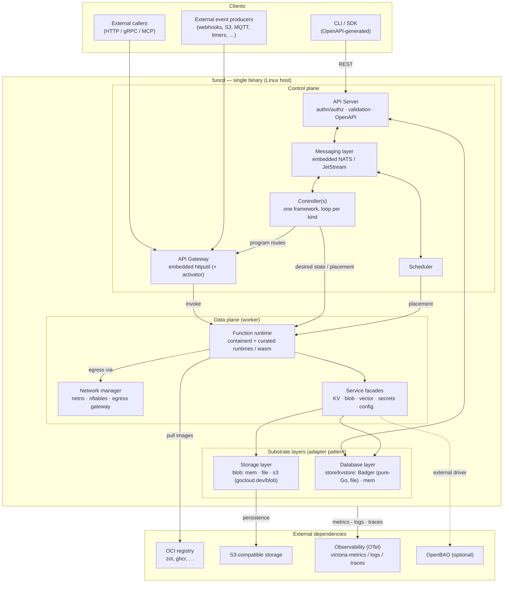
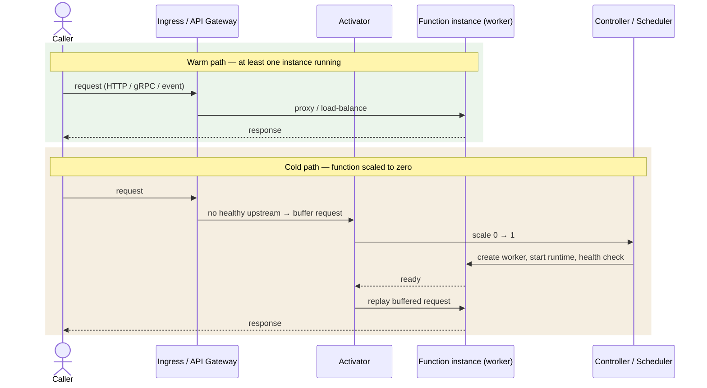
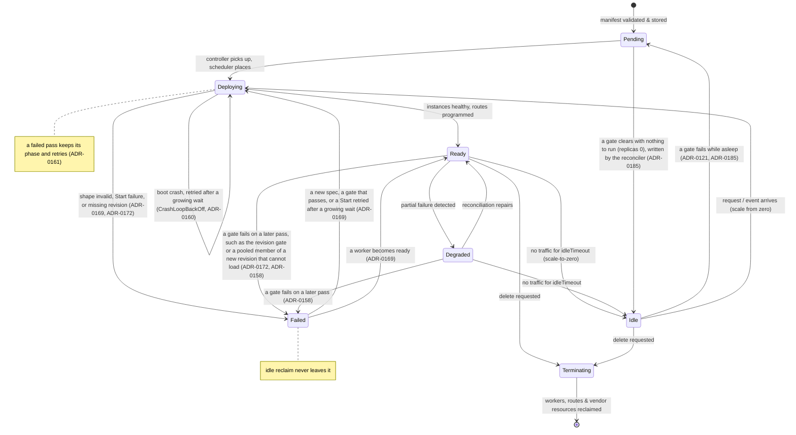

# Spec / Prompt de conception — Plateforme funcd, faasd-like, modulaire, single-binary, and inspired by kubernetes internal architecture.


## Context

Design a lightweight serverless platform, inspired by faasd, provisionally named funcd.

The platform must allow deploying, running, exposing, monitoring, and administering serverless functions, or small services on a Linux machine, without mandatory dependency on Kubernetes or Docker.

The platform will also provide services that augment the basic serverless capabilities, such as KV storage, blob storage, eventing sourcing, and other services that can be used by the functions.

- The design must be:
    - modular;
    - single-binary on the platform side;
    - API-first;
    - compatible with SDK/CLI generation via OpenAPI;
    - extensible to multi-node later;
    - compatible with a PaaS vision for wasm / functions / agents;
    - testable in phases with progressive e2e validation;
    - designed to minimize code duplication as much as possible.


## Purpose of the platform

In an AI era where agents are becoming more and more common, the platform will allow to deploy and run agents as serverless functions, with a focus on:
- simplicity of deployment and operation;
- low resource consumption;
- high performance;
- high observability and monitoring capabilities;
- high security and isolation of the functions;
- high extensibility and modularity of the platform;

The platform should be built on existing tools and libraries to avoid reinventing the wheel, and to leverage the existing ecosystem of serverless functions and agents.

## Components

In order to make this platform self-contained, we will need to implement the following components:

- **Function** :
    - **Runtime**: A lightweight runtime that can execute serverless functions. This runtime handles function invocation, scaling, and lifecycle management. Decided direction (2026-06-13, to be formalized in its own ADR):
        - **CloudEvents-only handler contract**: handlers never see raw transport. Every trigger — HTTP request, timer, bus message — is captured by the eventing layer and normalized into a CloudEvents payload consumed by the handler (exact signature per runtime shape below — e.g. Node `handle(context, event)`); for sync HTTP triggers the handler's return value maps back to the HTTP response by convention (Lambda-proxy style; Knative-style: nothing → 204, a CloudEvent, or `{statusCode, headers, body}`). Transport between gateway and worker stays plain HTTP — the **runtime shim** inside the container does the normalization, so CloudEvents is a contract property, not a new wire protocol. OpenFunction spec and the AWS Lambda runtime API remain the references. Open point for the contract ADR: response **streaming** (agents stream LLM tokens) needs an explicit escape hatch to the pure request→event→response model.
        - **Curated language runtimes, source-artifact deploys**: the platform does not accept arbitrary container images for now. Users deploy code artifacts (JS bundle, Python wheel/zip) into platform-owned, hardened runtime containers (`nodejsXX`, `pythonXYZ`) that embed the runtime shim: it speaks CloudEvents to the platform, hosts the SDK (KV, blob, events, secrets), and intercepts outbound HTTP at the language-runtime level **by default** (Node: undici global dispatcher; Python: `sitecustomize` patching) — see egress tier 2. Arbitrary OCI images and further languages come later behind the same `Runtime` port; WASM remains the path for untrusted code.
        - **Function shape (Knative-func compatible)**: each curated runtime publishes the *shape* an artifact must conform to, adopted from the [Knative func templates](https://github.com/knative/func/tree/main/docs/function-templates) so existing `func` functions port with no code change. **Node.js**: a single bundled file exporting the configured handler — `handle(context, event)`; in funcd the event is always a CloudEvent. **Python** (ADR-0049): a `.py` module exporting `handle(context, event)` (the same contract as Node, the event always a CloudEvent) and a **mandatory** typed I/O contract (ADR-0058; **mandatory for every function since ADR-0090** — both sides always declared, a void side as `{"type":"null"}`): the handler's `FuncInput`/`FuncOutput` types (a TS interface/type or a Python class) generate a **JSON Schema** contract — a bounded, language-agnostic supported-type *profile* — validated before invoke (input → 422) and after return (output → 500), a void output replying **204**, by a validator the runtime **compiles from the pinned schema at worker warm-up** (ADR-0123, superseding ADR-0058/0060's eval-free *precompile*: a bounded compile, once at init, over a `contract.Check`-gated + digest-pinned schema, before any handler loads — so *advertised == enforced* still holds); `event_schema`/JTD (ADR-0038) is superseded — *not* the original Knative `new()`-factory/lifecycle-hook shape, which the implemented `handle(context, event)` reference shim supersedes for both languages. The runtime shim serves `/health/liveness` and `/health/readiness` automatically — these back the platform's readiness gate and scale-to-zero wake checks. (The reference shim is the single-module form, parallel to the JS bundle; a **dependency-bundle** artifact — handler + vendored native deps, ADR-0089 — is now supported alongside it, while a richer lifecycle-hook Python shape stays a future option behind the same `Runtime` port.) Where funcd deliberately differs from Knative func: **no source-tree build** (no buildpacks, no deploy-time `func.yaml`) — the deliverable *is* the prebuilt artifact (single-file JS bundle or a Python single-file/dependency-bundle), and `func.yaml`'s role is played by the `Function` resource spec. **ADR-0122** adds a small colocated **client push/dev config** `funcdctl.yaml` (the `wrangler.toml` analogue: `runtime`/`handler`/`bindings` + the inline I/O JSON Schema) that `funcdctl` reads to **bake the schema-only contract at `push`** and **generate `.pyi`/`.d.ts` types**, and will later drive **`funcdctl dev`** (local run). It is **not** the deploy manifest and does **not** compile to the `Function` resource — the `Function` CRD stays the platform's desired-state manifest, so the "no `func.yaml`" stance is unaffected.
        - **Shape enforcement (three gates, one validator)**: the shape is validated everywhere it matters, from one shared validator package (single implementation imported by CLI and server — no drift; lives in the public surface so `funcdctl` can use it under the import-discipline rule).
            1. **CLI pre-flight (DX, untrusted)**: `funcdctl` validates the artifact locally before upload — instant, offline feedback. JS: static export analysis (esbuild's parser is an embeddable Go library, MIT) confirming the configured handler is exported; Python: wheel structure (`*.dist-info`, entry module present) + entry-point heuristics. Skippable, and never trusted by the platform: the API can be called without the CLI.
            2. **Admission (authoritative, static)**: the API server runs the same validator when a `Function` is applied; the artifact is pinned by digest in the stamped `Revision`, so what was validated is exactly what ships.
            3. **Materialization (authoritative, dynamic)**: when the scheduler places the function and the worker node boots the worker, the runtime shim performs the only fully reliable check — load the artifact, resolve `handle` / `new()`, wire lifecycle and health hooks. On failure the function never becomes ready and no route is programmed; the controller writes a precise `ShapeValid: False` condition into `Function.status` (e.g. "module `app` has no attribute `new`"), surfaced by `funcdctl describe`.
        - The function is of kind "serverless": event-based input, response via output event or side effects (storage, events, …). Stateful functions rely on the platform services (KV storage, blob storage, graph database, etc.) to store and retrieve state.
    - **Containerization**: functions are packaged and deployed from **source artifacts**, not user images: the platform layers the artifact onto the matching runtime base image at deploy time (users never write Dockerfiles). **Artifact distribution is OCI (ADR-0031, newest-accepted-wins):** the user is the artifact client — `funcdctl push` packages the source bundle as a digest-addressed OCI artifact to a registry (or a zero-infra **local OCI layout** for single-host dev) and `funcdctl login`/`pull` round it out; the user sets `Function.spec.image` (a ref/tag; the digest is **optional**) and the **platform resolves the tag → digest and pins it into the immutable Revision at stamp time** (ADR-0035, Knative-style — no manual digest pinning), then **pulls by that digest** (the digest is the authority — a mutable tag can never swap an already-stamped Revision). The curated **runtime bases** are **embedded in the funcd binary** and imported into funcd's managed containerd on the first `Create` of each runtime in a namespace that lacks its image; on the private containerd the boot sweep drops an earlier run's images (**ADR-0054**, **ADR-0186** — distroless node/python, no registry pull); at deploy funcd still layers the pulled *artifact* onto the curated base (P-V-2) — the *artifact* reaches the platform via this push/pull, while the *runtime base* now ships inside funcd itself. **In V1 (ADR-0032) that layering is a read-only bind-mount of the pulled artifact into the curated base container** (logically base+artifact, no per-deploy image build); a baked per-revision base+layer image is a deferred optimization. **The function's generated I/O contract (ADR-0058) is surfaced as OCI manifest metadata (ADR-0059):** a small content-addressed contract blob (`application/vnd.funcd.contract.v1+json`) + a `dev.funcd.contract.v1` annotation, so a registry, a deploy-time policy, or an agent can read a function's input/output shape — `funcdctl inspect` — **without pulling the bundle layer or executing code** (the substrate for the future registry/AI-matching layer; cross-artifact discovery via OCI referrers is deferred).
    - **Security and Isolation**: A security and isolation system that ensures that functions are executed in a secure and isolated environment, preventing unauthorized access to the host system and other functions. Baseline (V1–V2): **crun** (C-based OCI runtime — lower per-worker memory than the Go runc; invoked via containerd's `io.containerd.runc.v2` shim, a drop-in OCI-compatible `BinaryName` swap — ADR-0011) with conservative OCI defaults — no added capabilities, `no_new_privileges`, default seccomp. Strong isolation is scheduled for V3 (researched 2026-06, to be formalized in its own ADR): **Kata Containers** as a standard containerd runtime-v2 shim — one KVM microVM per function with Dragonball as the default VMM and Cloud Hypervisor as fallback; firecracker-containerd rejected (forked containerd, devmapper requirement, maintenance-mode cadence). The gVisor middle tier was dropped (2026-06-13) — for untrusted code the WASM runtime provides isolation by construction instead. Runtime classes (runc / wasm / microvm) stay selectable per function behind one worker interface.

- **Services** :

    **Service architecture — two substrate layers + the adapter pattern.** Every service
    follows the same shape, generalizing the ports & drivers model to the whole platform
    (the anti-duplication principle, taken from how [Databend](https://github.com/databendlabs/databend)
    separates a pluggable object store from a pluggable meta-service):
    - **Adapter pattern everywhere**: a service is a Go *port* (interface) with multiple
      *drivers*, at minimum one real and one in-memory. A driver wraps an upstream SDK; it
      never leaks the upstream type past the port. funcd reuses mature SDKs rather than
      reimplementing — e.g. [`gocloud.dev/blob`](https://github.com/google/go-cloud/tree/master/blob)
      (Apache-2.0) for object storage, with its `memblob` / `fileblob` / `s3blob` drivers.
    - **Two shared substrate layers**, consumed by the higher services so the recurring
      backends (memory, file, S3) are implemented once, not per service:
      - **Storage layer** (`blob` port) — opaque object bytes; drivers: memory, filesystem,
        S3-compatible (via `gocloud.dev/blob`). This is the bytes substrate.
      - **Database layer** (`store`/`kvstore` port) — structured/keyed records with watch +
        atomic ops; engine: **Badger** (pure-Go embedded LSM; local file store) + a pure-Go
        **memory** engine for tests (ADR-0065, which replaced ADR-0006's slatedb/cgo engine —
        restoring the pure-Go static binary; the `store.Store` port + semantics are unchanged).
        This is the records substrate.
    - **Service = CRD + facade + controller + driver**: a service instance/binding is a
      `Service` resource (CRD); its controller (built on the general controller framework —
      see [Controller](#controller)) reconciles desired→actual by driving the upstream
      through the SDK (create/bind/teardown a bucket, KV namespace, …); the in-process
      **facade** is what functions actually call, enforcing per-request authorization via
      the PDP and multiplexing tenants over pooled upstream resources.

    Concrete services (each a port; drivers listed real → in-memory):
    - **Blob storage** (the storage layer, exposed as a function-facing service): object
      get/put/list/delete + presign. Drivers via `gocloud.dev/blob`: **S3-compatible**
      (minio, zot-adjacent, AWS S3, …), **filesystem**, **in-memory**. **Functions reach blob** via
      `context.blob.{get,put,delete,list,signedUrl}` over the per-sandbox worker-node local API (the same
      channel as `context.kv`/`context.invoke`), routed to a binding-gated facade that authorizes the
      **`S3Capability`** `s3::read`/`s3::write` on the bound `BlobPrefix` (ADR-0127 — **bind-as-grant** on
      `Function.spec.blob`: no binding ⇒ Forbidden), keyed on the **same substrate + keyspace** as the S3
      frontend so the two coexist. The ADR-0080 **S3-protocol frontend** (SigV4 keypair) stays the
      external/inspect path; `context.blob` is the in-function native path (no keypair, no S3 SDK).
    - **KV storage** (`kvstore` port, ADR-0019): get/put/delete/list. Drivers: **durable Badger**
      (ADR-0066 — a **separate** Badger instance from the metastore; prefix-per-store, single-writer gateway +
      group commit, `DropPrefix` teardown) and **in-memory** (default). The durable driver exposes two
      **opt-in, default-off** seams — **DR backup** (ADR-0067: version-watermarked incremental export → the
      `blob` port, with restore) and **CDC** (ADR-0068: a durable transactional-outbox change-feed → the `bus`
      port). **Functions reach KV** via `context.kv.{get,put,del,list}` over the per-sandbox worker-node local API
      (HTTP-over-UDS, connection-scoped identity; on a pool socket, the member named in `X-Funcd-Member`, checked
      against the pool's members — ADR-0158), routed to the PDP-authorized `Facade` (ADR-0069 — the same
      channel as `context.invoke`, ADR-0064). The shim KV client also offers typed read accessors
      (`getText`/`getJSON`, `get_str`/`get_json`) over `get` (ADR-0070). **KV is a declarative resource**
      (ADR-0073, superseding ADR-0072's `Grant` mechanism): a namespaced **`KVStore`** CRD = a **domain** (one
      Badger prefix, one instance-level gateway, per-op caps `maxValueBytes`/`maxKeyBytes`) holding
      **sub-domains** — `spec.tables[]`, each with an `owner` = the **single writer** (per-table, the consistency
      invariant; the typed-record engine attaches schema/indexes here, backlog). Functions **bind** KV on
      **`Function.spec.kv`** (`alias → store + table`, the wrangler/`spec.links` convention), reached as
      `context.kv.*('alias', …)`. **Default-deny**: no `spec.kv` entry ⇒ Forbidden (the binding is the
      capability; only config + secrets are implicit). **Writes require `caller == table.owner`**; **reads** are
      coarse within the namespace (the V1.1 trust boundary) — **fine-grained per-function authz is delegated to
      the PDP/Cedar IAM ADR**, where authorization belongs (KV does not hand-roll RBAC; Cedar policies persist as
      resources in the metastore, entities materialized from existing resources). A reconciler does Ready +
      Delete/table-removal → `DropPrefix`; admissions enforce store-count quota and deletion-protection (bindings
      **and** data), while binding/owner **existence is reconcile-time** (ADR-0121, accept-and-requeue: a
      consumer naming a not-yet-applied KVStore/table is admitted and held not-Ready until it exists — no
      write-time existence gate). V1.1 KV is **same-namespace**; cross-namespace sharing and
      the typed engine are deferred. Cross-node replication (NATS-lattice) is FEAT-0002.
    - **Graph database**: store and query graph data. Drivers: **in-process**
      (https://github.com/kuzudb/kuzu, https://github.com/cayleygraph/cayley) and **external**
      (neo4j, dgraph). (V3 candidate.)
    - **Cryptography services**: A cryptography service that allows functions to perform cryptographic operations, such as encryption, decryption, signing, and verification. https://github.com/tink-crypto/tink-go
    - **Monitoring and Logging**: A monitoring and logging system that collects metrics, logs, and traces from the functions and the platform itself. We will only be OpenTelemetry compliant, and we will use existing tools like stdout, stderr, and log files, and/or external monitoring systems like victoria-metrics, victoria-logs, victoria-trace, and grafana for visualization and analysis.
    - **Workflow engine**: A workflow engine that allows functions to be composed into complex workflows, with support for conditional branching, parallel execution, and error handling. we could take inspiration from existing workflow engines like temporal, but try to keep it simple and lightweight. **Realized by [FEAT-0005](docs/feat/0005-feat-workflow-engine.md) — the `Workflow`/`WorkflowRun` resources + a state-machine orchestrator ([ADR-0094](docs/adr/0094-workflow-engine-core.md)) over a typed expression engine ([ADR-0095](docs/adr/0095-reference-engine-typed-paths-predicates.md)).** The V1 core dispatches steps **synchronously** over the existing wake-then-invoke path (the HTTP response is the completion signal) with durable state in an engine-owned Badger instance — so it carries **no bus dependency**; NATS enters later with the event Sensor (F69), not the engine core. Typed edges (contracts checked at reconcile), scale-to-zero runs, and lineage are its differentiators.
    - **Vector database**: store and query high-dimensional vectors (similarity search, RAG). Drivers: **in-process** (a Go embeddable index) and **external** (pinecone, weaviate, milvus, qdrant).
    - **Config**: non-sensitive configuration for functions/services, updatable without redeploy. Drivers: **in-memory**, **file**, **S3-backed** (storage layer).
    - **Secrets management**: securely store and deliver sensitive values (API keys, credentials), encrypted at rest, delivered to workers via env/tmpfs. Drivers: **in-memory** (dev), **S3-backed + envelope encryption** (storage layer), **external** ([OpenBAO](https://openbao.org/)).
    - **Eventing system**: An eventing system that allows functions to be triggered by various events, such as HTTP requests, timers, events, or external events from other systems. We will use existing technologies like nats and inspiration from aws eventbridge.
        - Argo events example :
        ```mermaid
        flowchart LR
            subgraph External["External Systems"]
                GitHub
                S3["S3/MinIO"]
                MQTT["MQTT/Kafka/etc."]
            end

            subgraph K8s["Kubernetes Cluster / Argo Events Namespace"]
                Webhook["Webhook svc"]
                EventSource["EventSource Pod(s)"]
                EventBus["EventBus (JetStream/Kafka)"]
                Sensor["Sensor Pod(s)"]
                K8sObjs["Create K8s objs<br/>(CRDs, Deployments, ...)"]
                Workflows["Argo Workflows"]
                Calls["HTTP/NATS/Kafka calls"]
            end

            GitHub --> Webhook --> EventSource
            S3 --> EventSource
            MQTT --> EventSource
            EventSource -- publish --> EventBus
            EventBus -- "subscribe / filter / conditions" --> Sensor
            Sensor -- triggers --> K8sObjs
            Sensor -- triggers --> Workflows
            Sensor -- triggers --> Calls
        ```
        - A more generic eventing system example :
        ```mermaid
        flowchart LR
            subgraph External["EXTERNAL PRODUCERS"]
                GitHub
                S3["S3 / SNS / SQS"]
                Eventing["Eventing systems<br/>(NATS jetstream)"]
                MQTT
                Timers
                Other["…"]
            end

            subgraph Sources["EVENT SOURCES"]
                direction TB
                Adapters["adapters: Webhook, Kafka, NATS, Files, …"]
                Normalize["→ normalize to CloudEvents"]
                Publish["→ publish to subject / topic"]
                Adapters --> Normalize --> Publish
            end

            subgraph Bus["EVENT BUS (messaging layer)"]
                direction TB
                subgraph JetStream["NATS JetStream"]
                    Stream["stream: \"default\""]
                    Subjects["subjects: default.&lt;src&gt;.&lt;ev&gt;"]
                end
                subgraph Kafka["Kafka"]
                    TopicsBus["topics per bus"]
                    TopicsSensor["topics per sensor (event / trigger / action)"]
                end
            end

            subgraph Sensors["SENSORS"]
                direction TB
                Subscribe["→ subscribes to subjects / topics"]
                Filter["→ deps logic, filters, transforms, parameters"]
                Resolve["→ resolves expressions e.g. (A || B) && C"]
                Subscribe --> Filter --> Resolve
            end

            subgraph Triggers["TRIGGERS"]
                direction TB
                Execute["→ executes side effects when deps satisfied"]
                Actions["HTTP calls, serverless, msg publish, notify, …"]
                Execute --> Actions
            end

            External --> Sources --> Bus --> Sensors --> Triggers
        ```

        LEGEND (concise):
        - Event Sources: capture external events → convert to CloudEvents → publish to bus (subject/topic).
        - Event Bus: transports events (JetStream subjects or Kafka topics; optional retention/persistence).
        - Sensors: subscribe; filter/transform; evaluate dependency graph; parameterize trigger payloads.
        - Triggers: invoke HTTP APIs, serverless functions, publish messages, send notifications, call workflow engines, etc.

- **External Dependencies** :
    - **Registry**: This could any OCI compliant registry (e.g., Docker Hub, GitHub Container Registry, etc.) and even local registries like [Zot Registry](https://zotregistry.dev/)
    - **Messaging engine**: A messaging engine that allows functions to communicate with each other and with external systems in a decoupled manner. ([Nats/jetstream](https://github.com/nats-io/nats-server))
    - **Monitoring and Logging**: External monitoring and logging systems that can be integrated with the platform to collect metrics, logs, and traces from the functions and the platform itself. ([Victoria-metrics](https://docs.victoriametrics.com/victoriametrics/index.html), [victoria-logs](https://docs.victoriametrics.com/victorialogs/index.html), [victoria-trace](https://docs.victoriametrics.com/victoriatraces/index.html)) + vmauth for authentication and authorization and HTTP proxy of the monitoring systems.... https://docs.victoriametrics.com/victoriametrics/data-ingestion/opentelemetry-collector/ could be used to collect and export metrics, logs, and traces from the platform and the functions to the monitoring systems by bathing them in the OpenTelemetry Collector.
    - **S3-compatible storage**: An S3-compatible storage system that allows functions to store and retrieve large binary objects (blobs) in a fast and efficient manner (the **blob** substrate). The **metastore** is a separate, pure-Go embedded **Badger** store on local disk (ADR-0065) — it does **not** depend on S3.


- **Internal components** :

    - **API Server**: An API server that exposes the platform's functionality via a RESTful API, with support for authentication, authorization, and other API management features. 
    - **Controller**: reconciles desired→actual state for every resource kind. **All controllers are built on one general controller framework** (the Kubernetes controller-runtime pattern: shared informer/watch, work queue, rate-limited retry with backoff, status write-back) — a single engine in `internal/controller`, with each resource kind contributing only its `Reconcile` logic. This is non-negotiable: it is what keeps reconciliation uniform and duplication-free across functions and every service. Example — the **storage** service: managing (CRUD) and binding a bucket to a function via the `Service` CRD is a controller built on the framework whose `Reconcile` drives the upstream through the `gocloud.dev/blob` SDK (create bucket, apply lifecycle, wire the binding); the same shape applies to KV, vector, secrets, config — only the driver SDK changes.
    - **Scheduler**: A scheduler that schedules the execution of the functions based on various factors, such as resource availability, function priority, and other scheduling policies.
    - **Messaging layer**: A messaging layer that allows the internal components of the platform to communicate with each other in a decoupled manner. We will use existing technologies like nats to provide a simple and efficient messaging layer for the internal components of the platform. NATS is embedded in-process (nats-server is a plain Go library): JetStream runs with memory storage for tests and file storage for production; pointing funcd at an external NATS cluster stays a drop-in option for multi-node.
    - **Metastore**: stores resource metadata (CRD-like specs + status) and watches. Itself behind the `store.Store` port (adapter pattern, same as every service): the engine is **Badger** (pure-Go embedded LSM, local file store; ADR-0065), with a pure-Go **memory** engine for tests. ADR-0065 superseded ADR-0006's slatedb/cgo engine — pure-Go (no cgo, no object-store dependency), restoring the static single binary; the port + RV/generation/watch semantics are unchanged. The metastore is the database layer applied to the platform's own control state. (Object-storage backup / DR / CDC are opt-in concerns of the per-function KV-service work, not the metastore.)
    - **Control plane**: The control plane that manages the overall operation of the platform, including the API server, the controller, the scheduler, and the messaging layer. The control plane will be responsible for ensuring that the platform is running smoothly and efficiently, and for taking corrective actions when necessary.
    - **Worker node**: executes functions and provides their runtime environment. The worker node **exposes an API** — to the control plane (placement, worker lifecycle: `workernode.proto`) and a local one to the workers it hosts (the runtime shim calls it for KV/blob/secrets/events/identity/**invoke** — the last being the synchronous fn-to-fn RPC verb, `context.invoke(alias)`, brokered over a per-sandbox UDS, ADR-0064). Unlike the public control-plane API, **no SDK is published** for the worker-node API: it is reached only through the built-in runtime shim, which is shipped and versioned with the platform — there is no third-party client to generate.
    - **External providers**: The external providers that provide the necessary resources and services for the execution of the functions and the services, such as the registry, the API gateway, the messaging engine, the monitoring and logging systems, and the S3-compatible storage.
    - **Ingress controller / API Gateway**: exposes functions as HTTP endpoints (gRPC/MCP later) with routing, auth, rate limiting, and load balancing. **Embedded, not supervised**, behind the `gateway.Gateway` port. **Primary driver: an in-process `net/http/httputil.ReverseProxy`** (ADR-0013, superseding ADR-0012's Lura-as-production framing) — transparent 1:1 routing to function workers, **streaming-native (SSE / token streaming via `FlushInterval`, WebSocket via native `Upgrade`)** which the agent/MCP workload needs, and dynamic route programming as a map swap. An external upgrade request with no body is forwarded without the ADR-0134 invoke envelope, and the activator closes any upgrade tunnel it proxies that carries no byte in either direction for 5 minutes ([ADR-0181](docs/adr/0181-edge-forwards-bodiless-upgrades.md)). The ingress feature set (auth PEP, rate-limit, LB+health, circuit-break, static files, compression, CORS, timeouts) is built as **composable `net/http` middleware** — the way Caddy/Traefik are built — each owned by its feature (auth→API server/PDP, LB+health→activator, timeouts→FEAT-0006/F107, [ADR-0151](docs/adr/0151-external-invoke-deadline.md)). Three are handler steps rather than middleware: the external invoke deadline (`spec.timeout`, default `invoke.defaultTimeout` 60 s, 504 before the first byte) is set in `serveFunction` and enforced by the activator, the ADR-0113 auth PEP is a `serveFunction` step, and so is the `key: function` rate step ([ADR-0164](docs/adr/0164-rate-limit-per-target.md): one bucket per resolved `<namespace>/<function>`, taken after the PEP and the Function lookup, before the activator); the `key: clientIP` rate step and the size and in-flight caps stay `limit.Chain` middleware. **Static serving** ([F82, ADR-0120](docs/adr/0120-static-asset-serving-route.md)): a `Route` whose backend is a `Bucket` prefix serves that prefix's objects directly (index/SPA, content-types, a pinned three-tier cache policy, weak ETag) — no function in the path. Its content half is the **`Site`** kind ([F103, ADR-0139](docs/adr/0139-site-declarative-static-web-app.md)): an immutable OCI site bundle materialized under a digest-scoped `Bucket` prefix, owning its `Bucket` + `Route` inline, `Ready` only once the bundle is servable, with atomic swap and rollback by digest. **[ADR-0140](docs/adr/0140-path-mounted-site.md)** mounts a `Site` at an edge **path** (`ingress.path`; host-less ⇒ `/site/<name>`), so several sites share one listener without a hostname each — the prefix-mount arrangement other edges offer, reusing the Route matcher's segment-aware prefix match + strip. **TLS/automatic-HTTPS** (ADR-0111, F74) returning a `*tls.Config` for funcd's own `http.Server` — no listener handover (`ServeTLS`): a **self-signed stdlib cert (default, offline)** or an **operator-provided** cert, with **[`certmagic`](https://github.com/caddyserver/certmagic)** (Apache-2.0) on the **`acme`** path for public certs. TLS is opt-in; plaintext is the back-compat default (TLS-on-by-default is a phased V2 option). The gateway has a **single driver** (the embedded `httputil` proxy); ADR-0029 dropped the unused, streaming-weak Lura driver. An **external-gateway** driver (route programming into an external APISIX/Caddy via its admin API) is the V2 second driver the `gateway.Gateway` port keeps a clean swap. This keeps the single-binary / embed-first rule and makes the **activator** a direct in-process code path (no healthy upstream → buffer → wake → forward) — the reversal of the earlier "gateway as a separate process" stance (APISIX, rendered config + hot-reload). Trade-off accepted: funcd owns the request data path; the `Gateway` port keeps an external gateway or a full embedded-Caddy driver a swap for later.
    - **Providers — the platform capability model (built-in vs. add-on).** A **provider** is a shared, platform-offered endpoint that supplies a protocol/capability to many consumers — funcd's analog of a **wasmCloud capability provider**: a **binding** (`spec.kv` / `spec.blob` / `spec.links` / `spec.catalogs`) is the *link*, and a **port + ≥2 drivers** is the *contract*, so the provider behind it is swappable without touching the function. Providers come in two tiers, split by the pure-Go-daemon / cgo boundary (which is also the trust boundary):
      - **Built-in providers** — *in-daemon*, pure-Go, shipped in the binary, trusted core, always-on, with direct port/identity access. The **ingress gateway** (HTTP → functions, ADR-0013) and **egress gateway** (the routing built-ins — "gateway" is the descriptive name kept for these); the **S3 provider** (S3/SigV4 → `blob.Bucket`, ADR-0080); the **log-ingest provider** (the function-telemetry side channel, ADR-0081); and the existing data-plane services functions bind to (KV, blob, secrets, eventing, invoke).
      - **Add-on providers** — *out-of-daemon* **managed engine services** (a heavy native engine such as DuckDB — embedding it in the pure-Go daemon would require cgo, so it runs out-of-daemon as a sandboxed service), tenant-governed, optionally reached *through* the ingress gateway, optional/extensible. A provider is **not a Function** (no artifact/handler; its own protocol/health/auth): it is deployed by the **add-on provider runtime** (F57, ADR-0087 — `internal/provider` over the existing `runtime.Runtime` container port, with a configurable HTTP readiness probe and an optional ingress route), reused by per-provider CRDs. A provider is a **first-class S3 principal** under the same Cedar binding-as-grant as a function (F58, ADR-0088 — its `spec.blob` are its `blobBindings`, it owns its catalog prefix), so it reads/writes Parquet through the F47 PEP with no privileged bypass. The FEAT-0003 **catalog/query provider** (F48, ADR-0086): a curated `duckdb` runtime + a `CatalogService` CRD (deployed via the provider-runtime), its DuckLake catalog a SQLite file checkpointed to blob. A **Function consumes** a catalog the funcd-native way via **`spec.catalogs`** (F61, ADR-0091): declaring the binding injects `FUNCD_CATALOG_<ALIAS>_URL`/`_TOKEN` (the catalog's endpoint + `QUACK_TOKEN`, resolved for *declared* consumers only — binding-as-grant, token never in status), so the F48 SQL round-trip runs as a governed Function. **[FEAT-0008/F102, ADR-0137](docs/adr/0137-per-caller-catalog-query-rbac.md)** then brings the catalog **query** path under a per-caller **`catalog::query`** Cedar PEP — an in-daemon **catalog proxy** fronts each engine (resolve caller token → PEP → swap in the shared engine token), reached by internal Functions via a **node-private listener** (a MAC-authenticated per-function token; the `spec.catalogs` binding becomes an *enforced* `catalog::query` permit) and by external `Identity` callers via an **ingress `Route`** (a minted per-Identity token + a `RolesAssignment`), superseding ADR-0091's Decision-3 shared-`QUACK_TOKEN` injection. **[ADR-0138](docs/adr/0138-external-catalog-ingress-and-route-aggregation.md)** lands that external edge on the **Route-v2** data-plane (ADR-0110): an opt-in `CatalogService.spec.ingress` programs an edge entry whose **node-private Upstream backend** (a new, edge-router-internal reverse-proxy target — *not* a user-facing `RouteBackend` arm, so no SSRF) points at the **PEP proxy**, never the engine; the data-plane reverse-proxies it (open-auth, the proxy does its own `catalog::query` PEP). A new **edge-route aggregator** is the single sole-writer of the edge router's replace-all table, unioning per-source entries (user `routes` · the catalog) and arbitrating their claims with one rule set ([ADR-0176](docs/adr/0176-one-collision-rule-for-every-edge-source.md): one owner per `(host, path, method)`, a host in `explicit` mode, no host-less claim under `/function/`), so the catalog route coexists with user Routes and never takes another's claim. The separate `egress::connect` grant (network reachability) stays a later V2 egress-PEP addition. (The FEAT-0004 observability **read path** (F54, ADR-0084) is *not* an add-on: it is a **thin pure-Go in-daemon reader** — parquet-go + plog over `blob.Bucket`, no DuckDB — served on the control plane behind the log-ingest capability, refining the earlier "observability serving provider" sketch.)
      The dividing question: *can the provider be embedded pure-Go in the trusted daemon with direct port access?* — yes → **built-in**; no (needs cgo / a heavy engine, works over a binding) → **add-on**. Don't stand up a built-in provider where an add-on behind the ingress gateway suffices, or vice-versa. (Distinct from **external providers** below — those are *third-party* systems funcd integrates with, not platform-offered providers.)
    - **Network manager (egress control)**: wires each function worker's network namespace (veth/bridge — done directly by the runtime driver on a single node; no Kubernetes CNI machinery needed) and enforces egress policy in two layers: **L3/L4** — nftables default-deny for lateral traffic (function → function only through the gateway, platform services only through their facades) and no direct internet route; **L4–L7** — all remaining outbound TCP/UDP (HTTP, HTTPS, database connections, any custom protocol) is **transparently redirected** at the netns boundary (nftables `REDIRECT`/`TPROXY` on the worker veth — no env vars, no app cooperation, nothing to bypass) into the **egress gateway**: a transparent proxy embedded in the funcd binary (a goroutine server, not a child process) that recovers the original destination (`SO_ORIGINAL_DST`/TPROXY), identifies the calling workload by worker source IP, captures every connection to the audit channel, and allows/blocks via the in-process PDP against the namespace's `EgressPolicy`. Fail-closed by construction: if the gateway is down, the redirect has nowhere to deliver and default-deny holds. `HTTP_PROXY` env vars are still injected as a courtesy so well-behaved HTTP clients receive a descriptive 403 instead of a reset connection. Note: the messaging layer (NATS) is the platform's *internal communication plane* — it does not replace packet networking; workers still need network wiring.
        - **One policy, tiered enforcement.** `EgressPolicy` compiles to Cedar and is evaluated by the same `auth.Authorizer` PDP as every other decision (action namespace `egress:*`), at four depths with decreasing request context: (1) **wasm host functions** — the guest cannot do I/O except through host-implemented functions (`wasi:http` pattern), so every outbound request is captured *in-process, pre-encryption, with full URL* — capability-based, zero bypass surface; (2) **runtime-shim layer (default-on for curated runtimes)** — the platform-owned JS/Python runtime containers intercept outbound HTTP at the language-runtime level (Node: undici global dispatcher; Python: `sitecustomize` patching of urllib/requests) and evaluate the same Cedar policies in the function's process: full-URL, pre-TLS capture and descriptive denials for every function, no user opt-in. Still **not** a security boundary — user code can open raw sockets, spawn subprocesses, or ship C extensions — so the gateway below remains the enforcement floor; (3) **egress gateway (enforced, all protocols)** — the node-level transparent proxy, i.e. the "shared sidecar" (ambient-mesh style: one embedded proxy per node; a sidecar co-process *per function* was rejected — N proxies of RAM for zero policy gain on one box). Context per protocol: full URL for plain HTTP; domain via SNI peek for TLS, no MITM (full-path policy would require a per-namespace MITM CA — invasive, breaks pinning, decide in the egress ADR); `host:port` for raw TCP such as databases, where domain-level rules are enabled by the embedded **DNS forwarder** — worker DNS is redirected too, so the gateway correlates resolved IPs with domains (Cilium-style DNS-aware policy); (4) **kernel (enforced, candidate)** — seccomp user-space notification on `connect()`, decided by the worker-node-side PDP with L4 context only.


## Architecture

The platform will be designed as a modular, single-binary application that can be deployed on a Linux machine. The architecture will be inspired by the internal architecture of Kubernetes, with a clear separation of concerns between the different components of the platform.

> This blueprint defines the target architecture. Concrete decisions — repository setup, gateway rendering mechanics, worker lifecycle, scale-to-zero ordering, … — are made per topic in ADRs under `docs/adr/`: each ADR captures the need, constraints, alternatives, and the final contract, and is the source of truth for its topic. The blueprint is kept in sync with accepted ADRs; if they ever disagree, the newest accepted ADR wins and the blueprint gets updated.

 ### Resources definition (CRD-like)

 #### Concept

 We will define the resources of the platform in a CRD-like manner, similar to Kubernetes or [OAM](https://github.com/oam-dev/spec).

So the control plane could have a contract like this:

- Namespace: A logical grouping of functions and services, similar to Kubernetes namespaces.
- Function: A serverless function that can be deployed and executed on the platform.
- Service: A service that provides additional capabilities to the functions, such as KV storage, blob storage, eventing, and other services.
- Event: An event that can trigger the execution of a function, such as an HTTP request, a timer, or a message from a eventing system
- ...

Example of a CRD-like definition for a function:

This below CRD is just an example, and it can be extended to include more fields and capabilities as needed.
```yaml
apiVersion: funcd.io/v1alpha1
kind: Function
metadata:
  name: my-function
  namespace: my-namespace
  resourceGroup: my-agent-stack   # REQUIRED on every resource — see "Resource groups & tags"
  tags:                           # optional, free-form key/value (for filtering, cost, ownership)
    team: research
    env: prod
spec:
  runtime: python312            # curated runtime: nodejs22 | python312 | … (no arbitrary images)
  handler: app.handler          # receives a CloudEvent: handler(event, context)
  image: my-function-1.4.2.whl      # source artifact (JS bundle, Python wheel/zip)
  env:
    - name: MY_ENV_VAR
      value: my-value
  resources:
    limits:
      cpu: "500m"
      memory: "128Mi"
  scaling:
    minReplicas: 0      # 0 = scale-to-zero enabled
    maxReplicas: 5
    concurrency: 10     # target in-flight requests per replica
    idleTimeout: 5m     # reclaim instances after 5 min without traffic
  triggers:
    - name: httpTrigger
      type: http
      route: /my-function
      method: POST
      auth: none
    - name: timerTrigger
      type: timer
      schedule: "*/5 * * * *"
  services:
    - name: my-service
      type: kv
      config:
        bucket: my-bucket
status:                  # owned by the controller, never written by the user
  phase: Ready           # Pending | Deploying | Ready | Idle | Degraded | Failed | Terminating
  observedGeneration: 3
  replicas: 1
  conditions:
    - type: Scheduled
      status: "True"
    - type: RouteConfigured
      status: "True"
#...
```

Every resource follows the same split as in Kubernetes: `spec` is the desired state (owned by the user), `status` is the observed state (owned by the controller). Reconciliation is exactly the process of making `status` converge to `spec`.

This specification can be used to define the desired state of the function, and the controller will be responsible for ensuring that the actual state of the function matches the desired state.

So the Resources definition like function is an high-level Resource definition of :
- Event
- Service
- ConfigMap
- Secret

So we could use the same approach for the other resources, and define their desired state in a CRD-like manner, and the controller will be responsible for ensuring that the actual state of the resources matches the desired state.

#### Lifecycle 

| Step | Phase                  | Result                                                                                          |
|------|------------------------|-------------------------------------------------------------------------------------------------|
| 1    | Validate               | YAML/JSON validated, quotas checked                                                             |
| 2    | Store spec             | Raw manifest stored in the metadata store                                                       |
| 3    | Deploy request         | User calls `/deploy`                                                                             |
| 4    | Translate to Vendor RD | The Resource Definition is translated to each driver's form (gateway routes via httputil, NATS subjects/streams, `gocloud.dev/blob` buckets, OpenBAO paths, etc.) |
| 5    | Slice into tasks       | The OAM is broken down into logical tasks                                                       |
| 6    | Schedule & provision   | The scheduler places the tasks; the worker node provisions workers and vendor resources            |
| 7    | Expose                 | Routes and triggers are programmed in the gateway and the eventing system                       |
| n    | Monitor & reconcile    | The controller monitors the function/service and takes corrective actions to maintain desired state |

> Additional steps may occur between 7 and n (e.g., warm-up, canary rollout). A redeploy of a Function switches
> revisions (ADR-0143): the new revision's workers boot beside the old ones, the calls move once every new replica is
> ready, and the old workers stop after they drain; a new revision that fails leaves the old one serving.

The same lifecycle as a sequence diagram:



### Features

#### Namespace

Namespaces are a logical grouping of functions and services, similar to Kubernetes namespaces. Each namespace will have its own set of resources, such as functions, services, events, secrets, and configurations. The namespace will provide isolation between different groups of functions and services, and will allow for multi-tenancy on the platform.

#### Resource groups & tags

A second grouping axis *inside* a namespace, modeled on Azure resource groups: every resource that belongs together (an agent and its KV bucket, secrets, routes, event sources) is filed under one **resource group**, so it can be listed, described, and torn down as a unit.

- **`metadata.resourceGroup` is REQUIRED on every resource kind**; **`metadata.tags`** (free-form key/value) is **optional**. Both live in the shared `ObjectMeta` (`api/types/v1alpha1/metadata.go`), so every CRD inherits them by construction and no kind can forget them — admission rejects a resource with no resource group.
- Hierarchy: `Namespace` (tenancy/isolation/quota boundary) **>** `resourceGroup` (lifecycle/management unit) **>** resources. A resource group is metadata, not a tenancy boundary — it does not grant cross-namespace access.
- Tags drive filtering and cross-cutting views (ownership, cost, environment) for CLI/API list queries and dashboards; they carry no authorization meaning.
- CLI: `funcdctl get functions --resource-group my-agent-stack`, `funcdctl delete rg my-agent-stack` (refused with 409, naming the members, while the group has any; `--force` deletes the members first, each under its own authorization and protections — ADR-0170), `funcdctl get all -l team=research`.

#### Function

Functions are the core building blocks of the platform. Each function will have its own runtime, handler, and configuration, and will be able to interact with other functions and services within the same namespace. Functions will be triggered by events, such as HTTP requests, timers, or messages from an eventing system, and will be able to access secrets and configurations as needed.

#### Service

Services provide additional capabilities to the functions, such as KV storage, blob storage, eventing, and other services. Each service will have its own configuration and will be able to interact with functions within the same namespace. Services will be managed by the controller, and will be able to scale independently of the functions.

#### Event

Events are the triggers that cause functions to be executed. Events can come from various sources, such as HTTP requests, timers, or messages from an eventing system. Each event will have its own configuration and will be able to trigger one or more functions within the same namespace. Events will be managed by the controller, and will be able to scale independently of the functions.

#### Controller

The controller is responsible for managing the lifecycle of the functions and services, including deployment, scaling, and monitoring. The controller will reconcile the desired state of the functions and services with the actual state, and will take corrective actions as needed. The controller will also be responsible for managing events and triggers, and for ensuring that functions are executed in response to events.

Owned objects follow their owner: a platform **garbage collector** (ADR-0170) runs beside the control loops and deletes every object whose controller owner reference names an owner that no longer exists at that UID (a Workflow's step Functions and the `delete` KVStores it made, an Identity's credential Secret, a Site's Route, a Function's Revisions). It acts on the owner's delete event and on a periodic sweep, one at start included, so a crash loses no collection; a live owner's child is never collected.

Each resource kind gets its own control loop, following the Kubernetes controller pattern:



#### ConfigMap

Configurations provide a way to store configuration information for functions and services, such as environment variables, command-line arguments, and other configuration parameters. Configurations will be managed by the controller, and will be able to be updated dynamically without requiring a redeployment of the functions or services.

#### Secret

Secrets provide a way to store sensitive information for functions and services, such as API keys, database credentials, and other secrets. Secrets will be managed by the controller, and will be able to be updated dynamically without requiring a redeployment of the functions or services.

#### Scaling & scale-to-zero

Functions scale horizontally between `minReplicas` and `maxReplicas`, driven by in-flight request concurrency and/or event-queue depth. With `minReplicas: 0`, idle functions are reclaimed after `idleTimeout` and consume zero resources. The first request or event addressed to a scaled-to-zero function is buffered by an **activator** while the controller scales the function back up (cold start). Cold-start latency can be mitigated with pre-warmed worker pools and microVM snapshot/restore (e.g., Kata VM templating).

#### Etc..

### Single-binary process model

Like k3s or faasd, funcd ships as a single binary that runs several cooperating parts:

- **Library-first**: the entire platform is an embeddable Go library (`pkg/funcd`); `cmd/funcd` is a thin shell that parses configuration, selects the drivers (store, bus, gateway, runtime), and calls `funcd.New(...).Run(ctx)`. E2e tests embed the very same library with in-memory drivers — no daemon, no root, no network. See [Repository structure](#repository-structure).
- **In-process (goroutines)**: API server, controllers, scheduler, embedded NATS/JetStream, metastore, the **embedded API gateway (httputil)**, and the built-in service facades. They communicate through the messaging layer and well-defined interfaces, so any of them can later be extracted into a standalone process (multi-node) without changing APIs.
- **Supervised child processes**: components with no embeddable Go form — **containerd** (always), **OpenBAO** (only if the external secrets driver is chosen) — are launched, configured, and supervised by funcd itself (config rendering, health checks, restarts), the same way faasd supervises containerd. The list shrank deliberately: embedding the in-process httputil gateway removed the API gateway from it.
- **Crash-only design**: on restart, funcd rebuilds its world view from the metastore plus the actual state of workers and routes, then lets the reconciliation loops converge. No state lives only in memory. In steady state, a reconciler that owns running instances (Function workers, provider engines) requeues itself every supervision period (config key `runtime.supervisionPeriod`, default 10 s, ADR-0163); the pass checks its instances and replaces one that died, with no store write while all are healthy (ADR-0142).
- **Embed-first rule**: a dependency is embedded as a Go library whenever a credible one exists — NATS server, store/blob/kvstore drivers, **the API gateway (httputil)**, policy engine (cedar-go), wasm runtime, OTel pipeline; a supervised child process is the fallback only for components with no embeddable form (containerd; OpenBAO when used). The metastore engine is a **pure-Go embedded library** (Badger, ADR-0065) like every other embed — funcd is a **pure-Go static single binary**. (ADR-0006 had recorded a deliberate cgo exception for slatedb; ADR-0065 removed it — no cgo, no native archive.)

### Platform logging

How the funcd codebase itself logs (info / warn / error) — distinct from function logs, which are tenant telemetry.

- **One API: `log/slog`** (stdlib). No third-party logging API anywhere in the codebase (depguard-enforced); handlers decide rendering: human-readable text in dev, JSON in production.
- **Built once, injected everywhere**: `internal/platform/observability` constructs the root logger at bootstrap from daemon config (`log.level`, `log.format`, `log.otlp`); the app container hands every component a named child logger — `root.With("component", "controller")`. No package-level globals, so tests can assert on log output with an in-memory handler.
- **Canonical fields**: `component`, `namespace`, `kind`, `name`, `generation`, `request_id`, `trace_id`, `span_id`, `error` — dashboards and alerts key on these.
- **Trace correlation**: middleware and control loops carry request-id + OTel span context in `context.Context`; a thin `slog.Handler` decorator lifts `trace_id`/`span_id` from the context into every record, so a log line in victoria-logs links to its trace in victoria-traces. Components use the `*Context` variants (`InfoContext`, …) everywhere.
- **Level conventions**:

| Level | Meaning | Examples |
|-------|---------|----------|
| `Debug` | high-volume internals, off in prod | reconcile diffs, bus message handling, driver chatter |
| `Info` | state transitions worth a timeline | component started, function deployed, route programmed, scaled 0→1 |
| `Warn` | degraded but self-healing | retry with backoff, slow driver, stale heartbeat, fallback used |
| `Error` | an operation failed for good | reconcile gave up after retries, dropped event, recovered panic |

- **Log once at the boundary**: inner layers wrap and return (`fmt.Errorf("render route: %w", err)`); only the outermost owner of the operation (control loop, HTTP middleware) logs it — one failure, one log line.
- **Runtime level switching**: the root level lives in a `slog.LevelVar`; an admin endpoint (`PUT /v1/admin/log-level`) adjusts global or per-component levels without restart.
- **Export**: stdout JSON by default (12-factor — journald or any collector picks it up); optionally the `otelslog` bridge ships the same records through OTLP into victoria-logs — same OTel pipeline as function logs, separate stream labels (`source=platform` vs `source=function`).
- **Child processes**: the supervisor captures stdout/stderr of the remaining supervised processes — containerd, and OpenBAO when the external secrets driver is used — and re-emits each line through the same slog pipeline (`component=containerd`), so the single-binary deployment has exactly one log stream. (The gateway is embedded, so it logs in-process directly.)
- **Audit is not ops logging**: security-relevant events (who deployed what, policy decisions) go to the dedicated audit channel (`internal/platform/observability/audit.go`) with its own retention; never interleaved with operational logs. (Nothing in production constructs that channel yet; until an ADR wires it, the one-shot KVStore marker migration records each mark as one Info line on the operational log — ADR-0180.)

```go
// bootstrap (internal/app)
root := observability.NewLogger(cfg.Log)          // level, format, optional OTLP bridge
ctrl := controller.New(deps, root.With("component", "controller"))

// inside a reconciler
log.InfoContext(ctx, "function deployed",
    "namespace", fn.Namespace, "name", fn.Name, "generation", fn.Generation)
log.WarnContext(ctx, "route render failed, retrying", "error", err, "attempt", n)
```

### Security model

- **API access**: every API-server request is authenticated (static tokens and **scoped API keys** first, OIDC later) and authorized through namespace-scoped RBAC (e.g., admin / developer / viewer roles). API keys are the credential for non-interactive clients — CI and the **Terraform provider** (see [Control-plane API & IaC](#control-plane-api--iac)) — issued per namespace/role and revocable.
- **Multi-tenancy boundary**: the namespace — quotas, secrets, routes, and service instances are namespace-scoped and never shared across namespaces.
- **Function isolation**: each function runs in its own worker — **crun** OCI container with conservative defaults (V1–V2; ADR-0011), WASM sandbox, or microVM from V3 (Kata); no shared filesystem, PID, or network namespace between functions by default.
- **Service credentials**: functions never receive long-lived platform credentials; the worker node injects short-lived, scoped workload tokens only for the services declared in the function spec — see [Internal IAM](#internal-iam).
- **Secrets at rest**: encrypted in the metastore (tink / OpenBAO-backed keys), delivered to workers via env vars or tmpfs mounts.
- **Egress control**: worker networking is default-deny for lateral traffic — functions reach other functions only through the gateway and other systems only through the bus or declared services; outbound internet egress is governed by the namespace's `EgressPolicy` (domain/CIDR/port allowlists), enforced by the network manager: nftables at L3/L4 plus the egress proxy for L7 capture and audit of HTTP(S). A compromised function cannot scan the host or sibling workers, and every outbound call it makes is observable and blockable. Made concrete by [ADR-0115](docs/adr/0115-worker-network-isolation.md) (F80): **opt-in/phased**, programmed as `google/nftables` policy **layered on the existing funcd0 CNI bridge** — a `bridge`-family lateral-deny plus an `inet` table redirecting remaining external TCP into the egress gateway (F81); the lateral filter is bridge-family because same-bridge worker↔worker traffic is L2 and never reaches the L3 hooks. The **enforcement gateway** is [ADR-0117](docs/adr/0117-egress-policy-enforcement.md) (F81): an in-binary transparent proxy that recovers `SO_ORIGINAL_DST`, identifies the workload by source IP, and delegates to the PDP (`egress::connect` over a `NetDestination`), splicing on allow / refusing+auditing on deny — with the **funcd DNS forwarder as the domain trust anchor** (a domain rule authorizes only when the real dst IP is in the forwarder's resolved-IP set for that worker+domain — client SNI/Host is never trusted). `EgressPolicy` is the first high-level typed policy CRD that **compiles to Cedar** on the ADR-0116 capability registry.
- **Artifact trust**: images and wasm modules are pinned by digest when a `Revision` is created, and optionally verified against signatures (sigstore/cosign) before a worker starts; a pull-through registry cache keeps deploys working when the upstream registry is down.
- **Internal traffic**: mTLS between control plane and worker nodes once deployed multi-node.

### Internal IAM

Functions call functions (sync through the gateway, async through events) and call platform services (kv, blob, …). All of these hops need authentication and authorization **without API keys** — everything is internal, so the platform can do better than shared secrets.

**Identity — minted at worker creation.** The control plane is the trust root: it creates every worker, so identity is injected at birth (the Kubernetes ServiceAccount token-projection idea):

- every workload gets a SPIFFE-style identity: `spiffe://funcd/ns/<namespace>/fn/<function>/rev/<revision>`;
- the worker node mounts a short-lived signed token (minutes, not days) into the worker (tmpfs + env var) and rotates it before expiry — nothing to create, store, or revoke manually, which is exactly what kills API keys;
- tokens are audience-bound (a token minted for the kv service is useless against blob or another function) and carry namespace / function / revision claims;
- signing keys come from the platform crypto service (tink, OpenBAO-backed later); verification is local in every enforcement point (public key, no network call on the hot path);
- SPIFFE-compatible naming keeps a clean upgrade path to SPIRE federation in multi-node — without running SPIRE today (embed-first).

**Authorization — one PDP behind a port, PEPs at every hop.**

- the `auth.Authorizer` port is the single decision point (PDP), called in-process by every enforcement point (PEP): API-server middleware (user → platform), service facades (fn → kv/blob/…), gateway & activator (fn → fn sync), bus facade (fn → events), and the egress path (fn → outside world: wasm host functions, egress proxy, network manager — see [Network manager](#components));
- **default deny across namespaces, explicit grants within**: binding a service in `Function.spec.services` *is* the grant for that instance; everything else — fn→fn invoke, cross-namespace event flows, shared services — requires a declarative `Grant` resource, reviewable and reconciled like every other resource.

**Policy engine — OPA, challenged.** OPA embeds fine in Go (the `rego` package is explicitly intended for eval-only embedding), so it fits the embed-first rule. But it is a heavyweight dependency (large dep tree, real binary-size impact) and Rego is a general-purpose datalog — a lot of language for decisions that are 95% "may *principal* do *action* on *resource*?". Layered decision:

1. **Built-in engine (default, zero deps)**: namespace-scoped RBAC for humans + `Grant` evaluation for workloads, default deny. Covers the platform's own needs entirely.
2. **Embedded policy-language driver** behind the same `Authorizer` port for fine-grained, per-resource policies: [cedar-go](https://github.com/cedar-policy/cedar-go) (Apache-2.0, pure-Go) — a purpose-built, analyzable authz language (RBAC + ABAC), dramatically lighter than OPA. **Made concrete by ADR-0074** for data-plane **resource** access: a namespaced **`Policy`** resource (its spec is Cedar text, persisted in the metastore + validated at admission) carries the policies; Cedar **entities are materialized from existing resources** (e.g. `KVTable in KVStore`, `owner`/`resourceGroup` attributes — no duplicate state); the principal is the **per-function identity** (from the connection-scoped local-API `Ref`; on a pool socket, the member named in `X-Funcd-Member`, checked — ADR-0158); **default-deny** (no permitting `Policy` ⇒ denied). **KV is the first consumer** — the facade replaces ADR-0073's coarse-read workaround with a `kv::read`/`kv::write` decision (single-writer is the built-in `forbid … unless principal in resource.writers` — **ADR-0136** generalized the owner-only `principal == resource.owner` check to a type-agnostic **`writers` set** so an external identity can be granted write; the legacy `owner` is one `writers` entry, back-compat). A declared `Function.spec.kv` binding **grants `kv::read`** on that table by default — a built-in `permit … when principal.kvBindings.contains(resource)` (ADR-0076), so reading your own bound table needs no `Policy`; reads on **un**bound tables stay default-deny, and `Policy`s govern (`forbid` to revoke, `permit` a cross-binding read). So `spec.kv` is both the **binding** (naming) and, for reads, the **capability** — exactly mirroring `spec.links`→invoke below; writes are gated by the generalized single-writer forbid (owner + writer-role grants — ADR-0136). **fn→fn invoke is the second consumer** (ADR-0075): a `link::invoke` action with `Function` as the resource; ADR-0064's link-as-grant survives as a **built-in `permit`** (a declared `spec.links` still grants invoke by default), and operator `Policy`s govern it (`forbid` to revoke a link without editing the caller, conditional deny) — the `Resolver`'s "undeclared alias ⇒ Forbidden" naming gate is unchanged. rbac (point 1) keeps control-plane CRUD; **egress** (`EgressPolicy`→Cedar) and **secrets** are the remaining follow-on consumers behind this same schema-extension model. **A `Policy` governs only its own namespace** (ADR-0177): the driver compiles one PolicySet per namespace (the built-ins plus that namespace's Policies and its EgressPolicy/RolesAssignment synthetics), a request whose principal and resource are not both in one namespace is judged by the built-in policies only, and admission refuses a statement whose scope names an entity of another namespace; cross-namespace sharing, including ADR-0075's deferred cross-namespace invoke, waits for a later ADR. An OPA/Rego driver stays a drop-in alternative; the port keeps the choice reversible.
3. **Never OPA-as-sidecar**: policy decisions stay in-process — no HTTP hop on the invoke path.

**IAM epoch (FEAT-0008).** The principal + grant model is generalized beyond the Function-only owner/binding: a first-class **`Identity`** (ADR-0135) is a user-assigned managed identity for an **external** caller — its reconciler issues a revocable SigV4 keypair into an owned `Secret` and registers it, so the caller resolves to `Identity::"<ns>/<name>"` (issuing a credential is authentication only; an unassigned Identity is default-deny). **`Role`** + **`RolesAssignment`** (ADR-0136) are an Azure-RBAC-shaped grant surface — a named data-plane action set (built-in `Blob Data Reader/Writer`, `KV Data Reader/Writer`, `Function Invoker`, `Reader/Contributor/Owner` + custom `Role`) assigned to a principal (`Function` | `Identity`) at a **scope** (namespace or resource), many grants per object. Read/query/invoke grants compile to Cedar permits (the `EgressPolicy`→Cedar precedent); the single-writer **write** case gates the generalized `writers`-set forbid above. This is the prod-safe replacement for the external-write gap the dev-only S3 relaxation stopgaps. Managing assignments is control-plane RBAC (point 1), a separate plane.

**Bus-level enforcement — accounts, scoped to what they are good at.** Namespaces map to NATS **accounts** — one per namespace (tens to hundreds), never per-function or per-entity. This is the officially supported JetStream multi-tenancy model and it buys three things cheaply: natively isolated subject spaces, per-account JetStream quotas (`max_mem`, `max_file`, `max_streams`, `max_consumers`) that implement namespace quotas for free, and cross-namespace event flows rendered declaratively as account exports/imports from `Grant` resources.

Known limitation, designed around: raw JetStream **API** permissions do not compose. Bucket/stream names are not tokenizable in ACL subjects (no mid-token wildcards, no dots in bucket names — [nats-server#4225](https://github.com/nats-io/nats-server/issues/4225)), so per-entity buckets force a choice between god-like `$JS.API.>` grants and unmaintainable permission lists; and many buckets are themselves costly, since each KV/Object bucket is a stream and streams are the most resource-consuming JetStream asset. funcd therefore **never exposes the JetStream API to functions**:

- functions hold account-scoped credentials for **plain core-NATS subjects only** (`<ns>.<source>.<event>` — fully tokenizable, trivially wildcardable, cheap to permission);
- KV, blob, and durable consumption go through the platform **service facades**, which hold the privileged JetStream access, own a few pooled buckets per service (maintainer guidance: few buckets, metadata in keys), multiplex tenants via key prefixes (`<namespace>/<binding>/<key>`), create buckets on the fly, and enforce per-request authorization through the in-process PDP. The "privileged facade wrapping JetStream behind a narrow exported API" that raw-NATS users end up hand-building is a first-class platform component here — in-process, audited, with workload identity instead of trial-and-error ACLs;
- if account-per-namespace ever becomes a scaling concern, the `Bus` port collapses to a single account with subject-prefix permissions derived from workload identity — a driver change, invisible to functions and to the API.



### Diagrams

#### Global architecture



#### Function invocation flow (warm vs cold)



> **V1 wiring (ADR-0033).** In V1 the data plane is a dedicated listener whose handler resolves the function
> from the request path `/function/<name>` (+ `X-Funcd-Namespace`, default `default`) against the store and
> serves **every** request through the activator — warm → proxy to the ready upstream now; cold → buffer, wake
> (`ScaleTo 1`), poll readiness, forward. The same `activator.Wake` primitive backs the **timer** path, so a
> trigger at a scaled-to-zero function wakes it (ADR-0023 C3) rather than failing. The gateway route table
> stays the declarative ingress record; it is not the V1 invocation front door (so a warm request takes one
> in-process activator hop — `touch` on a warm function is harmless, as idle-reclaim skips `MinReplicas≠0`).
>
> **Refinement (ADR-0110, F79).** A declarative `Route` resource makes edge exposure explicit: the data-plane
> handler first consults a compiled Route matcher (exact/segment-prefix + exact-host + method,
> longest-prefix-first) that resolves a request to a `(namespace, function)` and then runs the *same*
> activator hop (it resolves, it does not proxy — scale-to-zero is preserved). A namespace's
> `spec.defaultExposure` switches the front door: **`explicit`** ⇒ a request must match a Route or it is
> `404`ed **without waking any sandbox** (default-deny ingress — the one place the blueprint's default-deny
> posture now reaches the edge, alongside grants/egress/KV); **`implicit`** (the default, empty-normalized) ⇒
> the `/function/<name>` path above still serves, for back-compat. `host` is the tenant discriminator in
> `explicit` mode (Routes are never shared across namespaces); the per-route edge policy (TLS, limits, authn,
> shaping — F74–F78) hangs off the same Route. Internal fn-to-fn invoke (ADR-0064 worker-node local API) is
> never gated by exposure. **ADR-0176** applies these claim rules to every edge source, catalog ingress included:
> the edge-route aggregator alone arbitrates one owner per `(host, path, method)` across sources, `HostRequired`
> covers a catalog ingress in an `explicit` namespace, a host-less claim on `/function` or under `/function/` is
> refused (`ReservedPath`) for every source so it cannot shadow the by-name form, and the loser is told (a Route
> turns `NotReady`, a CatalogService reports `IngressReady=False`).

#### Resource state machine



### Open design points

A few important things intentionally left open at this stage:

- **Build pipeline**: largely resolved by the curated-runtime decision — functions arrive as source artifacts (JS bundle, Python wheel) layered onto platform-owned runtime images. **Dependency resolution is resolved (ADR-0089): deps are bundled *in* the artifact, not resolved at deploy** — a function artifact may be a **deployment-package bundle** (a directory: handler + vendored non-stdlib deps + the mandatory I/O contract) pushed as a tar+gzip OCI layer, so a native dependency (e.g. a `duckdb` wheel) runs on the stock curated runtime (`PYTHONPATH`/`FUNCD_BUNDLE_DIR`); a single-file artifact stays the common case. **Bundling lives in the language toolchains (ADR-0144)**: `@funcd-dev/vite-plugin` writes one self-contained `.mjs` per TypeScript function, and `funcd-bundle` (`uv run`) installs a Python function's locked closure for the runtime's Linux platform from any host and import-checks it (a hermetic in-container build stays an option); `funcdctl` runs no language toolchain and `funcdctl.yaml` stays the only contract source. **One function ref may carry a bundle per CPU (ADR-0145)**: an OCI image index of per-platform manifests (`funcdctl push --platform`, `funcdctl index`); each node pulls its own platform's bundle, and placement refuses a function whose artifact has no bundle for the node (`NoMatchingPlatform`). Still open: an optional in-platform builder later.
- **Versioning & rollout**: traffic splitting and canary / blue-green strategies. The immutable `Revision` resource (see [Resource model](#resource-model)) gives the foundation, and a redeploy already switches all calls to the new revision once it is ready (ADR-0143, the Container Apps single-revision model); splitting traffic between revisions is not yet specified.
- **Multi-node path**: worker nodes registering to the control plane over NATS, node heartbeats, and scheduler placement across nodes.
- **Quotas & limits**: per-namespace resource quotas and admission-time enforcement (per-account JetStream limits already cover the bus dimension — see [Internal IAM](#internal-iam)).
- **Backup & disaster recovery**: metastore snapshot/restore and JetStream stream backups; declarative resources keep namespaces re-applyable from manifests (GitOps-style) as a coarse-grained fallback.
- **Platform upgrades**: single-binary swap with forward-only store schema migrations; control-plane/worker-node version-skew rules once multi-node.

## Repository structure

### Platform as a library

The hard design constraint: **funcd is a Go library first, a daemon second.**

- `pkg/funcd` is the embeddable facade: `funcd.New(...Option) (*Platform, error)`, `Run(ctx)`, `Shutdown(ctx)`.
- Every infrastructure dependency hides behind a small interface ("port") with at least two drivers — one real, one in-memory:

| Port | Production driver | Dev / e2e driver |
|------|-------------------|------------------|
| `store.Store` (metastore / database layer) | **Badger** (pure-Go embedded LSM; local file store) — ADR-0065 | in-memory (pure-Go) |
| `blob.Bucket` (storage layer) | S3-compatible via `gocloud.dev/blob` (`s3blob`) | `memblob` / `fileblob` |
| `bus.Bus` (messaging) | embedded NATS JetStream, file storage | embedded NATS with memory storage, or pure in-memory bus |
| `gateway.Gateway` (ingress) | **embedded httputil** (in-process) | same driver — pure-Go, no infra split (ADR-0029) |
| `runtime.Runtime` (workers) | containerd + crun curated runtimes (kata microVM shim from V3) | plain process / wasm |
| service ports (`kvstore`, `vector`, `secrets`, `config`, …) | external SDK or on the storage/database layer | in-memory |

Every service port follows the same two-driver-minimum rule; the recurring memory/file/S3 drivers come from the shared storage and database substrate layers (see [Services](#components)), so they are written once.

- `cmd/funcd` only holds the configuration of external components and driver selection — zero business logic.
- The e2e harness boots the platform with the `InMemory()` preset: same code paths, no root, no containerd, no network ports beyond an ephemeral listener.
- **Embedded NATS in production: yes.** nats-server is an ordinary Go dependency; JetStream with file storage gives durability inside the single binary, and an external NATS URL remains a config-level swap for multi-node.

```go
// cmd/funcd — production
plat, err := funcd.New(
    funcd.WithConfigFile("/etc/funcd/funcd.yaml"),
    funcd.WithStore(badger.Open(dataDir+"/store")),  // database layer: Badger (pure-Go, local file) — ADR-0065
    funcd.WithBlob(s3blob.Open(blobURL)),          // storage layer: s3 | file | mem
    funcd.WithBus(nats.Embedded(nats.FileStorage(dataDir))),
    funcd.WithGateway(embedded.New()),            // embedded httputil, in-process
    funcd.WithRuntime(containerd.New(rtCfg)),
)

// tests/e2e — the same platform, zero infrastructure
plat, err := funcd.New(funcd.InMemory())
```

### Layout

```text
funcd/
├── api/                                  # public contracts — the only packages SDK/CLI may depend on
│   ├── openapi/
│   │   ├── funcd.v1alpha1.yaml           # GENERATED OpenAPI 3.1 (code-first via huma — ADR-0005)
│   │   └── generated/                     # (reserved for future generated client — P-R/F18)
│   ├── proto/
│   │   └── funcd/v1/
│   │       ├── controlplane.proto        # worker node ⇆ control-plane registration & watch (multi-node)
│   │       ├── workernode.proto              # placement & worker lifecycle (multi-node)
│   │       └── runtime.proto             # out-of-tree runtime shim contract
│   ├── types/
│   │   └── v1alpha1/                     # CRD-like resource model (matches apiVersion funcd.io/v1alpha1)
│   │       ├── metadata.go               # TypeMeta, ObjectMeta (incl. required resourceGroup + optional tags), owner refs
│   │       ├── namespace.go
│   │       ├── resourcegroup.go
│   │       ├── function.go
│   │       ├── revision.go
│   │       ├── route.go
│   │       ├── service.go
│   │       ├── eventsource.go
│   │       ├── config.go
│   │       ├── secret.go
│   │       ├── grant.go
│   │       ├── egresspolicy.go
│   │       ├── invocation.go
│   │       ├── runtimeclass.go
│   │       ├── workernode.go
│   │       ├── gateway.go
│   │       └── status.go                 # shared Conditions / Phase types
│   └── fault/                            # error kernel + edge mapping (ADR-0002; stdlib-only, public contract)
│       ├── fault.go                      # Kind enum, Error+Unwrap, KindOf, Wrapf, NotFoundf/Invalidf/…
│       └── problem.go                    # RFC 9457 application/problem+json (single status-mapping site)
│
├── cmd/
│   ├── funcd/
│   │   └── main.go                       # thin shell: config → drivers → funcd.Run(ctx)
│   └── funcdctl/
│       └── main.go                       # separate CLI; depends on pkg/sdk only
│
├── pkg/                                  # public Go surface — "the platform as a library"
│   ├── funcd/
│   │   ├── funcd.go                      # New(...Option) (*Platform, error), Run, Shutdown
│   │   ├── options.go                    # WithStore / WithBus / WithGateway / WithRuntime / …
│   │   └── presets.go                    # InMemory() for tests, Production() defaults
│   └── sdk/                              # ergonomic wrapper over the generated client
│
├── internal/
│   ├── app/                              # composition root behind pkg/funcd
│   │   ├── bootstrap.go                  # wire store, bus, features, controllers, servers
│   │   ├── config.go                     # daemon config schema + validation + env overrides
│   │   ├── container.go                  # dependency container
│   │   └── lifecycle.go                  # ordered start/stop, readiness, crash-only restart
│   │
│   ├── features/                         # vertical slices — one package per resource kind
│   │   ├── feature.go                    # Feature = types + validation + handlers + reconciler
│   │   ├── registry.go                   # features self-register: API routes + control loops
│   │   ├── namespaces/
│   │   ├── resourcegroups/
│   │   ├── functions/
│   │   ├── revisions/
│   │   ├── routes/
│   │   ├── services/
│   │   ├── eventsources/
│   │   ├── configs/
│   │   ├── secrets/
│   │   ├── grants/
│   │   ├── egresspolicies/
│   │   └── invocations/
│   │
│   ├── controlplane/                     # API server (implements the generated server interface)
│   │   ├── server.go
│   │   ├── router.go
│   │   ├── middleware/                   # authn, audit, recovery, request-id, otel
│   │   └── admission/                    # validation, defaulting, quota enforcement
│   │
│   ├── controller/                       # generic reconciliation engine
│   │   ├── manager.go                    # runs every feature's control loop
│   │   ├── reconciler.go                 # watch → diff → act → write status
│   │   └── workqueue.go                  # rate-limited retries with backoff
│   │
│   ├── scheduler/                        # placement port (ADR-0017): control-plane, called by the reconciler
│   │   ├── scheduler.go                  # Scheduler port: Schedule(Request) → Placement
│   │   ├── singlenode/                   # single-node driver (places on the local worker node); multi-node is V3
│   │   └── schedulercontract/            # the port guarantee any driver must satisfy
│   │
│   ├── gateway/
│   │   ├── gateway.go                    # Gateway port: ProgramRoutes(desired), health
│   │   ├── middleware.go                 # net/http middleware seam: Chain + recover + request-id
│   │   └── embedded/                     # built-in net/http/httputil reverse-proxy driver (the single driver — ADR-0029)
│   │
│   ├── activator/                        # scale-to-zero (ADR-0016): its own package, not under gateway/
│   │   ├── activator.go                  # cold-start buffer→wake→forward + idle reclaim (in-process)
│   │   └── storescaler/                  # store-backed Scaler driver: partitioned Phase write-back
│   │
│   ├── network/                          # network manager: netns wiring + egress control
│   │   ├── netns.go                      # veth/bridge wiring per worker (no k8s CNI)
│   │   ├── nftables.go                   # default-deny lateral + transparent redirect
│   │   └── egress/                       # transparent egress gateway: TPROXY, SNI peek, DNS-aware
│   │
│   ├── workernode/                       # node agent
│   │   ├── workernode.go                     # exposes worker-node API (control-plane + worker-local); no SDK
│   │   ├── supervisor.go                 # child processes: containerd, OpenBAO (when used)
│   │   └── heartbeat.go
│   │
│   ├── runtime/
│   │   ├── runtime.go                    # Runtime port: Create/Start/Stop/Exec/Logs
│   │   ├── manager.go
│   │   ├── shim/                         # in-worker shim: CloudEvents contract, health, SDK, egress hooks
│   │   └── providers/
│   │       ├── process/                  # plain OS processes (dev / e2e)
│   │       ├── wasm/                     # wazero / wasmtime
│   │       ├── containerd/               # containerd + crun curated runtimes (kata shim from V3)
│   │       └── external/                 # remote runtimes via runtime.proto
│   │
│   ├── blob/                             # STORAGE LAYER (substrate): blob.Bucket port (ADR-0002: not "storage", to stay distinct from "store")
│   │   ├── blob.go                       # port: get/put/list/delete/presign (driver-dep-free)
│   │   └── gocloud/                      # one-file driver (gocloud.go): memory+file+S3 via go-cloud; own pkg only to keep go-cloud out of blob.go
│   │
│   ├── store/                            # DATABASE LAYER (substrate): Store/kvstore port — DISTINCT engines (no single lib covers all, unlike blob), so sibling drivers are warranted
│   │   ├── store.go                      # port: CRUD + generations + watch
│   │   ├── memory/                       # one-file driver (memory.go): in-process map
│   │   └── badger/                       # one-file driver (badger.go): pure-Go embedded LSM, local file store (ADR-0065, superseding ADR-0006's slatedb/cgo engine)
│   │
│   ├── kvstore/                          # KV port + drivers (substrate, ADR-0019): memory now; jetstream/db-layer later
│   ├── services/                         # function-facing services (ADR-0019): one KindService dispatcher + a facade+handler per type
│   │   ├── dispatcher.go                 # the single KindService reconciler: routes spec.type → TypeHandler (one-reconciler-per-gvk)
│   │   ├── kv/                           # KV facade (PDP authz + <ns>/<binding>/<key> prefix) + TypeHandler, on internal/kvstore
│   │   ├── blob/                         # on storage layer
│   │   ├── secrets/                      # memory / s3+encryption / openbao
│   │   ├── config/                       # memory / file / s3
│   │   └── vector/                       # in-process / external
│   │
│   ├── bus/
│   │   ├── bus.go                        # Bus port: pub/sub + streams
│   │   ├── memory/                       # pure in-process bus (unit tests)
│   │   └── nats/                         # embedded or external NATS/JetStream
│   │
│   ├── eventing/                         # runtime machinery behind EventSource
│   │   ├── source.go                     # adapters → CloudEvents normalization
│   │   ├── sensor.go                     # filters, dependency expressions
│   │   └── trigger.go                    # invoke functions, publish, notify
│   │
│   ├── auth/                             # authorization kernel (ADR-0018): the PDP every PEP calls
│   │   ├── authorizer.go                 # Authorizer port (PDP) + Identity/Verb/Role/Decision
│   │   ├── rbac/                          # built-in namespace-RBAC driver, default-deny (Grants → V2)
│   │   ├── authcontract/                 # the Authorizer port conformance suite
│   │   ├── authenticator.go              # workload identity + OIDC → V2 (V1 request authn is the API-server middleware, internal/controlplane)
│   │   └── policy/                       # optional cedar-go / opa engines behind the port → V2
│   │
│   └── platform/                         # shared kernel — zero business logic (LEAF: imports no internal/, ADR-0002 depguard)
│       │                                  # (error kernel lives in api/fault, not here)
│       ├── clock/                         # testable clock abstraction
│       ├── config/                        # daemon config (FuncdConfig): schema + validation + env overrides
│       ├── lintfixture/                   # ADR-0002 lint-rule test fixtures
│       ├── observability/                 # slog root + OTel metrics/tracing + audit (logger/metrics/tracing/audit.go)
│       └── version/                       # version.go — filled by -ldflags at build time
│
├── tests/
│   ├── e2e/                              # black-box: only pkg/funcd + pkg/sdk + api imports (depguard e2e-boundary)
│   │   ├── e2e_test.go                   # ADR-0025 L3b: funcd.InMemory() embed e2e (boot/run-shutdown/multi-instance)
│   │   ├── contractcoverage_test.go      # ADR-0025 L2 drift guard (walks internal/ for <port>contract suites)
│   │   ├── boundary-fixture/             # lintfixture: proves the e2e-boundary depguard rule fires
│   │   └── linux_integration_test.go     # ADR-0025 L4: //go:build linux && integration (deferred walk)
│   └── lint-fixtures/                    # ADR-0002/0025 runnable lint-rule proofs (any-leak, mock, e2e-boundary)
# NOTE (ADR-0025): contract suites live at internal/<port>/<port>contract (ADR-0002), NOT a top-level tests/contract;
# the Linux per-driver lane co-locates in tests/e2e behind `//go:build linux && integration` (containerd precedent).
│
├── e2e/                                  # declarative containerd-lane e2e (ADR-0077): OVH Venom YAML suites that
│   │                                     #   assert the `just lima-example-*` lanes on a real self-deploying VM.
│   │                                     #   DISTINCT from tests/e2e (the Go funcd.InMemory() embed tests above).
│   ├── kv-counter.venom.yml              #   the KV lane (ADR-0069/0076) · fn-to-fn.venom.yml — the link lane (ADR-0064/0058)
│   └── README.md                         #   authoring playbook = the venom-e2e skill (.claude/skills/venom-e2e)
│
├── configs/
│   ├── funcd.yaml                        # production example (drivers, gateway, storage, bus)
│   └── funcd.dev.yaml                    # in-memory / embedded everything
├── deploy/
│   ├── systemd/funcd.service
│   └── compose.dev.yaml                  # optional local deps: registry, victoria-*, …
├── scripts/
│   ├── generate.sh                       # openapi + proto codegen (wired to go:generate)
│   ├── test-e2e.sh
│   └── build.sh                          # single binary + version stamping (pure-Go static, CGO_ENABLED=0 — ADR-0065 removed the slatedb/cgo release path)
├── docs/                                 # blueprint, SPEC, ADRs (architecture decision records)
├── .github/workflows/ci.yml              # lint → unit → codegen-drift → integration → e2e
├── .golangci.yml
├── justfile                              # single task runner (just)
├── go.mod                                # module github.com/pyvvo/funcd; codegen tools via `tool`; the language repos pinned by tag (ADR-0141)
├── go.sum
├── LICENSE
└── README.md
```

### Companion repositories (ADR-0141)

funcd lives at `github.com/pyvvo/funcd`. The language shims and their examples live in their own repos, which
funcd consumes as Go modules pinned by release tag in `go.mod`:

| Repo | Holds | funcd uses |
|------|-------|------------|
| `pyvvo/funcd-typescript` | the Node shim (`shim.mjs`, `pool.mjs`), npm `@funcd-dev/shim` and `@funcd-dev/vite-plugin` (ADR-0144), the JS examples with committed builds | `shim.Shim`, `shim.Pool` (embedded), the image's `shim.mjs`, the examples for e2e and lanes |
| `pyvvo/funcd-python` | the Python shim (`funcd_shim`), PyPI `funcd-shim` and `funcd-bundle` (ADR-0144), the Python examples | `shim.Extract` (embedded), the image's `funcd_shim`, the examples for e2e and lanes |
| `pyvvo/funcd-functions` | real functions deployed on the platform | nothing (a consumer of funcd) |

funcd reads a module's files from `go list -m -f '{{.Dir}}'` and never writes there; a gitignored `go.work`
overrides a pin for cross-repo work. Providers (duckdb, later rqlite) stay in funcd.

### Challenged & changed (vs the draft layout)

- **`pkg/funcd` added**: `internal/` alone cannot be embedded by another module or by black-box tests; the library-first requirement demands a public facade (same pattern as embedding nats-server).
- **e2e moved from `internal/e2e` to `tests/e2e`**: inside `internal/` the tests could cheat and import internals; at `tests/e2e` they exercise only the public library + SDK, which is exactly the contract we want to validate (enforced via golangci-lint `depguard`).
- **`internal/controller/` added**: the reconciliation engine is the heart of the design (watch → diff → act → status) yet had no home in the draft.
- **Scheduler promoted out of `workernode/`**: scheduling is a control-plane concern (placement decisions); the worker node is a node agent that executes placements.
- **Gateway embedded (httputil)**: the gateway is in-process, not a supervised APISIX. `internal/gateway` holds the `Gateway` port, the `embedded/` `net/http/httputil` reverse-proxy driver (streaming-native — ADR-0013; the **single** driver since ADR-0029 dropped the optional Lura driver), and a `middleware.go` seam (`Chain` + recover + request-id; auth/rate-limit/LB are `net/http` middleware owned by their features, calling the in-process PDP — not a separate config dialect — except the auth PEP, the `key: function` rate step and the invoke deadline, which are `serveFunction` steps: ADR-0113, ADR-0164, ADR-0151). The **activator** (scale-to-zero) is its **own package** `internal/activator` (ADR-0016), backing a route upstream: cold-start buffer→wake→forward plus idle reclaim, emitting a scale intent the controller/P-M reconciles.
- **`controlplane/handlers/` removed**: the feature registry exists precisely so each feature registers its own handlers; a central handlers package would duplicate it.
- **`api/types/v1` → `v1alpha1`**: matches the manifests (`apiVersion: funcd.io/v1alpha1`); graduate to v1 when the contract stabilizes.
- **`gateway.proto` dropped**: the gateway is embedded (httputil) and programmed by in-process calls; no RPC contract needed. `controlplane`/`worker`/`runtime` protos stay — they are the future multi-node seams.
- **`store/badger/` is the metastore engine (ADR-0065)**: pure-Go embedded LSM on a local file store; a pure-Go memory engine serves tests + `InMemory()` — both behind the same `Store` port (RV/generation/watch/keying unchanged from ADR-0006). ADR-0065 superseded ADR-0006's slatedb/cgo engine: pure-Go, no cgo, no object-store dependency, restoring the static single binary. (Object-storage backup/DR/CDC are opt-in concerns of the per-function KV-service work, tracked separately.)
- **One task runner only**: two task runners drift apart. `just` chosen (clean recipe syntax, arguments, no `.PHONY` ceremony) — decided in ADR-0001, 2026-06-13.
- **`internal/eventing/` added**: EventSource resources need runtime machinery (adapters, CloudEvents normalization, sensors, triggers) distinct from their CRUD feature slice.
- **`internal/platform/version/` + ldflags added**: standard build-info stamping.

### Resource model

> Concretely realized as typed Go in **[ADR-0003](docs/adr/0003-resource-model-and-api-typing.md)**
> (`api/types/v1alpha1`): the shared `TypeMeta`/`ObjectMeta` envelope (required `resourceGroup`,
> optional `tags`), the generic `Object` + optional `StatusObject` interfaces and a kind registry,
> and each kind's `spec`/`status` skeleton — behavioral fields are appended by the owning feature
> ADRs. ADR-0003 defines all 15 kinds below as typed shells.

Challenged list — kept, renamed, or removed with reasons:

| Kind | Scope | Notes |
|------|-------|-------|
| `Namespace` | cluster | tenancy boundary (quotas, RBAC, isolation) |
| `ResourceGroup` | namespaced | management/lifecycle unit *within* a namespace (Azure-style); referenced by the **required** `metadata.resourceGroup` on every other resource; deleting a non-empty group is refused (409 naming its members) and a forced delete deletes the members first (ADR-0170). Not a tenancy/auth boundary |
| `Function` | namespaced | desired state; every spec change stamps a new immutable `Revision` |
| `Revision` | namespaced, read-only | **replaces draft's `Deployment`** — immutable snapshot of a Function (image + config), enabling rollback and canary; "deployment" is an action, not a state; written only by the Function reconciler (the API serves get and list — ADR-0172) |
| `Route` | namespaced | HTTP exposure: domains, paths, traffic split across Revisions; auto-derived from `Function.triggers`, standalone for advanced cases |
| `Service` | namespaced | **was missing from the draft** although central to the blueprint — declares an instance/binding of an augmenting service (kv, blob, vector, …) |
| `EventSource` | namespaced | declarative event source/binding (the blueprint's "Event" renamed: an event is a runtime occurrence, not a declarative resource) |
| `Config` | namespaced | non-sensitive configuration |
| `Secret` | namespaced | sensitive configuration, encrypted at rest |
| `Grant` | namespaced | explicit permission edge: fn→fn invoke, fn→service access, cross-namespace event flow (within-namespace service bindings are auto-granted from `Function.spec.services`) — see [Internal IAM](#internal-iam) |
| `EgressPolicy` | namespaced | outbound allowlist (domains / CIDRs / ports) for function egress; enforced by the network manager + egress proxy — see [Security model](#security-model) |
| `Invocation` | namespaced, read-only | execution record (status, duration, error) with a retention policy — written by the platform, never by users |
| `RuntimeClass` | cluster | **renamed from draft's `Runtime`** (avoids clashing with the language-runtime concept; mirrors Kubernetes RuntimeClass): process, wasm, microVM flavors |
| `WorkerNode` | cluster, status-owned | node inventory, capacity, heartbeat |
| `Gateway` | cluster | listeners, TLS, domains of the ingress layer |

Removed from the draft list:

- **`Deployment`** → folded into `Revision` + `Route` (traffic shifting), as above.

### funcdctl (separate CLI)

- Separate binary `cmd/funcdctl`, releasable on its own; depends only on `pkg/sdk` + `api/*` — never on `internal/`.
- kubectl-style UX: `funcdctl get|describe|apply|delete <kind> [name]`, `funcdctl apply -f fn.yaml`, plus verbs that map to subresources: `funcdctl invoke my-fn --data '…'`, `funcdctl logs my-fn -f`, `funcdctl rollout undo function/my-fn`, and `funcdctl validate -f fn.yaml --artifact dist/index.js` (shape pre-flight; also runs automatically inside `apply`). **`funcdctl dev` (ADR-0125, a `-tags dev` opt-in build)** runs a function or workflow **locally, from source, with zero hand-written CRDs** — it embeds `funcd.InMemory()` + the process runtime, auto-provisions the bindings' backends from a colocated `funcdctl.yaml` `dev:` block (config inline, secrets from `${ENV}`), enforces the contract, and serves a localhost gateway (invoke) + S3 endpoint (inspect blob) — the `wrangler dev` analogue; it is **not** where isolation/egress is validated.
- Client config in `~/.funcd/config.yaml` (contexts: server URL, token, default namespace).
- The SDK and CLI consume the generated OpenAPI client, so CLI, SDK, and server cannot drift from the spec.

### Control-plane API & IaC

The control-plane REST API is the single front door for *all* clients — `funcdctl`, the Go SDK, CI, and infrastructure-as-code. Because it is OpenAPI-first and resources are declarative `spec`/`status` objects (apply = desired state, the controller reconciles), it maps directly onto a **Terraform provider**:

- a `terraform-provider-funcd` (separate repo/binary) authenticates with a scoped **API key** and CRUD-maps Terraform resources (`funcd_function`, `funcd_service`, `funcd_secret`, `funcd_route`, `funcd_resource_group`, …) onto the same API the CLI uses — no special server surface, the provider is just another OpenAPI client.
- the declarative model means Terraform's plan/apply lines up with the platform's own apply/reconcile; `status` conditions feed back as resource readiness.
- this is an outlook deliverable (needs a stabilized API + API-key auth), not a V1 item; it is called out here so the API is designed provider-friendly from the start (stable IDs, list/filter by resource group and tags, idempotent apply).

### Go best practices baked in

> The source-code rulebook is **[ADR-0002](docs/adr/0002-source-code-conventions-and-patterns.md)** — constructor patterns, the `api/fault` error kernel + problem+json mapping, typed enums/IDs (no `any`-leakage), context-first, no globals, `slog`-only, the depguard import graph, and the no-mocks rule. The bullets below are the summary; the ADR is authoritative.

- **Single module**, generated code committed; CI re-runs codegen and fails on diff (`git diff --exit-code`).
- **Codegen tools pinned** in `go.mod` via the `tool` directive (buf) — reproducible generation, no "works on my machine". The API is **code-first via huma** (Go types → generated OpenAPI 3.1, served + committed; chi router; `api/fault` problem+json). The typed Go client is deferred to P-R/F18 — **[ADR-0005](docs/adr/0005-api-surface-code-first-huma.md)** (supersedes ADR-0004).
- **Construction**: functional options on the public facade (`funcd.New(WithStore(...))`); explicit deps-structs internally (ADR-0002 §1).
- **Contract tests over mocks**: one conformance suite per port (`Store`, `Blob`, `Bus`, `Gateway`, `Runtime`, and each service port) executed against every driver — the in-memory/file driver is guaranteed to behave like the S3/external one, which is what makes both the e2e-on-library strategy and the storage/database substrate layers trustworthy. No mock frameworks (depguard-enforced).
- **Import discipline**: `api/` imports nothing from `internal/`/`pkg/` (it is the bottom contract layer; `api/fault` + `api/types` are stdlib-only, imported *up* by everyone); `features/*` never import each other (they communicate via the bus); `platform/` has no business logic; enforced with `depguard`.
- **Errors**: one taxonomy in `api/fault` — a `Kind` enum + wrapped `fault.Error` (`errors.Is/As`) internally, mapped once to RFC 9457 `application/problem+json` at the edge (ADR-0002 §3).
- **Typed API**: typed enums + typed IDs/names at boundaries; no `interface{}`/`map[string]any` in hand-written exported or port signatures (generated files exempt).
- **Context-first**: every blocking call takes `context.Context`; no package-level singletons; `log/slog` for structured logging, OTel for traces/metrics.
- **Lint & CI**: `.golangci.yml` (govet, staticcheck, depguard, errcheck, forbidigo, errorlint, gochecknoglobals/inits, …); pipeline = lint → unit → codegen-drift → integration (per-driver) → e2e (in-memory platform) → e2e (full, Linux VM with containerd).


