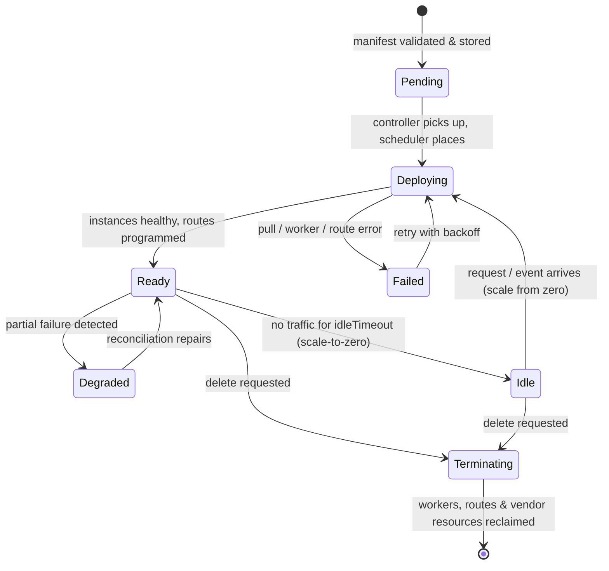
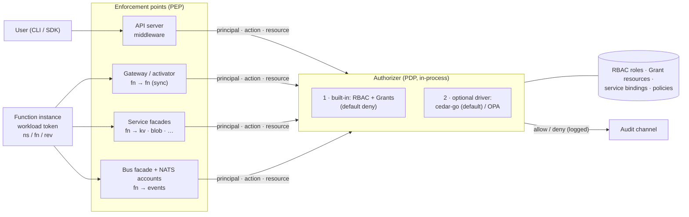
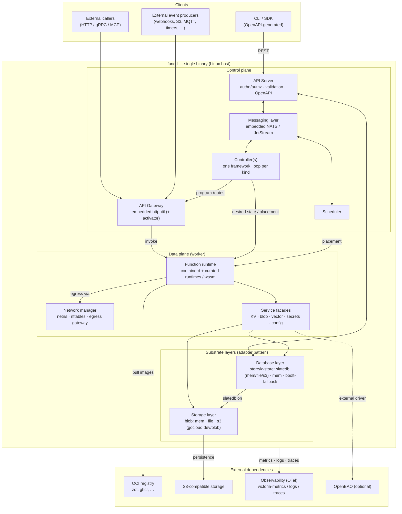
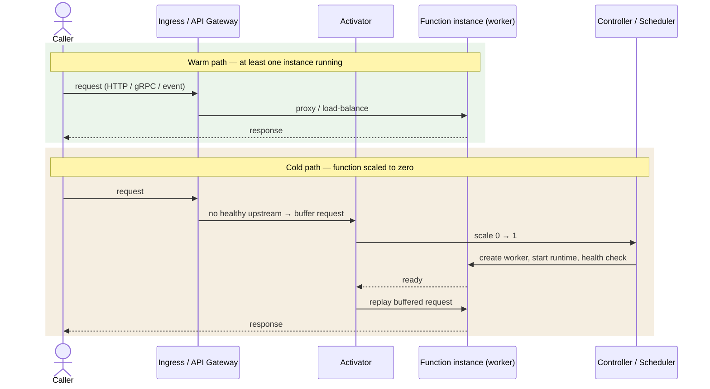

# funcd — project summary

> A single-page, accurate picture of what funcd is and how its parts fit. The
> [blueprint](../blueprint.md) is the full architecture; the [ADRs](adr/) are the per-decision
> contracts. This summary is the map you read first. **Status: Active** (living doc).

---

## What funcd is

funcd is an **API-first, embeddable, "bottomless" FaaS + services platform** for **local-first AI
agents, MCP servers, and traditional full-stack apps** (frontend + backend, backend-only, or static
web). It targets **high-throughput, RAM-bound, scale-to-zero** workloads on a single Linux box (the
design point: ~100 lightweight agents/MCP servers on an 8-core/18 GB host, heavy compute offloaded),
and it is built so you can **`import` it as a Go library** *or* run it as a **single static binary**.

Provisioning is **API-first**: every stack is driven through the **OpenAPI control plane** — usable
from the **CLI, the Go SDK, MCP, or Terraform**. Apps can extend to a distributed workload via the
inner **messaging system**, but multi-node is out of scope for V1.

Three properties anchor the design:

- **Bottomless** — state can persist to **S3** (with a latency trade-off) so the platform is not
  bound by local disk. The metastore engine, **SlateDB**, is the backend-independent foundation.
- **Backend-independent ports** — the same swap-the-backend pattern runs through the **store**
  (mem/file/S3 via SlateDB), the **blob storage** (mem/file/S3 via `gocloud.dev/blob`), and the
  **bus** (mem/file via embedded NATS/JetStream).
- **Hexagonal (ports & drivers)** — every pluggable capability is a port with **≥2 drivers** (one
  real, one in-memory), so the platform is extensible and **testable without mocks**.

---

## The "bottomless" substrate (SlateDB)

**SlateDB** is an LSM store that buffers writes in a memtable and flushes sequentially/async, so a
cloud (S3) backend stays usable and a local backend is near-memory speed. It is **backend-agnostic by
design** (memory / local FS / S3 are config, not code).

| Backend | put/s (steady) | get/s (steady) | Notes |
|---|---|---|---|
| Memory | ~4.5–10.8k | ~18–43k | LSM buffering → mostly sequential async I/O |
| Local FS | ~3.8–10.7k | ~15–42k | **~10 % slower than memory** — modest FS overhead |
| **S3** (read-heavy 4:1) | ~7.3k | ~29k | 94.5 % DB hit ratio; decent even over the network |
| S3 (write-heavy) | ~3.5k | ~2.3k | the cost of remote durability shows on writes |

**The one non-native dependency.** SlateDB is **Rust**, reached via UniFFI + **cgo** (ADR-0006). To
keep the Rust toolchain out of this repo, the plan is a **separate package** (`slatedb-go-funcd`) that
**embeds the prebuilt static SlateDB library** — so funcd consumers get a pure-Go build. Until then,
the default dev/CI build uses the **pure-Go memory store**; the cgo/SlateDB lane is opt-in.

> The **store** and **blob** layers are bottomless; the **bus** (NATS/JetStream) is the one layer that
> is **not** — it supports mem/file only. A SlateDB-backed streaming store (the "S2-on-SlateDB"
> approach) is the reference for a future bottomless bus, but that is not built.

---

## Repository shape

```
api/        # the public contract: huma-generated OpenAPI + the CRD-like typed resources (v1alpha1)
pkg/funcd   # the platform-as-a-library facade (composition root) — embeddable; → pkg.go.dev
pkg/sdk     # the Go client for the control-plane API — used by the CLI; → pkg.go.dev
cmd/funcd   # the daemon: a thin shell over pkg/funcd
cmd/funcdctl# the CLI: a thin shell over pkg/sdk (+ the OCI artifact verbs)
internal/   # all components — ports + drivers + the controller/serving engine
```

- **`internal/` — ports with drivers** (the hexagon): `store`, `blob`, `bus`, `gateway`, `runtime`
  (process + containerd/crun), `scheduler`, `auth` (the authorizer/PDP), `kvstore`, `secrets`
  (encryptor + resolver).
- **`internal/` — the engine/wiring**: `controller` (the one reconcile framework), `controlplane`
  (the authenticated API server), `dataplane` (function-invocation serving), `activator`
  (scale-to-zero), `eventing` (triggers), `function` (the Function reconciler), `services` (the
  KV/blob service facades), `artifact` (OCI push/pull), `observability`, `platform`, `version`.

> **"Where is the config component?"** — There isn't one, by design. **ConfigMap is a *resource kind***
> (data: env vars, flags, runtime params), not a hexagonal port. It is stored + served by the
> `store` + API and consumed by functions, exactly like `Secret`. Only *capabilities with drivers*
> live as ports in `internal/`.

---

## Resource model & lifecycle

Every resource has a **Kubernetes-like typed spec** (`api/types/v1alpha1`) with `metadata`
(`namespace`, `resourceGroup` required; `tags` optional) + `spec` + `status`. The **one generic
controller** runs **one reconcile loop per kind** to drive *actual state → desired state*.

**Resource kinds:** `Namespace`, `ResourceGroup`, `Function`, `Revision`, `Service`, `EventSource`,
`Sensor`, `Invocation`, `ConfigMap`, `Secret`, `Gateway`, `Route`, `RuntimeClass`, `Grant`, `Policy`,
`EgressPolicy`, `WorkerNode`, `KVStore`, `Bucket`, `S3Identity`, `CatalogService`, `Workflow`,
`WorkflowRun`.

**Deploy lifecycle:**

| Step | Phase | Result |
|---|---|---|
| 1 | Validate | manifest validated (typed admission), quotas checked |
| 2 | Store spec | raw manifest persisted to the metastore |
| 3 | Stamp Revision | an **immutable `Revision`** is stamped from the spec generation |
| 4 | Translate | the resource is mapped to each driver's form (gateway routes, NATS subjects/streams, blob buckets, secret paths, worker spec, …) |
| 5 | Schedule & provision | the scheduler places the work; the runtime provisions the worker + vendor resources |
| 6 | Materialize & gate | the artifact is pulled/mounted, the **runtime shim** loads the handler; `/health/readiness` is the authoritative shape-gate |
| 7 | Expose | routes are programmed in the gateway; triggers registered in eventing |
| n | Monitor & reconcile | the controller writes status back and repairs drift |

### Resource state machine



---

## Features

| Feature | What it is | Status |
|---|---|---|
| [**Namespace**](../api/types/v1alpha1/namespace.go) | Logical isolation; the boundary for tenancy, quotas, and access control. | V1 |
| [**Resource group & tags**](../api/types/v1alpha1/resourcegroup.go) | Group related resources (an agent + its routes, secrets, KV, event sources) to manage/delete together. `metadata.resourceGroup` is required; `tags` are filter-only (no authz effect). | V1 |
| [**Function**](../internal/function/function.go) | The core compute unit: runtime + handler + config + triggers + service/secret/config access, all namespace-scoped. | V1 |
| [**Revision**](../api/types/v1alpha1/revision.go) | An **immutable snapshot** of a Function at a generation; the foundation for rollout/canary. Pinned by **artifact digest** ("validated = shipped") — the digest is **auto-resolved from the tag at stamp time** (ADR-0035), so the user never types one. | V1 (rollout mechanics: follow-up) |
| [**Service**](../internal/services/dispatcher.go) | Function-facing capabilities, reconciled independently and scaled separately (same facade pattern, extensible):<ul><li>[**KV store**](../internal/kvstore/) — key/value</li><li>[**Blob store**](../internal/services/blob/) — object storage</li><li>Eventing</li><li>Vector store</li><li>Databases</li></ul> | V1 (KV, blob) |
| [**Event / EventSource**](../internal/eventing/eventing.go) | Triggers a function from HTTP, timer, queue, or message; binds a source to one or more functions in the namespace. | V1 (**HTTP + timer**) |
| [**Invocation**](../api/types/v1alpha1/invocation.go) | The recorded result of each trigger fire (Ready/Failed + timing); a trigger is **never silently dropped**. | V1 |
| [**ConfigMap**](../api/types/v1alpha1/configmap.go) | Non-sensitive configuration (env vars, args, flags); bound via `spec.config` and injected as worker env (config-then-secrets, secret wins). Renamed from `Config` by ADR-0079. | V1 (ADR-0093) |
| [**Secret**](../internal/secrets/secrets.go) | Sensitive data, managed separately from config, exposed only to authorized workloads (see [Security](#security)). | V1 (inject last-mile: **P-W**) |
| [**Scaling & scale-to-zero**](../internal/activator/activator.go) | Horizontal scaling between `minReplicas`/`maxReplicas`; with `minReplicas: 0`, idle functions scale to zero and the **activator** buffers the first request/trigger during cold start, then forwards. | V1 |
| [**Gateway / ingress**](../internal/gateway/gateway.go) + [**data plane**](../internal/dataplane/dataplane.go) | Embedded `net/http` + `httputil` reverse proxy is the ingress; the **data plane** serves invocations through the activator (warm proxy / cold wake) over a dedicated listener (ADR-0033). Ingress hardening (FEAT-0006): declarative `Route` exposure, TLS, rate/size/concurrency limits, an edge authn PEP, and edge observability + shaping. | V1 (**FEAT-0006 complete**, ADR-0110–0114) |
| [**Runtime & RuntimeClass**](../internal/runtime/runtime.go) | The **worker** (the process running a function) behind the `runtime.Runtime` port: a **process driver** (dev/CI) and a **containerd/crun driver** (Linux prod) running **curated runtime images** carrying the **runtime shim** (loads the handler, serves CloudEvents). | V1 (**Node** + **Python**, ADR-0049) |
| [**Scheduler**](../internal/scheduler/scheduler.go) | Single-node placement behind a pluggable port. | V1 (multi-node: V2) |
| [**Controller**](../internal/controller/controller.go) | One reconcile framework, one loop per kind, default-deny on drift. | V1 |
| [**WorkerNode**](../api/types/v1alpha1/workernode.go) | The multi-node compute-node identity (a node that schedules workers; many may run on one machine, K3s-style). Renamed from `Worker` by ADR-0045. | V2 (registration/heartbeat) |
| [**Worker pooling**](../internal/pooling/pooling.go) | Per-function opt-in (`spec.pooling.worker`) to co-locate same-namespace, same-runtime functions as handlers in one `worker_threads` pool worker — amortizing the runtime baseline (~2.8× density). Keyed by (namespace, runtime, worker-id); per-pool scale-to-zero; cap guard. | V1 (Node; ADR-0044/0046) |
| [**Observability**](../internal/platform/observability/telemetry.go) | OTLP-native logging/telemetry + audit channel — see [Observability](#observability). | V1 (stdout JSON; file/S3 exporters planned) |
| [**Grant**](../api/types/v1alpha1/grant.go) / [**EgressPolicy**](../api/types/v1alpha1/egresspolicy.go) | Authorization grants and egress policy — see [Security](#security). | Grant: modeled (enforcement V2) · EgressPolicy: modeled (enforcement V2) |
| [**KV store**](../api/types/v1alpha1/kvstore.go) | A declarative `KVStore` (domain + owner'd sub-domain tables) bound via `spec.kv`; durable Badger engine with single-writer group commit and opt-in DR backup + CDC; function-facing `context.kv`. | V1 (ADR-0066–0073) |
| [**Cedar authorization**](../api/types/v1alpha1/policy.go) | Cedar PDP behind `auth.Authorizer` — per-function principals + `Policy` resources; binding-as-grant for KV read, fn→fn invoke, and S3, genuinely default-deny. | V1 (ADR-0074–0076, 0088) |
| [**Data & analytics platform**](../internal/blob/s3gateway/) | In-process **S3 frontend** over the blob substrate (funcd-managed per-function keypair); **function-log capture** → OTLP-JSONL → compacted **Parquet** with `funcdctl logs`; a governed **DuckLake/DuckDB/Quack** catalog add-on (`CatalogService`). | V1 (ADR-0080–0088) |
| [**Workflow engine**](../internal/workflow/) | `Workflow`/`WorkflowRun` DAG orchestrator — dependsOn/join/when/retry/timeouts, engine-native built-in steps (`wait`/`pass`), **sub-workflows**, statically type-checked edges, one-run-one-trace observability, and step-level **replay**. | V1 (FEAT-0005, ADR-0094–0107) |
| [**Reference engine**](../internal/expr/) | One typed native-JavaScript expression engine on goja (`${{ … }}` Select + Condition) used by workflow `when`/`params`, `builtin` steps, and `Sensor` input projection. | V1 (ADR-0095) |
| [**Sensor**](../api/types/v1alpha1/sensor.go) | The reusable event→action binder: subscribes to named `EventSource` v2 events and runs kind-keyed actions (start a `WorkflowRun` / invoke a `Function`), delivering event-driven and scheduled workflows. | V1 (ADR-0108/0109) |

---

## Observability

OTel-native end to end: the platform **emits** OTLP and **speaks** OTLP. Four levels (**Debug, Info,
Warn, Error**). V1 exports **structured JSON to stdout**; **file** and **S3** exporters are planned.
A fully OTLP-compliant gateway that lands logs/traces/metrics **directly in the underlying blob
storage** is the longer-term goal — so observability needs **no separate service**. An **audit
channel** (ADR-0010) records authorization decisions.

---

## Network

- **Control plane** — reaching the API server requires an **authn** step ([Security](#security)). 
- **Data plane** — deployed functions are reachable over the **ingress gateway** → activator → worker
  (the gateway's full ingress hardening is still in progress).
- **Function ⇄ service / function ⇄ function** — via **NATS** messaging and the service facades.
- **CNI** — *yes, it is configured* (correcting a common misread): the **containerd/crun driver**
  attaches a **per-worker netns via `go-cni`** (bridge + firewall) with **L3/L4 default-deny
  lateral** traffic. The **process driver** (dev/CI) has no netns. So CNI exists on the **Linux
  production path**, not the dev path.

---

## Security

**Multi-tenancy** is namespace-scoped: quotas, secrets, routes, and service instances are
**namespace-scoped and never shared** across namespaces.

**Worker isolation** — each function runs in its own worker. V1 ships **crun** (OCI runtime) with
conservative defaults (no added caps, `no_new_privileges`, default seccomp) + the netns lateral
default-deny. Stronger FS/network hardening and a microVM tier (Kata) are later tiers.

**Secrets** — at rest, secrets are **AES-256-GCM encrypted in the metastore** (stdlib, filling the
store `Encryptor` seam; ADR-0022) and delivered to the worker via a **PDP-authorized resolver** (env
var / tmpfs). The **inject-into-the-running-worker last mile** is the remaining V1 item (**P-W**).
OpenBAO is an *optional external* driver, deferred.

**Egress control** — *suspicion confirmed*: V1 ships **only L3/L4 default-deny lateral** at the netns
boundary. **North-south outbound egress** (transparent egress gateway, nftables L7 redirect/TPROXY,
SNI peek, DNS-aware policy, **`EgressPolicy` enforcement**) is **V2** — `EgressPolicy` is *modeled* as
a resource kind but **not yet enforced**.

### Internal IAM — workload identity

Every internal workload (a function instance, a service, a worker) carries a **short-lived, signed
*workload token*** — a **SPIFFE-like workload identity**, not an AWS-style `arn`/`client_id`. The
**principal is `namespace / function / revision`** (+ an **audience**), minted and rotated
automatically the way a Lambda execution role's token is. **In V1 these tokens are *recorded* but not
yet *enforced***: the binding `Function.spec.services` exists as the grant, and full
workload-token enforcement (fn→fn, fn→service) through the PDP is **V2**.

### Authorization

funcd uses one **Policy Decision Point (PDP)** — the `auth.Authorizer` **port** — that **every**
enforcement point calls, so the **default-deny** guarantee lives in exactly one place and every future
hop (services, gateway, bus, egress) reuses the same decision:

- **PEPs (Policy Enforcement Points):** the API-server middleware (user → control plane), the
  gateway/activator (fn → fn), the service facades (fn → KV/blob/…), and the bus facade + NATS
  accounts (fn → events).
- **PDP (in-process):** the built-in **RBAC + Grants** engine (default-deny), with an **optional
  policy driver** behind the same port.

> **"Which auth library — casbin or cedar-go?"** — Decided in **ADR-0018**: **do not reimplement** —
> the `auth.Authorizer` port abstracts it. V1 ships a **zero-dependency built-in RBAC** driver
> (default-deny, three fixed roles) as the **default**. **`cedar-go` is the chosen *optional* policy
> driver** for richer ABAC/conditional policy (a typed, analyzable policy language with a maintained
> Go SDK) — **not casbin**. For **authn**, V1 = **static tokens + scoped API keys**; **OIDC** (via
> `coreos/go-oidc` + `golang.org/x/oauth2`) is the planned V2 addition. So: API-key + RBAC today,
> cedar-go + OIDC as drop-in drivers later — no custom crypto/policy engine to write.

### Policy engine

The **built-in RBAC engine** (V1) evaluates `(principal, action, resource)` against **RBAC roles +
`Grant` resources** with **default-deny**, and logs every decision to the audit channel. The
**cedar-go driver** (V2) satisfies the *same* `Authorizer` contract for policy-as-code (ABAC,
conditions, cross-namespace grants), so swapping it in changes no enforcement-point code.

### Authorization data flow (PEP → PDP)



---

## Architecture

### Global architecture



### Function invocation flow (warm vs cold)



> **V1 wiring (ADR-0033).** The data plane is a dedicated listener that resolves the function from
> `/function/<name>` (+ `X-Funcd-Namespace`, default `default`) against the store and serves **every**
> request through the activator — warm → proxy; cold → buffer + `ScaleTo(1)` + poll + forward. The same
> `activator.Wake` primitive backs the **timer** path (a timer wakes a scaled-to-zero function instead
> of dropping the trigger).

---

## Build status (V1)

The V1 build slate is complete and past it: **ADR-0001…0126** decided, **124 Implemented** (34 accepted as the
roadmap's tier-0 build items; the rest — incl. ADR-0034…0126 — are follow-ons refining or extending
existing feature rows), **0 roadmap items remaining**. The exit-criterion path is proven end-to-end — a
function deploys from a **source artifact** (no Dockerfile), is **invoked over HTTP and by a timer**,
**scales to zero and wakes on demand**, and **reads a secret**, all through the public API/CLI — and
that whole journey is an executable acceptance test (ADR-0034). Post-slate work: the runtime shim is **TypeScript + Hono** with an **embedded JTD
contract** (ADR-0037/0038) on **node 22** (ADR-0039); a **benchmark harness** (`funcd-bench`,
ADR-0040) proved sustainability and drove fixes — **upstream connection pooling** (ADR-0041) and a
**file-by-default substrate** with `--memory` (ADR-0043); the CLI moved to **cobra** (ADR-0042);
**worker pooling** landed — the `worker_threads` host (ADR-0044) plus its **placement policy**
(`spec.pooling.worker`, ADR-0046) for ~2.8× same-namespace density; and the compute vocabulary was
**renamed `sandbox`→`worker` / `Worker`→`worker node`** (ADR-0045); a reconcile-storm was fenced by
**store-level no-op-write coalescing + a `tests/chaos/` guard tier** (ADR-0047); and DTO validation was
made a **normative per-field reference** carrying constraints into the OpenAPI/422 edge and typed
admission `Validate()` (ADR-0048); and **Python** landed as the second curated language behind the same
runtime-shim contract — a stdlib-HTTP + hand-rolled-RFC-8927-validator shim, uv-managed and typed, with
per-runtime dispatch (ADR-0049) — followed by a **Python worker-pool host** (subinterpreters, Python 3.14,
~3.7× density with per-interpreter isolation, ADR-0050), closing the Node/Python pooling parity gap. The
**secret-injection last mile** (P-W / ADR-0057) then closed the final exit clause — a handler **reads a
secret** — so the V1 roadmap has **no items remaining**. Beyond the slate, funcd became **truly
self-contained** (the k3s model): embedded curated images + a privately-managed containerd, with `funcd
install` self-provisioning crun/containerd/CNI (ADR-0054/0056), and the sustainability harness folded into
`funcd bench` (ADR-0055). **v1.1 (FEAT-0001)** then shipped **statically-defined I/O contracts**: the
contract is **generated from the author's code types** as JSON Schema with an eval-free precompiled
validator (ADR-0058/0060), and **surfaced as inspectable OCI metadata** for static, no-run contract reads
(ADR-0059), plus an operability increment — a **kubeconfig-style daemon config file** (`funcdconfig.yaml`,
ADR-0061) that also finally wires ADR-0022's at-rest secret encryption into the daemon.

Since v1.1, five further epochs landed (all tracing to a complete V1 roadmap): a **KV data platform** —
a pure-Go **Badger** metastore replacing slatedb/cgo (ADR-0065), a durable KV service with opt-in DR
backup + CDC (ADR-0066/0067/0068), the function-facing KV data-plane + typed read accessors
(ADR-0069/0070), and KV as a declarative `KVStore` with `spec.kv` bindings and sub-domain tables
(ADR-0072/0073); **Cedar authorization** as a real PDP — per-function principals, `Policy` resources,
and binding-as-grant for KV read, fn→fn invoke, and S3 (ADR-0074/0075/0076); a **data/analytics
platform** — an in-process **S3 frontend** over the blob substrate with a funcd-managed per-function
keypair (ADR-0080/0085), **function-log capture** → OTLP-JSONL → compacted **Parquet** with `funcdctl
logs` (ADR-0081/0083/0084), and a governed **DuckLake/DuckDB/Quack** catalog add-on provider with its
own runtime + identity (ADR-0086/0087/0088); a **workflow engine** (FEAT-0005) — the
`Workflow`/`WorkflowRun` state-machine orchestrator (ADR-0094), a typed native-JS **reference engine**
on goja (ADR-0095), engine-native built-in steps + **sub-workflows** (ADR-0096/0099), statically
type-checked **edges** (ADR-0098), and **one-run-one-trace** observability with DAG-shaped span
parenting, run-scoped logs, and step-level **replay** (ADR-0100–0107); reshaped **eventing** —
`EventSource` v2 named events + a reusable `Sensor` event→action binder (ADR-0108/0109); and the
**FEAT-0006 ingress-hardening edge** — declarative `Route` exposure, TLS, ingress limits, an edge authn
PEP, and edge observability + shaping (ADR-0110–0114); a **default-deny egress substrate + in-binary
gateway PEP**, reactive **object-store `EventSource`** + eventing **DLQ**, and first-class **static-asset
serving** (ADR-0115–0120); and a **`funcdctl.yaml` client-config** with native contract/type codegen and
runtime-compiled I/O validators plus the **`funcdctl dev` local-run** family — run a function or workflow
from source with zero CRDs (ADR-0122–0126). See
[docs/roadmap/v1-delivery-plan.md](roadmap/v1-delivery-plan.md).

**Out of V1 scope** (recorded for later): multi-node workers, north-south egress enforcement, an OIDC
auth driver, workload-token *enforcement*, rollout/canary mechanics, the bottomless bus, and
per-route edge policy (TLS/limits/CORS/authn), mTLS + SNI routing (FEAT-0006 V2 follow-ons).

---

## Decision log (ADRs)

Every ADR, its one-line recap, and the choices it locked in (no rationale — see the ADR for that).
All are **Implemented** unless the recap says *superseded*.

| Title | Recap | Verdict (validated choices) |
|---|---|---|
| [ADR-0000 — ADR process](adr/0000-adr-process.md) | The decision process, template, and gates. | <ol><li>Draft→Proposed→Accepted→Reviewing→Implemented</li><li>immutable once Accepted</li><li>change = a superseding ADR</li><li>five gates: plan · decide · judge · build · review</li><li>one ADR = one topic</li></ol> |
| [ADR-0001 — Project setup & structure](adr/0001-project-setup-and-structure.md) | Repo bootstrap, layout, Nix. | <ol><li>module `github.com/green-0-rabbit/funcd`</li><li>`api/`·`pkg/`·`cmd/`·`internal/` layout</li><li>Nix dev env</li><li>`just` task runner</li><li>Apache-2.0/MIT deps only</li></ol> |
| [ADR-0002 — Source-code conventions](adr/0002-source-code-conventions-and-patterns.md) | Binding Go code shapes. | <ol><li>ports & drivers (≥2 drivers)</li><li>`api/fault` error kernel</li><li>functional-options facade + deps-struct ctor</li><li>typed enums/IDs, no `any`</li><li>ctx-first, no globals, slog-only, no mocks</li><li>depguard import graph; one driver = one file</li></ol> |
| [ADR-0003 — Resource model & API typing](adr/0003-resource-model-and-api-typing.md) | The typed CRD-like model. | <ol><li>k8s-like metadata/spec/status</li><li>typed kinds + kind registry</li><li>`RuntimeClass`</li><li>generation-stamped revisions</li><li>namespace + resourceGroup required</li></ol> |
| [ADR-0004 — API surface & codegen](adr/0004-api-surface-and-codegen.md) | First API-surface attempt (*superseded*). | <ol><li>REST/OpenAPI v1alpha1 surface</li><li>superseded by ADR-0005 (code-first huma)</li></ol> |
| [ADR-0005 — API surface, code-first huma](adr/0005-api-surface-code-first-huma.md) | Code-first → generated OpenAPI. | <ol><li>huma framework</li><li>code-first → generated OpenAPI</li><li>REST control plane</li><li>supersedes ADR-0004</li></ol> |
| [ADR-0006 — Store / database port](adr/0006-store-database-layer-port.md) | Metastore port + SlateDB. | <ol><li>`store.Store` port</li><li>SlateDB engine (UniFFI + cgo)</li><li>mem/file/S3 backends</li><li>pure-Go memory driver</li><li>`Encryptor` seam; watch + revisions</li></ol> |
| [ADR-0007 — Blob / storage port](adr/0007-blob-storage-layer-port.md) | Blob storage port. | <ol><li>`blob.Bucket` port</li><li>`gocloud.dev/blob`</li><li>mem/file/S3 drivers</li></ol> |
| [ADR-0008 — Bus / messaging port](adr/0008-bus-messaging-port.md) | Messaging port. | <ol><li>`bus.Bus` port</li><li>embedded NATS + JetStream</li><li>mem/file storage</li><li>per-account isolation</li></ol> |
| [ADR-0009 — Observability logger root](adr/0009-observability-logger-root.md) | slog construction + injection. | <ol><li>`log/slog` only</li><li>constructed root logger, injected</li><li>no global logger</li><li>text/JSON formats</li></ol> |
| [ADR-0010 — Telemetry + audit](adr/0010-observability-telemetry-and-audit.md) | OTel pipeline + audit. | <ol><li>OpenTelemetry pipeline</li><li>OTLP log bridge</li><li>audit channel</li><li>no-op default; stdout JSON export</li></ol> |
| [ADR-0011 — Runtime sandbox port](adr/0011-runtime-sandbox-port.md) | Sandbox port + drivers. | <ol><li>`runtime.Runtime` port</li><li>process driver (dev/CI)</li><li>containerd/crun driver (Linux)</li><li>crun via runc-shim `BinaryName`</li><li>per-sandbox netns + default-deny lateral (go-cni)</li><li>`no_new_privileges` + seccomp</li></ol> |
| [ADR-0012 — Gateway port](adr/0012-gateway-ingress-port.md) | First gateway decision (*superseded*). | <ol><li>`gateway.Gateway` port</li><li>embedded httputil + Lura drivers</li><li>superseded by ADR-0013 / ADR-0029</li></ol> |
| [ADR-0013 — Gateway httputil-primary](adr/0013-gateway-ingress-httputil-primary.md) | Embedded reverse-proxy gateway. | <ol><li>embedded httputil primary</li><li>net/http middleware composition</li><li>certmagic TLS</li><li>streaming-native (FlushInterval −1)</li><li>supersedes ADR-0012</li></ol> |
| [ADR-0014 — Platform facade & harness](adr/0014-platform-facade-lifecycle-harness.md) | The composition-root facade. | <ol><li>`pkg/funcd` facade</li><li>functional options</li><li>`InMemory()` preset</li><li>crash-only lifecycle</li><li>library-first</li></ol> |
| [ADR-0015 — Controller engine](adr/0015-controller-engine.md) | The one reconcile framework. | <ol><li>one controller framework</li><li>one reconciler per GVK</li><li>hand-written workqueue (informer/retry)</li><li>store-watch driven</li><li>status write-back</li></ol> |
| [ADR-0016 — Activator & scale-to-zero](adr/0016-activator-scale-to-zero.md) | Cold-start buffering + idle reclaim. | <ol><li>in-process activator</li><li>buffer→wake→forward</li><li>singleflight wake</li><li>partitioned `Status.Phase` (Endpoints read / Scaler write)</li><li>store-backed Scaler; idle reclaim</li></ol> |
| [ADR-0017 — Scheduler port](adr/0017-scheduler-placement-port.md) | Pluggable placement. | <ol><li>`scheduler.Scheduler` port</li><li>single-node driver</li><li>pluggable for multi-node</li></ol> |
| [ADR-0018 — API-server authn/RBAC/admission](adr/0018-api-server-authn-rbac-admission.md) | Control-plane auth + the PDP. | <ol><li>`auth.Authorizer` PDP port</li><li>built-in RBAC + Grants (default-deny)</li><li>static tokens + scoped API keys</li><li>typed admission</li><li>cedar-go optional driver (V2)</li><li>OIDC (V2)</li></ol> |
| [ADR-0019 — Service facade + KV](adr/0019-service-facade-pattern-kv.md) | Facade pattern + KV service. | <ol><li>service facade pattern (CRD+facade+reconciler+driver)</li><li>KV service (`kvstore`)</li><li>RBAC facade authz</li><li>one reconciler per service kind</li></ol> |
| [ADR-0020 — Function contract & lifecycle](adr/0020-function-contract-lifecycle.md) | The Function reconciler. | <ol><li>Function reconciler</li><li>immutable Revision stamping</li><li>effective-replicas honors wake Phase</li><li>full-table route programming</li><li>shape-validation gate</li><li>`Endpoints` provider</li></ol> |
| [ADR-0021 — Blob service](adr/0021-blob-service.md) | Function-facing blob facade. | <ol><li>blob service facade</li><li>over the `blob` port</li><li>namespace-scoped buckets</li></ol> |
| [ADR-0022 — Secrets service](adr/0022-secrets-service.md) | At-rest encryption + delivery. | <ol><li>AES-256-GCM `store.Encryptor`</li><li>PDP-authorized env-var Resolver</li><li>`SecretTypeOpaque`</li><li>OpenBAO/Grant/rotation deferred</li></ol> |
| [ADR-0023 — Eventing core](adr/0023-eventing-core.md) | CloudEvents + timer sources. | <ol><li>`internal/eventing`</li><li>hand-defined CloudEvent envelope</li><li>timer EventSource (interval)</li><li>HTTP invoker via Endpoints</li><li>no-dropped-trigger (Invocation recorded)</li><li>trigger-wake deferred → ADR-0033</li></ol> |
| [ADR-0024 — funcdctl + Go SDK](adr/0024-funcdcli-and-sdk.md) | Client-access layer. | <ol><li>`pkg/sdk` client</li><li>kubectl-style `funcdctl`</li><li>thin shell over the SDK</li><li>token auth</li></ol> |
| [ADR-0025 — Testing strategy & e2e](adr/0025-testing-strategy-and-e2e-harness.md) | The test taxonomy. | <ol><li>four-tier taxonomy (L1–L4)</li><li>`InMemory()` e2e harness</li><li>contract suites per port</li><li>Linux integration lane (L4)</li><li>no mocks</li></ol> |
| [ADR-0026 — Packaging & release](adr/0026-packaging-and-release.md) | Single binary + release. | <ol><li>single static binary</li><li>version stamping</li><li>systemd unit</li><li>pure-Go default / cgo SlateDB opt-in</li></ol> |
| [ADR-0027 — Depguard import-discipline fix](adr/0027-import-discipline-depguard-fix.md) | Make path-scoped rules fire. | <ol><li>`files` globs need `**/` prefix</li><li>deny is prefix-match (no `/*`)</li><li>production-only via `!**/*_test.go`</li><li>deny-only lists</li></ol> |
| [ADR-0028 — Control-plane wiring](adr/0028-platform-control-plane-wiring.md) | Make `funcd.Run` serve + reconcile. | <ol><li>Run serves control-plane API + controller</li><li>error-returning constructors</li><li>`Production()` defaults</li><li>data plane deferred → ADR-0033</li></ol> |
| [ADR-0029 — Gateway, drop Lura](adr/0029-gateway-drop-lura-single-driver.md) | Single gateway driver. | <ol><li>drop the Lura driver</li><li>single embedded driver</li><li>external-gateway = V2 second driver</li><li>supersedes ADR-0013 (Lura part)</li></ol> |
| [ADR-0030 — Function execution / shim (P-V-1)](adr/0030-function-execution-runtime-shim-node.md) | Real execution via the runtime shim. | <ol><li>runtime-shim HTTP contract</li><li>Node reference shim</li><li>Materializer seam + file driver</li><li>per-replica loopback + `FUNCD_PORTFILE`</li><li>readiness gate refines ADR-0020</li><li>node-gated test tier</li></ol> |
| [ADR-0031 — OCI artifact distribution (P-V-A)](adr/0031-oci-artifact-distribution-oras.md) | Artifact push/pull via oras-go. | <ol><li>oras-go v2</li><li>funcdctl push/pull/login/logout</li><li>`OrasMaterializer` (digest = authority)</li><li>local OCI layout (dev) / registry (prod)</li><li>supersede blueprint "no push"</li></ol> |
| [ADR-0032 — Curated images + container exec (P-V-2)](adr/0032-curated-runtime-images-container-execution.md) | Run the shim in the curated container. | <ol><li>curated image (shim entrypoint)</li><li>`SandboxSpec.Mounts` (read-only artifact bind)</li><li>container-mode fixed netns port</li><li>`Instance.Port` on List+Status</li><li>bind-mount over baked image (V1)</li></ol> |
| [ADR-0033 — Data-plane serving + wake (P-X)](adr/0033-data-plane-serving-and-trigger-wake.md) | Serve invocations + wake on trigger. | <ol><li>data-plane listener</li><li>path+store → activator handler</li><li>shared `activator.Wake`</li><li>eventing `Waker` (closes ADR-0023 C3)</li><li>readiness-gated Endpoints + woken-stays-up</li></ol> |
| [ADR-0034 — End-user journey acceptance e2e](adr/0034-end-user-journey-acceptance-e2e.md) | An e2e lane driving the real CLI + HTTP through the exit criterion. | <ol><li>`tests/e2e` user-journey lane</li><li>drives the real `funcdctl` binary (push/apply/get)</li><li>data-plane HTTP invoke + scale-to-zero wake</li><li>public-surface-only (`pkg`+`api`, e2e-boundary)</li><li>node-gated; embedded server</li></ol> |
| [ADR-0035 — Tag→digest resolution at Revision](adr/0035-artifact-digest-resolution-at-revision.md) | Resolve the artifact tag→digest at stamp; no manual pinning (Knative model). | <ol><li>`artifact.digest` optional</li><li>`ArtifactResolver` seam (oras `Resolve`)</li><li>resolve+pin only on the Revision-create path</li><li>materialize the pinned digest (spec stays digest-free)</li><li>unresolvable → `Failed`/`ArtifactUnresolved`</li></ol> |
| [ADR-0036 — Daemon execution wiring](adr/0036-daemon-execution-wiring.md) | Make the standalone `funcd` binary execute functions. | <ol><li>`FUNCD_RUNTIME` mode select</li><li>process: **embedded** Node shim (`go:embed`) + `WithRuntimeShim` + artifact store</li><li>containerd mode (env `Config`) + `WithContainerExecution`</li><li>no node → control plane only (degrade)</li><li>answers ADR-0034's open question</li></ol> |
| [ADR-0037 — TypeScript + Hono shim](adr/0037-typescript-hono-runtime-shim.md) | The Node reference shim rewritten (supersedes ADR-0030 §2). | <ol><li>TypeScript + Hono over `node:http`</li><li>esbuild → `shim.mjs` (committed, `go:embed`)</li><li>`handle(context, event)`; object→200 · none→204 · throw→500</li><li>supersedes ADR-0030 §2</li></ol> |
| [ADR-0038 — Event-data contract (JTD)](adr/0038-event-data-contract-jtd.md) | A JTD schema validates `event.data` in the shim (refines ADR-0037). | <ol><li>JTD (RFC 8927) via `jtd` (pure-JS, MIT)</li><li>optional `eventSchema` export in the artifact</li><li>data mismatch → 422</li><li>refines ADR-0037</li></ol> |
| [ADR-0039 — Pin Node to node 22](adr/0039-pin-node-runtime-to-node22.md) | Pin the curated Node runtime to node 22 (refines ADR-0032/0037). | <ol><li>node 22 (LTS) curated image + shim target</li><li>`--experimental-strip-types` for TS</li><li>refines ADR-0032 + ADR-0037</li></ol> |
| [ADR-0040 — Benchmark & sustainability harness](adr/0040-benchmark-sustainability-harness.md) | `funcd-bench` drives the data plane + samples RSS → a sustainability verdict. | <ol><li>`internal/bench` + `cmd/funcd-bench`</li><li>Go-native load; external (process-RSS) sampling</li><li>memory vs file substrate</li><li>throughput · per-worker RSS · cold-start · density</li><li>markdown + JSON report</li></ol> |
| [ADR-0041 — Data-plane upstream connection pooling](adr/0041-gateway-upstream-connection-pooling.md) | Pooled upstream transport on activator + gateway (refines ADR-0029/0016). | <ol><li>shared pooled `http.Transport`, keyed by upstream `host:port`</li><li>fixes per-request reverse-proxy → ephemeral-port exhaustion</li><li>tenant-safe (never reused across functions)</li><li>refines ADR-0029/0016</li></ol> |
| [ADR-0042 — Adopt cobra for the CLI](adr/0042-cobra-cli-framework.md) | cobra as the CLI framework (refines ADR-0024). | <ol><li>cobra (Apache-2.0) for `funcdctl` + `funcd`</li><li>already an indirect dep</li><li>refines ADR-0024</li></ol> |
| [ADR-0043 — Single-binary substrate selection](adr/0043-single-binary-substrate-selection.md) | File substrate by default; `--memory` for ephemeral (refines ADR-0028). | <ol><li>file substrate is the default (durable)</li><li>`--memory` → ephemeral (mem blob/bus)</li><li>`Production()` deployment-injects store/runtime/blob/bus</li><li>refines ADR-0028</li></ol> |
| [ADR-0044 — Worker pooling (`worker_threads`)](adr/0044-worker-pooling-threads.md) | A `worker_threads` multi-tenant shim for same-namespace density (+ bench). | <ol><li>`pool.mjs` hosts many handlers of one namespace</li><li>per-handler V8 isolate + crash isolation</li><li>`resourceLimits` = native per-artifact memory quota</li><li>bench: ~2.8× density, ~73% throughput retained</li><li>placement deferred → ADR-0046</li></ol> |
| [ADR-0045 — Compute vocabulary rename](adr/0045-rename-sandbox-to-worker.md) | `sandbox`→`worker` (the process), `Worker`→`worker node` (the compute node). | <ol><li>`runtime.SandboxSpec`→`WorkerSpec`</li><li>`v1alpha1.Worker`→`WorkerNode` (+ `KindWorkerNode`)</li><li>`scheduler.Placement.Worker`→`.WorkerNode`; controlplane `*WorkerNode`</li><li>behavior-preserving; OpenAPI + blueprint synced</li><li>supersedes (naming only) ADR-0011/0003/0017</li></ol> |
| [ADR-0046 — Pooling placement](adr/0046-pooling-placement-policy.md) | Per-function opt-in to a shared worker, keyed by (namespace, runtime, worker-id). | <ol><li>`spec.pooling.worker` opt-in (empty = solo)</li><li>key = (namespace, runtime, worker-id); never resourceGroup</li><li>`internal/pooling` policy + reconciler `ensurePool` (idempotent)</li><li>per-pool scale-to-zero (max over members); cap guard</li><li>closes ADR-0044's deferred placement</li></ol> |
| [ADR-0047 — Control-loop quiescence](adr/0047-control-loop-quiescence-and-chaos-tests.md) | Fix a reconcile-storm: coalesce no-op writes at the store so an idle function stops spinning the daemon. | <ol><li>`store.Update` skips the `Modified` event on a byte-identical write</li><li>idle Ready function → daemon quiesces (no hot-loop)</li><li>`tests/chaos/` lane: quiescence + leak + chaos-recovery guards</li><li>bisected pre-existing CPU storm, now regression-fenced</li></ol> |
| [ADR-0048 — DTO validation reference](adr/0048-dto-validation-reference.md) | The normative per-field validation table for every v1alpha1 entity: two layers, one source. | <ol><li>schema-expressible (pattern/enum/bound/len) → huma tag or `SchemaProvider` leaf → OpenAPI + 422 at edge</li><li>cross-field/conditional → typed `Validate()` at admission</li><li>`api/types` imports huma/v2 (MIT) for `SchemaProvider`; depguard holds</li><li>bounded by default: replicas ≤ 15, idleTimeout ≤ 24h, interval 100ms–24h</li><li>presence stays the shape gate's job (ADR-0020) — one constraint, one layer</li></ol> |
| [ADR-0049 — Python reference shim](adr/0049-python-runtime-shim.md) | The second curated language behind the same runtime-shim contract (P-V-3): stdlib HTTP + a hand-rolled RFC 8927 validator, uv-managed + typed. | <ol><li>same wire contract as the Node shim (200/204/400/422/500, health, portfile, exit 2/3) — the platform stays language-blind</li><li>`event_schema` (JTD) validated by a pure-stdlib RFC 8927 engine — the official `jtd` was rejected (pulls GPLv3 `strict-rfc3339`); zero runtime deps</li><li>`funcd_shim` uv package: typed `handle(context, event)`, `mypy --strict`, `py.typed`</li><li>per-runtime dispatch: `WithRuntimeShimFor` + reconciler `shimFor` (python* → python shim, else node)</li><li>`go:embed`'d into the daemon; `examples/python/hello-world`; no Python pool host (ADR-0046)</li></ol> |
| [ADR-0050 — Python worker pooling](adr/0050-python-worker-pooling-subinterpreters.md) | The Python pool host (the analog of ADR-0044's Node pool): N handlers in one process, each in its own subinterpreter — measured ~3.7× density **with** isolation. | <ol><li>`pool.py` = one `InterpreterPoolExecutor(max_workers=1)` per handler (Python ≥3.14) → per-interpreter GIL + state isolation; same `FUNCD_POOL_MANIFEST` + wire contract + JTD validation as Node</li><li>subinterpreters chosen over threading (8.1× but no isolation) and fork — measured spike, isolation parity with ADR-0044</li><li>per-family pool host: `WithPoolShimFor` + reconciler `poolHostFor`; `poolKeyFor` flips to host-inclusion (python* pools iff a python host exists, else solo)</li><li>placement policy (key/cap/scale-to-zero) reused from ADR-0046 unchanged</li><li>3.14 floor for *pooled* python (solo keeps ADR-0049's floor); no new dependency (stdlib)</li></ol> |
| [ADR-0051 — gopsutil + fortio in the bench](adr/0051-bench-adopt-gopsutil-fortio.md) | Swap the bench's hand-rolled RSS sampling + load driver for maintained libraries; **test-only**, confined to the harness. Refines ADR-0040. | <ol><li>RSS via `gopsutil` (BSD-3) — removes the `ps`/`pgrep` shelling; load + percentiles via `fortio` (Apache-2.0), closed-model `NumThreads`+`QPS:-1`</li><li>fortio chosen over vegeta (the bench is closed-model max-throughput = fortio's native mode)</li><li>confinement **enforced** by a `bench-libs` depguard rule (gopsutil/fortio denied outside `internal/bench` + `cmd/funcd-bench`)</li><li>`loadResult`/`Latency`/`Report` types unchanged; pool reports reshaped to small `metric \| single \| pooled` tables</li><li>never in the shipped `funcd`/`funcdctl` binaries (verified by `go list -deps`)</li></ol> |
| [ADR-0052 — Containerd cgroup-footprint bench lane](adr/0052-bench-containerd-cgroup-footprint-lane.md) | An opt-in bench lane that boots funcd over the real containerd/crun production path and measures each function container's cgroup memory — the **true** footprint, kept alongside the process-RSS lane. Refines ADR-0040; exercises ADR-0032/0011. | <ol><li>`funcd-bench --containerd` boots `containerd.New`+`WithRuntime`+`WithContainerExecution` (the production path), runs functions in real crun containers</li><li>footprint = container **cgroup-v2 `memory.current`** (read from `/proc/<pid>/cgroup`→`/sys/fs/cgroup`, deduped per cgroup via `rt.List` PIDs) — `MaxDensity`/`FitsTarget` from the **honest** cgroup number</li><li>Linux+root only; **skips cleanly** (never fails the run) off-Linux or without socket/image — `containerd_linux.go`/`containerd_other.go` build split</li><li>separate [`footprint-report.md`](../reports/footprint-report.md); process-RSS `report.md` unchanged; no new module</li><li>cgroup-measuring scenarios deferred to the homebox `FUNCD_IT=1` e2e (ADR-0011/0040 precedent)</li></ol> |
| [ADR-0053 — `funcdctl bench` subcommand](adr/0053-funcdcli-bench-subcommand.md) | A NATS-`bench`-style **client** load/latency verb on funcdctl that drives a running funcd's data plane and reports throughput + tail latency — hand-rolled on the stdlib so it ships no bench dependency (preserves ADR-0051). Realizes F18; the funcd-bench embed/memory harness stays. | <ol><li>`funcdctl bench --url <fn-endpoint>` (or `--function`+`--data-plane`) drives the data plane with `-c` workers for `-d`/`-n`, prints req/s + p50/p90/p99/max + ok/errors (`--json` for machine output)</li><li>`internal/loadgen` — stdlib-only HTTP load engine (net/http + sort + sync + api/fault); **no fortio/gopsutil**, no new module; the `bench-libs` depguard rule unchanged (funcdctl not allowlisted)</li><li>`fault.Invalid` on no target; `fault.Unavailable` when no request succeeds</li><li>client tool only — no platform embed, no memory measurement (that stays `funcd-bench`, ADR-0040/0052)</li></ol> |
| [ADR-0054 — Self-contained runtime (k3s model)](adr/0054-self-contained-runtime-embedded-images-managed-containerd.md) | funcd ships truly self-contained — **embed** the curated runtime images + **privately manage** containerd/crun, no system install or registry pull. Refines ADR-0032/0031. | <ol><li>lighter curated bases: node→`distroless/nodejs22`, python→distroless (entrypoint `node`/`python`, no shell)</li><li>per-arch images exported to OCI tars `go:embed`'d into funcd, imported into the managed containerd at startup (no registry pull)</li><li>private-managed containerd: funcd supervises its own containerd child on a private socket/root</li><li>`funcd install` lays down crun + containerd + a single systemd unit</li><li>execution unchanged (netns, default-deny lateral, read-only artifact bind-mount)</li></ol> |
| [ADR-0055 — `funcd bench` subcommand](adr/0055-funcd-bench-subcommand.md) | Fold the sustainability harness into the `funcd` binary as `funcd bench` (the bench embeds the platform; funcd now also carries the runtime). Realizes F27; removes `cmd/funcd-bench`. | <ol><li>a single `funcd bench` cobra verb, mode by mutually-exclusive flags</li><li>the `--containerd` lane reuses ADR-0054's embedded image + managed containerd</li><li>keep fortio + gopsutil (no `internal/bench` rewrite); test-confined by the `bench-libs` depguard</li><li>remove `cmd/funcd-bench` (its `main` → the verb); `internal/bench` stays</li><li>dedicated-box guard: an isolated containerd namespace; `funcdctl bench` (ADR-0053) untouched</li></ol> |
| [ADR-0056 — Temporary runtime self-provisioning](adr/0056-temporary-runtime-self-provisioning.md) | `funcd install` downloads crun/containerd/CNI and funcd writes its own CNI conflist + `ip_forward` — the temporary lay-down completing ADR-0054's "one binary + install". Realizes F19. | <ol><li>one shared runtime root `/var/lib/funcd`</li><li>`funcd install` downloads crun + containerd + CNI plugins for the detected arch (amd64\|arm64)</li><li>the Manager resolves binaries from `binDir` first, then `PATH`</li><li>the containerd driver self-provisions its CNI conflist + enables `ip_forward`</li><li>`funcd install --print` describes the version-stamped unit + the lay-down plan</li></ol> |
| [ADR-0057 — Secret injection last-mile](adr/0057-secret-injection-last-mile.md) | A Function declares `spec.secrets`; the reconciler resolves them (PDP-authorized, ADR-0022) and merges them into the worker env — completes "reads a secret", the V1 exit criterion's last clause. Realizes F15. | <ol><li>`Secrets []ObjectName` on `FunctionSpec` (`json:"secrets,omitempty"`)</li><li>a reconciler `SecretResolver` seam (`ResolveEnv`, satisfied by `internal/secrets`)</li><li>resolve in `Reconcile` (a gate), merge in pure `workerSpec`; reserved `FUNCD_*` keys win over a secret</li><li>PDP identity = the function's developer (`DeveloperFor(ns)`), default-deny</li><li>fail-closed: PDP deny / missing `Secret` → not-Ready (`SecretResolveFailed`), no worker; only names persisted (values transient in `WorkerSpec.Env`)</li></ol> |
| [ADR-0058 — Contract codegen from code types](adr/0058-contract-codegen-from-code-types.md) | The author's TS interface/type (or Python class) is the single source of truth — `funcdctl push` generates the canonical JSON Schema I/O contract + an eval-free precompiled validator; the shim validates input (422) and output (500). **Supersedes ADR-0038** (JTD). Realizes F29. | <ol><li>author declares `FuncInput`/`FuncOutput` types; the build generates the JSON Schema (ts-json-schema-generator / pydantic) — no hand-written schema</li><li>a bounded, language-agnostic supported-type **profile** ("the def") gated by `internal/contract.Check` (closed records, scalars, enums, arrays, typed maps, discriminated unions, `Json`; no open records/recursion/`$ref`)</li><li>a precompiled eval-free validator baked into the artifact — funcd owns the compilation, so validator ≡ gated schema</li><li>runtime: input mismatch→422 (handler not called), output→500, void/None→204, no-types→unvalidated</li><li>supersedes the hand-written JTD `event_schema` (ADR-0038)</li></ol> |
| [ADR-0059 — Contract as OCI manifest metadata](adr/0059-contract-as-oci-metadata.md) | Surface the generated JSON Schema contract as **statically-inspectable OCI metadata** (a contract blob + manifest annotation) so a registry/policy/agent reads a function's I/O shape without pulling the bundle or running it. Refines ADR-0031. Realizes F30. | <ol><li>`Push` adds a content-addressed `application/vnd.funcd.contract.v1+json` blob layer + a `dev.funcd.contract.v1` annotation (nil contract → unchanged ADR-0031 artifact)</li><li>`funcdctl inspect <ref>[@<digest>]` reads the manifest + contract blob only — never the bundle, never running</li><li>`Pull` selects the bundle by media type (not index), robust to the added layer</li><li>content-addressed + digest-pinned (tamper-evident: the inspected contract == the deployed one)</li><li>OCI referrers (cross-artifact discovery) deferred to the V2 registry</li></ol> |
| [ADR-0060 — Contract validator generation](adr/0060-contract-validator-generation.md) | Per-runtime validators are build-time generated from the gated schema, precompiled, and funcd-owned — Python via **fastjsonschema** (pure-Python, subinterpreter-safe). **Amends ADR-0058**'s Python mechanism. Realizes F29. | <ol><li>the validator is generated FROM the gated schema at build (not hand-written) → validator ≡ schema by construction (the integrity invariant)</li><li>Node: AJV-standalone; Python: fastjsonschema `compile_to_code` (pydantic is build-time only — pydantic-core can't load in a subinterpreter)</li><li>precompiled eval-free callables baked into the artifact (`__funcdValidate*` / `__funcd_validate_*`); the shim runs them, compiles nothing</li><li>compute-agnostic: the pure-JS/pure-Python validators work solo AND in the worker/subinterpreter pool</li><li>amends ADR-0058's named Python tool</li></ol> |
| [ADR-0061 — funcd daemon config file (`funcdconfig.yaml`)](adr/0061-funcd-daemon-config-file.md) | A kubeconfig-style, **optional** operator config for the daemon (groups server/storage/auth/secrets/runtime/log/telemetry) so a deployment is declared in one file instead of ~20 `FUNCD_*` env vars — and the **code-only** control-plane/data-plane addresses become settable. Realizes F31. | <ol><li>`internal/config` is a driver-free **leaf**: `Locate`/`Load`/`Resolve` → a flat `Resolved`, precedence **flag > env (`FUNCD_*`) > file > built-in default**; `cmd/funcd` maps it to `[]funcd.Option` (pkg/funcd + presets untouched)</li><li>strict decode via `sigs.k8s.io/yaml` `UnmarshalStrict` (unknown key rejected), enum validation, optional `apiVersion: funcd.io/v1alpha1`/`kind: FuncdConfig` envelope; every key defaulted ⇒ zero-config unchanged</li><li>`--config` flag → `$FUNCD_CONFIG` → `./funcdconfig.yaml` → `/etc/funcd/funcdconfig.yaml`; a missing explicit path is `fault.NotFound`</li><li>**activates ADR-0022's at-rest encryptor** in the daemon (it was built but unwired): `secrets.encryptionKeyFile` (32-byte key) → `store.WithEncryptor([KindSecret], aesgcm)`; absent → unencrypted + a warning</li><li>`log.format`/`level` + `telemetry.endpoint`/`insecure` wired through `WithLogger`/`WithTelemetry`; `examples/funcdconfig.yaml` ships a zero-infra dev config</li></ol> |
| [ADR-0062 — Unify config loading into one env-validated struct](adr/0062-config-single-env-validated-struct.md) | Refactors ADR-0061's loader: collapse the `File`/`Resolved`/`resolveStr` triplication into **one `Config` struct** populated from file + env + default and validated **once on the merged result** — a key is defined in one place, and the ADR-0061 env edge (a bad `FUNCD_*` value silently defaulting) is closed. Refines ADR-0061; F31. | <ol><li>one `Config` (nested by group); each field's tags declare its yaml key (`json`, via `sigs.k8s.io/yaml`), its `FUNCD_*` overlay var (`env`, via **caarlos0/env**), and its `validate` rule (`go-playground/validator`, already via huma)</li><li>`Load` = `defaults()` → `yaml.UnmarshalStrict` → `env.Parse` (no-clobber: an unset var leaves the field) → `--memory` flag → derive dataDir-relative containerd paths → `Validate` — precedence `flag > env > file > default` preserved</li><li>validation runs on the **merged** struct ⇒ a bad value from file, a `FUNCD_*` env, or the flag all fail fast (proven live); removes `Resolved`, every `resolveStr`, the hand-rolled image-override parser</li><li>every key uniformly `FUNCD_*`-overridable (existing names preserved via `env` tags); `internal/config` stays a leaf; `pkg/funcd` untouched</li><li>new dep `caarlos0/env` (MIT, **zero third-party deps**); reuses the validator + yaml already present</li></ol> |
| [ADR-0063 — Control-plane admission framework](adr/0063-admission-framework.md) | Extracts the inline obj.Validate() admit step into a reusable two-phase admission pipeline (mutate-all then validate-all) run on every Create/Update/Delete, opening the cross-resource + Delete extension point. Realizes F32. | <ol><li>an Admission port declaring Phase, Handles(GVK,Operation), and Admit(ctx,Request)</li><li>a two-phase Pipeline: all Mutating (threading the object), then all Validating; first fault short-circuits, statically wired</li><li>one built-in validate admission wrapping obj.Validate() for all kinds on Create+Update</li><li>storeHandlers gain the Pipeline; Request carries GVK, caller Identity, and Old (replaceObj reuses its pre-update Get)</li><li>authz still runs first; Delete runs the pipeline only when an admission Handles Delete</li></ol> |
| [ADR-0064 — fn-to-fn RPC links](adr/0064-fn-to-fn-rpc-links.md) | Declarative synchronous fn-to-fn RPC: a Function declares spec.links (alias to target), the handler calls context.invoke(alias, input), brokered over a per-sandbox worker-node local API where the declared link is the capability grant. Realizes F33. | <ol><li>FunctionSpec.Links []FunctionLink{Alias, Target, Timeout}, same-namespace, latest-Ready</li><li>two admissions on the ADR-0063 pipeline: link-validity (target-exists + alias-unique + acyclic via DFS) and link-deletion-protection (Conflict)</li><li>a worker-node local API (HTTP-over-UDS) serving POST /invoke/{alias}, caller identity fixed at provisioning (connection-scoped, no spoofing)</li><li>Invoke forwards in-process via the data-plane/activator Handler.ServeHTTP; the target's shim validates input (422)/output (500), the daemon propagates status</li><li>context.invoke in Node + Python; default-deny (no link ⇒ Forbidden)</li></ol> |
| [ADR-0065 — Metastore Badger engine](adr/0065-metastore-badger-engine.md) | Swaps the metastore's persistent store.Engine from slatedb/cgo to pure-Go Badger, wired as the real default durable metastore and restoring the pure-Go static single binary. Realizes F34. **Supersedes ADR-0006** (engine choice only). | <ol><li>adopt github.com/dgraph-io/badger/v4 as an internal/store/badger driver of the unchanged store.Engine port</li><li>keys NUL-separated as bucket + "\x00" + key so Scan/prefix is unambiguous</li><li>buildStore wires Badger for storage.mode: file; memory mode unchanged</li><li>SyncWrites on, a RAM-frugal options profile, periodic RunValueLogGC</li><li>remove slatedb dep, build tag, cgo flags, and slatedb-lib/test-slatedb recipes; add no opt-in DR/CDC (deferred to the KV-service ADRs)</li></ol> |
| [ADR-0066 — KV-service durable engine](adr/0066-kv-service-durable-engine.md) | Delivers ADR-0019's deferred persistent kvstore.KV driver as a separate durable Badger instance with a group-commit gateway, and defines the Backup/CDC extension seams (absent by default). Realizes F35. | <ol><li>internal/kvstore/badger durable KV driver on a separate Badger instance; store id prefixes keys as store + "\x00" + key</li><li>single-writer gateway + greedy-drain group commit per store (0 SSI conflicts)</li><li>per-store teardown via DropPrefix(store); value-log GC; SyncWrites on</li><li>Backup and CDC seam interfaces + WithBackup/WithCDC options, nil/absent by default (no _cdc/ keys, no loops)</li><li>config kvstore.engine (memory \| badger) and kvstore.dataDir</li></ol> |
| [ADR-0067 — KV opt-in DR backup](adr/0067-kv-opt-in-dr-backup.md) | Implements ADR-0066's Backup seam as a version-watermarked incremental export of the KV Badger instance to a blob target, opt-in and off by default. Realizes F36. | <ol><li>incremental loop cursor' = db.Backup(w, cursor) through a chunking writer to bounded-size blob objects (chunkBytes, default 64 MiB)</li><li>cursor advances only after a durable upload (crash-safe, idempotent on restore)</li><li>periodic full re-baseline with low Stream.NumGo + segment pruning to bound the restore chain</li><li>Restore streams the latest base + incrementals via db.Load (last-writer-wins)</li><li>kvstore.backup.* config default off; enabled without a target ⇒ fault.Invalid; target is blob.Bucket (ADR-0007)</li></ol> |
| [ADR-0068 — KV opt-in CDC](adr/0068-kv-opt-in-cdc.md) | Implements ADR-0066's CDC seam as a durable, resumable transactional-outbox change-feed for the KV Badger instance, opt-in and off by default. Realizes F37. | <ol><li>same-txn append of _cdc/&lt;seq&gt; alongside the data write (db.GetSequence), so the log never diverges (outbox property)</li><li>a durable-cursor tailer publishing to a bus.Bus sink, resuming from a persisted _cdc_cursor/&lt;consumer&gt;</li><li>at-least-once + durable cursor + idempotent consumer = effectively exactly-once (zero loss across a kill)</li><li>retention via min-cursor GC or per-key TTL</li><li>kvstore.cdc.* config default off; enabled without a sink ⇒ fault.Invalid; Subscribe is not the feed</li></ol> |
| [ADR-0069 — KV data-plane](adr/0069-kv-data-plane.md) | Adds the function-facing KV data-plane as verbs on the per-sandbox worker-node local API routed to the ADR-0019 Facade, wiring the config-selected driver into the platform. Realizes F38. | <ol><li>GET/PUT/DELETE /kv/{binding}/{key} + GET /kv/{binding} list on the worker-node local API, RFC 9457 errors</li><li>identity is the fixed caller Ref (connection-scoped), never read from the request</li><li>the platform constructs kv.NewFacade with the kvstore.engine-selected driver and closes it on shutdown</li><li>one socket serves /invoke/ and /kv/, provisioned when a function has links or KV bindings</li><li>context.kv.{get,put,del,list} in Node + Python; namespace-scoped authz (workload-Grant deferred to V2)</li></ol> |
| [ADR-0070 — context.kv typed read accessors](adr/0070-kv-client-typed-read-accessors.md) | Adds additive client-side typed read accessors (text and JSON) to the shim KV client over the unchanged bytes wire. Realizes F39. | <ol><li>Node getText and getJSON&lt;T&gt; on KVClient, thin wrappers over get</li><li>Python get_str and get_json on KVClient</li><li>a miss propagates as null/None (not an error); get still returns raw bytes</li><li>text via TextDecoder/bytes.decode, JSON via JSON.parse/json.loads (no new deps)</li><li>client-only: wire, kvstore.KV port, and Facade untouched; kv-counter examples use the text accessor</li></ol> |
| [ADR-0071 — Python runtime ships fastjsonschema](adr/0071-python-runtime-ships-fastjsonschema.md) | Repairs the curated python314 image so contract-validated Python functions run: ships fastjsonschema, pins the glibc base, and copies the C-extension lib closure. Realizes F40. | <ol><li>ship fastjsonschema==2.21.2 (pure-Python, BSD-3, pinned) on PYTHONPATH beside funcd_shim</li><li>pin the build stage to python:3.14-slim-bookworm (glibc 2.36, matching the distroless final stage)</li><li>copy the dynamic ldd closure of libpython + lib-dynload/*.so (minus distroless-provided core libs) into LD_LIBRARY_PATH</li><li>rebuild the embedded python314.tar; no pip/venv at runtime</li><li>record the ADR-0054 stdlib-only reconciliation here (newest authority), not by editing the frozen ADR</li></ol> |
| [ADR-0072 — KV as a declarative resource](adr/0072-kv-as-a-declarative-resource.md) | Makes KV a declarative KVStore CRD reached only through a Grant, with single-writer ownership and lifecycle admissions. Realizes F41. *superseded by ADR-0073*. | <ol><li>a namespaced KVStore CRD (per-op caps + status.grantRefs) and a KV-scoped GrantSpec{function, binding, store, mode}</li><li>facade resolves (caller, binding) → Grant, default-deny; rw required for put/del; prefix &lt;ns&gt;/&lt;store&gt;/&lt;key&gt;</li><li>ownership = the single rw Grant holder (admission rejects a second rw)</li><li>three Validating admissions: store-count quota, grant-validity (single-writer), KVStore deletion-protection on Grants and non-empty data</li><li>reconciler sets Ready + grantRefs, reclaims via DropPrefix; all grants same-namespace (V1.1)</li></ol> |
| [ADR-0073 — KV bindings and sub-domains](adr/0073-kv-bindings-and-subdomains.md) | Drops the Grant-as-binding mechanism, moving KV bindings to Function.spec.kv and giving KVStore sub-domain tables with a per-table owner. Realizes F42. **Supersedes ADR-0072**. | <ol><li>revert GrantSpec to struct{}; add Function.spec.kv []FunctionKV{alias, store, table} — the binding is the capability (default-deny)</li><li>KVStore.spec.tables[] []KVTable{name, owner}: store = domain, table = sub-domain (&lt;ns&gt;/&lt;store&gt;/&lt;table&gt;/)</li><li>facade writes require caller == table.owner (single-writer per table); reads coarse-allowed in-namespace; per-op caps</li><li>admissions cloned from spec.links: binding-validity, owner-exists, deletion-protection on Delete and table-removal, store-count quota</li><li>one gateway unchanged; reconciler reclaims via DropPrefix on store delete and table removal</li></ol> |
| [ADR-0074 — Cedar authorization for resource access](adr/0074-cedar-authorization-resource-access.md) | Adds the cedar-go driver behind auth.Authorizer with a per-function principal, a resource/action request model, and a Policy CRD — with KV as the first PEP, genuinely default-deny. Realizes F43. | <ol><li>cedar-go driver behind the auth.Authorizer port; per-function principal Function::"&lt;ns&gt;/&lt;name&gt;" from the connection-scoped Ref</li><li>auth.Request gains optional Action (e.g. kv::read) + Resource EntityRef; a routing authorizer dispatches Action-bearing requests to cedar, coarse to rbac</li><li>a namespaced Policy CRD (spec.cedar text) in the metastore + a policy-validity admission; entities materialized from existing resources (no duplicate state)</li><li>hot path: cached compiled PolicySet + only request-relevant entities (principal + resource + parents)</li><li>KV facade calls the PDP: reads default-deny (examples carry a read Policy), owner-write is a built-in forbid unless principal == resource.owner; ADR-0073 coarse read retired; rbac keeps CP CRUD</li></ol> |
| [ADR-0075 — Cedar invoke authorization](adr/0075-cedar-invoke-authorization.md) | Makes fn→fn invoke the second Cedar consumer: spec.links stays naming, a link::invoke PDP decision authorizes, and ADR-0064's link-as-grant is preserved as a built-in permit. Realizes F44. | <ol><li>extend the curated schema with action link::invoke and Function as a resource entity type</li><li>EntitiesFor adds the principal Function's links Set attribute (from spec.links) and builds a Function resource entity</li><li>a driver-shipped built-in permit(link::invoke) when principal.links.contains(resource) — link-as-grant preserved</li><li>the local-API invoke PEP calls Authorize after Resolve (unknown alias ⇒ Forbidden); a forbid Policy revokes a declared invoke</li><li>V1.1 governance is forbid-centric; KV and rbac decisions unchanged; no new dep</li></ol> |
| [ADR-0076 — Cedar KV read binding-grant](adr/0076-cedar-kv-read-binding-grant.md) | A declared spec.kv binding grants kv::read on that table via a built-in Cedar permit, so reading your own bound table needs no Policy — mirrors ADR-0075's link-as-grant, refines ADR-0074's default-deny read posture. Realizes F45. | <ol><li>materialize a kvBindings Set on the principal Function entity from spec.kv</li><li>built-in permit(kv::read) when principal.kvBindings.contains(resource), guarded by principal has kvBindings</li><li>no PEP / schema / port change — the facade already calls Authorize(kv::read)</li><li>governance stays: forbid revokes a read, permit grants a cross-binding read</li><li>default-deny preserved for unbound tables; owner-write unchanged</li></ol> |
| [ADR-0077 — Declarative e2e via Venom](adr/0077-declarative-e2e-venom.md) | Makes OVH Venom the official declarative assertion mechanism for the containerd example lanes and pins it in the flake, retiring the brittle bash invoke scripts. Realizes F46. | <ol><li>pin Venom v1.3.0 via buildGoModule in the flake for all systems</li><li>e2e/*.venom.yml suites + the venom-e2e skill as the authoring playbook</li><li>host-side http assertions, in-VM exec mutations, retry/delay as the wait</li><li>results convention: JUnit XML + venom.log to scratch, path echoed</li><li>kv + fn-to-fn lanes converted to the pinned binary; per-lane invoke .sh retired</li></ol> |
| [ADR-0078 — CLI rename funcdcli→funcdctl](adr/0078-rename-funcdcli-to-funcdctl.md) | Behavior-preserving hard rename of the CLI to funcdctl (the funcd control client), across all live surfaces via a grep gate — refines ADR-0024's naming. Realizes F18. | <ol><li>git mv cmd/funcdcli → cmd/funcdctl; binary is funcdctl</li><li>cobra root Use + all op/usage strings → funcdctl</li><li>sweep every old-name ref on tracked live surfaces (grep gate → 0)</li><li>hard rename, no alias; verbs/flags/output/OpenAPI/pkg/sdk unchanged</li><li>frozen docs/adr/* + docs/reviews/* and permanent ADR-filename links keep the old name</li></ol> |
| [ADR-0079 — Resource rename Config→ConfigMap](adr/0079-rename-config-to-configmap.md) | Behavior-preserving rename of the pure-data Config kind to ConfigMap (disambiguating it from FuncdConfig), touching the API surface — refines ADR-0003, follows the ADR-0045 pattern. Realizes F03. | <ol><li>config.go → configmap.go: ConfigMap/ConfigMapSpec/KindConfigMap = "ConfigMap"</li><li>token-precise qualified-symbol rename (never a bare-Config sweep; FuncdConfig untouched)</li><li>pkg/sdk maps KindConfigMap → {"configmaps", true}; REST path /configmaps</li><li>regenerate + commit the OpenAPI via just generate</li><li>resource semantics, metastore, and every other kind unchanged</li></ol> |
| [ADR-0080 — S3-protocol frontend on the blob substrate](adr/0080-s3-protocol-frontend-blob-substrate.md) | An opt-in in-process S3 endpoint (versitygw over blob.Bucket) so DuckDB/DuckLake read/write Parquet against funcd's own bytes under Cedar governance — a built-in provider. Realizes F47; its AuthN + entry point later superseded in part by ADR-0085. | <ol><li>internal/blob/s3gateway backend embeds BackendUnsupported, overrides only the DuckDB/DuckLake subset, each method a PEP</li><li>new Bucket CRD (domain + owner'd prefix sub-domains) + spec.blob binding</li><li>Cedar s3::read/s3::write binding-as-grant; write requires caller == prefix.owner; default-deny</li><li>optional RangeReader capability with Get+slice fallback</li><li>path-style, node-private opt-in TCP listener; connection-scoped identity, SigV4 for external</li></ol> |
| [ADR-0081 — Function log capture side-channel](adr/0081-function-log-capture-side-channel-blob.md) | Captures function logs via a harness console-intercept side channel, batches host-side loss-free across freeze/teardown, and persists them as OTLP-JSON-Lines through the blob.Bucket port. Realizes F50. | <ol><li>Path B: harness intercepts console/logging before format, NDJSON per line; Path A raw stdout/stderr safety net</li><li>transport: fd 3 under crun / UDS bind-mount under containerd, same host Reader</li><li>host-side pipeline: Reader→per-Resource batch→Sink, signal-generic</li><li>marshal to OTLP-JSONL via pdata/plog, one blob.Bucket.Put per sealed segment</li><li>identity-tagged Resource (source=function) in the reserved funcd-system namespace</li></ol> |
| [ADR-0082 — Provider model catalog](adr/0082-provider-model-catalog.md) | Adds a leaf internal/provider catalog that names and classifies every platform provider (built-in vs add-on), assembled at the composition root and logged at startup — behavior-preserving. Realizes F56. | <ol><li>typed Kind (built-in \| add-on), a Descriptor naming Port + Bindings, an immutable Catalog (All/ByKind/Get)</li><li>static catalog assembled at pkg/funcd; internal/provider is a true leaf</li><li>New runs Validate and rejects duplicate Name with fault.Invalid</li><li>daemon logs the catalog (name + kind) at startup</li><li>bus excluded (internal substrate); no existing provider package touched; zero new deps</li></ol> |
| [ADR-0083 — Funclog compaction OTLP-JSONL→Parquet](adr/0083-funclog-compaction-otlp-jsonl-to-parquet.md) | An always-on daemon-internal pure-Go pipeline that folds raw funclog OTLP-JSONL into time-windowed partitioned Parquet through blob.Bucket — internal substrate, not a bindable provider. Realizes F53. | <ol><li>internal/funclog/compact.Compactor goroutine on a timer; fixed Row schema + one attrs_json column</li><li>window by seal time floor(sealNano/Window)*Window; only closed windows compacted</li><li>one Parquet per (ns,fn,window) at deterministic Hive key logs/&lt;ns&gt;/&lt;fn&gt;/&lt;date&gt;/&lt;windowStart&gt;.parquet</li><li>Parquet-before-delete + deterministic key = crash-safe, idempotent; retention prunes compacted</li><li>parquet-go (Apache-2.0, pure-Go); pkg/funcd options only (WithLogCompaction/WithoutLogCompaction)</li></ol> |
| [ADR-0084 — Funclog reader + funcdctl logs](adr/0084-funclog-read-funcdctl-logs.md) | A thin pure-Go reader merges compacted Parquet with the recent raw JSONL tail and serves tenant-scoped funcdctl logs over the control plane — no DuckDB, no cgo. Realizes F54. | <ol><li>internal/funclog/logread.BlobReader merges .parquet + .otlp.jsonl, filters by since/severity, returns the tail rows[len-Limit:]</li><li>control-plane route GET …/functions/{name}/logs, RBAC authorize(get, Function, ns) first — never client-asserted</li><li>additive compact.DecodeJSONL export sharing the compactor's decode loop</li><li>pkg/sdk.Logs + funcdctl logs with --since/--severity/--limit/-n</li><li>route registered only when a blob substrate is present; no new deps</li></ol> |
| [ADR-0085 — In-platform S3 identity (funcd keypair)](adr/0085-s3-in-platform-identity-funcd-keypair.md) | Supersedes ADR-0080's S3 AuthN + entry point: a funcd-derived per-function deterministic SigV4 keypair, injected into the sandbox and resolved by an in-process versitygw IAM. Realizes F47. | <ol><li>derive keypair: decodable accessKey, secretKey = HMAC-SHA256(nodeMasterSecret, "s3:"+ns+"/"+fn), no storage/rotation</li><li>inject AWS_* env into the sandbox (ADR-0057 seam) only when s3gateway enabled + spec.blob present</li><li>iam implements the full 6-method auth.IAMService; build on s3api.New (not embedgw.RunVersityGW)</li><li>SigV4 passes only for the secret holder → signs-as-self, cannot-forge-peer (403)</li><li>account→principal maps to a Function Ref or S3Identity; ADR-0080 Cedar PEP unchanged</li></ol> |
| [ADR-0086 — Catalog/query provider (DuckLake+DuckDB+Quack)](adr/0086-catalog-query-provider-ducklake-duckdb-quack.md) | An add-on provider giving a governed SQL catalog + query engine over the Parquet on funcd's blob — DuckDB out-of-process, reached over Quack through the ingress. Realizes F48. | <ol><li>curated duckdb runtime (DuckDB 1.5.4 + ducklake v1.0/httpfs/quack) — cgo stays out of the daemon</li><li>namespaced CatalogService CRD + reconciler (min-replica=1, recreate rollout, single writer)</li><li>DuckDB reaches Parquet only via the F47 S3 PEP under its spec.blob keypair; shim confines it to the injected endpoint</li><li>DuckLake catalog = local SQLite checkpointed to blob via VACUUM INTO→whole-object Put, data-before-metadata</li><li>Quack served over the ingress gateway; the gateway auth middleware is the authoritative gate</li></ol> |
| [ADR-0087 — Add-on provider runtime](adr/0087-add-on-provider-runtime.md) | An internal provider runtime that deploys/supervises a curated engine as a governed gateway-exposed service — refines ADR-0086 to deploy the CatalogService engine via this runtime, not a backing Function. Realizes F57. | <ol><li>internal/provider Converge/Teardown reusing runtime.Runtime + the ingress gateway, no Function shape gate</li><li>configurable HTTP readiness probe (Quack GET /→200), not the funcd shim health</li><li>supervision = re-convergence (crashed engine recreated next pass); optional ingress Route</li><li>provider identity = Ref; keypair (ADR-0085) + spec.secrets/spec.config merged into engine env</li><li>pinned single replica; CatalogService reworked to build a ProviderSpec (adds secrets/config to the kind)</li></ol> |
| [ADR-0088 — Add-on provider Cedar identity](adr/0088-add-on-provider-s3-identity.md) | Two surgical changes so an add-on provider (CatalogService) is a first-class S3 principal and valid prefix owner under the F47/Cedar model — extends ADR-0080, policy untouched. Realizes F58. | <ol><li>EntitiesFor sources blobBindings from a CatalogService when no Function of that name exists</li><li>bucket-prefix-owner-exists admission accepts a Function OR CatalogService owner</li><li>Function-first, deterministic precedence on a name collision</li><li>policy (builtin_s3.cedar) and name-based UID scheme unchanged; default-deny preserved</li><li>no new principal type, no new deps — entity-resolution + admission only</li></ol> |
| [ADR-0089 — Function dependency bundling](adr/0089-python-function-dependency-bundling.md) | Lets a Python function's artifact be a deployment package (handler + vendored native deps) that runs unchanged on the stock python314 runtime — the Lambda deployment-package model. Realizes F59. | <ol><li>bundle = a directory pushed as one deterministic tar+gzip OCI layer (BundleTarMediaType), entry in a dev.funcd.bundle.entry annotation, additive to ADR-0031's single-blob push</li><li>runtime finds deps via generic env: FUNCD_BUNDLE_DIR (any runtime) + PYTHONPATH (python family); shim unchanged</li><li>push gates the bundle contract via VerifyBundleContract (__funcd_contract.json + baked validators), promoting to the OCI contract layer</li><li>hermetic build.py vendors inside python:3.14-slim-bookworm for glibc/arch match</li><li>single-file push stays byte-for-byte backward compatible</li></ol> |
| [ADR-0090 — Mandatory single I/O schema](adr/0090-mandatory-single-io-schema.md) | Makes every function carry one mandatory contract with both input and output always present; void becomes an explicit {"type":"null"}. Realizes F60; supersedes in part the opt-in two-flag surface of ADR-0059 and the unchecked path of ADR-0058. | <ol><li>one mandatory {dialect, input, output} document, both keys always present; no contract-less artifact (ContractBlob fails fault.Invalid on a missing side)</li><li>void = explicit {"type":"null"} declared in code (FuncInput/FuncOutput = None/void); undeclared I/O is a build/push error</li><li>void validator compiled from its schema (hand-baked _VOID_VALIDATOR removed); wire 204/422/500 unchanged</li><li>single --schema CLI replaces --contract-input/--contract-output</li><li>all curated examples migrated to explicit contracts</li></ol> |
| [ADR-0091 — Function catalog consumer binding](adr/0091-function-catalog-consumer-binding.md) | A Function declares spec.catalogs and funcd injects the catalog's Quack endpoint + token as env — binding-as-grant, closing the F48 consumption story. Realizes F61. | <ol><li>Function.spec.catalogs: [{alias, catalog}], alias DNS-1123/unique, catalog same-namespace</li><li>admission catalog-binding-validity rejects a binding to a non-existent CatalogService</li><li>reconciler addCatalogEnv injects FUNCD_CATALOG_&lt;ALIAS&gt;_URL (status.endpoint) + _TOKEN (QUACK_TOKEN) written directly, never via mergeSecretEnv</li><li>fail-closed: not-Ready catalog / missing token → requeue, Ready=False CatalogNotReady, never an empty value</li><li>token reaches only declared consumers, never in status; V2 egress grant recorded forward-compat</li></ol> |
| [ADR-0092 — Shared provider env resolution helper](adr/0092-provider-env-resolution-helper.md) | DRY refactor: one shared spec.secrets+spec.config→guarded-env helper so the next provider CRD doesn't copy the catalog resolve loop, and one reserved-key guard. Realizes F62; behavior-preserving. | <ol><li>one guard in internal/secrets: IsReservedKey + MergeEnvGuarded (both local isReservedFuncdKey copies deleted)</li><li>provider.ResolveEnv resolves ConfigMaps (store) + Secrets (ADR-0057 resolver), config-first then secrets</li><li>EnvDeps.Secrets is a consumer-side SecretResolver interface, not the concrete resolver</li><li>CatalogService controller + Function reconciler refactored onto them; Converge stays env-agnostic</li><li>resolved env byte-identical (existing suites are the regression guard)</li></ol> |
| [ADR-0093 — Function ConfigMap consumption](adr/0093-function-configmap-consumption.md) | Lets a Function bind spec.config (ConfigMaps → env), mirroring spec.secrets, and relocates the shared resolver to a neutral package. Realizes F63; supersedes ADR-0092's placement. | <ol><li>Function.spec.config []ObjectName — ConfigMap Data injected as env at materialization, config-then-secrets (secret wins)</li><li>one resolver in internal/envresolve; provider.ResolveEnv delegates; Function reconciler must not import internal/provider</li><li>fail-closed: missing ConfigMap → Ready=False ConfigResolveFailed; pooled gate flips to config-OR-secrets</li><li>side-attributed failures via ErrConfig/ErrSecret sentinels → ConfigResolveFailed vs SecretResolveFailed</li><li>ConfigMap reads are plain (no PDP); no admission (validated fail-closed at reconcile)</li></ol> |
| [ADR-0094 — Workflow engine core](adr/0094-workflow-engine-core.md) | The Workflow/WorkflowRun resources and the durable state-machine orchestrator — FEAT-0005's keystone, zero new deps. Realizes F64; its WorkflowStep kind-union later superseded by ADR-0096 (orchestration retained). | <ol><li>Workflow owns/materializes step Functions (&lt;workflow&gt;-&lt;step&gt;, per-workflow, scale-to-zero); WorkflowRun is one execution</li><li>run state machine: dependsOn edges, join all/any, when-skips, retry (engine sole retry owner), timeouts, onFailure, fail-fast cancel</li><li>Badger is run-state truth; status mirrors coarse phase; recovery re-dispatches in-flight steps with fresh attempt IDs (at-least-once)</li><li>sync dispatch over wake+invoke (no bus in V1); spec-as-grant, dispatcher fail-closed on undeclared targets</li><li>declarative pause/cancel via spec.paused/spec.cancel on the controller workqueue; when.condition uses native JS on goja (ADR-0095)</li></ol> |
| [ADR-0095 — Reference engine: typed goja expressions](adr/0095-reference-engine-typed-paths-predicates.md) | One expression engine for the platform: goja (pure-Go ECMAScript) parses/evaluates, and a type-checker over its parser AST admits only a typed JS subset, failing bad expressions at reconcile. Realizes F73. | <ol><li>internal/expr: Parse (wraps goja/parser) → Check (typed subset over the AST) → Eval/EvalBool; ${{ … }} whole-value wrapper, native JS</li><li>Select mode (returns the value) + Condition mode (must be a boolean expr; bare reference rejected)</li><li>admitted typed subset only; == / != , loops, functions, new, this, truthiness operands rejected at Check</li><li>defaults rule + native !== undefined guard (positional short-circuit); no three-valued logic</li><li>context-scoped roots via a pluggable Resolver, longest-first matching; api/fault position-carrying diagnostics; goja the sole new dep</li></ol> |
| [ADR-0096 — Workflow step model + engine-native builtins](adr/0096-engine-native-builtin-steps.md) | Reshapes a workflow step into three kind-keyed structs (function{image\|ref} · builtin{wait\|pass} · workflow) and adds in-process built-in steps. Realizes F64; supersedes ADR-0094's WorkflowStep kind-union only. | <ol><li>WorkflowStep = exactly one of function/builtin/workflow; orchestration fields (name, dependsOn, join, when, params) common</li><li>all dispatch knobs (retry, timeout, kv, blob, secrets, config, catalogs, pooling) move onto FunctionStep only (shape-enforced)</li><li>builtin wait: a blocking in-engine timer (duration string or goja Select→seconds), counts toward the paused-excluding run timeout; no new step phase</li><li>builtin pass: a goja Select expression → the step's output, no dispatch</li><li>ADR-0095 Select mode gains an additive object-literal case (Condition still rejects); workflow kind reserved until F70</li></ol> |
| [ADR-0097 — Flatten Function artifact ref to spec.image](adr/0097-function-image-flatten.md) | Renames/flattens the Function artifact field to top-level spec.image + spec.imageDigest, aligning it to the workflow function{image} word. Realizes F13; supersedes ADR-0020's ArtifactRef/spec.artifact only. | <ol><li>FunctionSpec + RevisionSpec drop Artifact ArtifactRef, gain Image string + ImageDigest string</li><li>ArtifactRef type deleted; every .Artifact.URI→.Image, .Artifact.Digest→.ImageDigest</li><li>manifests write spec.image (no artifact: wrapper); funcdctl push help points at spec.image</li><li>pure rename — no resolution/pinning/validation change; ImageDigest keeps the sha256 pattern</li><li>unreleased contract, so zero migration cost; OpenAPI regenerated</li></ol> |
| [ADR-0098 — Typed workflow edges](adr/0098-typed-workflow-edges.md) | The static contract-check gate: derives/caches the contract graph and makes a mis-wired edge a reconcile-time condition, with registry-free run admission. Realizes F65; fills ADR-0094's deferred status seams. | <ol><li>reconcile derives + caches status.contract / status.steps[] from OCI metadata (artifact.Inspect/InspectContract, never bytes)</li><li>checkEdge: required-primitive match + void rules + fan-in composite + params-provided; a mismatch blocks Ready with SchemaMismatch naming edge+field</li><li>when: type-checked at reconcile (ADR-0095 Condition mode) against the parent's cached output schema</li><li>WorkflowRun admission validates input against the cached contract, zero registry I/O; no cached contract ⇒ allow</li><li>run start pins the contract and fast-fails a bad async-admitted input with InputSchemaMismatch; not-pushed image requeues, not a mismatch</li></ol> |
| [ADR-0099 — Sub-workflows](adr/0099-sub-workflows.md) | Fills the reserved workflow step kind: a workflow: step runs a child workflow inline, so a workflow becomes a reusable typed building block. Realizes F70; fills the seam ADR-0096 reserved. | <ol><li>the workflow kind is accepted (validateKind: exactly one of function/builtin/workflow, non-empty DNS-1123 ref)</li><li>inline recursive execution: child driven by the same engine on one goroutine (no child CRD, no worker starvation); child run output → step output</li><li>cycle guard at reconcile (WorkflowCycle, visited-set) + runtime depth cap Config.MaxSubworkflowDepth (default 8, SubworkflowDepthExceeded)</li><li>typed edges across the boundary reuse F65: the child's status.contract is the step contract; not-Ready child requeues</li><li>fail-fast + run-deadline propagation + at-least-once recovery; child runs with its own grants (declared-target-is-the-grant)</li></ol> |
| [ADR-0100 — Per-step troubleshooting lineage](adr/0100-run-step-lineage.md) | Records per-step failure cause, timings, and attempts in the run status and renders them in funcdctl workflow describe. Realizes F67. | <ol><li>engine markSucceeded/markFailed stamp phase + startedAt/endedAt; dispatchStep stamps the raw bare cause + n.attempts at the retry-loop break</li><li>runstate.StepState + RunStepStatus gain StartedAt/EndedAt/Error; WorkflowRunStatus gains TraceID (mirrored from ADR-0102)</li><li>error string length-capped (maxStatusError 512, first line preferred) so the CRD never bloats; full text in logs/trace</li><li>describe default output becomes a rendered per-step view (phase · attempts · duration · error) + trace line + funcdctl workflow logs pointer; -o json preserves raw</li><li>Resume restores terminal steps' lineage; rides status (no new store)</li></ol> |
| [ADR-0101 — Function trace capture](adr/0101-trace-capture-invocation-span.md) | Captures one OTel SERVER span per invocation on the signal-generic funclog pipeline and closes ADR-0081's trace_id/span_id correlation gap. Realizes F51. | <ol><li>harness establishes a per-invocation trace context (ALS/contextvars): adopt an incoming W3C traceparent as trace+parent, else mint a root (16/8 random bytes)</li><li>one auto SERVER span per invocation (name/start/end/status OK\|ERROR) emitted on the existing fd3/UDS channel, tagged funcd.signal:"traces"; input-mismatch 422 emits none</li><li>host demux Route routes by funcd.signal to logs Sink or the new TraceSink; untagged → logs (F50 back-compat)</li><li>BlobTraceSink marshals OTLP-trace-JSON-Lines (ptrace) → one blob.Bucket.Put under traces/&lt;ns&gt;/&lt;fn&gt;/…, identity-tagged</li><li>log records now carry the invocation's trace_id/span_id; no second channel, no go.mod change (ptrace from vendored pdata)</li></ol> |
| [ADR-0102 — One run = one trace (dispatch propagation)](adr/0102-one-run-one-trace-dispatch-propagation.md) | The engine mints one W3C trace context per run and stamps traceparent on every step dispatch so all a run's step spans share one trace; the shim (F51) adopts it. Realizes F67. | <ol><li>runstate.Record gains TraceID (hex32) + RootSpanID (hex16), minted once at run start via crypto/rand, persisted, reused on Resume (never re-minted)</li><li>DispatchRequest carries TraceID + ParentSpanID</li><li>set traceparent: 00-TraceID-ParentSpanID-01 on every function-step dispatch; empty TraceID ⇒ no header (additive)</li><li>engine sets a header string only — no internal/funclog import; mint failure proceeds with empty context, never fails the run</li><li>not a security boundary — trace-id is engine-minted, never client-supplied</li></ol> |
| [ADR-0103 — Engine-emitted run-root span](adr/0103-engine-emitted-run-root-span.md) | The RunReconciler emits one INTERNAL run-root span at a run's terminal transition so step spans nest under a real root carrying total duration + status. Completes F67's one-run-one-trace. | <ol><li>at the terminal transition build a funclog.Span (SpanID=RootSpanID, no parent, INTERNAL, status OK/ERROR by phase, Start/End from record timestamps)</li><li>emit from the reconciler after drive+updateRunStatus and from cancelRun (two exclusive sites ⇒ once); terminal short-circuit dedups</li><li>NewRunReconciler gains a funclog.TraceSink (nil ⇒ no span, additive/nil-safe)</li><li>pkg/funcd builds one shared BlobTraceSink for both the run-root span and the F51 step spans</li><li>the sanctioned internal/workflow → internal/funclog seam; sink error never fails reconcile</li></ol> |
| [ADR-0104 — Cross-sub-workflow trace linking](adr/0104-cross-subworkflow-trace-linking.md) | A sub-workflow child run inherits the parent's trace and nests under the parent run span; the engine emits the child's run-root span — one composition = one trace. Realizes F67. | <ol><li>runstate.Record gains RootParentID ("" top-level, parent's RootSpanID for a child)</li><li>execute takes inheritTraceID/inheritRootParent; top-level mints fresh, a child shares the trace + mints its own RootSpanID + sets the parent link</li><li>runChild threads the parent context and emits the child run-root span (before its error return, so a Failed child still emits an ERROR span)</li><li>shared buildRunSpan builder sets ParentID = RootParentID; no double-emit (top-level via reconciler, child via engine)</li><li>engine wired the same shared TraceSink; inherits to arbitrary depth</li></ol> |
| [ADR-0105 — Nested DAG span parenting](adr/0105-nested-dag-span-parenting.md) | The engine pre-mints a span-id per DAG step and the shim uses it, so step spans nest along their dependency edges (fan-in via OTel span links) — a fully DAG-shaped waterfall. Completes F67's trace side. | <ol><li>engine pre-mints a span-id per step at run start, persisted in StepState.SpanID, restored on Resume before the Running→Pending reset, never re-minted</li><li>dispatch carries own SpanID (X-Funcd-Span-Id), primary parent = first dependsOn's span (else run root), links = remaining predecessors (X-Funcd-Span-Links)</li><li>shim uses the provided span-id (else mints — direct invokes unchanged) and attaches links</li><li>funclog.Span gains Links; ptrace marshaler emits OTel span links (same trace)</li><li>one span per step across retries; first-edge primary parent</li></ol> |
| [ADR-0106 — Run-scoped log read](adr/0106-run-scoped-log-read.md) | Adds a trace_id filter + namespace-wide read to the funclog reader and ships funcdctl workflow logs &lt;run&gt;, returning the full error + all a run's logs (parent + sub-workflow children) in one query. Realizes F67. | <ol><li>logread.Query gains TraceID; Read filters by it and scans logs/&lt;ns&gt;/ namespace-wide when Function=="" &amp;&amp; TraceID!=""</li><li>guard: Namespace required and Function!="" \|\| TraceID!="" (no unfiltered namespace dump)</li><li>route GET …/workflowruns/{name}/logs resolves status.traceId, RBAC on the namespace; empty trace ⇒ empty, not error</li><li>pkg/sdk RunLogs + funcdctl workflow logs &lt;run&gt; with --since/--severity/--limit/--step drill-down</li><li>a trace-id selects, never grants; reuses the F54 reader, no new store</li></ol> |
| [ADR-0107 — Run replay from a step](adr/0107-run-replay-from-step.md) | A declarative spec.replay seeds a new WorkflowRun from a finished run's checkpoint, re-running a chosen step + descendants over reused upstream outputs, digest-gated. Realizes F71. | <ol><li>spec.replay = {run, from, allowDrift} on WorkflowRun; a replay is a new run, source never mutated</li><li>every run start now records the resolved digest-pinned image in StepState.Revision (via stepNode.revision, restored on Resume, preserved for copied steps)</li><li>Engine.Replay copies forward the source's spec/contract/input + terminal steps outside the replay set = {from} ∪ descendants(from); Failed/Cancelled outside ⇒ SeedInvalid, Pending ⇒ runs</li><li>digest-drift gate on replay-set image steps ⇒ DigestDrift unless allowDrift; ref/workflow steps not gated</li><li>fresh trace per replay, copied span-ids cleared, provenance (SourceRun/SourceFrom) in describe; funcdctl workflow replay</li></ol> |
| [ADR-0108 — EventSource v2 named events](adr/0108-eventsource-v2-named-events.md) | Reshapes EventSource into a kind-keyed source hosting named events and emits each firing as a named CloudEvent to a Publisher seam, dropping the function binding. Realizes F72; scoped-supersedes ADR-0023/0033. | <ol><li>EventSourceSpec is a kind union (spec.timer.events[], exactly one kind); type + spec.function removed</li><li>Validate: exactly one kind, ≥1 event, unique DNS-1123 names, interval 100ms–24h</li><li>Publisher seam + in-process Fanout driver; firing publishes NewNamedEvent (source=funcd:// URI, type=event), routed by inverting the URI; no direct invoke, no Invocation recorded by the Source</li><li>reconcile registers each named event on the tick engine, deregisters on delete</li><li>clean break (no dual shape); webhook: kind + bus-backed durable delivery deferred; Invoker moves to the Sensor (ADR-0109)</li></ol> |
| [ADR-0109 — Sensor event→action binder](adr/0109-sensor-event-action-binder.md) | Adds a Sensor resource that subscribes to named events and runs kind-keyed actions (start a WorkflowRun / invoke a Function), delivering event-driven and scheduled (F68) workflows. Realizes F69, delivers F68. | <ol><li>Sensor with spec.on (named (source,event) deps) + spec.do (kind-keyed actions: workflow:\|function: + ${{ }}-projected input)</li><li>reconciler subscribes each dep to the ADR-0108 Fanout, idempotent per (ns,name)+ObservedGeneration; static ${{ }}/dep checks ⇒ NotReady before any firing</li><li>on firing: workflow: creates a WorkflowRun (63-char-bounded name, on the internal store); function: invokes/wakes via the Invoker (re-created here); records an Invocation per action</li><li>input builder = literals + F73 Select Eval over the CloudEvent; absent ⇒ event data verbatim</li><li>stateless V1 (independent firings); F68 = a timer EventSource + a workflow: action</li></ol> |
| [ADR-0110 — Route v2 declarative edge exposure](adr/0110-route-v2-declarative-edge-exposure.md) | Fleshes the Route resource + a namespace exposure mode so the Route set becomes the data-plane front door in explicit mode; the keystone F74–F78 attach to. Realizes F79; refines ADR-0033. | <ol><li>RouteSpec gains host + rules[] (path, pathType Exact\|Prefix, methods, backend.function); NamespaceSpec gains defaultExposure (implicit default \| explicit) + empty edgeDefaults</li><li>explicit mode: no Route ⇒ 404 with no activator wake; implicit ⇒ /function/&lt;name&gt; back-compat; empty/absent normalizes to implicit</li><li>host is a required tenant discriminator in explicit mode (HostRequired); duplicate (host,path,method) ⇒ deterministic RouteConflict</li><li>Route reconciler validates backend (BackendNotFound), programs the edge Router replace-all from a full store List</li><li>internal edge Router resolves (host,path,method) longest-prefix-first to (ns,function)+StripPrefix; the activator hop/scale-to-zero unchanged (it resolves, never proxies)</li></ol> |
| [ADR-0111 — TLS termination (certmagic)](adr/0111-tls-termination-certmagic.md) | Gives funcd's control-plane and data-plane listeners automatic HTTPS via a provider port with three issuance modes, no external terminator or listener handover. Realizes F74. | <ol><li>internal/edge/tls Provider port (TLSConfig/Manage/Close) + two drivers: static (selfsigned + provided, pure stdlib) and acme (certmagic, TLS-ALPN-01)</li><li>both listeners attach *tls.Config and call ServeTLS (no handover); Provider.Close wired into Platform.Shutdown</li><li>selfsigned = one multi-SAN cert covering the host set, persisted under &lt;dataDir&gt;/tls, reloaded on restart; SNI serves the F79 Router.Hosts()</li><li>plaintext is the back-compat default (deliberate inversion of the feat exit criterion, reconciled at acceptance); enabled default mode = selfsigned; ALPN advertises h2</li><li>certmagic confined to the acme path; live ACME issuance e2e deferred to a Pebble lane</li></ol> |
| [ADR-0112 — Ingress protection limits](adr/0112-ingress-protection-limits.md) | Middleware before the data-plane handler that refuses abusive traffic with RFC 9457 rejects before any sandbox wake — token-bucket rate limit (429), body-size cap (413), concurrency ceiling (503). Realizes F75. | <ol><li>internal/edge/limit Chain composes rate → size → concurrency (cheapest first), inserted as the last vararg ⇒ runtime Recover → RequestID → limit → handler (rejects panic-guarded, correlated, pre-activator)</li><li>token bucket (x/time/rate) keyed clientIP or the /function/&lt;name&gt; head; keys in a true LRU bounded by MaxKeys; Retry-After from Reserve().Delay() before WriteProblem</li><li>size: Content-Length fast-path is the true 413 site (MaxBytesReader is best-effort for chunked); concurrency: buffered-channel semaphore ⇒ 503</li><li>two additive fault kinds ResourceExhausted (429) + PayloadTooLarge (413)</li><li>funcdconfig server.limits + WithLimits; absent ⇒ pass-through; process-level in V1 (per-route deferred)</li></ol> |
| [ADR-0113 — Edge authn PEP](adr/0113-edge-authn-pep.md) | A PEP inside the data-plane serving path that authenticates an authenticated-stance caller to a connection-scoped Identity and delegates the allow/deny decision to the existing PDP, enforcing 401/403 before wake. Realizes F77. | <ol><li>internal/edge/authn Enforcer: open ⇒ nil; authenticated ⇒ extract bearer (ADR-0018 scheme), Credentials.Lookup → Identity (missing/invalid ⇒ 401), delegate to auth.Authorizer (VerbGet, RBAC namespace scope; deny ⇒ 403)</li><li>runs as the first action in serveFunction — before store.Get (no enumeration oracle) and before the activator (no wake)</li><li>fail-closed: nil Enforcer passes through only open; authenticated + nil Enforcer ⇒ 401</li><li>stance surface RouteSpec.Auth + NamespaceSpec.EdgeDefaults.Auth (authenticated\|open); Route overrides namespace, zero ⇒ open (phased)</li><li>connection-scoped Identity from the token (never request-asserted); enforce-never-decide; fine-grained Cedar edge policy deferred to V2</li></ol> |
| [ADR-0114 — Edge observability + shaping](adr/0114-edge-observability-shaping.md) | Two families of additive, non-rejecting data-plane middleware: RED metrics + edge trace span + access log (F76), and CORS + header shaping + gzip compression with a WebSocket-passthrough test (F78). Realizes F76 + F78. | <ol><li>internal/edge/observ: RED metrics off the OTel meter, an edge span that mints (crypto/rand) or adopts a W3C traceparent so the invocation span shares the trace-id, and a structured access log keyed by X-Request-Id</li><li>internal/edge/shape: CORS (preflight 204 + ACAO), response header set/strip, gzip that skips text/event-stream + upgrades</li><li>chain order Recover → RequestID → observ → limit → shape → handler (observ times rejects; shape wraps the response)</li><li>both the observ status wrapper and the shape compression wrapper forward http.Flusher + http.Hijacker; SSE + WS conformance run through the real chain</li><li>a request-scoped Target holder gives the correct function label for a Route hit; opt-in, no-op-friendly, process-level in V1</li></ol> |
| [ADR-0115 — Worker network isolation](adr/0115-worker-network-isolation.md) | An internal/network Manager port that programs a default-deny L3/L4 egress substrate over the funcd0 worker subnet with nftables (Linux) and no-op drivers. Realizes F80. | <ol><li>internal/network Manager port + two drivers (Linux google/nftables, no-op non-Linux/disabled); Apply once after runtime up, Remove at shutdown</li><li>table funcd_lateral (bridge family): drops same-subnet worker↔worker frames (fn→fn goes via the local API, never raw packets)</li><li>table funcd_egress (inet): nat prerouting REDIRECTs external worker TCP to GatewayPort — no gateway ⇒ refused (fail-closed)</li><li>filter forward policy drop: accept worker→InternalAllow + worker→scoped DNSResolver; everything else default-deny</li><li>opt-in server.network.egress on Linux; disabled/non-Linux ⇒ no-op, egress open as today; subnet read from containerd SubnetCIDR</li></ol> |
| [ADR-0116 — Capability authorization framework](adr/0116-capability-authorization-framework.md) | Abstracts the per-capability Cedar wiring into a Capability value type + Registry in internal/auth/cedar, so adding a capability is registration, not shared-code edits. Realizes F84. | <ol><li>Capability value {actions + resource shape + binding attribute + built-in} + orthogonal PrincipalSource list + Registry in internal/auth/cedar</li><li>registry assembles the composite EntityProvider: ordered PrincipalSource resolve (Function-first, else CatalogService), attach every capability's PrincipalBinding, dispatch resource to the first capability whose Resource returns ok</li><li>assembled schema vocabulary (KnownAction/KnownEntityType unioned) replaces hand-listed curatedActions/curatedEntityTypes; built-in PolicySet = concatenated capability permits</li><li>the three existing capabilities (kv, invoke, s3) + two sources (Function, CatalogService) registered at composition; EntitiesFor per-capability branches deleted</li><li>adding egress (ADR-0117) is registering one more Capability; auth.Authorizer port, routing authorizer, default-deny, binding-as-grant untouched</li></ol> |
| [ADR-0117 — Egress policy enforcement](adr/0117-egress-policy-enforcement.md) | A transparent in-binary egress gateway PEP + DNS forwarder authorizing every outbound worker connection against its namespace's EgressPolicy via the Cedar PDP. Realizes F81. | <ol><li>internal/network/egress Gateway on GatewayPort: recovers SO_ORIGINAL_DST, resolves src-IP→(ns,fn) via WorkerIndex, authorizes egress::connect over NetDestination, ALLOW splices / DENY 403|RST; audits every connection, default-deny</li><li>authorizes the forwarder-attested destination (DomainsFor), never the asserted SNI/Host (confirmation hint only); a DNS forwarder on DNSForwarderPort is the sole reachable resolver, recording (src,domain)→IP</li><li>EgressPolicy CRD fleshed: namespaced allow-list, implicit default-deny, rules[]{to:{domains(wildcard *.x.com)|cidrs}, ports}, optional appliesTo; no policy ⇒ nothing external</li><li>registered as an ADR-0116 Capability (no PrincipalBinding, no Builtin); EgressPolicy compiled to Cedar via JSON EST (never fmt.Sprintf, injection-safe), one permit per rule scoped by principal.namespace (O(rules), not O(functions))</li><li>revision-keyed atomic single-slot PolicySet cache (lock-free Authorize); admission caps (≤64 rules/dests, ≤32 ports); opt-in Linux-only server.network.egress, no-op process runtime</li></ol> |
| [ADR-0118 — Eventing dead-letter queue](adr/0118-eventing-dead-letter-queue.md) | Bounded retry then a bus-independent Badger DLQ on the Sensor, with an operator read/replay/discard surface. Realizes F85. | <ol><li>internal/eventing/deadletter Store port (Put/List/Get/Delete/SweepExpired) + Badger driver (InMemory flag or &lt;dataDir&gt;/deadletter); keys dl/&lt;ns&gt;/&lt;ulid&gt; time-sortable; never imports the bus</li><li>Sensor bounded retry on a rate-limited queue mirroring the ADR-0015 workqueue (base·2^(n-1) backoff); at DeliveryAttempts (default 3) build a DeadLetter, Put, record the terminal Invocation (now recorded at terminal outcome)</li><li>Reconciler.Replay: exactly one synchronous delivery attempt against the live Sensor/action (not the async loop); success ⇒ Delete, failure ⇒ re-Put with Attempts reset (never loses the event)</li><li>control-plane routes (not a CRD): GET list/describe, POST replay (imperative departure from ADR-0094), DELETE discard; SDK + funcdctl eventing dlq {list|describe|replay|discard}</li><li>periodic SweepExpired: global TTL retention across namespaces + per-namespace count cap; shutdown drains retry workers (narrows, not closes, the crash window)</li></ol> |
| [ADR-0119 — Object-store EventSource](adr/0119-object-store-eventsource.md) | A blob: EventSource kind + a poll watcher that emits a named CloudEvent per new object through the ADR-0108 Publisher for reactive ingestion. Realizes F83. | <ol><li>additive blob: kind on the ADR-0108 EventSource union {bucket, events[]{name, prefix, on:[Created]}}; Validate: exactly one kind, non-empty DNS-1123 bucket, ≥1 uniquely-named event, on only Created in V1</li><li>internal/eventing/blobwatch BlobWatcher (KindEventSource stays the sole reconciler): a side Run loop polls each registered (ns,source,event), resolves the Bucket via s3BucketFor, Lists the prefix, emits per new object</li><li>per-(ns,source,event) watermark {MaxModTime, KeysAtMax} — new iff newer, or equal-time and key∉tie-set; bounded, dedups re-listed objects, persisted over kvstore.KV (survives restart)</li><li>NewBlobEvent (data {bucket,key,size,version,time}) flows through the unchanged Fanout + Sensor (${{ event.data.key }} projection); version fingerprint = (ModTime,Size)</li><li>watermark advances on emission (at-least-once): a crash between publish and save re-emits next poll, never drops; downstream failures handled by ADR-0118</li></ol> |
| [ADR-0120 — Static-asset serving](adr/0120-static-asset-serving-route.md) | Makes RouteBackend an exactly-one-of union and adds a Bucket-prefix static backend + edge handler serving prebuilt static sites as a first-class edge capability, no function. Realizes F82. | <ol><li>RouteBackend becomes exactly-one-of {function|static}; StaticBackend{Bucket, Prefix, Index, SPA, Public}; Validate enforces one arm; a static rule compiles with no router method restriction (the handler owns GET/HEAD serve, else 405)</li><li>internal/edge/static handler: per-namespace blob.Prefixed(s3/&lt;ns&gt;/&lt;bucket&gt;/) view; owns the traversal defense (URL-decode → path.Clean → reject .. / absolute → assert HasPrefix(key,Prefix) before any Get); SPA fallback to Index</li><li>validator from (ModTime,Size) → weak ETag + http.ServeContent (Last-Modified, If-Modified-Since, If-None-Match 304, Range 206)</li><li>pinned three-tier Cache-Control (V1, fixed): no-cache for Index + a stable-name set (sw/manifest/favicon/robots/.well-known), immutable for content-hash filenames, public max-age=300 must-revalidate otherwise</li><li>auth: explicit authenticated wins (public:true + authenticated ⇒ rejected at admission); else public:true relaxes to open; reject-before-read (no enumeration); authenticated static authorizes at namespace scope; a router hit dispatches static with no activator hop</li></ol> |
| [ADR-0121 — Declarative referential integrity](adr/0121-declarative-referential-integrity-admission.md) | Removes six existence-checking admissions and moves cross-resource existence to consumer reconcilers that surface Waiting until the referent resolves. Realizes F86. | <ol><li>remove/delete six existence admissions (blob-binding-validity, bucket-prefix-owner-exists, catalog-blob/binding-validity, kv-binding-validity, kv-owner-exists) + their tests; StoreReader port stays</li><li>consumer reconcilers surface Waiting on an unresolved referent: Ready=False Reason=&lt;kind&gt;NotFound, Phase=Pending, RequeueAfter 2s (fail-closed, doesn't deploy/serve); Reasons BucketNotFound/KVStoreNotFound/CatalogNotFound</li><li>container-side owner refs (Bucket.prefixes[].owner, KVStore.tables[].owner) simply admitted — fail-closed write-authz makes the prefix/table un-writable until the owner exists, no status/requeue</li><li>unchanged: validate, count quotas, deletion-protection admissions, link-validity (its cycle detection is graph-structural, not existence)</li><li>collapse two-phase bucket-base.yaml→bucket.yaml into a single bucket.yaml (owners inline); apply-order prose becomes "apply in any order"</li></ol> |
| [ADR-0122 — funcdctl.yaml client config + codegen](adr/0122-funcdctl-yaml-manifest-native-contract-codegen.md) | A colocated per-function funcdctl.yaml client config (runtime, handler, bindings, inline contract) that becomes the primary contract source for funcdctl push and drives typed codegen. Realizes F87. | <ol><li>funcdctl.yaml per-function client push/dev config: runtime, handler, bindings, contract:{input,output} inline JSON Schema (both sides always present, void = {"type":"null"}); no deploy knobs, does not compile to/replace the Function CRD</li><li>funcdctl push: funcdctl.yaml.contract is the primary contract source (order: funcdctl.yaml → bundle __funcd_contract.json → --schema → code-derived); contract.Check per side, bakes the ADR-0059 schema-only blob (no baked validator — ADR-0123)</li><li>funcdctl types: generate FuncInput/FuncOutput + a typed binding context as .pyi/.d.ts from contract + bindings; DX-only, the platform never trusts it</li><li>deploy stays separate: Function CRD hand-written + funcdctl apply -f as today; funcdctl.yaml neither generates nor mutates it</li><li>no language plugin/container; a minimal OCI plugin stays deferred</li></ol> |
| [ADR-0123 — Runtime-compiled I/O validators](adr/0123-runtime-compiled-io-validators.md) | Makes the pushed artifact schema-only and compiles the I/O validator at worker warm-up from the delivered contract schema instead of baking a validator. Realizes F88. | <ol><li>schema-only artifact: carries the ADR-0059 {dialect,input,output} blob, no baked __funcd_validate_* callable</li><li>warm-up compile at worker init: Python fastjsonschema.compile / Node ajv.compile, cached for the worker's life, enforces input→422 / output→500 / void→204 (wire byte-identical to ADR-0058/0090)</li><li>nodejs22 image ships AJV; Python already ships fastjsonschema; advertised==enforced: materializer writes the exact contract-blob bytes to FUNCD_CONTRACT_PATH, single-file gets a .funcd-contract.json dotfile sidecar so it never displaces the handler; schema absent ⇒ fail closed</li><li>VerifyBundleContract drops the validator-symbol check, keeps both-keys-present, adds per-side contract.Check (bundle schema gated at push, not at worker cold-start)</li><li>eval-free reversal narrowed: the codegen (new Function/exec) runs once at shim-init over a Check-gated digest-pinned schema before any handler import — no eval of untrusted/request-time input; cold-start is benchmark-gated with a named cache/precompile fallback</li></ol> |
| [ADR-0124 — Multi-function funcdctl.yaml](adr/0124-multi-function-funcdctl-yaml.md) | Per-function-named &lt;stem&gt;.funcdctl.yaml manifests with stem-first resolution so a directory can hold multiple functions. Realizes F89. | <ol><li>per-function &lt;stem&gt;.funcdctl.yaml (e.g. front.funcdctl.yaml for front.mjs) holding the ADR-0122 Manifest unchanged</li><li>stem-first resolveManifest for a single-file push: &lt;dir&gt;/&lt;stem&gt;.funcdctl.yaml first, then fall back to &lt;dir&gt;/funcdctl.yaml; a bundle push resolves &lt;dir&gt;/funcdctl.yaml (a bundle is one function); funcdctl types -f honors an explicit path verbatim</li><li>no shape change — the Manifest and everything downstream (contract bake, types) are ADR-0122's, untouched</li></ol> |
| [ADR-0125 — funcdctl dev local run](adr/0125-funcdctl-dev-local-run.md) | A -tags dev subcommand that runs a function or workflow locally from source against an embedded in-memory platform, auto-provisioning bindings with no CRDs. Realizes F90. | <ol><li>funcdctl dev [path] (built only under -tags dev): constructs funcd.New(InMemory()), enables the S3 frontend, translates resolved manifest(s) into desired state, serves on localhost, prints gateway URL + S3 endpoint/creds + loaded functions</li><li>runs from source on internal/runtime/process (real shim, FUNCD_BUNDLE_DIR = working tree, hot-reload, local node_modules/venv); synthesizes the ADR-0059 blob so the shim runtime-compiles + enforces 422/500/204 (ADR-0123), no push</li><li>additive Dev manifest block auto-provisions the KVStore/Bucket/CatalogService/ConfigMap/Secret each binding names (no CRD): dev.backends global per kind (memory / file://), dev.config inline values, dev.secrets from process ENV</li><li>catalog = an embedded process-mode duckdb+quack engine (go:embed via the embedimg pattern, ~130 MB, ~190 MB dev binary) run as a subprocess (no cgo) so catalog binds and queries offline; lazy-fetch deferred</li><li>presets: ephemeral by default, --persist swaps to local-durable Badger/KV + fileblob under gitignored .funcd-dev/; workflow.yaml loads as the DAG (steps resolve by stem via ADR-0124); funcdctl dev &lt;stem&gt; runs one</li></ol> |
| [ADR-0126 — funcdctl dev developer experience](adr/0126-funcdctl-dev-developer-experience.md) | Live log streaming, a colored boxed CLI, reproducible ports, and robust naming for funcdctl dev. Realizes F91. | <ol><li>pkg/funcd WithLogObserver(LogObserver) tees a public LogLine observer onto the funclog sink (teeLogSink): every Append persists and streams; platform-wide so workflow step logs stream tagged per step</li><li>colored, boxed CLI via lipgloss (dev-only //go:build dev import): rounded banner, severity-colored log lines, lipgloss.NewRenderer so a non-TTY renders plain</li><li>reproducible ports: --gport/--s3port fix the gateway (WithDataPlaneAddr) + S3 frontend; 0/unset keeps an ephemeral free port; they must differ</li><li>robust naming: &lt;stem&gt;.funcdctl.yaml names by stem; a generic funcdctl.yaml uses --name else the abs-resolved directory basename (so . yields the real dir name)</li><li>just dev-example reproducer: resolves a bundled example, builds -tags dev funcdctl (fetching the catalog engine only when needed), runs from source; ports as recipe args (default 3005/3006)</li></ol> |
