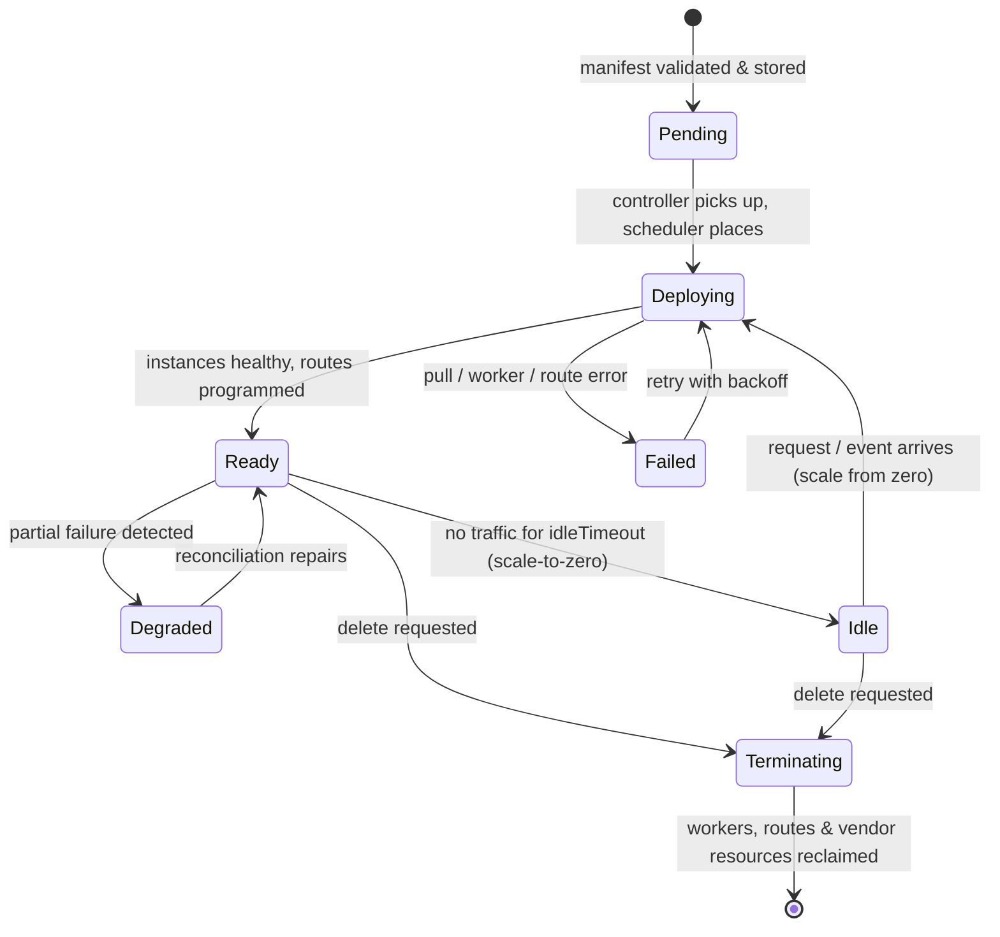
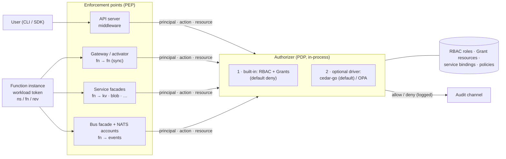
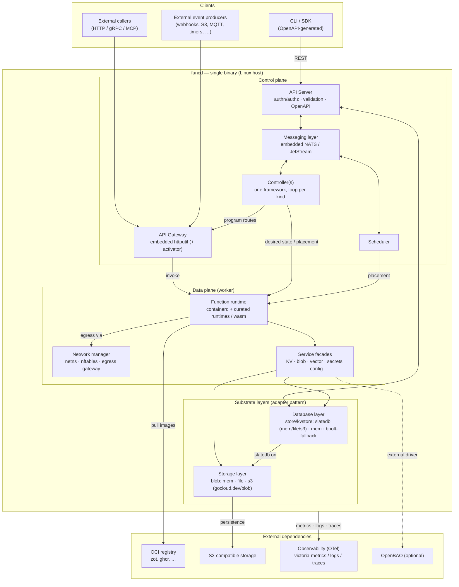
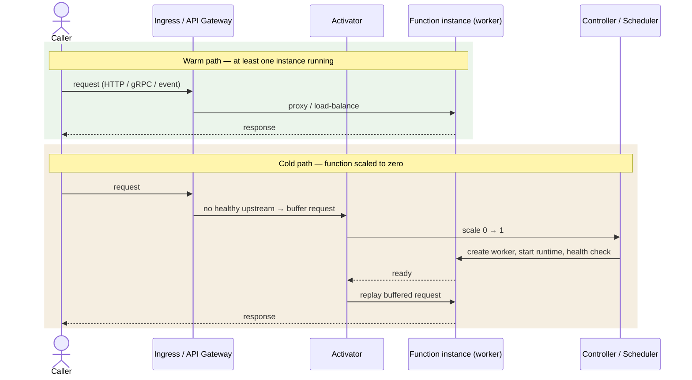

# funcd — project summary

> A single-page, accurate picture of what funcd is and how its parts fit. The
> [blueprint](../blueprint.md) is the full architecture; the [ADRs](adr/) are the per-decision
> contracts. This summary is the map you read first. **Status: Active** (living doc).

---

## What funcd is

funcd is an **API-first, embeddable, "bottomless" FaaS + services platform** for **local-first AI
agents, MCP servers, and traditional full-stack apps** (frontend + backend, backend-only, or static
web). It targets **high-throughput, RAM-bound, scale-to-zero** workloads on a single Linux box (the
design point: ~100 lightweight agents/MCP servers on an 8-core/18 GB host, heavy compute offloaded),
and it is built so you can **`import` it as a Go library** *or* run it as a **single static binary**.

Provisioning is **API-first**: every stack is driven through the **OpenAPI control plane** — usable
from the **CLI, the Go SDK, MCP, or Terraform**. Apps can extend to a distributed workload via the
inner **messaging system**, but multi-node is out of scope for V1.

Three properties anchor the design:

- **Bottomless** — state can persist to **S3** (with a latency trade-off) so the platform is not
  bound by local disk. The metastore engine, **SlateDB**, is the backend-independent foundation.
- **Backend-independent ports** — the same swap-the-backend pattern runs through the **store**
  (mem/file/S3 via SlateDB), the **blob storage** (mem/file/S3 via `gocloud.dev/blob`), and the
  **bus** (mem/file via embedded NATS/JetStream).
- **Hexagonal (ports & drivers)** — every pluggable capability is a port with **≥2 drivers** (one
  real, one in-memory), so the platform is extensible and **testable without mocks**.

---

## The "bottomless" substrate (SlateDB)

**SlateDB** is an LSM store that buffers writes in a memtable and flushes sequentially/async, so a
cloud (S3) backend stays usable and a local backend is near-memory speed. It is **backend-agnostic by
design** (memory / local FS / S3 are config, not code).

| Backend | put/s (steady) | get/s (steady) | Notes |
|---|---|---|---|
| Memory | ~4.5–10.8k | ~18–43k | LSM buffering → mostly sequential async I/O |
| Local FS | ~3.8–10.7k | ~15–42k | **~10 % slower than memory** — modest FS overhead |
| **S3** (read-heavy 4:1) | ~7.3k | ~29k | 94.5 % DB hit ratio; decent even over the network |
| S3 (write-heavy) | ~3.5k | ~2.3k | the cost of remote durability shows on writes |

**The one non-native dependency.** SlateDB is **Rust**, reached via UniFFI + **cgo** (ADR-0006). To
keep the Rust toolchain out of this repo, the plan is a **separate package** (`slatedb-go-funcd`) that
**embeds the prebuilt static SlateDB library** — so funcd consumers get a pure-Go build. Until then,
the default dev/CI build uses the **pure-Go memory store**; the cgo/SlateDB lane is opt-in.

> The **store** and **blob** layers are bottomless; the **bus** (NATS/JetStream) is the one layer that
> is **not** — it supports mem/file only. A SlateDB-backed streaming store (the "S2-on-SlateDB"
> approach) is the reference for a future bottomless bus, but that is not built.

---

## Repository shape

```
api/        # the public contract: huma-generated OpenAPI + the CRD-like typed resources (v1alpha1)
pkg/funcd   # the platform-as-a-library facade (composition root) — embeddable; → pkg.go.dev
pkg/sdk     # the Go client for the control-plane API — used by the CLI; → pkg.go.dev
cmd/funcd   # the daemon: a thin shell over pkg/funcd
cmd/funcdcli# the CLI: a thin shell over pkg/sdk (+ the OCI artifact verbs)
internal/   # all components — ports + drivers + the controller/serving engine
```

- **`internal/` — ports with drivers** (the hexagon): `store`, `blob`, `bus`, `gateway`, `runtime`
  (process + containerd/crun), `scheduler`, `auth` (the authorizer/PDP), `kvstore`, `secrets`
  (encryptor + resolver).
- **`internal/` — the engine/wiring**: `controller` (the one reconcile framework), `controlplane`
  (the authenticated API server), `dataplane` (function-invocation serving), `activator`
  (scale-to-zero), `eventing` (triggers), `function` (the Function reconciler), `services` (the
  KV/blob service facades), `artifact` (OCI push/pull), `observability`, `platform`, `version`.

> **"Where is the config component?"** — There isn't one, by design. **Config is a *resource kind***
> (data: env vars, flags, runtime params), not a hexagonal port. It is stored + served by the
> `store` + API and consumed by functions, exactly like `Secret`. Only *capabilities with drivers*
> live as ports in `internal/`.

---

## Resource model & lifecycle

Every resource has a **Kubernetes-like typed spec** (`api/types/v1alpha1`) with `metadata`
(`namespace`, `resourceGroup` required; `tags` optional) + `spec` + `status`. The **one generic
controller** runs **one reconcile loop per kind** to drive *actual state → desired state*.

**Resource kinds:** `Namespace`, `ResourceGroup`, `Function`, `Revision`, `Service`, `EventSource`,
`Invocation`, `Config`, `Secret`, `Gateway`, `Route`, `RuntimeClass`, `Grant`, `EgressPolicy`,
`WorkerNode`.

**Deploy lifecycle:**

| Step | Phase | Result |
|---|---|---|
| 1 | Validate | manifest validated (typed admission), quotas checked |
| 2 | Store spec | raw manifest persisted to the metastore |
| 3 | Stamp Revision | an **immutable `Revision`** is stamped from the spec generation |
| 4 | Translate | the resource is mapped to each driver's form (gateway routes, NATS subjects/streams, blob buckets, secret paths, worker spec, …) |
| 5 | Schedule & provision | the scheduler places the work; the runtime provisions the worker + vendor resources |
| 6 | Materialize & gate | the artifact is pulled/mounted, the **runtime shim** loads the handler; `/health/readiness` is the authoritative shape-gate |
| 7 | Expose | routes are programmed in the gateway; triggers registered in eventing |
| n | Monitor & reconcile | the controller writes status back and repairs drift |

### Resource state machine



---

## Features

| Feature | What it is | Status |
|---|---|---|
| [**Namespace**](../api/types/v1alpha1/namespace.go) | Logical isolation; the boundary for tenancy, quotas, and access control. | V1 |
| [**Resource group & tags**](../api/types/v1alpha1/resourcegroup.go) | Group related resources (an agent + its routes, secrets, KV, event sources) to manage/delete together. `metadata.resourceGroup` is required; `tags` are filter-only (no authz effect). | V1 |
| [**Function**](../internal/function/function.go) | The core compute unit: runtime + handler + config + triggers + service/secret/config access, all namespace-scoped. | V1 |
| [**Revision**](../api/types/v1alpha1/revision.go) | An **immutable snapshot** of a Function at a generation; the foundation for rollout/canary. Pinned by **artifact digest** ("validated = shipped") — the digest is **auto-resolved from the tag at stamp time** (ADR-0035), so the user never types one. | V1 (rollout mechanics: follow-up) |
| [**Service**](../internal/services/dispatcher.go) | Function-facing capabilities, reconciled independently and scaled separately (same facade pattern, extensible):<ul><li>[**KV store**](../internal/kvstore/) — key/value</li><li>[**Blob store**](../internal/services/blob/) — object storage</li><li>Eventing</li><li>Vector store</li><li>Databases</li></ul> | V1 (KV, blob) |
| [**Event / EventSource**](../internal/eventing/eventing.go) | Triggers a function from HTTP, timer, queue, or message; binds a source to one or more functions in the namespace. | V1 (**HTTP + timer**) |
| [**Invocation**](../api/types/v1alpha1/invocation.go) | The recorded result of each trigger fire (Ready/Failed + timing); a trigger is **never silently dropped**. | V1 |
| [**Config**](../api/types/v1alpha1/config.go) | Non-sensitive configuration (env vars, args, flags); updatable without a full redeploy where the runtime supports it. | V1 |
| [**Secret**](../internal/secrets/secrets.go) | Sensitive data, managed separately from config, exposed only to authorized workloads (see [Security](#security)). | V1 (inject last-mile: **P-W**) |
| [**Scaling & scale-to-zero**](../internal/activator/activator.go) | Horizontal scaling between `minReplicas`/`maxReplicas`; with `minReplicas: 0`, idle functions scale to zero and the **activator** buffers the first request/trigger during cold start, then forwards. | V1 |
| [**Gateway / ingress**](../internal/gateway/gateway.go) + [**data plane**](../internal/dataplane/dataplane.go) | Embedded `net/http` + `httputil` reverse proxy is the ingress; the **data plane** serves invocations through the activator (warm proxy / cold wake) over a dedicated listener (ADR-0033). | V1 (ingress hardening in progress) |
| [**Runtime & RuntimeClass**](../internal/runtime/runtime.go) | The **worker** (the process running a function) behind the `runtime.Runtime` port: a **process driver** (dev/CI) and a **containerd/crun driver** (Linux prod) running **curated runtime images** carrying the **runtime shim** (loads the handler, serves CloudEvents). | V1 (**Node** + **Python**, ADR-0049) |
| [**Scheduler**](../internal/scheduler/scheduler.go) | Single-node placement behind a pluggable port. | V1 (multi-node: V2) |
| [**Controller**](../internal/controller/controller.go) | One reconcile framework, one loop per kind, default-deny on drift. | V1 |
| [**WorkerNode**](../api/types/v1alpha1/workernode.go) | The multi-node compute-node identity (a node that schedules workers; many may run on one machine, K3s-style). Renamed from `Worker` by ADR-0045. | V2 (registration/heartbeat) |
| [**Worker pooling**](../internal/pooling/pooling.go) | Per-function opt-in (`spec.pooling.worker`) to co-locate same-namespace, same-runtime functions as handlers in one `worker_threads` pool worker — amortizing the runtime baseline (~2.8× density). Keyed by (namespace, runtime, worker-id); per-pool scale-to-zero; cap guard. | V1 (Node; ADR-0044/0046) |
| [**Observability**](../internal/observability/telemetry.go) | OTLP-native logging/telemetry + audit channel — see [Observability](#observability). | V1 (stdout JSON; file/S3 exporters planned) |
| [**Grant**](../api/types/v1alpha1/grant.go) / [**EgressPolicy**](../api/types/v1alpha1/egresspolicy.go) | Authorization grants and egress policy — see [Security](#security). | Grant: modeled (enforcement V2) · EgressPolicy: modeled (enforcement V2) |

---

## Observability

OTel-native end to end: the platform **emits** OTLP and **speaks** OTLP. Four levels (**Debug, Info,
Warn, Error**). V1 exports **structured JSON to stdout**; **file** and **S3** exporters are planned.
A fully OTLP-compliant gateway that lands logs/traces/metrics **directly in the underlying blob
storage** is the longer-term goal — so observability needs **no separate service**. An **audit
channel** (ADR-0010) records authorization decisions.

---

## Network

- **Control plane** — reaching the API server requires an **authn** step ([Security](#security)). 
- **Data plane** — deployed functions are reachable over the **ingress gateway** → activator → worker
  (the gateway's full ingress hardening is still in progress).
- **Function ⇄ service / function ⇄ function** — via **NATS** messaging and the service facades.
- **CNI** — *yes, it is configured* (correcting a common misread): the **containerd/crun driver**
  attaches a **per-worker netns via `go-cni`** (bridge + firewall) with **L3/L4 default-deny
  lateral** traffic. The **process driver** (dev/CI) has no netns. So CNI exists on the **Linux
  production path**, not the dev path.

---

## Security

**Multi-tenancy** is namespace-scoped: quotas, secrets, routes, and service instances are
**namespace-scoped and never shared** across namespaces.

**Worker isolation** — each function runs in its own worker. V1 ships **crun** (OCI runtime) with
conservative defaults (no added caps, `no_new_privileges`, default seccomp) + the netns lateral
default-deny. Stronger FS/network hardening and a microVM tier (Kata) are later tiers.

**Secrets** — at rest, secrets are **AES-256-GCM encrypted in the metastore** (stdlib, filling the
store `Encryptor` seam; ADR-0022) and delivered to the worker via a **PDP-authorized resolver** (env
var / tmpfs). The **inject-into-the-running-worker last mile** is the remaining V1 item (**P-W**).
OpenBAO is an *optional external* driver, deferred.

**Egress control** — *suspicion confirmed*: V1 ships **only L3/L4 default-deny lateral** at the netns
boundary. **North-south outbound egress** (transparent egress gateway, nftables L7 redirect/TPROXY,
SNI peek, DNS-aware policy, **`EgressPolicy` enforcement**) is **V2** — `EgressPolicy` is *modeled* as
a resource kind but **not yet enforced**.

### Internal IAM — workload identity

Every internal workload (a function instance, a service, a worker) carries a **short-lived, signed
*workload token*** — a **SPIFFE-like workload identity**, not an AWS-style `arn`/`client_id`. The
**principal is `namespace / function / revision`** (+ an **audience**), minted and rotated
automatically the way a Lambda execution role's token is. **In V1 these tokens are *recorded* but not
yet *enforced***: the binding `Function.spec.services` exists as the grant, and full
workload-token enforcement (fn→fn, fn→service) through the PDP is **V2**.

### Authorization

funcd uses one **Policy Decision Point (PDP)** — the `auth.Authorizer` **port** — that **every**
enforcement point calls, so the **default-deny** guarantee lives in exactly one place and every future
hop (services, gateway, bus, egress) reuses the same decision:

- **PEPs (Policy Enforcement Points):** the API-server middleware (user → control plane), the
  gateway/activator (fn → fn), the service facades (fn → KV/blob/…), and the bus facade + NATS
  accounts (fn → events).
- **PDP (in-process):** the built-in **RBAC + Grants** engine (default-deny), with an **optional
  policy driver** behind the same port.

> **"Which auth library — casbin or cedar-go?"** — Decided in **ADR-0018**: **do not reimplement** —
> the `auth.Authorizer` port abstracts it. V1 ships a **zero-dependency built-in RBAC** driver
> (default-deny, three fixed roles) as the **default**. **`cedar-go` is the chosen *optional* policy
> driver** for richer ABAC/conditional policy (a typed, analyzable policy language with a maintained
> Go SDK) — **not casbin**. For **authn**, V1 = **static tokens + scoped API keys**; **OIDC** (via
> `coreos/go-oidc` + `golang.org/x/oauth2`) is the planned V2 addition. So: API-key + RBAC today,
> cedar-go + OIDC as drop-in drivers later — no custom crypto/policy engine to write.

### Policy engine

The **built-in RBAC engine** (V1) evaluates `(principal, action, resource)` against **RBAC roles +
`Grant` resources** with **default-deny**, and logs every decision to the audit channel. The
**cedar-go driver** (V2) satisfies the *same* `Authorizer` contract for policy-as-code (ABAC,
conditions, cross-namespace grants), so swapping it in changes no enforcement-point code.

### Authorization data flow (PEP → PDP)



---

## Architecture

### Global architecture



### Function invocation flow (warm vs cold)



> **V1 wiring (ADR-0033).** The data plane is a dedicated listener that resolves the function from
> `/function/<name>` (+ `X-Funcd-Namespace`, default `default`) against the store and serves **every**
> request through the activator — warm → proxy; cold → buffer + `ScaleTo(1)` + poll + forward. The same
> `activator.Wake` primitive backs the **timer** path (a timer wakes a scaled-to-zero function instead
> of dropping the trigger).

---

## Build status (V1)

The V1 build slate is complete and past it: **ADR-0001…0053** decided, **52 Implemented** (33 are the
roadmap's tier-0 build items; the rest — incl. ADR-0034…0053 — are follow-ons refining or extending
existing feature rows). The exit-criterion path is proven end-to-end — a function deploys from a
**source artifact** (no Dockerfile), is **invoked over HTTP and by a timer**, **scales to zero and
wakes on demand**, all through the public API/CLI — and that whole journey is an executable acceptance
test (ADR-0034). Post-slate work: the runtime shim is **TypeScript + Hono** with an **embedded JTD
contract** (ADR-0037/0038) on **node 22** (ADR-0039); a **benchmark harness** (`funcd-bench`,
ADR-0040) proved sustainability and drove fixes — **upstream connection pooling** (ADR-0041) and a
**file-by-default substrate** with `--memory` (ADR-0043); the CLI moved to **cobra** (ADR-0042);
**worker pooling** landed — the `worker_threads` host (ADR-0044) plus its **placement policy**
(`spec.pooling.worker`, ADR-0046) for ~2.8× same-namespace density; and the compute vocabulary was
**renamed `sandbox`→`worker` / `Worker`→`worker node`** (ADR-0045); a reconcile-storm was fenced by
**store-level no-op-write coalescing + a `tests/chaos/` guard tier** (ADR-0047); and DTO validation was
made a **normative per-field reference** carrying constraints into the OpenAPI/422 edge and typed
admission `Validate()` (ADR-0048); and **Python** landed as the second curated language behind the same
runtime-shim contract — a stdlib-HTTP + hand-rolled-RFC-8927-validator shim, uv-managed and typed, with
per-runtime dispatch (ADR-0049) — followed by a **Python worker-pool host** (subinterpreters, Python 3.14,
~3.7× density with per-interpreter isolation, ADR-0050), closing the Node/Python pooling parity gap. The
**only remaining roadmap item is P-W** (the secret-injection last mile). See
[docs/roadmap/v1-delivery-plan.md](roadmap/v1-delivery-plan.md).

**Out of V1 scope** (recorded for later): multi-node workers, north-south egress enforcement, OIDC +
cedar-go drivers, workload-token *enforcement*, rollout/canary mechanics, the bottomless bus, and the
`slatedb-go-funcd` prebuilt-binary package.

---

## Decision log (ADRs)

Every ADR, its one-line recap, and the choices it locked in (no rationale — see the ADR for that).
All are **Implemented** unless the recap says *superseded*.

| Title | Recap | Verdict (validated choices) |
|---|---|---|
| [ADR-0000 — ADR process](adr/0000-adr-process.md) | The decision process, template, and gates. | <ol><li>Draft→Proposed→Accepted→Reviewing→Implemented</li><li>immutable once Accepted</li><li>change = a superseding ADR</li><li>five gates: plan · decide · judge · build · review</li><li>one ADR = one topic</li></ol> |
| [ADR-0001 — Project setup & structure](adr/0001-project-setup-and-structure.md) | Repo bootstrap, layout, Nix. | <ol><li>module `github.com/green-0-rabbit/funcd`</li><li>`api/`·`pkg/`·`cmd/`·`internal/` layout</li><li>Nix dev env</li><li>`just` task runner</li><li>Apache-2.0/MIT deps only</li></ol> |
| [ADR-0002 — Source-code conventions](adr/0002-source-code-conventions-and-patterns.md) | Binding Go code shapes. | <ol><li>ports & drivers (≥2 drivers)</li><li>`api/fault` error kernel</li><li>functional-options facade + deps-struct ctor</li><li>typed enums/IDs, no `any`</li><li>ctx-first, no globals, slog-only, no mocks</li><li>depguard import graph; one driver = one file</li></ol> |
| [ADR-0003 — Resource model & API typing](adr/0003-resource-model-and-api-typing.md) | The typed CRD-like model. | <ol><li>k8s-like metadata/spec/status</li><li>typed kinds + kind registry</li><li>`RuntimeClass`</li><li>generation-stamped revisions</li><li>namespace + resourceGroup required</li></ol> |
| [ADR-0004 — API surface & codegen](adr/0004-api-surface-and-codegen.md) | First API-surface attempt (*superseded*). | <ol><li>REST/OpenAPI v1alpha1 surface</li><li>superseded by ADR-0005 (code-first huma)</li></ol> |
| [ADR-0005 — API surface, code-first huma](adr/0005-api-surface-code-first-huma.md) | Code-first → generated OpenAPI. | <ol><li>huma framework</li><li>code-first → generated OpenAPI</li><li>REST control plane</li><li>supersedes ADR-0004</li></ol> |
| [ADR-0006 — Store / database port](adr/0006-store-database-layer-port.md) | Metastore port + SlateDB. | <ol><li>`store.Store` port</li><li>SlateDB engine (UniFFI + cgo)</li><li>mem/file/S3 backends</li><li>pure-Go memory driver</li><li>`Encryptor` seam; watch + revisions</li></ol> |
| [ADR-0007 — Blob / storage port](adr/0007-blob-storage-layer-port.md) | Blob storage port. | <ol><li>`blob.Bucket` port</li><li>`gocloud.dev/blob`</li><li>mem/file/S3 drivers</li></ol> |
| [ADR-0008 — Bus / messaging port](adr/0008-bus-messaging-port.md) | Messaging port. | <ol><li>`bus.Bus` port</li><li>embedded NATS + JetStream</li><li>mem/file storage</li><li>per-account isolation</li></ol> |
| [ADR-0009 — Observability logger root](adr/0009-observability-logger-root.md) | slog construction + injection. | <ol><li>`log/slog` only</li><li>constructed root logger, injected</li><li>no global logger</li><li>text/JSON formats</li></ol> |
| [ADR-0010 — Telemetry + audit](adr/0010-observability-telemetry-and-audit.md) | OTel pipeline + audit. | <ol><li>OpenTelemetry pipeline</li><li>OTLP log bridge</li><li>audit channel</li><li>no-op default; stdout JSON export</li></ol> |
| [ADR-0011 — Runtime sandbox port](adr/0011-runtime-sandbox-port.md) | Sandbox port + drivers. | <ol><li>`runtime.Runtime` port</li><li>process driver (dev/CI)</li><li>containerd/crun driver (Linux)</li><li>crun via runc-shim `BinaryName`</li><li>per-sandbox netns + default-deny lateral (go-cni)</li><li>`no_new_privileges` + seccomp</li></ol> |
| [ADR-0012 — Gateway port](adr/0012-gateway-ingress-port.md) | First gateway decision (*superseded*). | <ol><li>`gateway.Gateway` port</li><li>embedded httputil + Lura drivers</li><li>superseded by ADR-0013 / ADR-0029</li></ol> |
| [ADR-0013 — Gateway httputil-primary](adr/0013-gateway-ingress-httputil-primary.md) | Embedded reverse-proxy gateway. | <ol><li>embedded httputil primary</li><li>net/http middleware composition</li><li>certmagic TLS</li><li>streaming-native (FlushInterval −1)</li><li>supersedes ADR-0012</li></ol> |
| [ADR-0014 — Platform facade & harness](adr/0014-platform-facade-lifecycle-harness.md) | The composition-root facade. | <ol><li>`pkg/funcd` facade</li><li>functional options</li><li>`InMemory()` preset</li><li>crash-only lifecycle</li><li>library-first</li></ol> |
| [ADR-0015 — Controller engine](adr/0015-controller-engine.md) | The one reconcile framework. | <ol><li>one controller framework</li><li>one reconciler per GVK</li><li>hand-written workqueue (informer/retry)</li><li>store-watch driven</li><li>status write-back</li></ol> |
| [ADR-0016 — Activator & scale-to-zero](adr/0016-activator-scale-to-zero.md) | Cold-start buffering + idle reclaim. | <ol><li>in-process activator</li><li>buffer→wake→forward</li><li>singleflight wake</li><li>partitioned `Status.Phase` (Endpoints read / Scaler write)</li><li>store-backed Scaler; idle reclaim</li></ol> |
| [ADR-0017 — Scheduler port](adr/0017-scheduler-placement-port.md) | Pluggable placement. | <ol><li>`scheduler.Scheduler` port</li><li>single-node driver</li><li>pluggable for multi-node</li></ol> |
| [ADR-0018 — API-server authn/RBAC/admission](adr/0018-api-server-authn-rbac-admission.md) | Control-plane auth + the PDP. | <ol><li>`auth.Authorizer` PDP port</li><li>built-in RBAC + Grants (default-deny)</li><li>static tokens + scoped API keys</li><li>typed admission</li><li>cedar-go optional driver (V2)</li><li>OIDC (V2)</li></ol> |
| [ADR-0019 — Service facade + KV](adr/0019-service-facade-pattern-kv.md) | Facade pattern + KV service. | <ol><li>service facade pattern (CRD+facade+reconciler+driver)</li><li>KV service (`kvstore`)</li><li>RBAC facade authz</li><li>one reconciler per service kind</li></ol> |
| [ADR-0020 — Function contract & lifecycle](adr/0020-function-contract-lifecycle.md) | The Function reconciler. | <ol><li>Function reconciler</li><li>immutable Revision stamping</li><li>effective-replicas honors wake Phase</li><li>full-table route programming</li><li>shape-validation gate</li><li>`Endpoints` provider</li></ol> |
| [ADR-0021 — Blob service](adr/0021-blob-service.md) | Function-facing blob facade. | <ol><li>blob service facade</li><li>over the `blob` port</li><li>namespace-scoped buckets</li></ol> |
| [ADR-0022 — Secrets service](adr/0022-secrets-service.md) | At-rest encryption + delivery. | <ol><li>AES-256-GCM `store.Encryptor`</li><li>PDP-authorized env-var Resolver</li><li>`SecretTypeOpaque`</li><li>OpenBAO/Grant/rotation deferred</li></ol> |
| [ADR-0023 — Eventing core](adr/0023-eventing-core.md) | CloudEvents + timer sources. | <ol><li>`internal/eventing`</li><li>hand-defined CloudEvent envelope</li><li>timer EventSource (interval)</li><li>HTTP invoker via Endpoints</li><li>no-dropped-trigger (Invocation recorded)</li><li>trigger-wake deferred → ADR-0033</li></ol> |
| [ADR-0024 — funcdcli + Go SDK](adr/0024-funcdcli-and-sdk.md) | Client-access layer. | <ol><li>`pkg/sdk` client</li><li>kubectl-style `funcdcli`</li><li>thin shell over the SDK</li><li>token auth</li></ol> |
| [ADR-0025 — Testing strategy & e2e](adr/0025-testing-strategy-and-e2e-harness.md) | The test taxonomy. | <ol><li>four-tier taxonomy (L1–L4)</li><li>`InMemory()` e2e harness</li><li>contract suites per port</li><li>Linux integration lane (L4)</li><li>no mocks</li></ol> |
| [ADR-0026 — Packaging & release](adr/0026-packaging-and-release.md) | Single binary + release. | <ol><li>single static binary</li><li>version stamping</li><li>systemd unit</li><li>pure-Go default / cgo SlateDB opt-in</li></ol> |
| [ADR-0027 — Depguard import-discipline fix](adr/0027-import-discipline-depguard-fix.md) | Make path-scoped rules fire. | <ol><li>`files` globs need `**/` prefix</li><li>deny is prefix-match (no `/*`)</li><li>production-only via `!**/*_test.go`</li><li>deny-only lists</li></ol> |
| [ADR-0028 — Control-plane wiring](adr/0028-platform-control-plane-wiring.md) | Make `funcd.Run` serve + reconcile. | <ol><li>Run serves control-plane API + controller</li><li>error-returning constructors</li><li>`Production()` defaults</li><li>data plane deferred → ADR-0033</li></ol> |
| [ADR-0029 — Gateway, drop Lura](adr/0029-gateway-drop-lura-single-driver.md) | Single gateway driver. | <ol><li>drop the Lura driver</li><li>single embedded driver</li><li>external-gateway = V2 second driver</li><li>supersedes ADR-0013 (Lura part)</li></ol> |
| [ADR-0030 — Function execution / shim (P-V-1)](adr/0030-function-execution-runtime-shim-node.md) | Real execution via the runtime shim. | <ol><li>runtime-shim HTTP contract</li><li>Node reference shim</li><li>Materializer seam + file driver</li><li>per-replica loopback + `FUNCD_PORTFILE`</li><li>readiness gate refines ADR-0020</li><li>node-gated test tier</li></ol> |
| [ADR-0031 — OCI artifact distribution (P-V-A)](adr/0031-oci-artifact-distribution-oras.md) | Artifact push/pull via oras-go. | <ol><li>oras-go v2</li><li>funcdcli push/pull/login/logout</li><li>`OrasMaterializer` (digest = authority)</li><li>local OCI layout (dev) / registry (prod)</li><li>supersede blueprint "no push"</li></ol> |
| [ADR-0032 — Curated images + container exec (P-V-2)](adr/0032-curated-runtime-images-container-execution.md) | Run the shim in the curated container. | <ol><li>curated image (shim entrypoint)</li><li>`SandboxSpec.Mounts` (read-only artifact bind)</li><li>container-mode fixed netns port</li><li>`Instance.Port` on List+Status</li><li>bind-mount over baked image (V1)</li></ol> |
| [ADR-0033 — Data-plane serving + wake (P-X)](adr/0033-data-plane-serving-and-trigger-wake.md) | Serve invocations + wake on trigger. | <ol><li>data-plane listener</li><li>path+store → activator handler</li><li>shared `activator.Wake`</li><li>eventing `Waker` (closes ADR-0023 C3)</li><li>readiness-gated Endpoints + woken-stays-up</li></ol> |
| [ADR-0034 — End-user journey acceptance e2e](adr/0034-end-user-journey-acceptance-e2e.md) | An e2e lane driving the real CLI + HTTP through the exit criterion. | <ol><li>`tests/e2e` user-journey lane</li><li>drives the real `funcdcli` binary (push/apply/get)</li><li>data-plane HTTP invoke + scale-to-zero wake</li><li>public-surface-only (`pkg`+`api`, e2e-boundary)</li><li>node-gated; embedded server</li></ol> |
| [ADR-0035 — Tag→digest resolution at Revision](adr/0035-artifact-digest-resolution-at-revision.md) | Resolve the artifact tag→digest at stamp; no manual pinning (Knative model). | <ol><li>`artifact.digest` optional</li><li>`ArtifactResolver` seam (oras `Resolve`)</li><li>resolve+pin only on the Revision-create path</li><li>materialize the pinned digest (spec stays digest-free)</li><li>unresolvable → `Failed`/`ArtifactUnresolved`</li></ol> |
| [ADR-0036 — Daemon execution wiring](adr/0036-daemon-execution-wiring.md) | Make the standalone `funcd` binary execute functions. | <ol><li>`FUNCD_RUNTIME` mode select</li><li>process: **embedded** Node shim (`go:embed`) + `WithRuntimeShim` + artifact store</li><li>containerd mode (env `Config`) + `WithContainerExecution`</li><li>no node → control plane only (degrade)</li><li>answers ADR-0034's open question</li></ol> |
| [ADR-0037 — TypeScript + Hono shim](adr/0037-typescript-hono-runtime-shim.md) | The Node reference shim rewritten (supersedes ADR-0030 §2). | <ol><li>TypeScript + Hono over `node:http`</li><li>esbuild → `shim.mjs` (committed, `go:embed`)</li><li>`handle(context, event)`; object→200 · none→204 · throw→500</li><li>supersedes ADR-0030 §2</li></ol> |
| [ADR-0038 — Event-data contract (JTD)](adr/0038-event-data-contract-jtd.md) | A JTD schema validates `event.data` in the shim (refines ADR-0037). | <ol><li>JTD (RFC 8927) via `jtd` (pure-JS, MIT)</li><li>optional `eventSchema` export in the artifact</li><li>data mismatch → 422</li><li>refines ADR-0037</li></ol> |
| [ADR-0039 — Pin Node to node 22](adr/0039-pin-node-runtime-to-node22.md) | Pin the curated Node runtime to node 22 (refines ADR-0032/0037). | <ol><li>node 22 (LTS) curated image + shim target</li><li>`--experimental-strip-types` for TS</li><li>refines ADR-0032 + ADR-0037</li></ol> |
| [ADR-0040 — Benchmark & sustainability harness](adr/0040-benchmark-sustainability-harness.md) | `funcd-bench` drives the data plane + samples RSS → a sustainability verdict. | <ol><li>`internal/bench` + `cmd/funcd-bench`</li><li>Go-native load; external (process-RSS) sampling</li><li>memory vs file substrate</li><li>throughput · per-worker RSS · cold-start · density</li><li>markdown + JSON report</li></ol> |
| [ADR-0041 — Data-plane upstream connection pooling](adr/0041-gateway-upstream-connection-pooling.md) | Pooled upstream transport on activator + gateway (refines ADR-0029/0016). | <ol><li>shared pooled `http.Transport`, keyed by upstream `host:port`</li><li>fixes per-request reverse-proxy → ephemeral-port exhaustion</li><li>tenant-safe (never reused across functions)</li><li>refines ADR-0029/0016</li></ol> |
| [ADR-0042 — Adopt cobra for the CLI](adr/0042-cobra-cli-framework.md) | cobra as the CLI framework (refines ADR-0024). | <ol><li>cobra (Apache-2.0) for `funcdcli` + `funcd`</li><li>already an indirect dep</li><li>refines ADR-0024</li></ol> |
| [ADR-0043 — Single-binary substrate selection](adr/0043-single-binary-substrate-selection.md) | File substrate by default; `--memory` for ephemeral (refines ADR-0028). | <ol><li>file substrate is the default (durable)</li><li>`--memory` → ephemeral (mem blob/bus)</li><li>`Production()` deployment-injects store/runtime/blob/bus</li><li>refines ADR-0028</li></ol> |
| [ADR-0044 — Worker pooling (`worker_threads`)](adr/0044-worker-pooling-threads.md) | A `worker_threads` multi-tenant shim for same-namespace density (+ bench). | <ol><li>`pool.mjs` hosts many handlers of one namespace</li><li>per-handler V8 isolate + crash isolation</li><li>`resourceLimits` = native per-artifact memory quota</li><li>bench: ~2.8× density, ~73% throughput retained</li><li>placement deferred → ADR-0046</li></ol> |
| [ADR-0045 — Compute vocabulary rename](adr/0045-rename-sandbox-to-worker.md) | `sandbox`→`worker` (the process), `Worker`→`worker node` (the compute node). | <ol><li>`runtime.SandboxSpec`→`WorkerSpec`</li><li>`v1alpha1.Worker`→`WorkerNode` (+ `KindWorkerNode`)</li><li>`scheduler.Placement.Worker`→`.WorkerNode`; controlplane `*WorkerNode`</li><li>behavior-preserving; OpenAPI + blueprint synced</li><li>supersedes (naming only) ADR-0011/0003/0017</li></ol> |
| [ADR-0046 — Pooling placement](adr/0046-pooling-placement-policy.md) | Per-function opt-in to a shared worker, keyed by (namespace, runtime, worker-id). | <ol><li>`spec.pooling.worker` opt-in (empty = solo)</li><li>key = (namespace, runtime, worker-id); never resourceGroup</li><li>`internal/pooling` policy + reconciler `ensurePool` (idempotent)</li><li>per-pool scale-to-zero (max over members); cap guard</li><li>closes ADR-0044's deferred placement</li></ol> |
| [ADR-0047 — Control-loop quiescence](adr/0047-control-loop-quiescence-and-chaos-tests.md) | Fix a reconcile-storm: coalesce no-op writes at the store so an idle function stops spinning the daemon. | <ol><li>`store.Update` skips the `Modified` event on a byte-identical write</li><li>idle Ready function → daemon quiesces (no hot-loop)</li><li>`tests/chaos/` lane: quiescence + leak + chaos-recovery guards</li><li>bisected pre-existing CPU storm, now regression-fenced</li></ol> |
| [ADR-0048 — DTO validation reference](adr/0048-dto-validation-reference.md) | The normative per-field validation table for every v1alpha1 entity: two layers, one source. | <ol><li>schema-expressible (pattern/enum/bound/len) → huma tag or `SchemaProvider` leaf → OpenAPI + 422 at edge</li><li>cross-field/conditional → typed `Validate()` at admission</li><li>`api/types` imports huma/v2 (MIT) for `SchemaProvider`; depguard holds</li><li>bounded by default: replicas ≤ 15, idleTimeout ≤ 24h, interval 100ms–24h</li><li>presence stays the shape gate's job (ADR-0020) — one constraint, one layer</li></ol> |
| [ADR-0049 — Python reference shim](adr/0049-python-runtime-shim.md) | The second curated language behind the same runtime-shim contract (P-V-3): stdlib HTTP + a hand-rolled RFC 8927 validator, uv-managed + typed. | <ol><li>same wire contract as the Node shim (200/204/400/422/500, health, portfile, exit 2/3) — the platform stays language-blind</li><li>`event_schema` (JTD) validated by a pure-stdlib RFC 8927 engine — the official `jtd` was rejected (pulls GPLv3 `strict-rfc3339`); zero runtime deps</li><li>`funcd_shim` uv package: typed `handle(context, event)`, `mypy --strict`, `py.typed`</li><li>per-runtime dispatch: `WithRuntimeShimFor` + reconciler `shimFor` (python* → python shim, else node)</li><li>`go:embed`'d into the daemon; `examples/python/hello-world`; no Python pool host (ADR-0046)</li></ol> |
| [ADR-0050 — Python worker pooling](adr/0050-python-worker-pooling-subinterpreters.md) | The Python pool host (the analog of ADR-0044's Node pool): N handlers in one process, each in its own subinterpreter — measured ~3.7× density **with** isolation. | <ol><li>`pool.py` = one `InterpreterPoolExecutor(max_workers=1)` per handler (Python ≥3.14) → per-interpreter GIL + state isolation; same `FUNCD_POOL_MANIFEST` + wire contract + JTD validation as Node</li><li>subinterpreters chosen over threading (8.1× but no isolation) and fork — measured spike, isolation parity with ADR-0044</li><li>per-family pool host: `WithPoolShimFor` + reconciler `poolHostFor`; `poolKeyFor` flips to host-inclusion (python* pools iff a python host exists, else solo)</li><li>placement policy (key/cap/scale-to-zero) reused from ADR-0046 unchanged</li><li>3.14 floor for *pooled* python (solo keeps ADR-0049's floor); no new dependency (stdlib)</li></ol> |
| [ADR-0051 — gopsutil + fortio in the bench](adr/0051-bench-adopt-gopsutil-fortio.md) | Swap the bench's hand-rolled RSS sampling + load driver for maintained libraries; **test-only**, confined to the harness. Refines ADR-0040. | <ol><li>RSS via `gopsutil` (BSD-3) — removes the `ps`/`pgrep` shelling; load + percentiles via `fortio` (Apache-2.0), closed-model `NumThreads`+`QPS:-1`</li><li>fortio chosen over vegeta (the bench is closed-model max-throughput = fortio's native mode)</li><li>confinement **enforced** by a `bench-libs` depguard rule (gopsutil/fortio denied outside `internal/bench` + `cmd/funcd-bench`)</li><li>`loadResult`/`Latency`/`Report` types unchanged; pool reports reshaped to small `metric \| single \| pooled` tables</li><li>never in the shipped `funcd`/`funcdcli` binaries (verified by `go list -deps`)</li></ol> |
| [ADR-0052 — Containerd cgroup-footprint bench lane](adr/0052-bench-containerd-cgroup-footprint-lane.md) | An opt-in bench lane that boots funcd over the real containerd/crun production path and measures each function container's cgroup memory — the **true** footprint, kept alongside the process-RSS lane. Refines ADR-0040; exercises ADR-0032/0011. | <ol><li>`funcd-bench --containerd` boots `containerd.New`+`WithRuntime`+`WithContainerExecution` (the production path), runs functions in real crun containers</li><li>footprint = container **cgroup-v2 `memory.current`** (read from `/proc/<pid>/cgroup`→`/sys/fs/cgroup`, deduped per cgroup via `rt.List` PIDs) — `MaxDensity`/`FitsTarget` from the **honest** cgroup number</li><li>Linux+root only; **skips cleanly** (never fails the run) off-Linux or without socket/image — `containerd_linux.go`/`containerd_other.go` build split</li><li>separate [`footprint-report.md`](../reports/footprint-report.md); process-RSS `report.md` unchanged; no new module</li><li>cgroup-measuring scenarios deferred to the homebox `FUNCD_IT=1` e2e (ADR-0011/0040 precedent)</li></ol> |
| [ADR-0053 — `funcdcli bench` subcommand](adr/0053-funcdcli-bench-subcommand.md) | A NATS-`bench`-style **client** load/latency verb on funcdcli that drives a running funcd's data plane and reports throughput + tail latency — hand-rolled on the stdlib so it ships no bench dependency (preserves ADR-0051). Realizes F18; the funcd-bench embed/memory harness stays. | <ol><li>`funcdcli bench --url <fn-endpoint>` (or `--function`+`--data-plane`) drives the data plane with `-c` workers for `-d`/`-n`, prints req/s + p50/p90/p99/max + ok/errors (`--json` for machine output)</li><li>`internal/loadgen` — stdlib-only HTTP load engine (net/http + sort + sync + api/fault); **no fortio/gopsutil**, no new module; the `bench-libs` depguard rule unchanged (funcdcli not allowlisted)</li><li>`fault.Invalid` on no target; `fault.Unavailable` when no request succeeds</li><li>client tool only — no platform embed, no memory measurement (that stays `funcd-bench`, ADR-0040/0052)</li></ol> |
