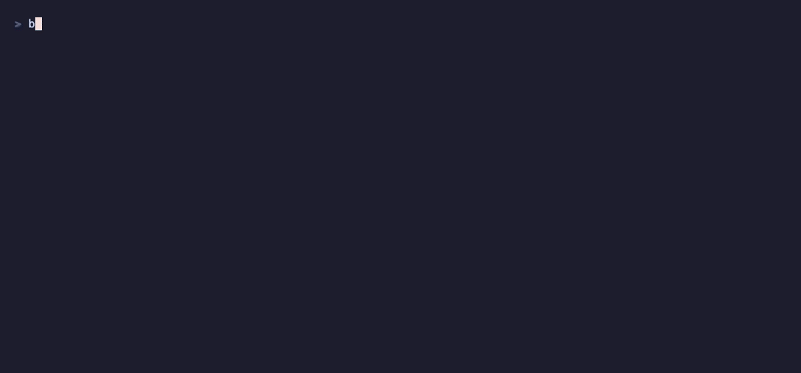

# funcd CLI demo



A recorded end-user journey: package a function as an OCI artifact, deploy it through the
API, and invoke it over HTTP — all through the public CLI + HTTP surface. A sharper/smaller
[WebM](cli-demo.webm) is rendered alongside the GIF (for docs sites / PRs).

```
funcdctl push handler.mjs oci-layout://…:v1     # package + push the source artifact (ADR-0031)
funcdctl apply -f function.yaml                 # deploy, pinned by digest
funcdctl get function echo -o json              # reconcile to Ready
curl -XPOST :8081/function/echo -d '{…}'        # invoke over the data plane (ADR-0033)
```

## Run it

```bash
just demo          # full lifecycle: build → boot → push/apply/get/invoke → teardown
just demo-record   # (re-)render docs/demo/cli-demo.gif + .webm from the tape
```

`just demo` needs `node` + `npm` + `yq` on PATH (the handler is bundled from TypeScript at
setup); `just demo-record` also needs `vhs` + `ffmpeg` +
`ttyd` (`brew install vhs ffmpeg ttyd yq`). The `.tape` is the **reproducible source**; the
`.gif`/`.webm` are its generated outputs — edit the tape or the scripts, never the recordings.

## Files

| File | What it is |
|---|---|
| `demo.yaml` | the demo **inputs** (`demoDir`, `server`, `dataPlane`, `token`, `function`) — the scripts read these via `yq` |
| `function.yaml` | the deployed **Function CRD**; `spec.artifact.{uri,digest}` are filled at apply time from the push output |
| the function | authored in TypeScript at [`examples/js/hello-world`](../../examples/js/hello-world) (`handle(context, event)`, typed against `@funcd/shim-nodejs`); bundled to `handler.mjs` at setup |
| `server/main.go` | a tiny **embedded** funcd wired for execution (ADR-0014 + shim + oras), fixed ports `:8080`/`:8081` — demo tooling, *not* the production daemon (`cmd/funcd`) |
| `cli-demo.tape` | the VHS script — the reproducible source of the recordings |
| `cli-demo.gif` · `cli-demo.webm` | the rendered recordings (generated from the tape) |
| [`scripts/demo/setup.sh`](../../scripts/demo/setup.sh) | build the binaries + boot the platform (hidden in the recording) |
| [`scripts/demo/journey.sh`](../../scripts/demo/journey.sh) | the narrated journey: push → apply → get → invoke (shown) |
| [`scripts/demo/teardown.sh`](../../scripts/demo/teardown.sh) | stop the server + remove the scratch dir |

> The demo runs a tiny **embedded** execution-wired platform on fixed ports `:8080`/`:8081`
> for a deterministic recording. The standalone `funcd` daemon executes functions too now
> (ADR-0036). The CLI + HTTP surfaces shown are exactly the user's.
