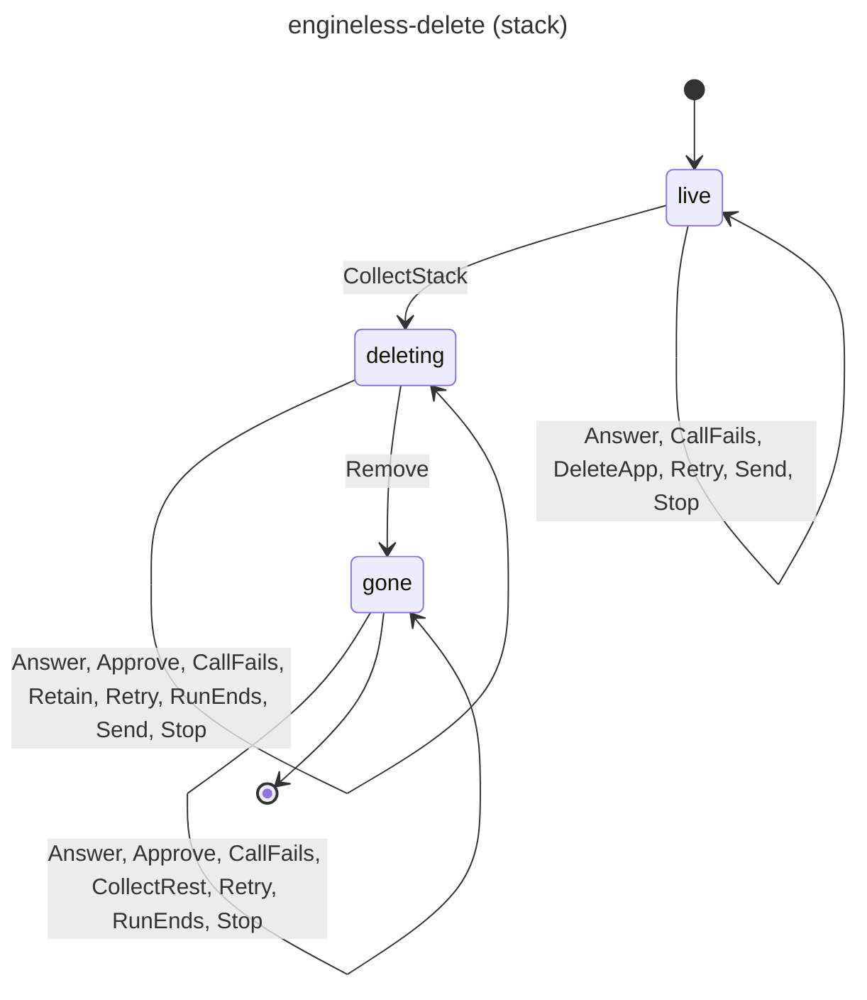

<!-- Generated by scripts/specs.py from engineless-delete.fizz (ADR-0272); do not edit. -->

# engineless-delete

```mermaid
---
title: engineless-delete (stack)
---
stateDiagram-v2
    state "deleting" as s0
    state "gone" as s1
    state "live" as s2
    [*] --> s2
    s0 --> s0 : Answer, Approve, CallFails, Retain, Retry, RunEnds, Send, Stop
    s0 --> s1 : Remove
    s1 --> s1 : Answer, Approve, CallFails, CollectRest, Retry, RunEnds, Stop
    s2 --> s0 : CollectStack
    s2 --> s2 : Answer, CallFails, DeleteApp, Retry, Send, Stop
    s1 --> [*]
```
