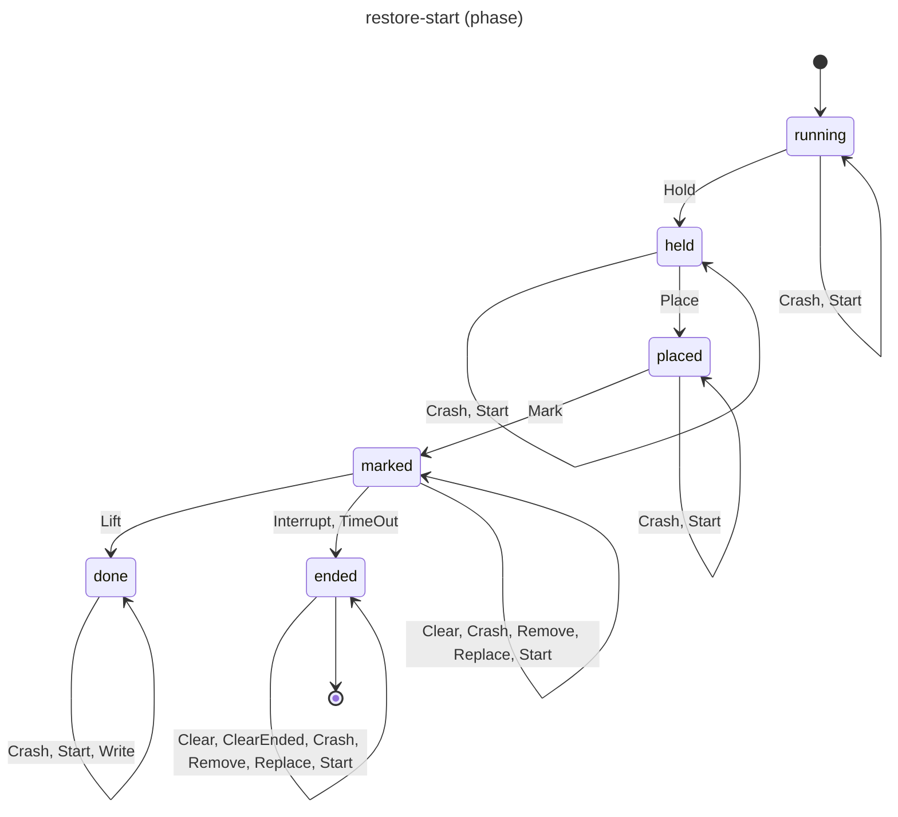

<!-- Generated by scripts/specs.py from restore-start.fizz (ADR-0272); do not edit. -->

# restore-start

```mermaid
---
title: restore-start (phase)
---
stateDiagram-v2
    state "done" as s0
    state "ended" as s1
    state "held" as s2
    state "marked" as s3
    state "placed" as s4
    state "running" as s5
    [*] --> s5
    s0 --> s0 : Crash, Start, Write
    s1 --> s1 : Clear, ClearEnded, Crash, Remove, Replace, Start
    s2 --> s2 : Crash, Start
    s2 --> s4 : Place
    s3 --> s0 : Lift
    s3 --> s1 : Interrupt, TimeOut
    s3 --> s3 : Clear, Crash, Remove, Replace, Start
    s4 --> s3 : Mark
    s4 --> s4 : Crash, Start
    s5 --> s2 : Hold
    s5 --> s5 : Crash, Start
    s1 --> [*]
```
