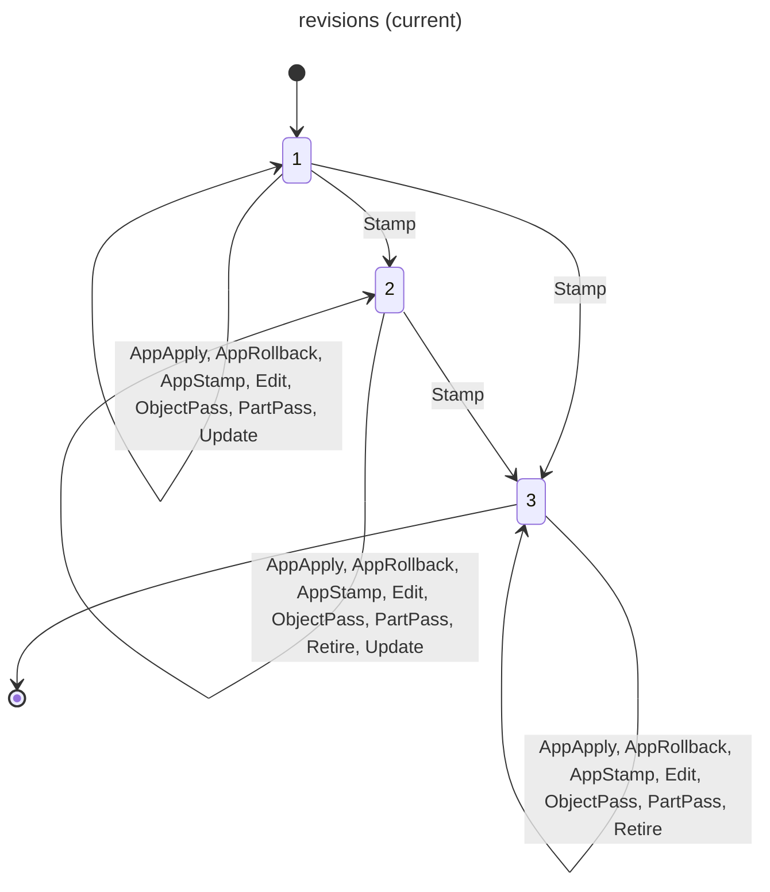

<!-- Generated by scripts/specs.py from revisions.fizz (ADR-0272); do not edit. -->

# revisions

```mermaid
---
title: revisions (current)
---
stateDiagram-v2
    state "1" as s0
    state "2" as s1
    state "3" as s2
    [*] --> s0
    s0 --> s0 : AppApply, AppRollback, AppStamp, Edit, ObjectPass, PartPass, Update
    s0 --> s1 : Stamp
    s0 --> s2 : Stamp
    s1 --> s1 : AppApply, AppRollback, AppStamp, Edit, ObjectPass, PartPass, Retire, Update
    s1 --> s2 : Stamp
    s2 --> s2 : AppApply, AppRollback, AppStamp, Edit, ObjectPass, PartPass, Retire
    s2 --> [*]
```
