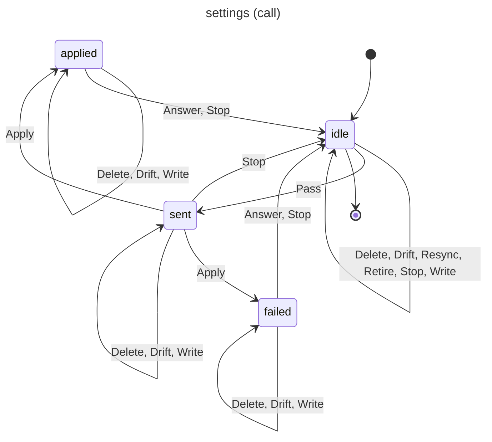

<!-- Generated by scripts/specs.py from settings.fizz (ADR-0272); do not edit. -->

# settings

```mermaid
---
title: settings (call)
---
stateDiagram-v2
    state "applied" as s0
    state "failed" as s1
    state "idle" as s2
    state "sent" as s3
    [*] --> s2
    s0 --> s0 : Delete, Drift, Write
    s0 --> s2 : Answer, Stop
    s1 --> s1 : Delete, Drift, Write
    s1 --> s2 : Answer, Stop
    s2 --> s2 : Delete, Drift, Resync, Retire, Stop, Write
    s2 --> s3 : Pass
    s3 --> s0 : Apply
    s3 --> s1 : Apply
    s3 --> s2 : Stop
    s3 --> s3 : Delete, Drift, Write
    s2 --> [*]
```
