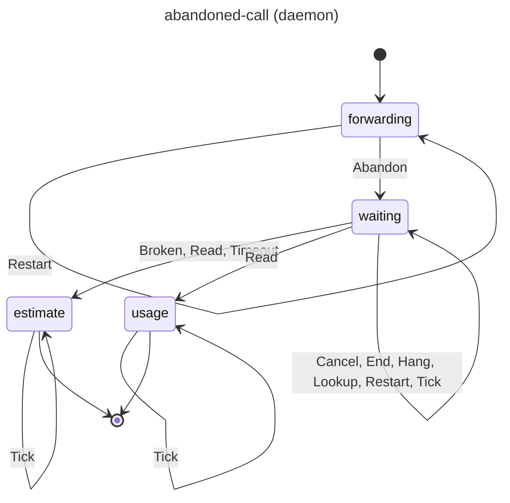
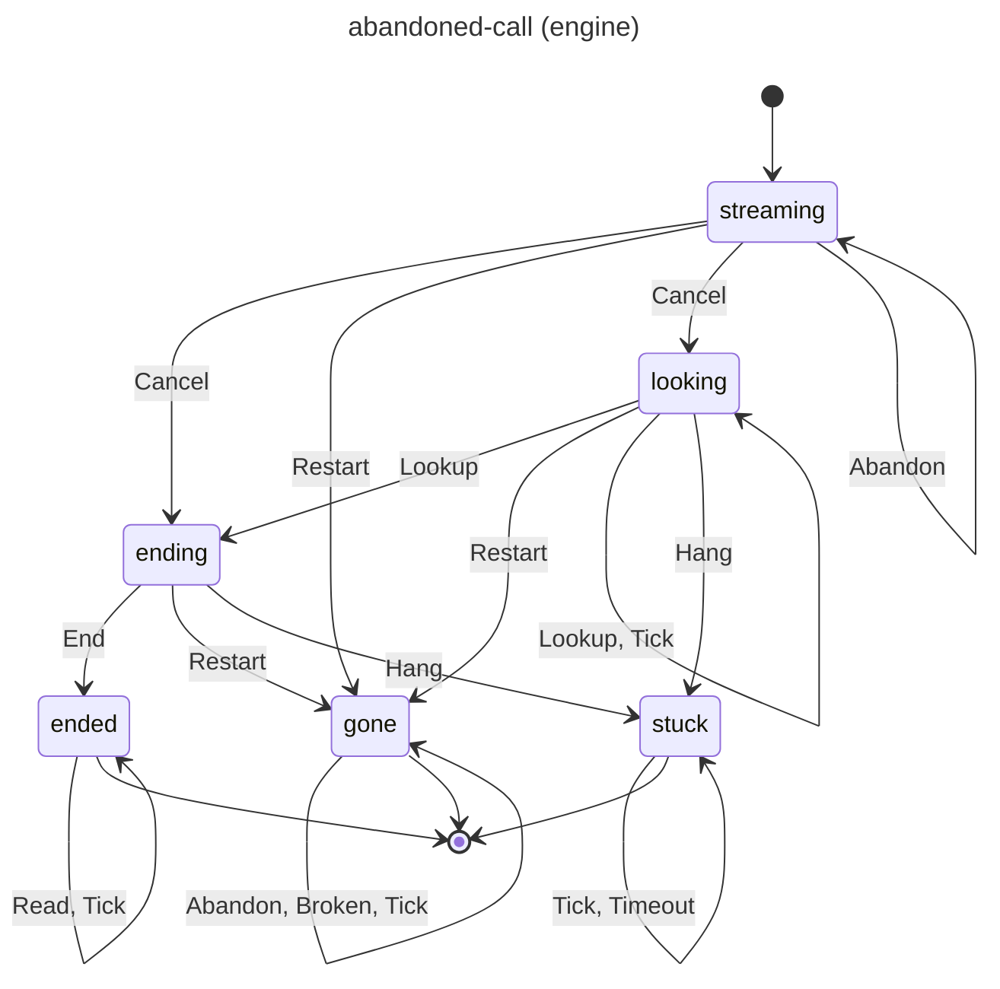

<!-- Generated by scripts/specs.py from abandoned-call.fizz (ADR-0272); do not edit. -->

# abandoned-call

```mermaid
---
title: abandoned-call (daemon)
---
stateDiagram-v2
    state "estimate" as s0
    state "forwarding" as s1
    state "usage" as s2
    state "waiting" as s3
    [*] --> s1
    s0 --> s0 : Tick
    s1 --> s1 : Restart
    s1 --> s3 : Abandon
    s2 --> s2 : Tick
    s3 --> s0 : Broken, Read, Timeout
    s3 --> s2 : Read
    s3 --> s3 : Cancel, End, Hang, Lookup, Restart, Tick
    s0 --> [*]
    s2 --> [*]
```

```mermaid
---
title: abandoned-call (engine)
---
stateDiagram-v2
    state "ended" as s0
    state "ending" as s1
    state "gone" as s2
    state "looking" as s3
    state "streaming" as s4
    state "stuck" as s5
    [*] --> s4
    s0 --> s0 : Read, Tick
    s1 --> s0 : End
    s1 --> s2 : Restart
    s1 --> s5 : Hang
    s2 --> s2 : Abandon, Broken, Tick
    s3 --> s1 : Lookup
    s3 --> s2 : Restart
    s3 --> s3 : Lookup, Tick
    s3 --> s5 : Hang
    s4 --> s1 : Cancel
    s4 --> s2 : Restart
    s4 --> s3 : Cancel
    s4 --> s4 : Abandon
    s5 --> s5 : Tick, Timeout
    s0 --> [*]
    s2 --> [*]
    s5 --> [*]
```
