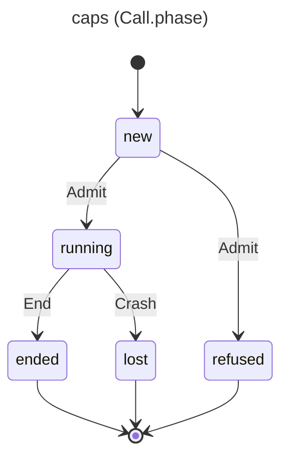

<!-- Generated by scripts/specs.py from caps.fizz (ADR-0272); do not edit. -->

# caps

```mermaid
---
title: caps (Call.phase)
---
stateDiagram-v2
    state "ended" as s0
    state "lost" as s1
    state "new" as s2
    state "refused" as s3
    state "running" as s4
    [*] --> s2
    s2 --> s3 : Admit
    s2 --> s4 : Admit
    s4 --> s0 : End
    s4 --> s1 : Crash
    s0 --> [*]
    s1 --> [*]
    s3 --> [*]
```
