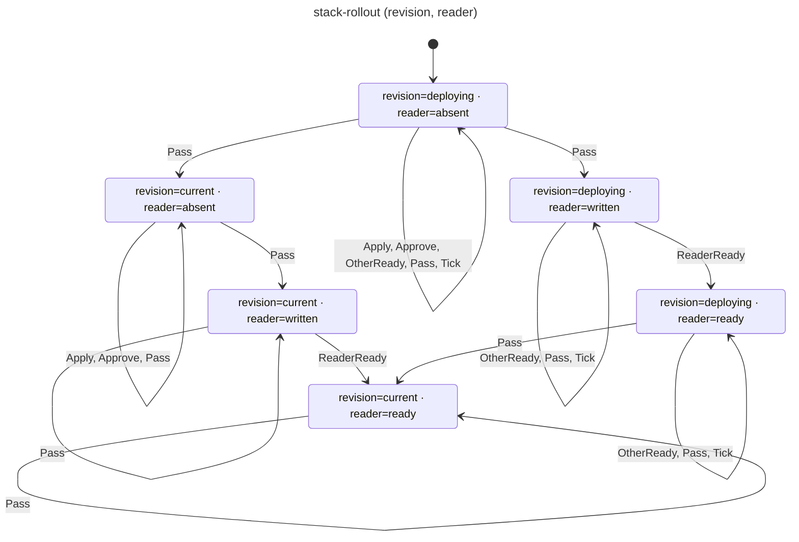

<!-- Generated by scripts/specs.py from stack-rollout.fizz (ADR-0272); do not edit. -->

# stack-rollout

```mermaid
---
title: stack-rollout (revision, reader)
---
stateDiagram-v2
    state "revision=current · reader=absent" as s0
    state "revision=current · reader=ready" as s1
    state "revision=current · reader=written" as s2
    state "revision=deploying · reader=absent" as s3
    state "revision=deploying · reader=ready" as s4
    state "revision=deploying · reader=written" as s5
    [*] --> s3
    s0 --> s0 : Apply, Approve, Pass
    s0 --> s2 : Pass
    s1 --> s1 : Pass
    s2 --> s1 : ReaderReady
    s2 --> s2 : Pass
    s3 --> s0 : Pass
    s3 --> s3 : Apply, Approve, OtherReady, Pass, Tick
    s3 --> s5 : Pass
    s4 --> s1 : Pass
    s4 --> s4 : OtherReady, Pass, Tick
    s5 --> s4 : ReaderReady
    s5 --> s5 : OtherReady, Pass, Tick
```
