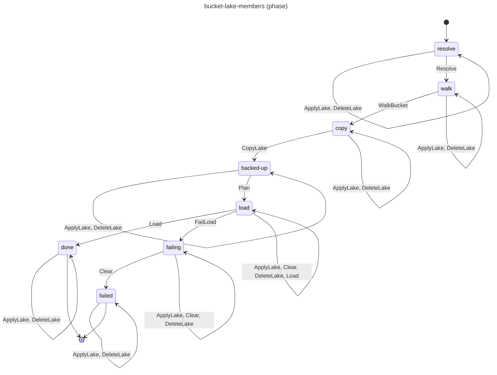

<!-- Generated by scripts/specs.py from bucket-lake-members.fizz (ADR-0272); do not edit. -->

# bucket-lake-members

```mermaid
---
title: bucket-lake-members (phase)
---
stateDiagram-v2
    state "backed-up" as s0
    state "copy" as s1
    state "done" as s2
    state "failed" as s3
    state "failing" as s4
    state "load" as s5
    state "resolve" as s6
    state "walk" as s7
    [*] --> s6
    s0 --> s0 : ApplyLake, DeleteLake
    s0 --> s5 : Plan
    s1 --> s0 : CopyLake
    s1 --> s1 : ApplyLake, DeleteLake
    s2 --> s2 : ApplyLake, DeleteLake
    s3 --> s3 : ApplyLake, DeleteLake
    s4 --> s3 : Clear
    s4 --> s4 : ApplyLake, Clear, DeleteLake
    s5 --> s2 : Load
    s5 --> s4 : FailLoad
    s5 --> s5 : ApplyLake, Clear, DeleteLake, Load
    s6 --> s6 : ApplyLake, DeleteLake
    s6 --> s7 : Resolve
    s7 --> s1 : WalkBucket
    s7 --> s7 : ApplyLake, DeleteLake
    s2 --> [*]
    s3 --> [*]
```
