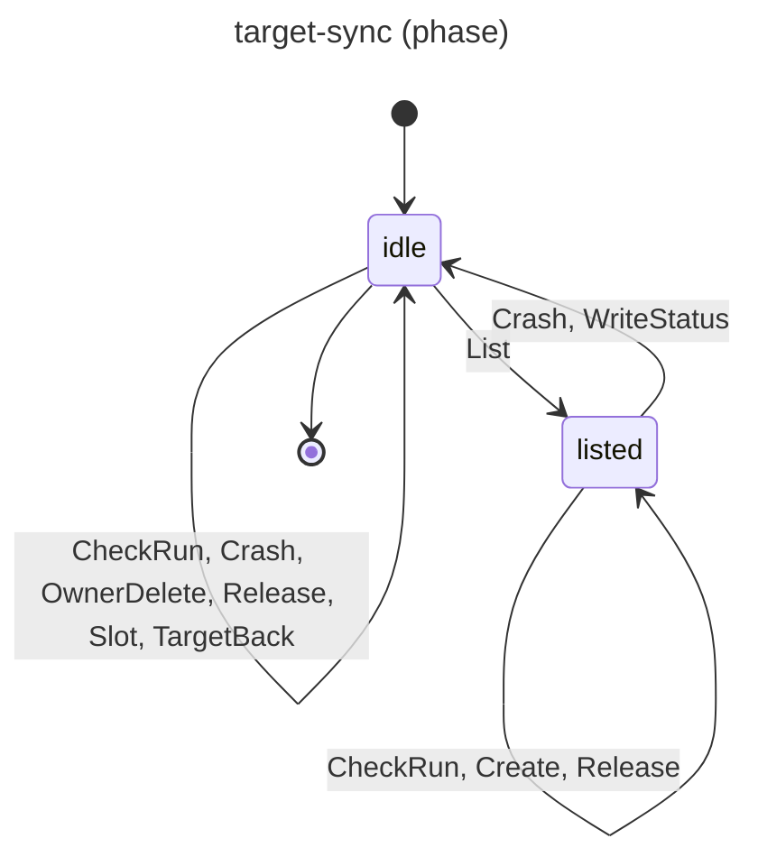

<!-- Generated by scripts/specs.py from target-sync.fizz (ADR-0272); do not edit. -->

# target-sync

```mermaid
---
title: target-sync (phase)
---
stateDiagram-v2
    state "idle" as s0
    state "listed" as s1
    [*] --> s0
    s0 --> s0 : CheckRun, Crash, OwnerDelete, Release, Slot, TargetBack
    s0 --> s1 : List
    s1 --> s0 : Crash, WriteStatus
    s1 --> s1 : CheckRun, Create, Release
    s0 --> [*]
```
