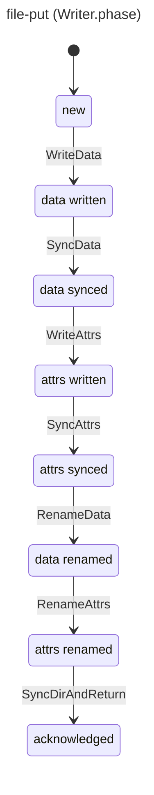

<!-- Generated by scripts/specs.py from file-put.fizz (ADR-0272); do not edit. -->

# file-put

```mermaid
---
title: file-put (Writer.phase)
---
stateDiagram-v2
    state "acknowledged" as s0
    state "attrs renamed" as s1
    state "attrs synced" as s2
    state "attrs written" as s3
    state "data renamed" as s4
    state "data synced" as s5
    state "data written" as s6
    state "new" as s7
    [*] --> s7
    s1 --> s0 : SyncDirAndReturn
    s2 --> s4 : RenameData
    s3 --> s2 : SyncAttrs
    s4 --> s1 : RenameAttrs
    s5 --> s3 : WriteAttrs
    s6 --> s5 : SyncData
    s7 --> s6 : WriteData
```
