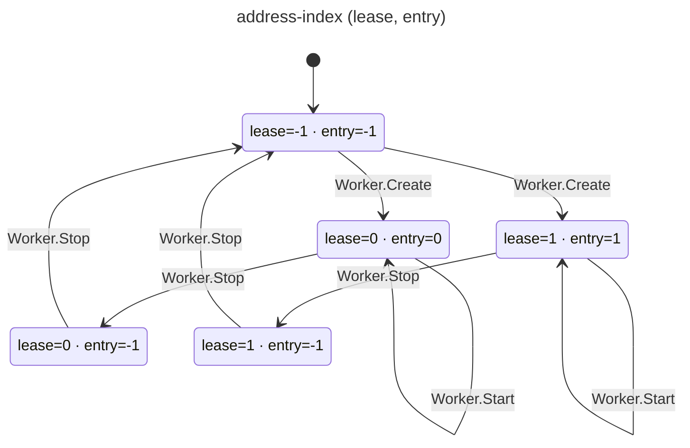

<!-- Generated by scripts/specs.py from address-index.fizz (ADR-0272); do not edit. -->

# address-index

```mermaid
---
title: address-index (lease, entry)
---
stateDiagram-v2
    state "lease=-1 · entry=-1" as s0
    state "lease=0 · entry=-1" as s1
    state "lease=0 · entry=0" as s2
    state "lease=1 · entry=-1" as s3
    state "lease=1 · entry=1" as s4
    [*] --> s0
    s0 --> s2 : Worker.Create
    s0 --> s4 : Worker.Create
    s1 --> s0 : Worker.Stop
    s2 --> s1 : Worker.Stop
    s2 --> s2 : Worker.Start
    s3 --> s0 : Worker.Stop
    s4 --> s3 : Worker.Stop
    s4 --> s4 : Worker.Start
```
