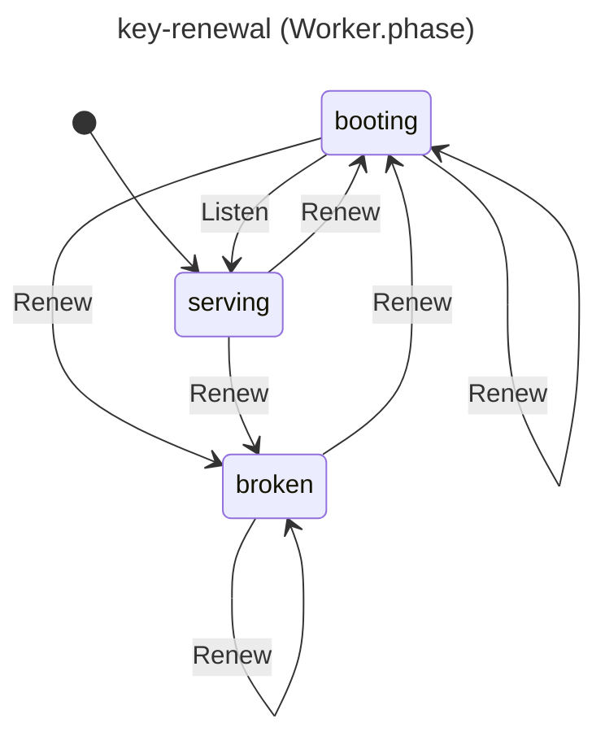

<!-- Generated by scripts/specs.py from key-renewal.fizz (ADR-0272); do not edit. -->

# key-renewal

```mermaid
---
title: key-renewal (Worker.phase)
---
stateDiagram-v2
    state "booting" as s0
    state "broken" as s1
    state "serving" as s2
    [*] --> s2
    s0 --> s0 : Renew
    s0 --> s1 : Renew
    s0 --> s2 : Listen
    s1 --> s0 : Renew
    s1 --> s1 : Renew
    s2 --> s0 : Renew
    s2 --> s1 : Renew
```
