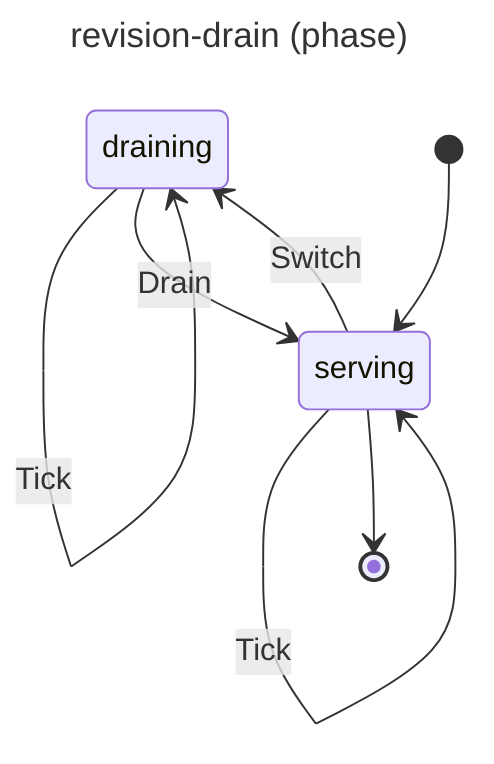

<!-- Generated by scripts/specs.py from revision-drain.fizz (ADR-0272); do not edit. -->

# revision-drain

```mermaid
---
title: revision-drain (phase)
---
stateDiagram-v2
    state "draining" as s0
    state "serving" as s1
    [*] --> s1
    s0 --> s0 : Tick
    s0 --> s1 : Drain
    s1 --> s0 : Switch
    s1 --> s1 : Tick
    s1 --> [*]
```
