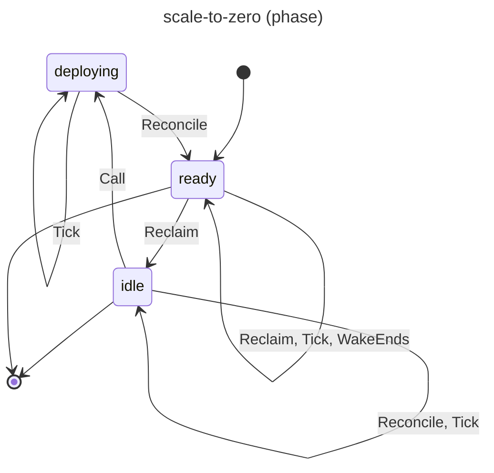

<!-- Generated by scripts/specs.py from scale-to-zero.fizz (ADR-0272); do not edit. -->

# scale-to-zero

```mermaid
---
title: scale-to-zero (phase)
---
stateDiagram-v2
    state "deploying" as s0
    state "idle" as s1
    state "ready" as s2
    [*] --> s2
    s0 --> s0 : Tick
    s0 --> s2 : Reconcile
    s1 --> s0 : Call
    s1 --> s1 : Reconcile, Tick
    s2 --> s1 : Reclaim
    s2 --> s2 : Reclaim, Tick, WakeEnds
    s1 --> [*]
    s2 --> [*]
```
