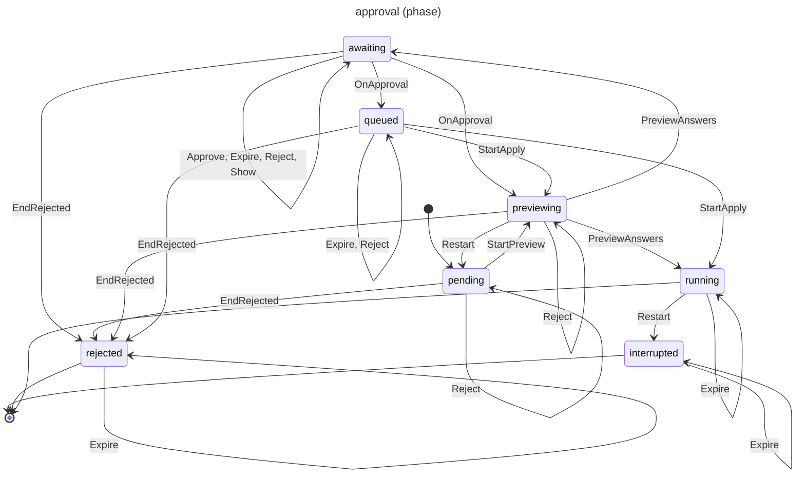

<!-- Generated by scripts/specs.py from approval.fizz (ADR-0272); do not edit. -->

# approval

```mermaid
---
title: approval (phase)
---
stateDiagram-v2
    state "awaiting" as s0
    state "interrupted" as s1
    state "pending" as s2
    state "previewing" as s3
    state "queued" as s4
    state "rejected" as s5
    state "running" as s6
    [*] --> s2
    s0 --> s0 : Approve, Expire, Reject, Show
    s0 --> s3 : OnApproval
    s0 --> s4 : OnApproval
    s0 --> s5 : EndRejected
    s1 --> s1 : Expire
    s2 --> s2 : Reject
    s2 --> s3 : StartPreview
    s2 --> s5 : EndRejected
    s3 --> s0 : PreviewAnswers
    s3 --> s2 : Restart
    s3 --> s3 : Reject
    s3 --> s5 : EndRejected
    s3 --> s6 : PreviewAnswers
    s4 --> s3 : StartApply
    s4 --> s4 : Expire, Reject
    s4 --> s5 : EndRejected
    s4 --> s6 : StartApply
    s5 --> s5 : Expire
    s6 --> s1 : Restart
    s6 --> s6 : Expire
    s1 --> [*]
    s5 --> [*]
    s6 --> [*]
```
