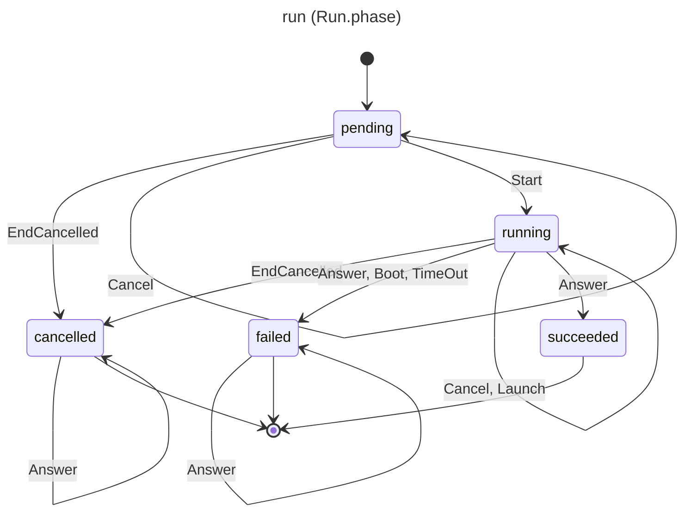

<!-- Generated by scripts/specs.py from run.fizz (ADR-0272); do not edit. -->

# run

```mermaid
---
title: run (Run.phase)
---
stateDiagram-v2
    state "cancelled" as s0
    state "failed" as s1
    state "pending" as s2
    state "running" as s3
    state "succeeded" as s4
    [*] --> s2
    s0 --> s0 : Answer
    s1 --> s1 : Answer
    s2 --> s0 : EndCancelled
    s2 --> s2 : Cancel
    s2 --> s3 : Start
    s3 --> s0 : EndCancelled
    s3 --> s1 : Answer, Boot, TimeOut
    s3 --> s3 : Cancel, Launch
    s3 --> s4 : Answer
    s0 --> [*]
    s1 --> [*]
    s4 --> [*]
```
