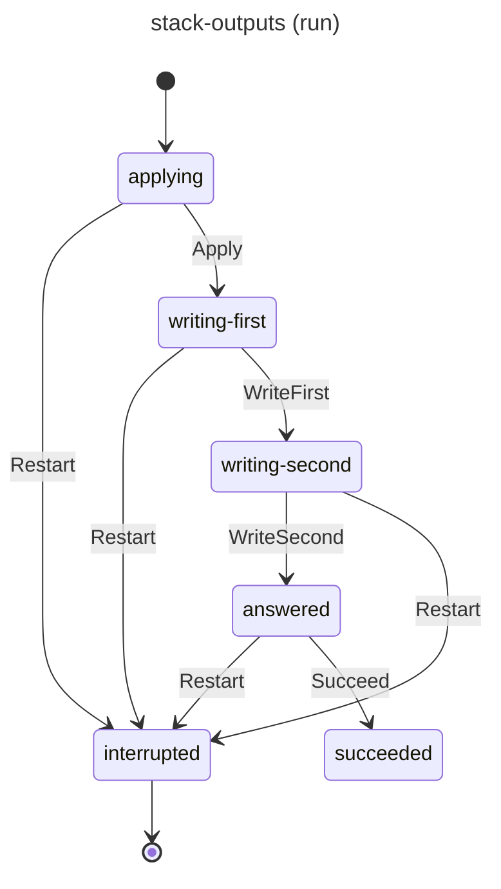

<!-- Generated by scripts/specs.py from stack-outputs.fizz (ADR-0272); do not edit. -->

# stack-outputs

```mermaid
---
title: stack-outputs (run)
---
stateDiagram-v2
    state "answered" as s0
    state "applying" as s1
    state "interrupted" as s2
    state "succeeded" as s3
    state "writing-first" as s4
    state "writing-second" as s5
    [*] --> s1
    s0 --> s2 : Restart
    s0 --> s3 : Succeed
    s1 --> s2 : Restart
    s1 --> s4 : Apply
    s4 --> s2 : Restart
    s4 --> s5 : WriteFirst
    s5 --> s0 : WriteSecond
    s5 --> s2 : Restart
    s2 --> [*]
```
