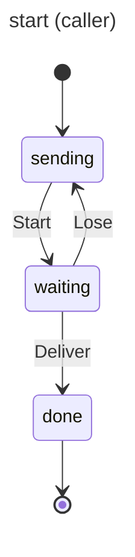

<!-- Generated by scripts/specs.py from start.fizz (ADR-0272); do not edit. -->

# start

```mermaid
---
title: start (caller)
---
stateDiagram-v2
    state "done" as s0
    state "sending" as s1
    state "waiting" as s2
    [*] --> s1
    s1 --> s2 : Start
    s2 --> s0 : Deliver
    s2 --> s1 : Lose
    s0 --> [*]
```
