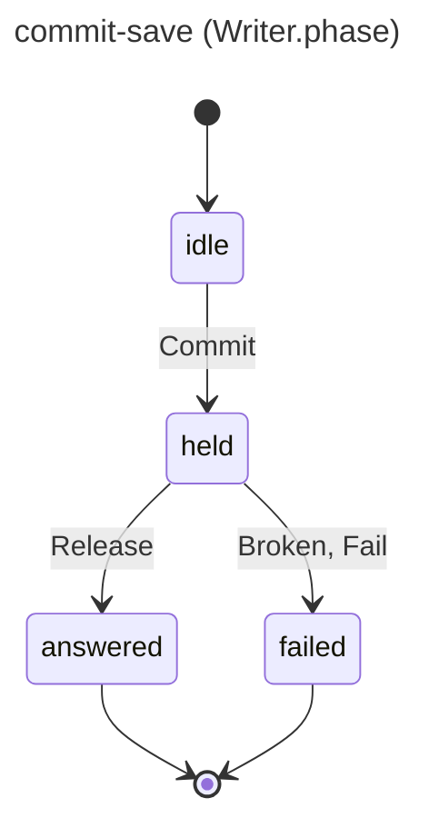

<!-- Generated by scripts/specs.py from commit-save.fizz (ADR-0272); do not edit. -->

# commit-save

```mermaid
---
title: commit-save (Writer.phase)
---
stateDiagram-v2
    state "answered" as s0
    state "failed" as s1
    state "held" as s2
    state "idle" as s3
    [*] --> s3
    s2 --> s0 : Release
    s2 --> s1 : Broken, Fail
    s3 --> s2 : Commit
    s0 --> [*]
    s1 --> [*]
```
