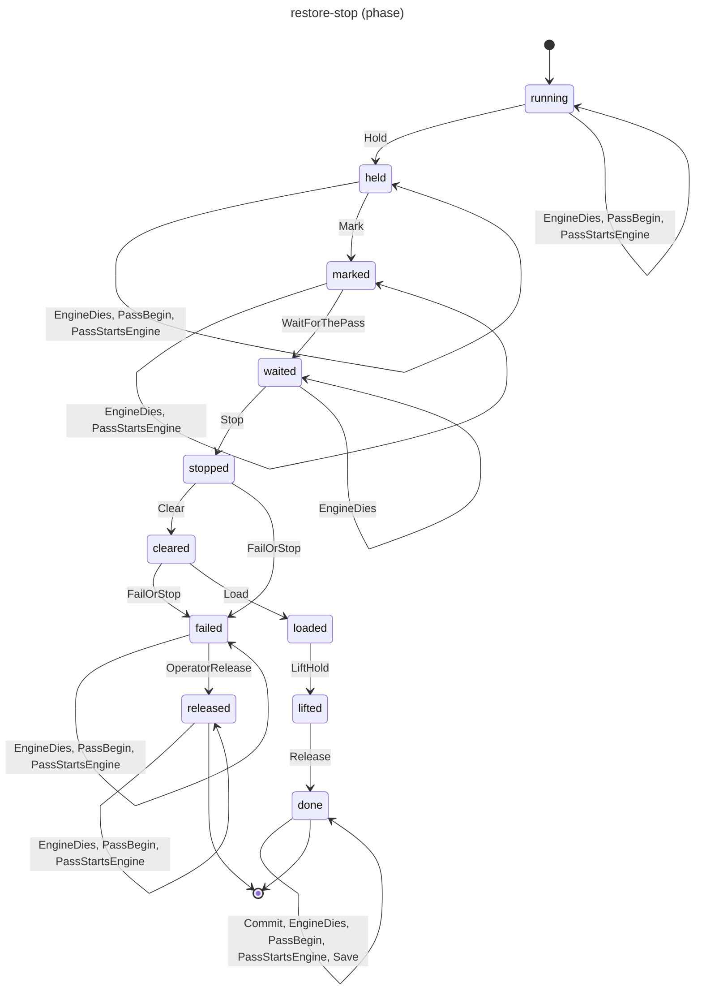

<!-- Generated by scripts/specs.py from restore-stop.fizz (ADR-0272); do not edit. -->

# restore-stop

```mermaid
---
title: restore-stop (phase)
---
stateDiagram-v2
    state "cleared" as s0
    state "done" as s1
    state "failed" as s2
    state "held" as s3
    state "lifted" as s4
    state "loaded" as s5
    state "marked" as s6
    state "released" as s7
    state "running" as s8
    state "stopped" as s9
    state "waited" as s10
    [*] --> s8
    s0 --> s2 : FailOrStop
    s0 --> s5 : Load
    s1 --> s1 : Commit, EngineDies, PassBegin, PassStartsEngine, Save
    s2 --> s2 : EngineDies, PassBegin, PassStartsEngine
    s2 --> s7 : OperatorRelease
    s3 --> s3 : EngineDies, PassBegin, PassStartsEngine
    s3 --> s6 : Mark
    s4 --> s1 : Release
    s5 --> s4 : LiftHold
    s6 --> s6 : EngineDies, PassStartsEngine
    s6 --> s10 : WaitForThePass
    s7 --> s7 : EngineDies, PassBegin, PassStartsEngine
    s8 --> s3 : Hold
    s8 --> s8 : EngineDies, PassBegin, PassStartsEngine
    s9 --> s0 : Clear
    s9 --> s2 : FailOrStop
    s10 --> s9 : Stop
    s10 --> s10 : EngineDies
    s1 --> [*]
    s7 --> [*]
```
