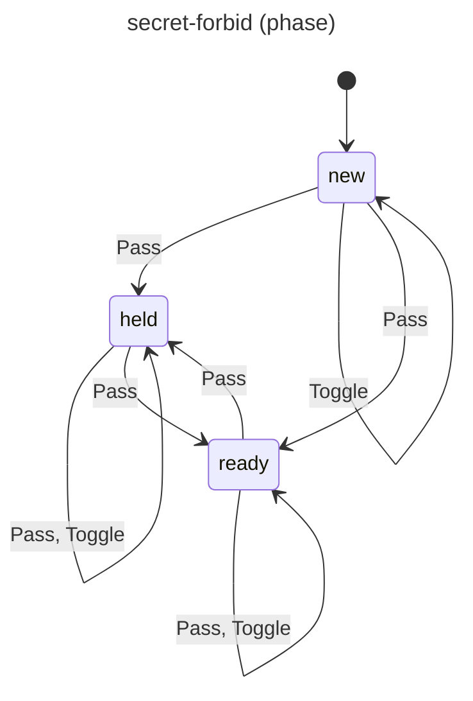

<!-- Generated by scripts/specs.py from secret-forbid.fizz (ADR-0272); do not edit. -->

# secret-forbid

```mermaid
---
title: secret-forbid (phase)
---
stateDiagram-v2
    state "held" as s0
    state "new" as s1
    state "ready" as s2
    [*] --> s1
    s0 --> s0 : Pass, Toggle
    s0 --> s2 : Pass
    s1 --> s0 : Pass
    s1 --> s1 : Toggle
    s1 --> s2 : Pass
    s2 --> s0 : Pass
    s2 --> s2 : Pass, Toggle
```
