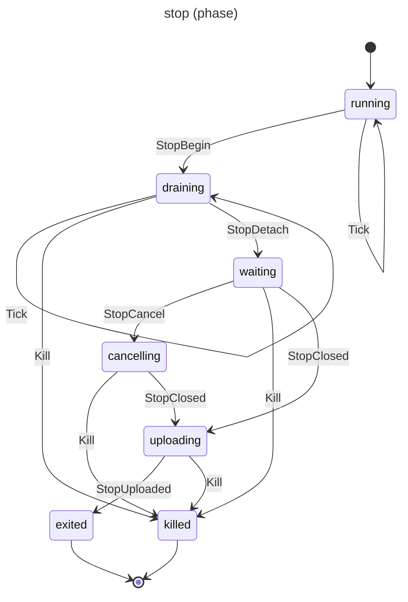

<!-- Generated by scripts/specs.py from stop.fizz (ADR-0272); do not edit. -->

# stop

```mermaid
---
title: stop (phase)
---
stateDiagram-v2
    state "cancelling" as s0
    state "draining" as s1
    state "exited" as s2
    state "killed" as s3
    state "running" as s4
    state "uploading" as s5
    state "waiting" as s6
    [*] --> s4
    s0 --> s3 : Kill
    s0 --> s5 : StopClosed
    s1 --> s1 : Tick
    s1 --> s3 : Kill
    s1 --> s6 : StopDetach
    s4 --> s1 : StopBegin
    s4 --> s4 : Tick
    s5 --> s2 : StopUploaded
    s5 --> s3 : Kill
    s6 --> s0 : StopCancel
    s6 --> s3 : Kill
    s6 --> s5 : StopClosed
    s2 --> [*]
    s3 --> [*]
```
