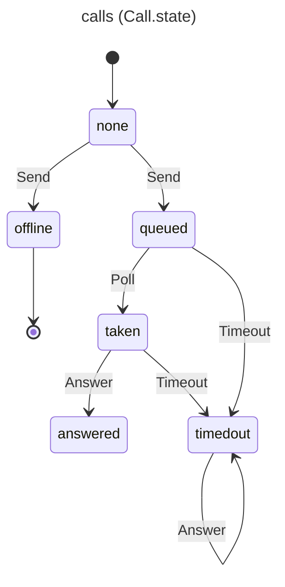

<!-- Generated by scripts/specs.py from calls.fizz (ADR-0272); do not edit. -->

# calls

```mermaid
---
title: calls (Call.state)
---
stateDiagram-v2
    state "answered" as s0
    state "none" as s1
    state "offline" as s2
    state "queued" as s3
    state "taken" as s4
    state "timedout" as s5
    [*] --> s1
    s1 --> s2 : Send
    s1 --> s3 : Send
    s3 --> s4 : Poll
    s3 --> s5 : Timeout
    s4 --> s0 : Answer
    s4 --> s5 : Timeout
    s5 --> s5 : Answer
    s2 --> [*]
```
