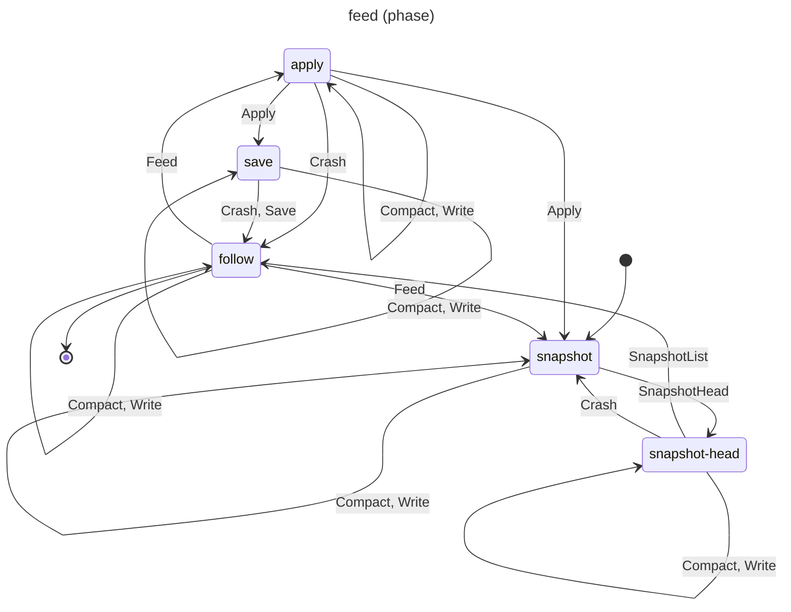

<!-- Generated by scripts/specs.py from feed.fizz (ADR-0272); do not edit. -->

# feed

```mermaid
---
title: feed (phase)
---
stateDiagram-v2
    state "apply" as s0
    state "follow" as s1
    state "save" as s2
    state "snapshot" as s3
    state "snapshot-head" as s4
    [*] --> s3
    s0 --> s0 : Compact, Write
    s0 --> s1 : Crash
    s0 --> s2 : Apply
    s0 --> s3 : Apply
    s1 --> s0 : Feed
    s1 --> s1 : Compact, Write
    s1 --> s3 : Feed
    s2 --> s1 : Crash, Save
    s2 --> s2 : Compact, Write
    s3 --> s3 : Compact, Write
    s3 --> s4 : SnapshotHead
    s4 --> s1 : SnapshotList
    s4 --> s3 : Crash
    s4 --> s4 : Compact, Write
    s1 --> [*]
```
