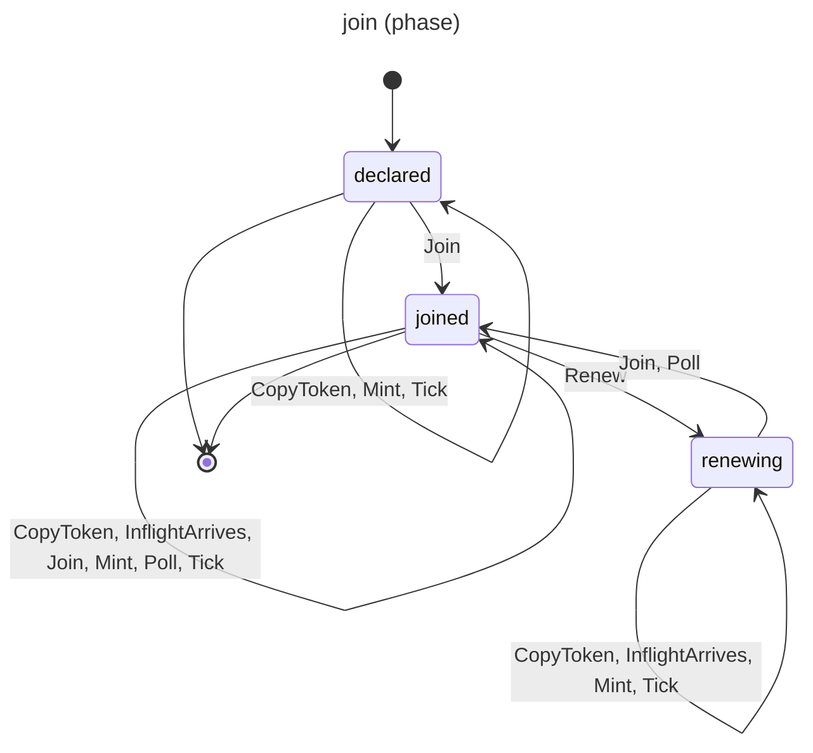

<!-- Generated by scripts/specs.py from join.fizz (ADR-0272); do not edit. -->

# join

```mermaid
---
title: join (phase)
---
stateDiagram-v2
    state "declared" as s0
    state "joined" as s1
    state "renewing" as s2
    [*] --> s0
    s0 --> s0 : CopyToken, Mint, Tick
    s0 --> s1 : Join
    s1 --> s1 : CopyToken, InflightArrives, Join, Mint, Poll, Tick
    s1 --> s2 : Renew
    s2 --> s1 : Join, Poll
    s2 --> s2 : CopyToken, InflightArrives, Mint, Tick
    s0 --> [*]
    s1 --> [*]
```
