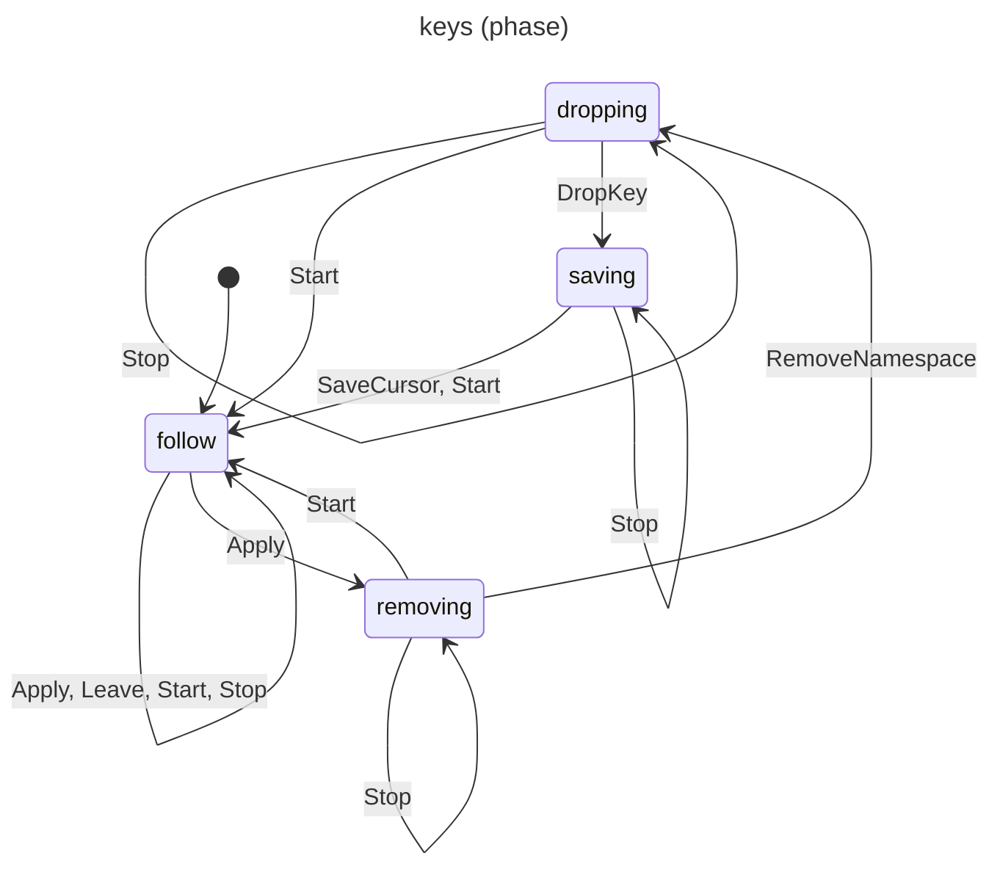

<!-- Generated by scripts/specs.py from keys.fizz (ADR-0272); do not edit. -->

# keys

```mermaid
---
title: keys (phase)
---
stateDiagram-v2
    state "dropping" as s0
    state "follow" as s1
    state "removing" as s2
    state "saving" as s3
    [*] --> s1
    s0 --> s0 : Stop
    s0 --> s1 : Start
    s0 --> s3 : DropKey
    s1 --> s1 : Apply, Leave, Start, Stop
    s1 --> s2 : Apply
    s2 --> s0 : RemoveNamespace
    s2 --> s1 : Start
    s2 --> s2 : Stop
    s3 --> s1 : SaveCursor, Start
    s3 --> s3 : Stop
```
