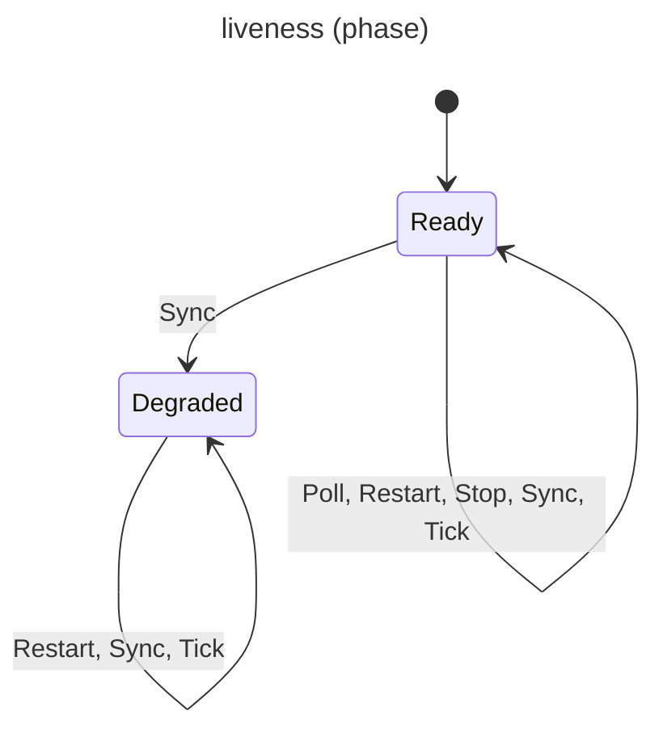

<!-- Generated by scripts/specs.py from liveness.fizz (ADR-0272); do not edit. -->

# liveness

```mermaid
---
title: liveness (phase)
---
stateDiagram-v2
    state "Degraded" as s0
    state "Ready" as s1
    [*] --> s1
    s0 --> s0 : Restart, Sync, Tick
    s1 --> s0 : Sync
    s1 --> s1 : Poll, Restart, Stop, Sync, Tick
```
