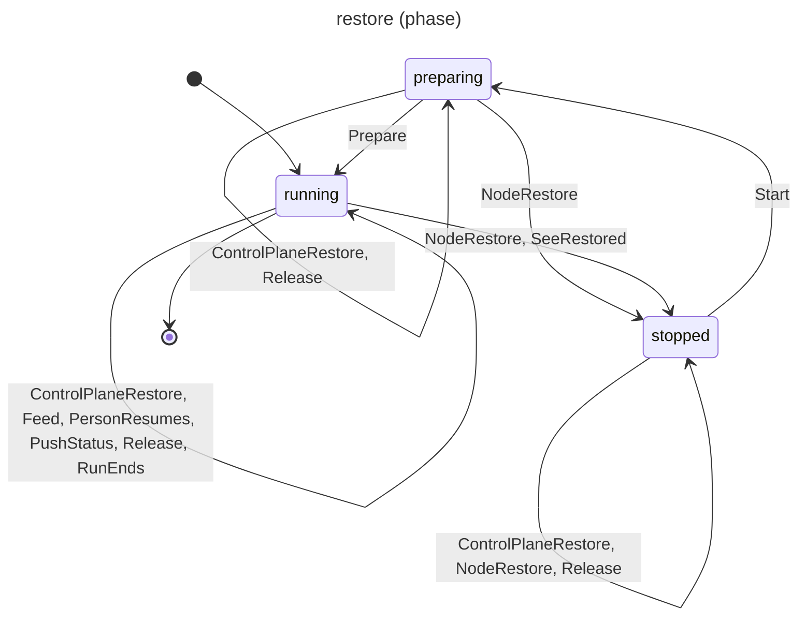

<!-- Generated by scripts/specs.py from restore.fizz (ADR-0272); do not edit. -->

# restore

```mermaid
---
title: restore (phase)
---
stateDiagram-v2
    state "preparing" as s0
    state "running" as s1
    state "stopped" as s2
    [*] --> s1
    s0 --> s0 : ControlPlaneRestore, Release
    s0 --> s1 : Prepare
    s0 --> s2 : NodeRestore
    s1 --> s1 : ControlPlaneRestore, Feed, PersonResumes, PushStatus, Release, RunEnds
    s1 --> s2 : NodeRestore, SeeRestored
    s2 --> s0 : Start
    s2 --> s2 : ControlPlaneRestore, NodeRestore, Release
    s1 --> [*]
```
