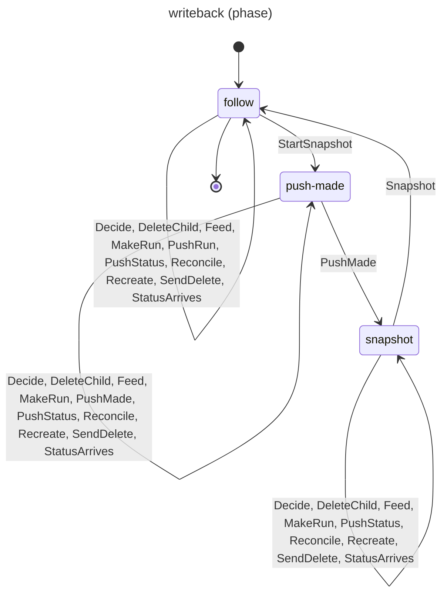

<!-- Generated by scripts/specs.py from writeback.fizz (ADR-0272); do not edit. -->

# writeback

```mermaid
---
title: writeback (phase)
---
stateDiagram-v2
    state "follow" as s0
    state "push-made" as s1
    state "snapshot" as s2
    [*] --> s0
    s0 --> s0 : Decide, DeleteChild, Feed, MakeRun, PushRun, PushStatus, Reconcile, Recreate, SendDelete, StatusArrives
    s0 --> s1 : StartSnapshot
    s1 --> s1 : Decide, DeleteChild, Feed, MakeRun, PushMade, PushStatus, Reconcile, Recreate, SendDelete, StatusArrives
    s1 --> s2 : PushMade
    s2 --> s0 : Snapshot
    s2 --> s2 : Decide, DeleteChild, Feed, MakeRun, PushStatus, Reconcile, Recreate, SendDelete, StatusArrives
    s0 --> [*]
```
