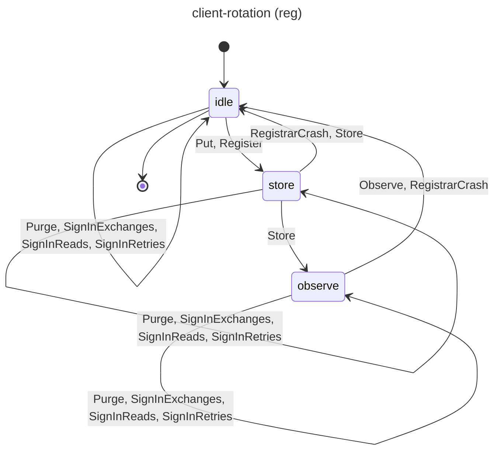

<!-- Generated by scripts/specs.py from client-rotation.fizz (ADR-0272); do not edit. -->

# client-rotation

```mermaid
---
title: client-rotation (reg)
---
stateDiagram-v2
    state "idle" as s0
    state "observe" as s1
    state "store" as s2
    [*] --> s0
    s0 --> s0 : Purge, SignInExchanges, SignInReads, SignInRetries
    s0 --> s2 : Put, Register
    s1 --> s0 : Observe, RegistrarCrash
    s1 --> s1 : Purge, SignInExchanges, SignInReads, SignInRetries
    s2 --> s0 : RegistrarCrash, Store
    s2 --> s1 : Store
    s2 --> s2 : Purge, SignInExchanges, SignInReads, SignInRetries
    s0 --> [*]
```
