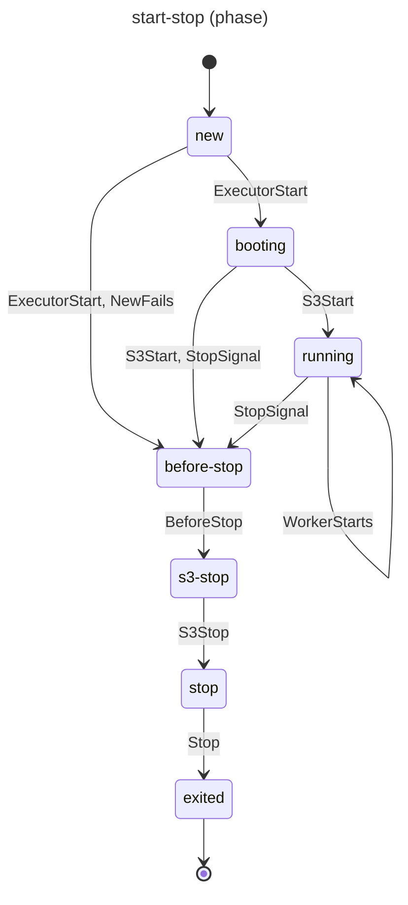

<!-- Generated by scripts/specs.py from start-stop.fizz (ADR-0272); do not edit. -->

# start-stop

```mermaid
---
title: start-stop (phase)
---
stateDiagram-v2
    state "before-stop" as s0
    state "booting" as s1
    state "exited" as s2
    state "new" as s3
    state "running" as s4
    state "s3-stop" as s5
    state "stop" as s6
    [*] --> s3
    s0 --> s5 : BeforeStop
    s1 --> s0 : S3Start, StopSignal
    s1 --> s4 : S3Start
    s3 --> s0 : ExecutorStart, NewFails
    s3 --> s1 : ExecutorStart
    s4 --> s0 : StopSignal
    s4 --> s4 : WorkerStarts
    s5 --> s6 : S3Stop
    s6 --> s2 : Stop
    s2 --> [*]
```
