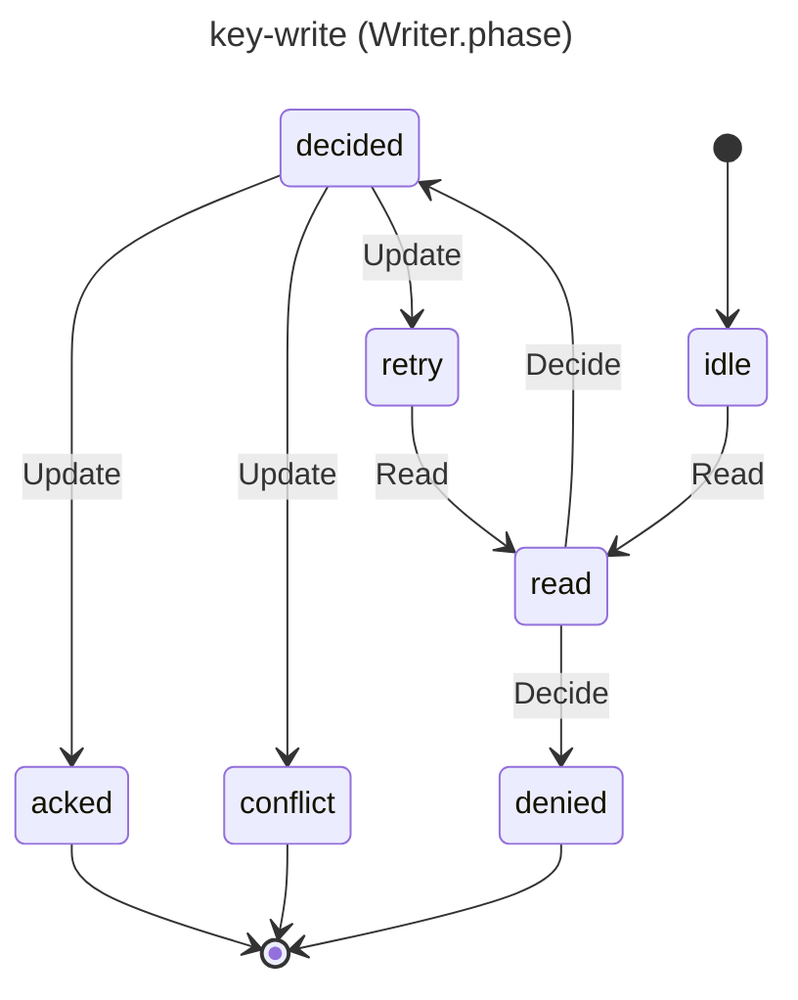

<!-- Generated by scripts/specs.py from key-write.fizz (ADR-0272); do not edit. -->

# key-write

```mermaid
---
title: key-write (Writer.phase)
---
stateDiagram-v2
    state "acked" as s0
    state "conflict" as s1
    state "decided" as s2
    state "denied" as s3
    state "idle" as s4
    state "read" as s5
    state "retry" as s6
    [*] --> s4
    s2 --> s0 : Update
    s2 --> s1 : Update
    s2 --> s6 : Update
    s4 --> s5 : Read
    s5 --> s2 : Decide
    s5 --> s3 : Decide
    s6 --> s5 : Read
    s0 --> [*]
    s1 --> [*]
    s3 --> [*]
```
