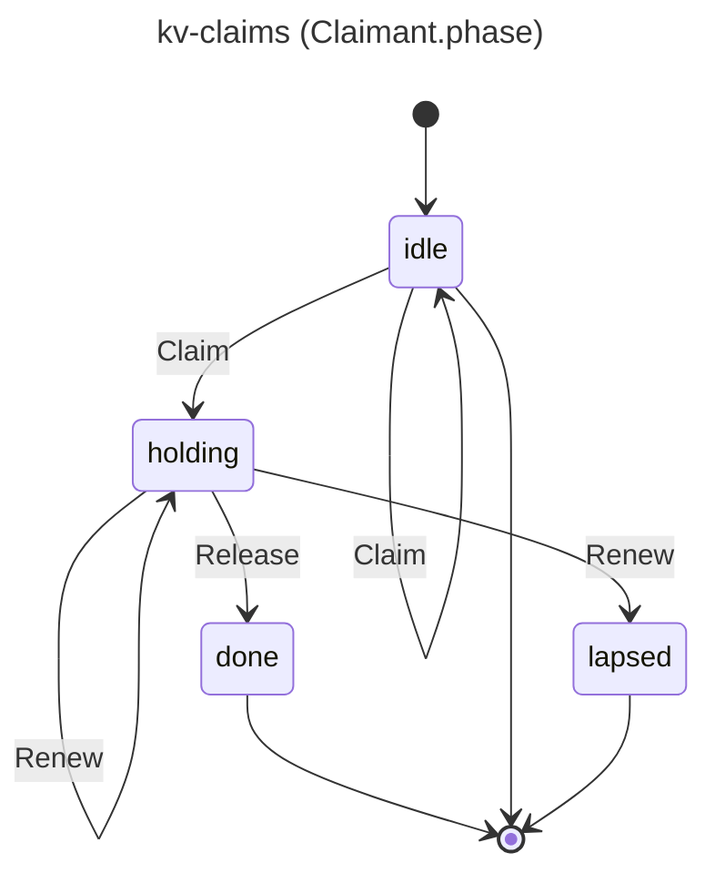

<!-- Generated by scripts/specs.py from kv-claims.fizz (ADR-0272); do not edit. -->

# kv-claims

```mermaid
---
title: kv-claims (Claimant.phase)
---
stateDiagram-v2
    state "done" as s0
    state "holding" as s1
    state "idle" as s2
    state "lapsed" as s3
    [*] --> s2
    s1 --> s0 : Release
    s1 --> s1 : Renew
    s1 --> s3 : Renew
    s2 --> s1 : Claim
    s2 --> s2 : Claim
    s0 --> [*]
    s2 --> [*]
    s3 --> [*]
```
