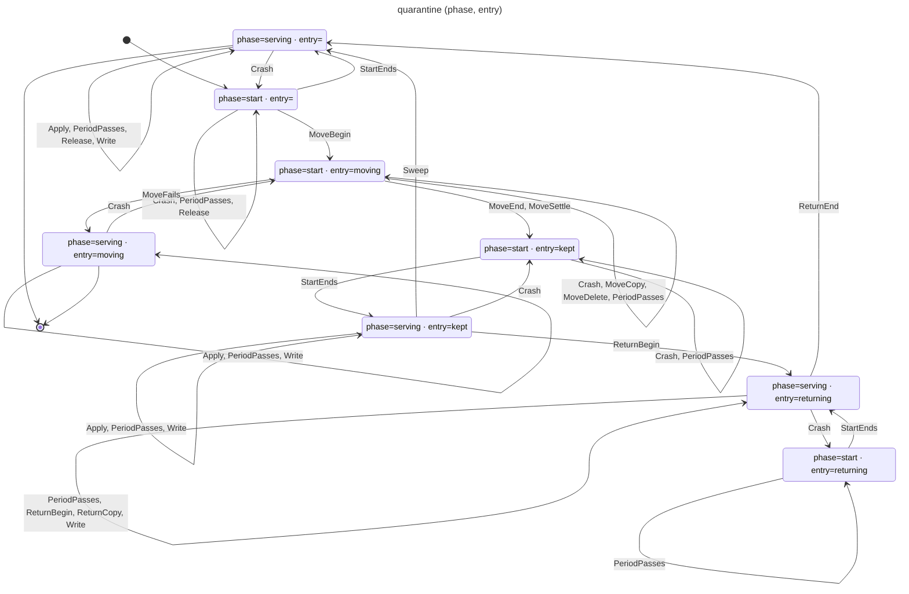

<!-- Generated by scripts/specs.py from quarantine.fizz (ADR-0272); do not edit. -->

# quarantine

```mermaid
---
title: quarantine (phase, entry)
---
stateDiagram-v2
    state "phase=serving · entry=" as s0
    state "phase=serving · entry=kept" as s1
    state "phase=serving · entry=moving" as s2
    state "phase=serving · entry=returning" as s3
    state "phase=start · entry=" as s4
    state "phase=start · entry=kept" as s5
    state "phase=start · entry=moving" as s6
    state "phase=start · entry=returning" as s7
    [*] --> s4
    s0 --> s0 : Apply, PeriodPasses, Release, Write
    s0 --> s4 : Crash
    s1 --> s0 : Sweep
    s1 --> s1 : Apply, PeriodPasses, Write
    s1 --> s3 : ReturnBegin
    s1 --> s5 : Crash
    s2 --> s2 : Apply, PeriodPasses, Write
    s2 --> s6 : Crash
    s3 --> s0 : ReturnEnd
    s3 --> s3 : PeriodPasses, ReturnBegin, ReturnCopy, Write
    s3 --> s7 : Crash
    s4 --> s0 : StartEnds
    s4 --> s4 : Crash, PeriodPasses, Release
    s4 --> s6 : MoveBegin
    s5 --> s1 : StartEnds
    s5 --> s5 : Crash, PeriodPasses
    s6 --> s2 : MoveFails
    s6 --> s5 : MoveEnd, MoveSettle
    s6 --> s6 : Crash, MoveCopy, MoveDelete, PeriodPasses
    s7 --> s3 : StartEnds
    s7 --> s7 : PeriodPasses
    s0 --> [*]
    s2 --> [*]
```
