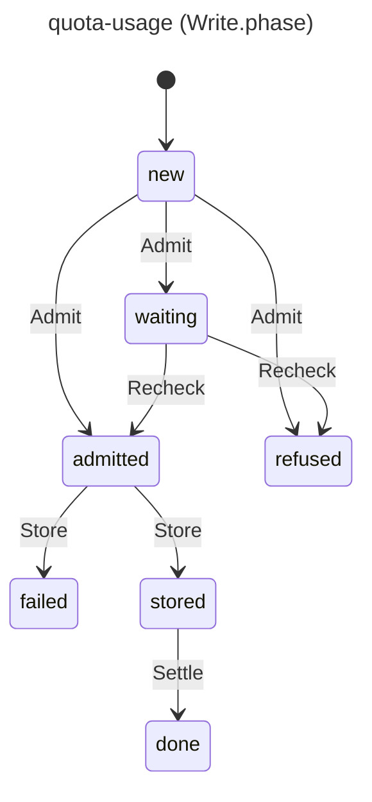

<!-- Generated by scripts/specs.py from quota-usage.fizz (ADR-0272); do not edit. -->

# quota-usage

```mermaid
---
title: quota-usage (Write.phase)
---
stateDiagram-v2
    state "admitted" as s0
    state "done" as s1
    state "failed" as s2
    state "new" as s3
    state "refused" as s4
    state "stored" as s5
    state "waiting" as s6
    [*] --> s3
    s0 --> s2 : Store
    s0 --> s5 : Store
    s3 --> s0 : Admit
    s3 --> s4 : Admit
    s3 --> s6 : Admit
    s5 --> s1 : Settle
    s6 --> s0 : Recheck
    s6 --> s4 : Recheck
```
