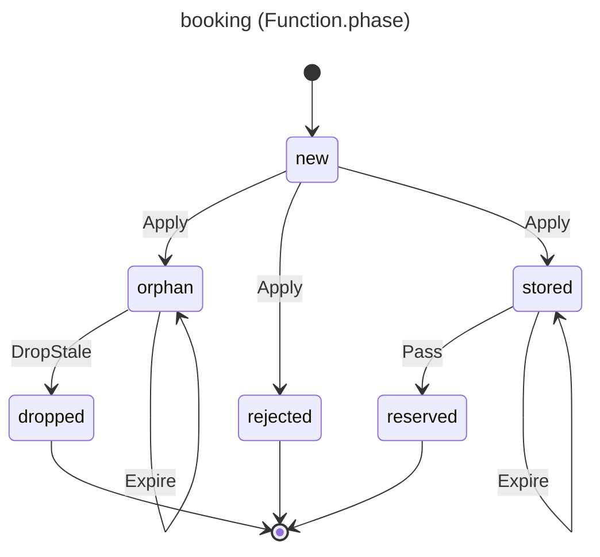

<!-- Generated by scripts/specs.py from booking.fizz (ADR-0272); do not edit. -->

# booking

```mermaid
---
title: booking (Function.phase)
---
stateDiagram-v2
    state "dropped" as s0
    state "new" as s1
    state "orphan" as s2
    state "rejected" as s3
    state "reserved" as s4
    state "stored" as s5
    [*] --> s1
    s1 --> s2 : Apply
    s1 --> s3 : Apply
    s1 --> s5 : Apply
    s2 --> s0 : DropStale
    s2 --> s2 : Expire
    s5 --> s4 : Pass
    s5 --> s5 : Expire
    s0 --> [*]
    s3 --> [*]
    s4 --> [*]
```
