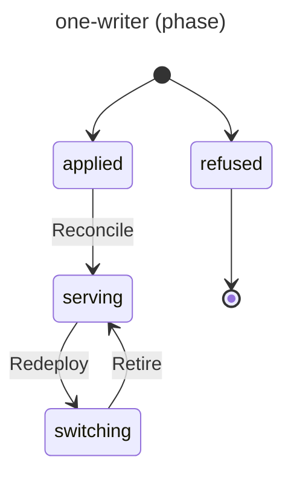

<!-- Generated by scripts/specs.py from one-writer.fizz (ADR-0272); do not edit. -->

# one-writer

```mermaid
---
title: one-writer (phase)
---
stateDiagram-v2
    state "applied" as s0
    state "refused" as s1
    state "serving" as s2
    state "switching" as s3
    [*] --> s0
    [*] --> s1
    s0 --> s2 : Reconcile
    s2 --> s3 : Redeploy
    s3 --> s2 : Retire
    s1 --> [*]
```
