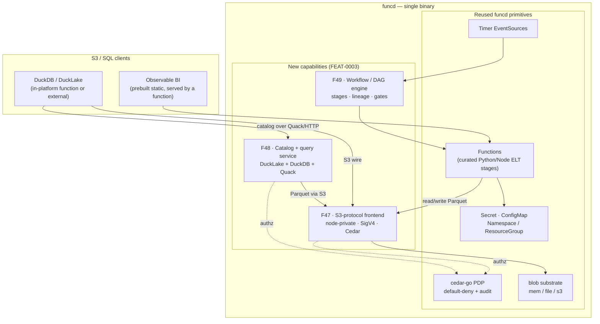

# FEAT-0003: funcd as a data-platform substrate

- **Status**: Active (living document — the tracking table updates as ADRs progress)
- **Date**: 2026-06-24
- **Deciders**: green-0-rabbit
- **Defines**: a new **additive capability epoch** — running a single-host **lakehouse + ELT + BI**
  stack *on* funcd (an object-store S3 surface, a table catalog/engine, and DAG orchestration).
  Positioned **alongside** the FEAT-0002 V2 hardening outlook; **not** part of v1.1 (FEAT-0001).

## Initial need

A real single-host "dataplatform" (the homebox box) runs a lakehouse stack as loosely-coupled,
separately-deployed systems: **Garage** (S3 object store), **DuckLake** (versioned table format) over
a **SQL catalog**, **DuckDB** (query engine), **DVC** (DAG orchestration + lineage), a **FastAPI**
service, and an **Observable** static BI site — each its own binary/process/systemd unit.

funcd already hosts most of what this stack needs: functions (curated Python/Node) for the ELT stages,
API, and BI serving; timer EventSources for scheduled runs; Secret/ConfigMap; Namespace/ResourceGroup
for per-project isolation; the **blob** and **KV** substrates for bytes and records; and the cedar-go
PDP for governance. Three capabilities are missing for the stack to deploy *into* funcd instead of
beside it — and this feat scopes exactly those, so the data plane is **one substrate governed by the
platform's auth**, not a second world bolted on.

## How this document works

This file captures **what** this capability set must contain — high level only. The **how** lives in
ADRs (`docs/adr/`, process in [ADR-0000](../adr/0000-adr-process.md)): every feature maps to one or
more ADRs; no implementation detail belongs here. Feature status:
`idea → adr → accepted → reviewing → implemented`.

## Features

| # | Feature | Builds on | ADR(s) | Status |
|---|---------|-----------|--------|--------|
| F47 | **S3-protocol frontend on the blob substrate** — expose the existing `blob.Bucket` port over the AWS **S3 REST API** so third-party S3 clients (chiefly **DuckDB/DuckLake httpfs**) read **and** write Parquet against the *same bytes* functions use via the blob facade. **One substrate, two surfaces** (function SDK over UDS · S3 wire over node-private TCP); **opt-in/default-off**; **connection-scoped identity + a `spec.blob` binding-as-grant** (Cedar `s3::read`/`s3::write`) for in-platform fns — *no issued credential* — and a **SigV4 keypair for external clients only**. Removes the separate Garage system (the blob port keeps external-S3 a swap). | [ADR-0007](../adr/0007-blob-storage-layer-port.md) (blob port) · [ADR-0074](../adr/0074-cedar-authorization-resource-access.md)/[0075](../adr/0075-cedar-invoke-authorization.md)/[0076](../adr/0076-cedar-kv-read-binding-grant.md) (Cedar precedent) · [ADR-0018](../adr/0018-api-server-authn-rbac-admission.md) (scoped credentials) | [ADR-0080](../adr/0080-s3-protocol-frontend-blob-substrate.md) · [ADR-0085](../adr/0085-s3-in-platform-identity-funcd-keypair.md) (in-platform identity, refines ADR-0080 §AuthN) | implemented |
| F48 | **Catalog / query service (DuckLake + DuckDB + Quack)** — a deployable, PDP-governed SQL **catalog + query** service exposed over HTTP via **Quack** (the DuckDB 1.5.4 client/server protocol) and reached through the **ingress** gateway — **an add-on provider** (a deployed service function serving HTTP over its bindings, *not* a built-in/in-daemon provider; see the blueprint's *provider* model) — KV-style in resource/lifecycle shape. DuckDB hosted **out of the pure-Go daemon** (cgo) as a curated function or funcd-supervised child. | F47 (the S3 data surface) · [ADR-0019](../adr/0019-service-facade-pattern-kv.md) (facade pattern) | [ADR-0086](../adr/0086-catalog-query-provider-ducklake-duckdb-quack.md) | implemented |
| F49 | **Workflow / DAG orchestration engine** — a declarative pipeline **DAG** (stages, data-dependency ordering, lineage, retries, blocking governance gates) replacing **DVC**; pipeline stages are functions, sequenced over the bus. | [ADR-0023](../adr/0023-eventing-core.md) (eventing) · [ADR-0064](../adr/0064-fn-to-fn-rpc-links.md) (links) | — | idea |
| F57 | **Add-on provider runtime** — the missing **mechanism to deploy/manage an add-on provider**: run a curated engine image as a governed, gateway-exposed, **HTTP-health-probed**, pinned service. The blueprint names add-on providers but had *no way to run one* — F48's live e2e proved a curated engine is **not a Function** (no artifact/handler, own protocol/health/auth). An **internal provider-runtime reused by per-provider CRDs** (F48 `CatalogService` first; vector DB / inference / PG later); reuses container execution + the ingress + the per-fn keypair, bypasses the Function shape gate. **Unblocks F48's live path.** | F48 ([ADR-0086](../adr/0086-catalog-query-provider-ducklake-duckdb-quack.md)) · [ADR-0032](../adr/0032-curated-runtime-images-container-execution.md)/[ADR-0054](../adr/0054-self-contained-runtime-embedded-images-managed-containerd.md) (container exec) · [ADR-0013](../adr/0013-gateway-ingress-httputil-primary.md) (ingress) · [ADR-0085](../adr/0085-s3-in-platform-identity-funcd-keypair.md) (keypair) | [ADR-0087](../adr/0087-add-on-provider-runtime.md) | implemented |
| F58 | **Add-on provider identity in the F47/Cedar model** — make an add-on provider engine (deployed by F57 with no backing Function) a **first-class S3 principal + prefix owner**: the Cedar EntityProvider sources its `blobBindings` from the `CatalogService.spec.blob` (Function-first) and the prefix-owner admission accepts a CatalogService owner. The S3 **policy is unchanged** (principal-agnostic) — only the entity resolution + admission extend. **Unblocks F48's live data path** (the engine reads its bound Parquet + writes/checkpoints its owned catalog prefix). | F57 ([ADR-0087](../adr/0087-add-on-provider-runtime.md)) · [ADR-0080](../adr/0080-s3-protocol-frontend-blob-substrate.md) (F47 identity, extended) · [ADR-0074](../adr/0074-cedar-authorization-resource-access.md) (Cedar) · [ADR-0085](../adr/0085-s3-in-platform-identity-funcd-keypair.md) (keypair) | [ADR-0088](../adr/0088-add-on-provider-s3-identity.md) | implemented |
| F59 | **Function dependency bundling (the deployment-package model)** — let a function **artifact** be a *bundle* (a directory: handler + **vendored non-stdlib deps** + the I/O contract) instead of only a single file, so a native dependency (a `duckdb` wheel + its `quack`/`httpfs` extensions) rides in the artifact and the function runs **unchanged on the stock curated `python314` runtime** — the AWS Lambda deployment-package model, the Python peer of the JS esbuild bundle. `funcdctl push <dir>` → a tar+gzip OCI layer; the materializer sets `PYTHONPATH`/`FUNCD_BUNDLE_DIR` (one generic mechanism, no per-library platform env); the bundle **carries its I/O schema and push gates it**; the build vendors **hermetically inside the curated image** (glibc-matched). **No new `python-duckdb` runtime.** **Unblocks F48's function consumer.** | F48 ([ADR-0086](../adr/0086-catalog-query-provider-ducklake-duckdb-quack.md)) · [ADR-0031](../adr/0031-oci-artifact-distribution-oras.md) (artifact) · [ADR-0032](../adr/0032-curated-runtime-images-container-execution.md) (container exec) · [ADR-0049](../adr/0049-python-runtime-shim.md) (python shim) · [ADR-0058](../adr/0058-contract-codegen-from-code-types.md)/[ADR-0059](../adr/0059-contract-as-oci-metadata.md) (I/O contract) | [ADR-0089](../adr/0089-python-function-dependency-bundling.md) | implemented |
| F61 | **Function catalog consumer binding (`spec.catalogs`)** — let a **Function** consume a `CatalogService` the funcd-native way: declare `spec.catalogs: [{alias, catalog}]` and funcd injects `FUNCD_CATALOG_<ALIAS>_URL` (the catalog's `status.endpoint`) + `_TOKEN` (its `QUACK_TOKEN`, resolved from the catalog's Secret) into the function's env, **requeuing** until the catalog is Ready. **Binding-as-grant**: the token reaches only *declared* consumers (never in `status`), mirroring `spec.blob`→`s3::read`. Admission validates the catalog exists. The V1 function→catalog call needs no egress grant (default-open lateral; the Cedar `egress::connect` grant is the V2 egress ADR's work). **Closes ADR-0089's consumer follow-up — the F48 SQL round-trip becomes a governed Function.** | F48/F59 ([ADR-0086](../adr/0086-catalog-query-provider-ducklake-duckdb-quack.md)/[ADR-0089](../adr/0089-python-function-dependency-bundling.md)) · [ADR-0088](../adr/0088-add-on-provider-s3-identity.md) (provider identity) · [ADR-0057](../adr/0057-secret-injection-last-mile.md) (secret→env) · [ADR-0074](../adr/0074-cedar-authorization-resource-access.md)/[ADR-0080](../adr/0080-s3-protocol-frontend-blob-substrate.md) (binding-as-grant) |[ADR-0091](../adr/0091-function-catalog-consumer-binding.md) | implemented |
| F62 | **Shared provider env resolution (DRY)** — one helper turns a provider's `spec.secrets` + `spec.config` into guarded engine env, so the next add-on-provider CRD reuses it instead of copying the CatalogService controller's resolve loop. Centralizes the duplicated reserved-`FUNCD_`-key guard (`isReservedFuncdKey` was defined **identically twice**) into a single `secrets.IsReservedKey`/`MergeEnvGuarded`, and adds `provider.ResolveEnv` (ConfigMaps via the store + Secrets via the ADR-0057 resolver, config-then-secrets). **Behavior-preserving** — the CatalogService engine env is unchanged; `Converge` stays env-agnostic. Refactor/infra. | [ADR-0087](../adr/0087-add-on-provider-runtime.md) (the provider framework) · [ADR-0057](../adr/0057-secret-injection-last-mile.md) (secret resolver) · [ADR-0086](../adr/0086-catalog-query-provider-ducklake-duckdb-quack.md) (the controller refactored) |[ADR-0092](../adr/0092-provider-env-resolution-helper.md) | implemented |

## How it lands on funcd (high level)

The lakehouse's medallion flow runs *as* funcd resources: scheduled triggers drive the DAG engine (F49),
whose stages are ordinary functions that read/write Parquet through the S3 surface (F47) on the blob
substrate; DuckDB reaches the versioned tables via the catalog service (F48); every byte access is
governed by the existing PDP. Reused primitives are unshaded; the three new capabilities are the
shaded column.

## Out of scope (tracked elsewhere)

- **OCR** (Tesseract/ghostscript) — needs arbitrary/custom system runtimes (curated distroless can't carry
  them); tracked on the GitHub **Project #4** backlog, not a feature here.
- **Vector DB service** (LanceDB/RAG) — integrate the blueprint's planned vector service when RAG is picked up.
- **The Observable *build* step / data-loaders** — build-time concern; funcd serves the **prebuilt** static
  bundle (a function), it does not run the build.
- **DuckLake table versioning** — native to DuckLake; no funcd work.
