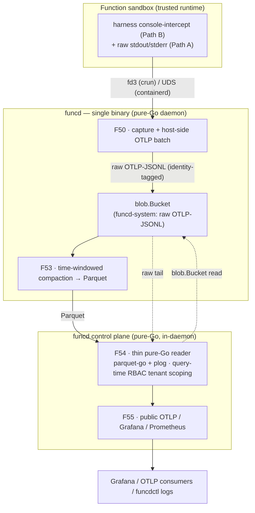

# FEAT-0004: funcd as an embedded observability backend

- **Status**: Active (living document — the tracking table updates as ADRs progress)
- **Date**: 2026-06-29
- **Deciders**: green-0-rabbit
- **Defines**: a new **additive capability epoch** — funcd as its own **OTel-native, lakehouse-independent
  observability backend**: capture tenant/function **logs, traces, and metrics**, persist them on funcd's own
  blob substrate, compact them, and **serve queries** over **ecosystem-standard** endpoints (point Grafana *at*
  funcd). Positioned **alongside** FEAT-0002 (V2 hardening) and FEAT-0003 (data platform); **not** part of v1.1.

## Initial need

The blueprint mandates "high observability and monitoring" and OTel compliance, and ADR-0009/ADR-0010 built the
**platform** lane — funcd's *own* slog→OTel telemetry (`source=platform`). They explicitly carved out the
**tenant/function** lane (`source=function`) as separate and deferred. That lane is this epoch: functions on the
trusted runtime path emit logs/traces/metrics that funcd must **capture without loss across freeze/teardown,
correlate, persist, and ultimately expose** for platform-wide monitoring.

The blueprint's first sketch assumed **export to external** systems (victoria-metrics/logs/traces + Grafana via
the OTel Collector). This epoch **refines** that: funcd becomes the **primary, embedded backend** — it owns the
bytes (one substrate), persists OTel-native signals to `blob.Bucket`, and serves them itself — while OTLP export
to an external stack remains a possible swap, not a dependency. Crucially, this epoch is **independent of the
FEAT-0003 lakehouse**: a platform substrate must not depend on an application feature. It **reuses the *pattern***
(raw → time-windowed compaction → DuckDB-over-Parquet query, served by a function) but takes **no dependency** on
the S3 gateway (ADR-0080) or the Quack/DuckLake catalog (F48) — those are the lakehouse's *services*, not ours.

## How this document works

This file captures **what** this capability set must contain — high level only. The **how** lives in ADRs
(`docs/adr/`, process in [ADR-0000](../adr/0000-adr-process.md)): every feature maps to one or more ADRs; no
implementation detail belongs here. Feature status: `idea → adr → accepted → reviewing → implemented`.

## Features

| # | Feature | Builds on | ADR(s) | Status |
|---|---------|-----------|--------|--------|
| F50 | **Function-log capture + persist-raw** — capture function `console`/stdout logs via a freeze-safe harness side channel (console-intercept "Path B" before `util.format`, raw stdout/stderr "Path A" safety net; fd 3 under crun / UDS under containerd), batch **host-side** in funcd, build a **signal-generic OTLP** pipeline, and persist **raw OTLP-JSON-Lines** through the existing **`blob.Bucket`** port into a reserved `funcd-system` namespace, each record identity-tagged (tenant/function/namespace as OTLP resource attributes). The tenant/function lane (`source=function`) complementing ADR-0009/0010's platform lane. | [ADR-0007](../adr/0007-blob-storage-layer-port.md) (blob port) · [ADR-0009](../adr/0009-observability-logger-root.md)/[ADR-0010](../adr/0010-observability-telemetry-and-audit.md) (the platform lane this complements) · [ADR-0011](../adr/0011-runtime-sandbox-port.md) (fd3/UDS transport) · [ADR-0065](../adr/0065-metastore-badger-engine.md) (pure-Go/no-cgo) | [ADR-0081](../adr/0081-function-log-capture-side-channel-blob.md) | implemented |
| F51 | **Traces capture** — capture function spans on the same signal-generic OTLP pipeline and persist as raw OTLP-JSONL, identity-tagged, reusing F50's seam. | F50 · [ADR-0011](../adr/0011-runtime-sandbox-port.md) (fd3/UDS transport) · [ADR-0030](../adr/0030-runtime-shim-contract.md)/[ADR-0058](../adr/0058-typed-function-io-contract.md) (the invoke handler the span wraps) | [ADR-0101](../adr/0101-trace-capture-invocation-span.md) | implemented |
| F52 | **Metrics** — function/platform metrics with a **live Prometheus-scrape** surface (real-time, daemon-side) **and** a historical lane persisted alongside logs/traces (Prometheus pull does **not** come from Parquet — a deliberate live/historical split). | F50 | — | idea |
| F53 | **Time-windowed compaction → Parquet** — funcd's own compaction pipeline folds many small raw OTLP-JSONL objects into fewer columnar **Parquet** objects over a **configurable window/retention** (sane default) — funcd's own raw→compacted pipeline, without DuckLake. | F50 | [ADR-0083](../adr/0083-funclog-compaction-otlp-jsonl-to-parquet.md) | implemented |
| F54 | **Function-log reader + `funcdctl logs`** — a **thin pure-Go in-daemon reader** (parquet-go + `pdata/plog` over the `blob.Bucket` port, **not** DuckDB, **not** a function) that merges the compacted Parquet with the recent raw OTLP-JSONL tail, filtered by time/severity/limit, served on a **control-plane logs route** and surfaced as `funcdctl logs <fn>`. **Query-time tenant scoping** (Loki/Mimir model): the readable namespace is the **caller's RBAC-authorized** one (ADR-0018 subject), never client-asserted — operator gets the full view, a tenant sees only its own. (Refined from the original DuckDB-serving-function sketch — the no-cgo daemon reads its own Parquet.) | F50, F53 · [ADR-0018](../adr/0018-api-server-authn-rbac-admission.md) (authn/RBAC) · [ADR-0042](../adr/0042-cobra-cli-framework.md) (funcdctl/SDK) | [ADR-0084](../adr/0084-funclog-read-funcdctl-logs.md) | implemented |
| F55 | **Public ecosystem-standard endpoint** — expose the served signals over **OTLP + ecosystem-standard** surfaces (OTLP in/out, Prometheus scrape for metrics, Loki/Tempo-shaped reads for logs/traces) so any standard tool (Grafana, collectors, vendors) plugs in. **Served over the F54 read path through the ingress gateway.** | F54 | — | idea |

## How it lands on funcd (high level)

funcd's own primitives, not the lakehouse: the daemon **captures** function signals over the side channel — the
**log-ingest built-in provider** (always-on, depends on nothing but the daemon) — **persists** them raw as
OTLP-JSONL through `blob.Bucket` into `funcd-system` (F50); a funcd **compaction** pipeline folds them to Parquet
over a configurable window (F53); a **thin pure-Go in-daemon reader** (F54) merges that Parquet with the recent raw
tail, enforces per-caller RBAC tenant scoping, and backs `funcdctl logs`; and a **public OTLP/Grafana/Prometheus
endpoint** exposes it platform-wide (F55). Capture and compaction are daemon-side, always-on; the read path is
served by the control plane — when the platform is degraded, raw bytes still land in blob.

## Exit criterion

A **public, ecosystem-standard observability endpoint** carrying **logs, traces, and metrics**, with both an
**operator** (platform-wide) and **tenant-scoped** query view, served entirely over funcd's **own primitives**
(`blob.Bucket` + functions) — **no** dependency on the FEAT-0003 lakehouse services (S3 gateway, Quack/DuckLake
catalog). Capture is loss-safe across freeze/teardown; signals are OTel-native end to end.

## Out of scope (tracked elsewhere)

- **The FEAT-0003 lakehouse services** (S3 gateway ADR-0080, Quack/DuckLake catalog F48) — this epoch reuses the
  *pattern* (compaction, DuckDB-over-Parquet-in-a-function), never those services. They evolve independently.
- **Platform self-telemetry** (`source=platform`) — already built by ADR-0009/ADR-0010; this epoch is the
  tenant/function lane that complements it, not a replacement.
- **The untrusted wazero + rquickjs capture plumbing** — there `console` binds to a Go host function at embed
  time and joins the same pipeline in-host; no fd/socket channel (handled inline in F50, no separate work).
