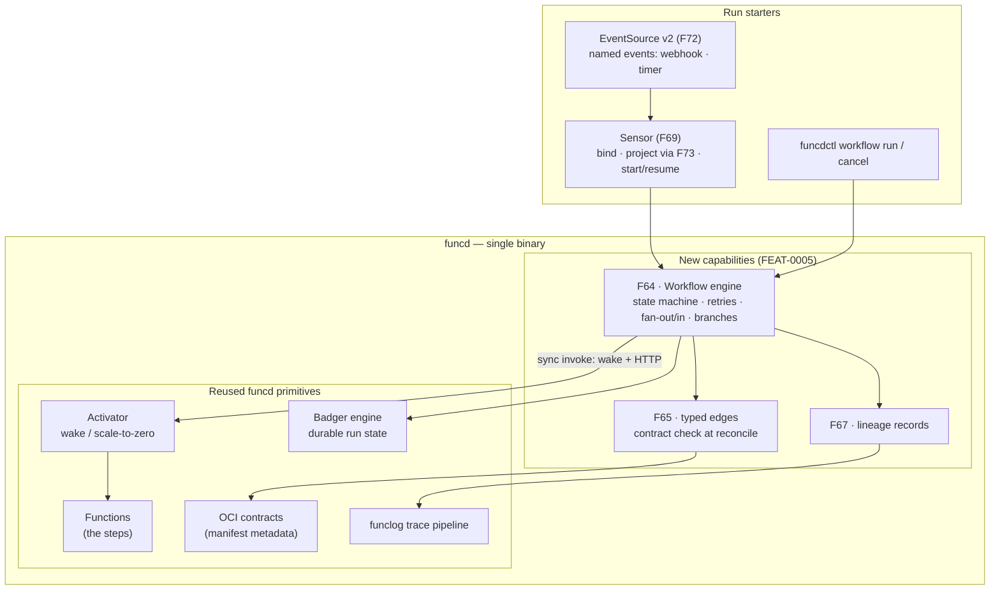

# FEAT-0005: A workflow engine for funcd

- **Status**: Active (living document — the tracking table updates as ADRs progress)
- **Date**: 2026-07-02
- **Deciders**: green-0-rabbit
- **Defines**: a new **additive capability epoch** — a **general workflow engine** that composes
  functions into orchestrated, durable, typed multi-step runs. The engine's model is
  **steps + typed edges + conditions**; a **DAG is what a data pipeline instantiates on it**, not the
  engine's model. Delivers [FEAT-0003](0003-feat-data-platform.md)/F49 (the DVC replacement) as its
  first use case. Positioned **alongside** FEAT-0002 (V2 hardening), FEAT-0003 (data platform) and
  FEAT-0004 (observability); **not** part of v1.1 (FEAT-0001).

## Initial need

Two commitments converge here. The blueprint earmarks a **workflow engine** ("conditional branching,
parallel execution, error handling … keep it simple and lightweight"), and the data-platform epoch's
one remaining gap is [FEAT-0003](0003-feat-data-platform.md)/F49 — a declarative pipeline DAG with
lineage and blocking governance gates, replacing **DVC**. Rather than build a DAG-shaped one-off, this
epoch builds the general engine and lets the DAG fall out of it.

The analysis (verified against the tree) shows most of the engine is **reuse**: the resource model and
controller framework carry the `Workflow`/`WorkflowRun` resources; the Badger engine gives durable run
state; step dispatch is the **same wake-then-HTTP-invoke path timers already use** — the response *is*
the completion signal, so the V1 core needs **no bus dependency** (this corrects F49's original
"sequenced over the bus" wording: the bus enters later, with the Sensor). Between steps a run costs
**zero** — the activator's scale-to-zero applies to every stage.

Three capabilities differentiate this engine from Temporal / Step Functions / DVC, and none needs new
infrastructure: **typed edges** (each step's I/O contract already lives in OCI manifest metadata, so
edge compatibility is statically checked before a workflow ever runs), **scale-to-zero runs** (no
always-on workers), and **lineage** (every step pins an immutable revision digest at run start).

## How this document works

This file captures **what** this capability set must contain — high level only. The **how** lives in
ADRs (`docs/adr/`, process in [ADR-0000](../adr/0000-adr-process.md)): every feature maps to one or
more ADRs; no implementation detail belongs here. Feature status:
`idea → adr → accepted → reviewing → implemented`.

## Features

| # | Feature | Builds on | ADR(s) | Status |
|---|---------|-----------|--------|--------|
| F64 | **Workflow engine core** — `Workflow` (definition: steps, edges, conditions, per-step retry/timeout policy) + `WorkflowRun` (one execution) resources and a **state-machine orchestrator** on the controller framework. Durable engine-owned run state (coarse phase mirrored to `WorkflowRun.status`); steps dispatched as **synchronous function invocations** over the existing wake-then-invoke path (response = completion; at-least-once with per-step attempt IDs); the engine is the **sole retry owner**; **fan-out / fan-in** — fan-out *is* the engine's parallel execution (declared sibling steps dispatch concurrently; fan-in joins when all parents succeeded) — and **conditional branching** (`when.condition`: native-JS boolean expressions (F73/goja) over direct-parent outputs + the run input; `join: all|any` makes if/else and switch merges work); step revision digests **pinned at run start**; runs cost zero between steps. **Input model**: the run input reaches root steps verbatim; a single-parent step receives its parent's output verbatim, a fan-in step a composite keyed by parent name (leaf outputs compose the run output symmetrically — so a workflow's I/O contract is **derivable**, which is what makes F70 composable); `params:` is a per-step static overlay; parameters **thread through** step contracts (computed field-mapping is V2). Payloads are control-plane metadata — size-bounded, bytes travel **by reference** on the blob substrate. Steps are **image-first**: `image:` is a full artifact ref with the **tag at the string end** (digest-pinned at Revision) and the Workflow **owns + materializes** its step Functions (`<workflow>-<step>`, cascade; `function:` references an existing shared Function). Runs are **pausable** (`spec.paused` — graceful: in-flight steps finish, nothing new dispatches; the run timeout excludes paused time). The parent Workflow **links its runs** (`status.runs`: active names + lifetime phase counts — the CronJob `status.active` pattern). **Declared steps are the grant** (binding-as-grant): the engine invokes only targets declared in the pinned spec, acting as the Workflow principal — default-deny by construction. No bus dependency. | [ADR-0015](../adr/0015-controller-engine.md) (controller) · [ADR-0065](../adr/0065-metastore-badger-engine.md)/[0066](../adr/0066-kv-service-durable-engine.md) (Badger) · [ADR-0023](../adr/0023-eventing-core.md)/[0033](../adr/0033-data-plane-serving-and-trigger-wake.md) (invoker + wake) · [ADR-0016](../adr/0016-activator-scale-to-zero.md) (scale-to-zero) · [ADR-0031](../adr/0031-oci-artifact-distribution-oras.md)/[0035](../adr/0035-artifact-digest-resolution-at-revision.md) (revisions) · [ADR-0064](../adr/0064-fn-to-fn-rpc-links.md)/[0073](../adr/0073-kv-bindings-and-subdomains.md)/[0091](../adr/0091-function-catalog-consumer-binding.md) (binding-as-grant precedent) | [ADR-0094](../adr/0094-workflow-engine-core.md) (core; step contract superseded by 0096) · [ADR-0096](../adr/0096-engine-native-builtin-steps.md) (step model reshape `function{image\|ref}`·`builtin{wait\|pass}`·`workflow` + engine-native built-ins: a blocking `wait` + a `pass` transform — implemented; tracked by its own lifecycle) | implemented |
| F65 | **Typed edges — static contract check at the reconcile gate** — for each edge A→B, fetch both functions' I/O contracts from **OCI manifest metadata only** (never the artifact bytes) and require: every *required* property of B's input exists in A's output with **equal primitive type**, plus void rules (`{"type":"null"}` output satisfies only a void input). Mismatch ⇒ a `SchemaMismatch` condition naming the edge and field diff — the Workflow never becomes Ready; artifact not yet pushed ⇒ requeue (the `CatalogNotReady` pattern). The **entire resolved contract graph is cached in `Workflow.status`** — the effective workflow I/O (`status.contract`) plus every step's resolved digest + input/output (`status.steps[]`); registry = origin, status = current truth, run state pins a per-run copy at start. So `WorkflowRun` admission validates the run input against the derived schema with **zero registry I/O** (async/Sensor-started runs fail fast with `InputSchemaMismatch` — never a silent drop); `when:` predicates are type-checked against the parent's output schema the same way (a misspelled or non-numeric predicate field never reaches runtime). Multi-root workflows derive a combined input schema (conflicting root requirements ⇒ `SchemaMismatch` at reconcile). Deliberately at **reconcile**, not admission (no registry coupling, no apply-order trap). Full JSON-Schema subsumption and typed field-mapping are V2. | [ADR-0059](../adr/0059-contract-as-oci-metadata.md) (contract in the manifest) · [ADR-0090](../adr/0090-mandatory-single-io-schema.md) (every function has one) · [ADR-0091](../adr/0091-function-catalog-consumer-binding.md) (requeue pattern) | — | idea |
| F66 | **Governance gates** — a blocking `gate` step type: the run parks (at zero cost) until an explicit approval verb (`funcdctl workflow approve <run> <gate>` → a control-plane endpoint), with reject/timeout outcomes. The F49 "blocking governance gates" differentiator — the human checkpoint a DVC pipeline never had. **Deferred out of the V1 engine cut** ([ADR-0094](../adr/0094-workflow-engine-core.md) ships no `gate:` kind, no `Parked` phase, no approve verb; the step-kind union leaves room) — revisit post-core when the approval UX is proven needed. | F64 · [ADR-0018](../adr/0018-api-server-authn-rbac-admission.md) (control-plane authn) | — | idea |
| F67 | **Lineage & run observability** — per step, record: the pinned revision digest, input/output digests/refs, timings, attempt count — into the run history, surfaced by `funcdctl workflow describe`; run/step IDs stamp the canonical trace fields so **one run = one trace** through the funclog pipeline. Recording is V1; query/graph UX is V2. | F64 · [ADR-0081](../adr/0081-function-log-capture-side-channel-blob.md) (funclog) · [ADR-0031](../adr/0031-oci-artifact-distribution-oras.md) (digests) | — | idea |
| F68 | **Scheduled workflow start** — a nightly/interval tick starts a run. **Delivered via F69**: a timer EventSource event bound by a Sensor `workflow:` action — the EventSource needs **no** workflow-target extension. Interval in V1; cron syntax/timezones/catchup stay the noted follow-up. | F69 (the Sensor delivers it) · [ADR-0023](../adr/0023-eventing-core.md) (timer events) | — | idea |
| F69 | **Sensor — the reusable event→action binder** — a standalone resource (own ADR, deliberately **shared by Functions and Workflows**): `spec.on` lists **named event dependencies**, tuple-addressed `(source, event)`; `spec.do` lists **named actions**, each **bound to one dependency** (`do[].on`) and kind-keyed — `workflow:` (start a run) · `function:` (invoke); the `gate:` resume action arrives with F66. An action's `input` **constructs** the run input: literals + `${{ event.* }}` **path projections** (the F73 engine) over the firing CloudEvent (`event.data.<path>`, `event.time`); `input` absent ⇒ event data verbatim. **Stateless in V1** — every firing is independent (no correlation state); literal input fields and reference roots are checked at **Sensor reconcile** (a bad static overlay ⇒ NotReady before any event fires). `do[].on` is a string whose grammar grows into boolean dependency expressions in V2 — joins, filters, and correlation state arrive **with no reshape**. The ADR **supersedes ADR-0023's binding half** (`EventSource.spec.function` moves here). | F64 (the start/resume seam) · F72 (named events) · F73 (projection) · [ADR-0023](../adr/0023-eventing-core.md) (superseded binding) · [ADR-0008](../adr/0008-bus-messaging-port.md) (bus, V2 delivery) | — | idea |
| F70 | **Sub-workflows (workflow-calls-workflow)** — a step whose target is another **Workflow**: the engine starts a child `WorkflowRun` and the step completes with the child's terminal state (the child's final output = the step's output, so typed edges apply across the boundary). Cheap in the state-machine model — a child run is just another resource the reconciler drives; **no new dispatch path**. The child is declared like any step (binding-as-grant covers it); its own steps carry their own grants. | F64 (engine) · F65 (typed edges across the boundary) | — | idea |
| F71 | **Run replay / re-run from a step** — re-execute a finished (or failed) run from a chosen step, reusing the **recorded step inputs and pinned revision digests** from the run's lineage — so replay is well-defined *without* Temporal-style deterministic code replay (nothing re-executes history; a new run starts from a recorded checkpoint). Post-core: it falls out of F67's records — pull forward once lineage lands. | F64 (engine) · F67 (recorded inputs + pinned digests) | — | idea |
| F72 | **EventSource v2 — kind-keyed named events** — reshape the EventSource: the source kind is the spec key (`spec.webhook:` \| `spec.timer:`, exactly one — no `type` enum, mirroring the Sensor's `do` union), each hosting a **list of named events** that Sensors address as the `(source, event)` tuple (the embedded-bus subject naming `events.<source>.<event>` falls out); `http` renamed **`webhook`**; **`spec.function` removed** (binding is the Sensor's job, F69). A clean `v1alpha1` break — in-repo manifests migrate in the same session; supersedes [ADR-0023](../adr/0023-eventing-core.md)'s resource shape (same superseding ADR as F69). | [ADR-0023](../adr/0023-eventing-core.md) (superseded shape) · [ADR-0013](../adr/0013-gateway-ingress-httputil-primary.md) (gateway delivers webhook events) | — | idea |
| F73 | **Reference engine — typed native-JavaScript on goja (`${{ … }}`)** — a small **dedicated, reusable** component (category H — not workflow-specific), one engine + syntax for the platform. Contents of `${{ … }}` are **native JS** evaluated by **goja** (pure-Go ECMAScript), with funcd's **type-checker over goja's parser AST** admitting only a typed subset and rejecting the rest at reconcile — so a typo'd field or coercing comparison still fails before any run (the differentiator), in a language users already know. V1 = **selection** (member references; context-scoped roots: `event.*` in Sensors, `step.<name>.output.*` / `input.*` in workflow `when`) + **boolean conditions** (`===`/`!==`/`<`/`>`/`&&`/`||`/`!`, `[..].includes(x)`, ternary — no truthiness, no coercing `==`) + a **computation subset** (`+ - * /`, string/array ops + a whitelisted `sum()` helper). Optional fields need a schema `default` or a native `X !== undefined &&` guard. **Bench-driven** ([bench/expr-engine](../../bench/expr-engine/RESULTS.md)): goja beat the hand-rolled evaluator (0.54 µs warm) and native operators beat injected methods 2.5×; `exists()` can't be a method on an absent field. First consumers: F69's Sensor `input` (selection) + F64's `when.condition`. | goja (`github.com/dop251/goja`, MIT; `sobek` fork as successor) | [ADR-0095](../adr/0095-reference-engine-typed-paths-predicates.md) | implemented |

## Capability map — reuse vs. new, by category

The epoch's scoping analysis: every workflow feature, what funcd substrate carries it (✅ exists ·
⚠️ partial · ❌ new), and its target. V1 targets name the feature row above that owns them.

### A. Definition & resource model — pure reuse

| Feature | funcd substrate | Target |
|---|---|---|
| `Workflow` CRD (definition) | ✅ resource model: ObjectMeta, admission, spec/status split | V1 · F64 |
| `WorkflowRun` CRD + orchestration reconciler | ✅ controller framework ([ADR-0015](../adr/0015-controller-engine.md)) | V1 · F64 |
| Revision pinning (replay-safe runs) | ✅ immutable stamped Revisions ([ADR-0031](../adr/0031-oci-artifact-distribution-oras.md)/[0035](../adr/0035-artifact-digest-resolution-at-revision.md)) | V1 · F64 |
| Teardown / grouping | ✅ `resourceGroup` cascade delete + namespace tenancy | V1 · F64 |

### B. Execution core — durable state + synchronous dispatch, no bus

| Feature | funcd substrate | Target |
|---|---|---|
| Durable run state + step history | ✅ Badger engine ([ADR-0065](../adr/0065-metastore-badger-engine.md)/[0066](../adr/0066-kv-service-durable-engine.md)), engine-owned instance; coarse phase mirrored to `WorkflowRun.status` | V1 · F64 |
| Step dispatch (engine → function) | ✅ the eventing invoker pattern ([ADR-0023](../adr/0023-eventing-core.md)/[0033](../adr/0033-data-plane-serving-and-trigger-wake.md)): wake + HTTP at the upstream; the response is the completion signal | V1 · F64 |
| Scale-to-zero between steps | ✅ activator ([ADR-0016](../adr/0016-activator-scale-to-zero.md)) — free | V1 · F64 |
| Per-step retry + timeout | ⚠️ backoff exists as a controller pattern; per-step policy + attempt-ID idempotency is new (small); engine = sole retry owner | V1 · F64 |
| Pause / resume a running run | ❌ new — declarative `spec.paused` + `funcdctl workflow pause\|resume`; timeout clock excludes paused time | V1 · F64 |
| Run replay / re-run from a step | ⚠️ falls out of F67's recorded inputs + pinned revision digests — a new run from a recorded checkpoint, **not** Temporal-style code replay | post-core · F71 |
| Exactly-once effects | ⚠️ V1 = at-least-once + attempt ID passed to the function (documented semantics); dedup hardening later | V2 |
| Long durable timers (sleep days/weeks) | ❌ new — a timer index; data-pipeline stages don't need it | V2 |

### C. Control flow — new, small, all inside the engine

| Feature | funcd substrate | Target |
|---|---|---|
| Fan-out / fan-in — **the parallel-execution primitive** (declared sibling steps run concurrently; join = all parents succeeded) | ❌ new engine state-machine semantics; per-function `concurrency`/`maxReplicas` absorbs the fan-out load (✅) | V1 · F64 |
| Conditional branching — `when.condition` native-JS boolean expressions (F73/goja) over parent outputs + run input (if / if-else / switch / and-or; `join: any` for exclusive-branch merges) | ❌ new — evaluated by goja, statically type-checked against contracts at reconcile (boolean-typed, no truthiness, defaults-or-guard rule) | V1 · F64/F73 |
| Sub-workflows (workflow-calls-workflow) | ❌ new but cheap — a step targets a Workflow; the child run is just another resource the reconciler drives to a terminal state | V1 · F70 |
| Saga / compensation chains | ❌ new — ordered compensations in the state machine | V2 |

### D. Contracts & typing — differentiator #1

| Feature | funcd substrate | Target |
|---|---|---|
| Static edge type-check at the reconcile gate | ✅ contract readable from OCI manifest metadata alone ([ADR-0059](../adr/0059-contract-as-oci-metadata.md)/[0090](../adr/0090-mandatory-single-io-schema.md)); ❌ the check itself is new | V1 · F65 |
| Run-input validation at `WorkflowRun` admission + typed `when:` predicates | ✅ contracts cached in `Workflow.status` at reconcile (zero registry I/O at admission); ❌ the checks are new, small | V1 · F64/F65 |
| Full JSON-Schema subsumption; **computed** field-mapping between steps (expressions on the F73 engine) | ❌ research-grade / V2 of the reference engine; static checking weakens honestly once inputs are computed | V2 |

### E. Security & governance

| Feature | funcd substrate | Target |
|---|---|---|
| Per-step invoke grant | ✅ binding-as-grant pattern ([ADR-0064](../adr/0064-fn-to-fn-rpc-links.md)/[0073](../adr/0073-kv-bindings-and-subdomains.md)/[0091](../adr/0091-function-catalog-consumer-binding.md)): declared steps ARE the grant, enforced fail-closed, Workflow ref = principal | V1 · F64 |
| Cedar `workflow::invoke` governance layer (operator `forbid`) | ✅ Cedar framework ([ADR-0074](../adr/0074-cedar-authorization-resource-access.md)/[0075](../adr/0075-cedar-invoke-authorization.md)) reusable; the consumer is new — mirrors ADR-0075's two-layer shape | V2 |
| Governance gates (blocking approval step) | ❌ new — `gate` step type + resume verb; **deferred post-core** (not in ADR-0094) | post-core · F66 |
| Run-level quotas (max concurrent runs per namespace) | ❌ new counter (per-namespace bus accounts do not exist) | V2 |

### F. Triggering & signals — where the Sensor (and the bus) lives

| Feature | funcd substrate | Target |
|---|---|---|
| EventSource v2: kind-keyed **named events**, tuple addressing, `webhook` rename, `spec.function` dropped | ⚠️ reshape of the existing resource — supersedes ADR-0023's shape, same ADR as F69 | V1 · F72 |
| Sensor: named deps (`on`) → named **dep-bound** actions (`do`: workflow · function), `input` construction with `${{ event.* }}` projections | ❌ new — own ADR (also supersedes ADR-0023's binding half); stateless V1, `do[].on` grammar grows to boolean expressions | V1 · F69 (joins/filters/correlation V2; `gate:` action with F66) |
| Scheduled workflow start | ✅ timer EventSource events + the F69 Sensor binding — no target extension needed | V1 · F68 (via F69; cron V2) |
| Event/bus-delivered triggering | ⚠️ the embedded bus exists ([ADR-0008](../adr/0008-bus-messaging-port.md)) but there is no bus→function/workflow delivery path — arrives with the Sensor | V2 (via F69) |
| External signals / human-in-loop | ❌ new — run-ID correlation; arrives with gates (F66, post-core) | V2 |

### G. Data-platform (F49) & observability — differentiator #3

| Feature | funcd substrate | Target |
|---|---|---|
| Lineage (per step: input digest, revision digest, output ref) | ❌ new — recorded into run history, surfaced by `funcdctl workflow describe` | V1 · F67 (query/graph UX V2) |
| Run observability (one run = one trace) | ✅ canonical `trace_id`/`span_id` fields + funclog pipeline ([ADR-0081](../adr/0081-function-log-capture-side-channel-blob.md)) | V1 · F67 |

### H. Shared platform components — not workflow-specific, tracked here because this epoch builds them

| Feature | funcd substrate | Target |
|---|---|---|
| Reference engine: native-JS `${{ … }}` on goja — member selection + boolean conditions + a computation subset, type-checked over goja's AST (defaults-or-guard rule, no truthiness) | ✅ goja (pure-Go, one dep) + ❌ the ~500-line subset checker — one engine for the platform; consumers: Sensor `input` + `when.condition` (V1), `params` field-mapping (follow-up) | V1 · F73 |
| Filters, string interpolation, `params` field-mapping wiring on the same grammar | ❌ follow-ups — the computation substrate is already in (F73) | V2 |

## The resource surface — standard shapes (illustrative, non-normative)

What the four resources look like, so the epoch is graspable at a glance. **The ADRs own the
contracts** — if these sketches and an Accepted ADR ever disagree, the ADR wins and this section
is updated to match.

```yaml
# EventSource v2 (F72) — WHERE events come from. The source kind is the spec key (exactly one);
# each kind hosts NAMED events, addressed by Sensors as the (source, event) tuple.
apiVersion: funcd.io/v1alpha1
kind: EventSource
metadata:
  name: team-hooks
  namespace: default
  resourceGroup: rg1
spec:
  webhook:                          # or timer: — kind-as-key, no `type` enum
    - name: new-orders
      endpoint: /hooks/new-orders
      method: POST
---
apiVersion: funcd.io/v1alpha1
kind: EventSource
metadata:
  name: schedules
  namespace: default
  resourceGroup: rg1
spec:
  timer:
    - name: nightly
      interval: 24h
---
# Sensor (F69) — WHAT happens. Named dependencies (`on`) → named DEP-BOUND actions (`do`).
# An action's `input` CONSTRUCTS the run input: literals + `${{ event.* }}` projections (F73) over
# the firing CloudEvent; `input` absent ⇒ event data verbatim. Stateless in V1 — `do[].on` is a
# single dep name whose grammar grows into boolean expressions in V2.
apiVersion: funcd.io/v1alpha1
kind: Sensor
metadata:
  name: orders-pipelines
  namespace: default
  resourceGroup: rg1
spec:
  on:
    - name: hook
      source: team-hooks
      event: new-orders
    - name: tick
      source: schedules
      event: nightly
  do:
    - name: on-demand
      on: hook
      workflow:
        name: orders-report
        input:
          day: ${{ event.data.body.date }}  # projection — dot-path selection only, whole values
          source: webhook                 # literal — pre-checked at Sensor reconcile
    - name: nightly-full
      on: tick
      workflow:
        name: orders-report
        input:
          day: ${{ event.time }}            # envelope field, CloudEvents naming
          source: schedule
    # other action kinds:
    # function:
    #   name: audit-log
    # (gate: resume — arrives with F66, post-core)
---
# Workflow (F64/F65) — steps + edges. No dependsOn ⇒ follows the previous step; edges
# express fan-out (parallel) / fan-in (join = all parents succeeded). Declared steps ARE the
# invoke grant. Every edge is contract-checked at reconcile (SchemaMismatch ⇒ never Ready).
apiVersion: funcd.io/v1alpha1
kind: Workflow
metadata:
  name: orders-report
  namespace: default
  resourceGroup: rg1
spec:
  steps:
    - name: extract                     # root — receives the run input verbatim
      image: oci-layout:///mnt/funcd-deps/registry:fetch-orders-v1   # OWNED: materialized, tag at the end
    - name: clean
      function: clean-orders            # single parent — receives extract's output verbatim
      retry:
        maxAttempts: 3
        backoff: 10s
      timeout: 120s
    - name: stats
      function: compute-stats
      dependsOn: [clean]                # ── fan-out: stats runs in parallel with charts
    - name: charts
      function: render-charts
      dependsOn: [clean]
    - name: publish
      function: write-report
      dependsOn: [stats, charts]        # ── fan-in: input = composite keyed by parent (stats, charts)
      when:                             # F73 condition — direct parents + run input; boolean-typed,
        condition: ${{ step.stats.output.rows > 0 }}   # native JS, checked at reconcile vs contracts
      params:                           # static overlay, checked against publish's input schema
        format: parquet
---
# WorkflowRun — one execution. Minted by any of the three start doors (Sensor, funcdctl, apply).
# spec.input validates at ADMISSION against the derived schema cached in Workflow.status.
apiVersion: funcd.io/v1alpha1
kind: WorkflowRun
metadata:
  name: orders-report-01j9c
  namespace: default
  resourceGroup: rg1
spec:
  workflow: orders-report
  input:
    day: "2026-07-01"
    source: webhook
status:
  phase: Running                        # Pending → Running → Succeeded | Failed | Cancelled
  steps:
    - name: extract
      phase: Succeeded
      attempts: 1
      revision: "sha256:9f2c…"
    - name: clean
      phase: Running
      attempts: 2
```

## How it lands on funcd (high level)



## Exit criterion

A multi-stage data pipeline defined as a single `Workflow` resource — with a fan-out/fan-in, a
conditional branch — runs end-to-end on a real containerd sandbox:

- a schema-incompatible edge is refused at the reconcile gate (`SchemaMismatch`; the Workflow never
  becomes Ready) — and fixing the contract makes it Ready with no other change;
- a Sensor starts the run twice over: on the nightly timer event, and on a webhook event whose
  payload is projected (`${{ event.data.… }}`) into the run input; every step invokes a scaled-to-zero
  function that wakes on demand, and the run consumes nothing between steps;
- `funcdctl workflow describe` shows the full lineage (pinned revision digest, inputs/outputs,
  attempts per step) and the run's steps correlate under one trace in the function logs.

This closes FEAT-0003/F49's pipeline core (the "blocking governance gates" clause follows
post-core with F66): the medallion bronze→silver→gold flow runs as a governed funcd workflow,
replacing DVC.

## Out of scope (tracked elsewhere)

- **The V2 rows of the capability map** (saga/compensation, long durable timers, Cedar
  `workflow::invoke`, full schema subsumption + field mapping, run quotas, exactly-once hardening,
  human-in-loop beyond gates, cron syntax, bus-delivered triggering) — outlook only; each graduates to
  a Project-board card or a FEAT-0002 row when picked up.
- **Code-as-workflow SDKs** (Temporal-style user-code replay) — explicitly rejected model; funcd
  workflows are declarative resources, not programs.
- **Cross-node scheduling** of steps — the multi-node future belongs to the V2 hardening epoch.
