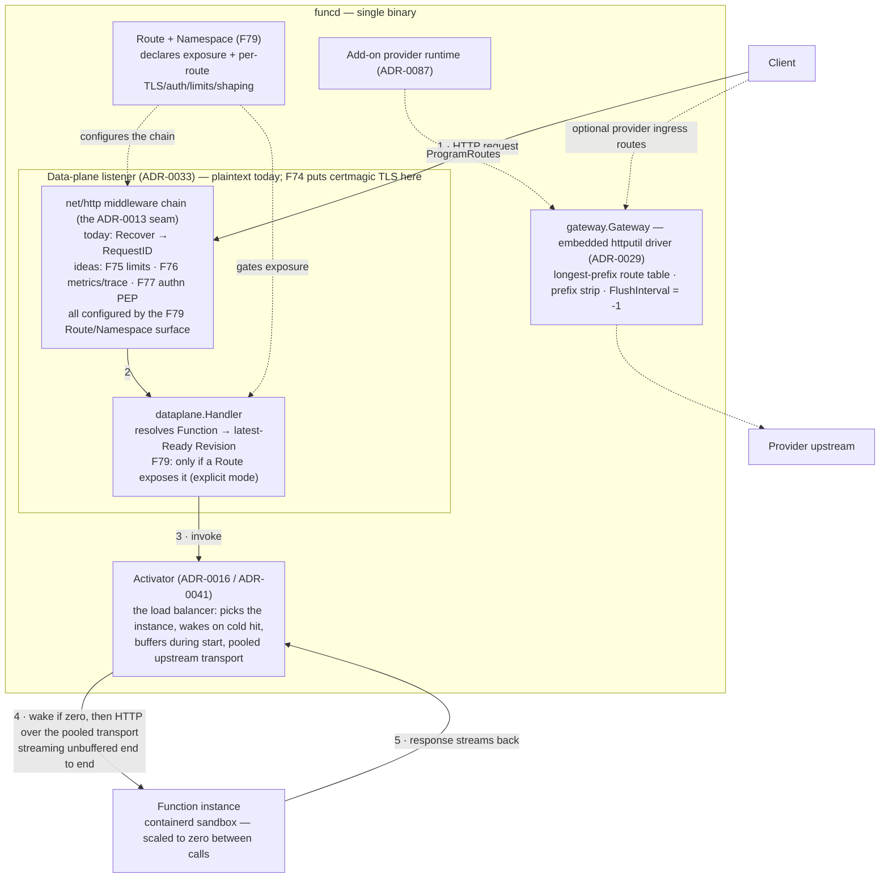

# FEAT-0006: Ingress hardening — the edge the gateway should own

- **Status**: Active (living document — the tracking table updates as ADRs progress)
- **Date**: 2026-07-07
- **Deciders**: green-0-rabbit
- **Defines**: a **mostly-additive edge-hardening epoch** for the HTTP ingress — a declarative
  `Route`-based **exposure model** (F79, the keystone), then TLS, traffic protection, edge
  observability, an authn hook, and edge shaping (F74–F78) — scoped by a survey of a full
  programmable-API-gateway feature catalogue (the
  [Pingora gateway guide](https://dev.to/warren_jitsing_dd1c1d6fc6/pingora-guide-how-to-make-a-programmable-api-gateway-1oim))
  and of two mature gateways ([Apache APISIX](https://apisix.apache.org/docs/apisix/terminology/route/),
  [AWS API Gateway](https://docs.aws.amazon.com/apigateway/latest/developerguide/http-api-vs-rest.html)).
  Its defining constraint is **what it refuses to build**: funcd's edge is deliberately split
  across three components — the gateway proxies, the **activator** balances/wakes, the **PDP**
  decides policy — and this epoch hardens that split instead of collapsing it into a
  do-everything gateway. The one **behavioral** shift (everything else is additive): edge
  exposure moves from *implicit* (any Ready Function invocable by name) to *explicitly declared*
  (a `Route` is required — phased for back-compat). Positioned alongside FEAT-0004
  (observability) and FEAT-0005 (workflow engine); **not** part of v1.1 (FEAT-0001).

## Initial need

A review of the Pingora guide — a 40-lesson catalogue of programmable-gateway features
(routing, load balancing, health checks, TLS, rate limiting, auth, caching, body filtering,
hot reload) — against the tree showed three things:

1. **The architecture already matches.** Pingora's phase-hook model maps ~1:1 onto the
   composable `net/http` middleware seam decided in
   [ADR-0013](../adr/0013-gateway-ingress-httputil-primary.md) (see the mapping table below).
   Routing, streaming, hot route reload, connection pooling, graceful shutdown, and custom
   error handling are **implemented** ([FEAT-0000/F10](0000-feat-v1.md) lineage:
   [ADR-0012](../adr/0012-gateway-ingress-port.md) →
   [ADR-0013](../adr/0013-gateway-ingress-httputil-primary.md) →
   [ADR-0029](../adr/0029-gateway-drop-lura-single-driver.md) →
   [ADR-0041](../adr/0041-gateway-upstream-connection-pooling.md)).
2. **A block of the catalogue is deliberately *not* the gateway's** — load balancing, health
   checks, failover, session affinity belong to the activator; auth *policy* belongs to the
   Cedar PDP. The debate below is the record of why.
3. **A real gap remains at the edge**: the data-plane listener is plaintext, unauthenticated,
   unlimited, and unmetered. Nothing refuses an oversized, over-rate, or anonymous request
   before it reaches the activator and can wake a sandbox. Those gaps — each a small
   middleware on the existing seam, not an architecture change — are feature rows F74–F78.

The certmagic-TLS direction was named by ADR-0013 and explicitly deferred; the deferral never
landed as a roadmap item, so it is (re)tracked here as F74.

## The declarative-exposure decision — the edge becomes a resource (F79)

Two gaps at the edge are really one: it is not only unprotected (point 3) but **undeclared**.
Today any Ready Function is invocable by name on the data-plane listener — exposure is
*implicit*, and no resource says "this function is reachable, with this host / TLS / auth /
limits." That implicit reachability is a default-allow at odds with the platform's default-deny
posture, and it leaves F74–F78 with nowhere declarative to carry their per-route configuration.

This epoch resolves both by making the edge a **declarative resource**: the existing `Route`
stub (`RouteSpec struct{}`, [ADR-0012](../adr/0012-gateway-ingress-port.md)/[0029](../adr/0029-gateway-drop-lura-single-driver.md),
owned by F10) is fleshed into the object that declares *which* Functions are exposed
(host/path → Function) and *how* (TLS, limits, authn, shaping, observability), with a namespace
carrying the exposure stance and shared edge defaults. Exposure shifts from *implicit*
(reachable-by-name) to *explicit* (absence of a Route = private) — **phased** behind a namespace
exposure mode so existing deployments keep working until they opt in. This is feature **F79**,
the keystone the other rows attach to, and it lands first.

A survey of two mature gateways ([Apache APISIX](https://apisix.apache.org/docs/apisix/terminology/route/) —
composable plugin-pipeline; [AWS API Gateway](https://docs.aws.amazon.com/apigateway/latest/developerguide/http-api-vs-rest.html) —
tiered products + explicit resource tree) fixed four shape principles, each a deliberate
*narrowing* (the concrete field shape is the Route-v2 ADR's to specify — this document commits
only to the capability and these narrowings):

- **One flat `Route`, no upstream/integration layer** — the activator already *is* the upstream
  (debate §1), so a Route's backend is simply a Function reference; funcd needs neither APISIX's
  `Upstream` nor AWS's `Integration`.
- **Typed fixed policy fields, not a plugin registry** — the F74–F78 set is small and closed;
  the existing middleware chain is the pipeline, compiled in, not a user-extensible plugin system.
- **Auth delegated to the PDP, no identity object** — a Route flags *authenticated*; Cedar
  decides (debate §3). funcd copies neither APISIX's `Consumer` nor AWS's `Authorizer`.
- **One unified proxy plane, no product tiers** — `httputil.ReverseProxy` already carries HTTP,
  WebSocket, and SSE on one listener, so funcd does not split into AWS-style REST/HTTP/WebSocket
  products; streaming and upgrade are **inferred**, not declared.

Both references are also **explicit-only** (no route ⇒ 404) — the precedent for F79's
explicit-exposure default. Async triggering stays out of this plane: a fire-and-forget hook is
an EventSource + Sensor concern (FEAT-0005/F69), because a live HTTP/WS/SSE connection cannot be
tunnelled through a discrete CloudEvent.

### Current route matching — the baseline F79 expands

Two matchers exist today, both **simpler** than the F79 surface — so most richer matching is
*new*, not a re-home of something already built:

- **Gateway route table** (`internal/gateway/embedded/`, via `ProgramRoutes`) — serves the
  optional provider ingress (ADR-0087), **not** the function-invoke hot path. A route is
  `{Host, PathPrefix, Upstream}`: a segment-aware **prefix** match (`/x` matches `/x` and `/x/y`,
  not `/x-2`), resolved **longest-prefix-first**; an optional **exact host** (`""` = any host);
  and **all HTTP methods** (no method matching — explicit in the port comment).
- **Data-plane invoke path** (`internal/dataplane/`, ADR-0033) — the *actual* function matcher,
  simpler still: the fixed grammar `/function/<name>[/rest]`, with the namespace carried by the
  `X-Funcd-Namespace` header (not the path). No host, method, parameter, or wildcard matching.

| Pattern | Today | Where / note |
|---|---|---|
| Exact | ✅ | degenerate prefix; the invoke path is an exact `/function/<name>` |
| Prefix (segment-aware, longest-first) | ✅ | gateway table only |
| Wildcard / glob (`/api/*`) | ❌ | the prefix match is not glob |
| Parameter capture (`/users/:id`) | ❌ | no captures anywhere |
| Multiple URIs, one route | ❌ | one `PathPrefix` string per route |
| Host / vhost | ⚠️ exact only | no wildcard host; the invoke path ignores host entirely |
| Methods | ❌ | "a route matches all HTTP methods in V1" |
| SNI-based | ❌ | no TLS termination yet (F74); SNI routing is FEAT-0002 |

So F79 is the **first** time the function-invoke path gains host / method / exact-vs-prefix
matching at all (today: a bare `/function/<name>` + a namespace header). The V1 matcher stays
deliberately small — exact + segment-prefix + exact-host + methods — with glob, `:param`
captures, and SNI pushed to V2 (mirroring the APISIX/AWS core-vs-advanced split).

## How this document works

This file captures **what** this capability set must contain — high level only. The **how**
lives in ADRs (`docs/adr/`, process in [ADR-0000](../adr/0000-adr-process.md)): every feature
maps to one or more ADRs; no implementation detail belongs here. Feature status:
`idea → adr → accepted → reviewing → implemented`.

The **already-implemented** edge features are *not* re-rowed here — they are owned by
[FEAT-0000/F10](0000-feat-v1.md) (gateway) and [F11](0000-feat-v1.md) (activator), both
`implemented`; the capability map below cites them with their ADRs so this document reads as
the complete edge picture without duplicating tracking rows.

## The full hop — where every feature in this epoch sits

Per [ADR-0033](../adr/0033-data-plane-serving-and-trigger-wake.md), function invocations are
served by a dedicated data-plane listener whose handler chain wraps `dataplane.Handler` in
gateway middleware — `gateway.Handler()`'s route table is **not** on the invoke path (it
serves optional add-on provider ingress, [ADR-0087](../adr/0087-addon-provider-runtime.md)).
Every F-row in this epoch lands on the numbered path below; only F107 also reaches the
activator's half, since its limit covers the cold-start wake and ends when the response starts.

## The debate — why funcd must NOT rebuild a full Pingora inside the ingress gateway

The tempting reading of the Pingora catalogue is "our gateway is missing 30 features". The
correct reading is that funcd already made — and implemented — decisions that assign most of
those features elsewhere, and re-homing them in the gateway would duplicate or break them.

**1. The load-balancing block belongs to the activator — a gateway LB would be dead code on
the hot path.** Pingora lessons 26–33 (round-robin, weighted, ketama, sticky sessions, TCP/
HTTP health checks, failover) assume a proxy choosing among long-lived upstream pools. In
funcd, instance selection *is* the activator
([ADR-0016](../adr/0016-activator-scale-to-zero.md)): it picks the replica, buffers requests
during cold start, and reclaims idle instances. And since
[ADR-0033](../adr/0033-data-plane-serving-and-trigger-wake.md) routes invocations through
`dataplane.Handler → activator` — bypassing `gateway.Handler()` entirely — an LB added to the
gateway route table would never even see function traffic. Two balancers, one of them blind,
is strictly worse than one.

**2. Scale-to-zero inverts the health-check model.** A classic gateway health checker marks
an unresponsive backend *down* and fails away from it. funcd's defining behaviour is the
opposite: an unresponsive function is *scaled to zero* and the correct action is to **wake
it**, not evict it. Instance health is the resource model's readiness problem (Revision/
instance state driven by the controller), not a prober loop in the proxy. Importing
Pingora-style health checks would fight the platform's core semantic (see
[funcd's workload rationale](0000-feat-v1.md): RAM-bound, ~100 mostly-idle agents,
scale-to-zero is the point). Sticky sessions likewise presume instances worth sticking to;
funcd instances are deliberately ephemeral.

**3. Auth *policy* lives in the PDP; the edge may only host the enforcement point.** The
guide hardcodes bearer/basic credentials in gateway callbacks. funcd already has a policy
engine — Cedar ([ADR-0074](../adr/0074-cedar-authorization-resource-access.md) /
[ADR-0075](../adr/0075-cedar-invoke-authorization.md)) — and a control plane with authn
([ADR-0018](../adr/0018-api-server-authn-rbac-admission.md)). An edge middleware that
*decides* (rather than *asks*) forks authorization truth into a second system. F77 is
therefore scoped as a PEP: authenticate the caller, delegate the decision.

**4. HTTP caching buys little on a function platform and risks correctness.** Cache-control
honouring, SWR, purge (lessons 43–47) pay off for static/content origins. funcd responses
are dynamic invocations; a cached invocation has no story for invalidation, and the
RAM-bound target makes a memory cache the wrong spend. If a hot read-mostly endpoint ever
appears, request coalescing (`singleflight`) is a 20-line middleware — a board idea at most,
not a version commitment.

**5. Body inspection is solved at a better layer.** Pingora's `request_body_filter`
keyword-scans bodies because a generic proxy knows nothing else about them. funcd functions
carry typed I/O contracts ([ADR-0090](../adr/0090-mandatory-single-io-schema.md),
FEAT-0005/F65) — shape enforcement happens against schemas, not grep-in-the-proxy. The edge
only needs a *size* limit (F75).

What the catalogue *does* validate: the ADR-0013 bet that ingress concerns compose as
`net/http` middleware. Pingora's lifecycle hooks and ours line up directly, which is exactly
why F74–F78 are cheap:

| Pingora phase | funcd equivalent (all existing seams) |
|---|---|
| `request_filter` | middleware before the handler — where `Recover`/`RequestID` sit today |
| `upstream_peer` | longest-prefix router (gateway) / activator instance pick (invoke path) |
| `upstream_request_filter` | `ReverseProxy.Rewrite` |
| `request_body_filter` | body-wrapping middleware on `r.Body` (only the size cap is wanted) |
| `response_filter` | `ReverseProxy.ModifyResponse` |
| `fail_to_proxy` | `ReverseProxy.ErrorHandler` + `Recover` (RFC 9457 problem+json) |
| `CTX` | `context.Context` values (as `RequestID` already does) |

## Features

Build order runs by dependency, **not** by number (F-codes are stable identifiers): **F79 lands
first** — it is the declarative surface the rest configure — then F74 / F76 / F78 in parallel,
then F75, then F77 (which needs its position in the chain relative to F75). The table lists F79
first for that reason.

| # | Feature | Builds on | ADR(s) | Status |
|---|---------|-----------|--------|--------|
| F79 | **Declarative edge exposure — the `Route` resource + namespace defaults** — the edge becomes *declared*, not implicit: a `Route` names which Functions are reachable at the edge (host/path → Function) and is the single carrier of their per-route edge policy (the TLS / limits / authn / shaping / observability of F74–F78); a namespace sets the **exposure stance** and shared **edge defaults** (so a Route stays terse and inherits them). funcd shifts from *implicit* reachability (any Ready Function invocable by name) to *explicit* exposure (**no Route = private**), **phased** behind a namespace exposure mode so existing deployments don't break; internal paths (fn-to-fn, `funcdctl invoke`) are never gated. The config surface every other row attaches to — so it lands first. Four shape narrowings from the APISIX/AWS survey: one flat Route (the activator is the upstream — no `Upstream`/`Integration`), typed fixed fields (no plugin registry), auth delegated to Cedar (no `Consumer`/`Authorizer`), one unified plane (no REST/HTTP/WS product tiers). | [FEAT-0000/F10](0000-feat-v1.md) (the `Route` stub + gateway seam) · [ADR-0033](../adr/0033-data-plane-serving-and-trigger-wake.md) (the data-plane chain) · Cedar [ADR-0074](../adr/0074-cedar-authorization-resource-access.md)/[0075](../adr/0075-cedar-invoke-authorization.md) (the delegated PDP) | [ADR-0110](../adr/0110-route-v2-declarative-edge-exposure.md) (Route v2 + exposure model) (+ [ADR-0176](../adr/0176-one-collision-rule-for-every-edge-source.md) — one collision rule) | route v2: implemented · collision rule: implemented |
| F74 | **TLS termination / automatic HTTPS** — a `*tls.Config` for funcd's own `http.Server`s (no listener handover; `ServeTLS`), covering the data-plane and control-plane listeners; ALPN/h2 falls out. Three issuance modes: **`selfsigned`** (default — stdlib self-signed, generated+persisted, offline zero-config for homebox), **`provided`** (operator cert), **`acme`** (certmagic public certs — the only path importing certmagic; live issuance deferred to a Pebble lane). Per-host certs via SNI over the F79 `Router.Hosts()` set. **V1 TLS mode is listener/deployment-level** (one terminator); a **per-Route** `tls` override is a V2 refinement. Direction named + deferred by [ADR-0013](../adr/0013-gateway-ingress-httputil-primary.md). | [ADR-0110](../adr/0110-route-v2-declarative-edge-exposure.md) (F79 `Router.Hosts()`) · [FEAT-0000/F10](0000-feat-v1.md) · [ADR-0013](../adr/0013-gateway-ingress-httputil-primary.md) (deferred decision) | [ADR-0111](../adr/0111-tls-termination-certmagic.md) (TLS termination / certmagic) | implemented |
| F75 | **Ingress protection middleware** — refuse abusive traffic *before* it can wake a sandbox: a rate limit (window + key decided in the ADR), request body size cap, and an in-flight concurrency ceiling; rejects as RFC 9457 problem+json (429/413/503) consistent with `Recover`. Sits on the data-plane chain (the invoke path) — it protects the activator; it is **not** a balancer. Configured per-Route/namespace via F79. | F79 (the `limits` surface) · [FEAT-0000/F10](0000-feat-v1.md) (middleware seam) · [ADR-0033](../adr/0033-data-plane-serving-and-trigger-wake.md) (the chain it joins) | [ADR-0112](../adr/0112-ingress-protection-limits.md) (rate/size/concurrency limits) (+ [ADR-0164](../adr/0164-rate-limit-per-target.md) — per-target rate key, no-reset bucket table) | limits: implemented · per-target rate key: implemented |
| F107 | **Bounded external invoke** — an external call to a Function, by name or through a Route, always gets an answer within a known time, even when the handler never settles: a platform-wide default limit that a Function can raise or lower for itself, after which the caller receives a gateway-timeout error instead of waiting until its own client gives up. The time a cold start takes counts. A response that has started is never cut while its client keeps accepting data, so streaming stays possible. Fn-to-fn links, workflow steps and Sensors keep their own limits. Owns the "timeouts" ingress concern the blueprint and ADR-0013 list without an owner. | F75 (the edge protections it joins) · F79 (the Route path it covers) · [FEAT-0001/F33](0001-feat-v1.1.md) (links keep their own limit) · [ADR-0013](../adr/0013-gateway-ingress-httputil-primary.md) (the unowned "timeouts" concern) | [ADR-0151](../adr/0151-external-invoke-deadline.md) (external invoke deadline) · [ADR-0191](../adr/0191-response-write-stall-timeout.md) (response write stall) | invoke deadline: implemented · write stall: implemented |
| F76 | **Edge observability middleware** — RED metrics (rate/errors/duration by function+status), an edge span parenting the invocation span so the ingress hop appears in the one-run-one-trace waterfall, and an access log correlated by the existing `X-Request-Id`. Toggled per-Route/namespace via F79. | F79 (the `observability` surface) · [FEAT-0000/F10](0000-feat-v1.md) · [FEAT-0004](0004-feat-platform-observability.md) pipeline: [ADR-0101](../adr/0101-trace-capture-invocation-span.md)/[0102](../adr/0102-one-run-one-trace-dispatch-propagation.md) (canonical trace fields) | [ADR-0114](../adr/0114-edge-observability-shaping.md) (edge observability + shaping) | implemented |
| F77 | **Edge authn PEP** — authenticate the data-plane caller (bearer token first; mTLS is a V2 follow-up) and delegate the allow/deny decision to **the PDP** (the `auth.Authorizer` — namespace-scoped **RBAC** in V1, fine-grained **Cedar** per-function edge policy in V2); the middleware enforces, never decides. Stance is **opt-in default-deny, phased** (ADR-0113): the zero stance is `open` (no breakage on upgrade), a namespace opts into `authenticated`-by-default via `edgeDefaults.auth`, and a Route makes anonymity an explicit, auditable per-route opt-out. Enforced **inside the serving path** (before `store.Get` + the activator → no wake, no enumeration oracle). | F79 (the `auth` surface + namespace stance) · F75 (ordering in the chain) · [ADR-0018](../adr/0018-api-server-authn-rbac-admission.md) (control-plane authn to mirror) · [ADR-0074](../adr/0074-cedar-authorization-resource-access.md)/[0075](../adr/0075-cedar-invoke-authorization.md) (the PDP) | [ADR-0113](../adr/0113-edge-authn-pep.md) (edge authn PEP) | implemented |
| F78 | **Edge shaping & protocol conformance** — small independent middlewares: CORS, response header injection/strip, compression (auto-skipped for streaming responses). Streaming/upgrade is **inferred** (not declared) — the reverse proxy negotiates WS/SSE and compression-skip keys off response headers; the only protocol control is a per-route opt-out to *refuse* an upgrade. Plus an explicit WebSocket passthrough conformance test in `gatewaycontract` (today upgrade support is implicit in `httputil.ReverseProxy`, untested). | F79 (the `cors`/`headers`/`compression`/upgrade-opt-out surface) · [FEAT-0000/F10](0000-feat-v1.md) (seam + contract suite) | [ADR-0114](../adr/0114-edge-observability-shaping.md) (edge observability + shaping) (+ [ADR-0181](../adr/0181-edge-forwards-bodiless-upgrades.md) — bodiless upgrades + idle tunnel) | shaping: implemented · upgrade passthrough: implemented |

## Capability map — the Pingora catalogue vs funcd, by category

Every feature the guide implements, where funcd stands (✅ implemented · ⚠️ decided/partial ·
❌ new), and who owns it. "Not the gateway's" rows cite the debate above.

### A. Routing & proxy core — implemented ([FEAT-0000/F10](0000-feat-v1.md))

| Pingora feature | funcd | Where |
|---|---|---|
| Path/host routing + context passing | ✅ longest-prefix host+path table; `context.Context` | [ADR-0029](../adr/0029-gateway-drop-lura-single-driver.md) · `internal/gateway/embedded/` |
| Header/query manipulation hooks | ✅ the seam exists (`Rewrite`/`ModifyResponse`); no built-ins beyond `Recover`+`RequestID` | [ADR-0013](../adr/0013-gateway-ingress-httputil-primary.md) · `internal/gateway/middleware.go` |
| Custom error responses (`fail_to_proxy`) | ✅ `Recover` → RFC 9457 problem+json; `ErrorHandler` seam | `internal/gateway/middleware.go` |
| Streaming (SSE/token) | ✅ `FlushInterval = -1`, dedicated test — first-class | [ADR-0013](../adr/0013-gateway-ingress-httputil-primary.md) |
| Upstream connection pooling / reuse | ✅ shared tuned `http.Transport`, per-host keying | [ADR-0041](../adr/0041-gateway-upstream-connection-pooling.md) |
| Hot-swap route reconfiguration | ✅ `ProgramRoutes` replace-all swap under `RWMutex` | [ADR-0012](../adr/0012-gateway-ingress-port.md)/[0029](../adr/0029-gateway-drop-lura-single-driver.md) |
| Graceful shutdown | ✅ `Server.Shutdown(ctx)` on both listeners | `pkg/funcd/funcd.go` |
| WebSocket upgrade | ✅ external passthrough proven on the real `dataplane.Handler` (`TestScenarioExternalWebSocketRoundtrips`, the `pkg/funcd` subtest `edge-chain-websocket-real-handler`); an idle tunnel closes after 5 minutes | [ADR-0114](../adr/0114-edge-observability-shaping.md), [ADR-0181](../adr/0181-edge-forwards-bodiless-upgrades.md) (F78) |

### B. Load balancing, health, failover — the activator's, by design (debate §1–2)

| Pingora feature | funcd stance |
|---|---|
| Round-robin / weighted / ketama LB | **Activator owns instance selection** ([ADR-0016](../adr/0016-activator-scale-to-zero.md), [FEAT-0000/F11](0000-feat-v1.md) ✅). Not a gateway feature; multi-node placement is FEAT-0002. |
| TCP/HTTP health checks, custom probes | Inverted by scale-to-zero: unresponsive ⇒ **wake**, not evict. Health = controller-driven readiness, not a proxy prober. |
| Failover / active-passive | Single-node V1; cross-node failover is FEAT-0002 (V2 hardening). |
| Sticky sessions | Instances are deliberately ephemeral; no V1/V2 intent. |

### C. TLS & protocols

| Pingora feature | funcd | Target |
|---|---|---|
| TLS termination (Mozilla-intermediate defaults) | ✅ stdlib self-signed/provided + certmagic (acme); opt-in, plaintext back-compat default | [ADR-0111](../adr/0111-tls-termination-certmagic.md) (F74) |
| HTTP/2 via ALPN | ✅ falls out of F74's `*tls.Config` | [ADR-0111](../adr/0111-tls-termination-certmagic.md) (F74) |
| mTLS, SNI routing | ❌ | V2 (FEAT-0002) |
| gRPC / H2C proxying | ❌ blueprint: "gRPC/MCP later" | V2 |
| CONNECT tunneling | Not a funcd use case | — |

### D. Traffic protection

| Pingora feature | funcd | Target |
|---|---|---|
| Rate limiting (fixed/sliding window) | ✅ token-bucket, keyed by function | [ADR-0112](../adr/0112-ingress-protection-limits.md) (F75) |
| In-flight concurrency limiting | ✅ edge concurrency ceiling (503 when full) added on the data-plane chain | [ADR-0112](../adr/0112-ingress-protection-limits.md) (F75) |
| Request size limiting | ✅ body-size cap (Content-Length fast-path 413, MaxBytesReader defense-in-depth) | [ADR-0112](../adr/0112-ingress-protection-limits.md) (F75) |
| IP filtering | ❌ low value behind a LAN/home deployment; ADR-0113 (F77) shipped without it | V2 / a superseding ADR if wanted |
| Request body content inspection | Rejected — typed contracts do this better (debate §5) | — |

### E. Authentication & authorization

| Pingora feature | funcd | Target |
|---|---|---|
| Bearer / basic auth in the proxy | ✅ data-plane PEP authenticates the caller + delegates the decision to the PDP; phased opt-in default-deny (open zero stance) | [ADR-0113](../adr/0113-edge-authn-pep.md) (F77 — PEP only, Cedar/RBAC PDP decides, debate §3) |
| Per-route authz decisions | ✅ Cedar policy layer ([ADR-0074](../adr/0074-cedar-authorization-resource-access.md)/[0075](../adr/0075-cedar-invoke-authorization.md)) with the edge PEP now wired to it | [ADR-0113](../adr/0113-edge-authn-pep.md) (F77) |

### F. Caching — refused for this epoch (debate §4)

| Pingora feature | funcd stance |
|---|---|
| In-memory HTTP cache, cache-control, purge, SWR | No version commitment — dynamic invocations, no invalidation story, RAM-bound target. Board idea at most. |
| Cache locking / request coalescing | `singleflight` middleware if a hot read-mostly endpoint ever materializes — board idea. |

### G. Observability

| Pingora feature | funcd | Target |
|---|---|---|
| Structured connection/request logging | ✅ structured edge access log correlated by `X-Request-Id` | [ADR-0114](../adr/0114-edge-observability-shaping.md) (F76) |
| Metrics export (background service) | ✅ edge RED metrics (rate/errors/duration by function+status) off the OTel meter | [ADR-0114](../adr/0114-edge-observability-shaping.md) (F76) |
| Tracing through the proxy | ✅ edge span mints/adopts the W3C `traceparent` so the ingress hop joins the one-run-one-trace waterfall ([ADR-0102](../adr/0102-one-run-one-trace-dispatch-propagation.md)) | [ADR-0114](../adr/0114-edge-observability-shaping.md) (F76) |

### H. Threading & service discovery — not applicable

| Pingora feature | funcd stance |
|---|---|
| Work-stealing vs shared-nothing runtimes | Go runtime scheduler; not a design surface. |
| File-based service discovery | Routing is programmed from the resource model (`ProgramRoutes`), not discovered. |

## Exit criterion

The data-plane edge refuses what it should and accounts for what it serves, with the
activator's role untouched apart from bounding an external call's wait (F107):

- edge exposure is declarative: a Function with **no `Route` is not reachable** at the edge
  (explicit mode), and a declared `Route` exposes it at its host/path carrying its TLS / auth /
  limits / shaping; a namespace sets the exposure stance + shared defaults; implicit
  invoke-by-name survives only where the namespace's exposure mode still allows it — the phased
  shift (F79);
- the data-plane and control-plane listeners can serve HTTPS — self-signed (stdlib, offline
  zero-config) or operator-provided by default, `certmagic`/ACME for public certs; TLS is opt-in and
  plaintext remains the back-compat default until enabled (ADR-0111 chose this over a browser-untrusted
  self-signed-on-by-default that would break existing clients; TLS-on-by-default is a phased V2 option) (F74);
- an over-rate, oversized, or (where the namespace requires authn) anonymous request is
  rejected at the edge with an RFC 9457 problem+json response **without waking any sandbox**
  — verified by observing zero activator wake on the refused call (F75/F77);
- an allowed request to a scaled-to-zero function completes the full hop — TLS → middleware
  chain → `dataplane.Handler` → activator wake → function — streaming an SSE response
  unbuffered, and produces an edge span parenting the invocation span plus RED metrics and
  an access log line correlated by `X-Request-Id` (F76);
- an external call to a handler that never answers gets 504 at its limit, a cold start
  included; a started response is never cut while its client keeps accepting data (F107);
- the `gatewaycontract` suite passes a WebSocket passthrough case (F78).

## Out of scope (tracked elsewhere)

- **External-gateway driver** (program routes into APISIX/Caddy via its admin API) — the V2
  second driver named by [ADR-0029](../adr/0029-gateway-drop-lura-single-driver.md); stays
  with [FEAT-0000/F10](0000-feat-v1.md)'s lineage.
- **Egress gateway** (transparent outbound L7 proxy, PDP-governed) — a distinct blueprint
  component (network manager), not the ingress.
- **Multi-node LB, cross-node failover, mTLS, SNI routing, gRPC/MCP ingress** — FEAT-0002
  (V2 hardening) material.
- **Weighted traffic split / canary (`backends[]`), per-namespace rate keying, a dedicated
  `RoutePolicy` kind** — V2 increments of F79/F75, addable without reshaping the V1 `Route`
  surface (a Route's backend is singular in V1; namespace defaults carry shared policy without a
  second kind until per-group duplication justifies one).
- **HTTP caching / request coalescing** — deliberately refused above; Project-board idea if
  ever wanted.
- **Load balancing, health checks, sticky sessions in the gateway** — not deferred:
  **rejected** (debate §1–2); the activator owns this permanently.
